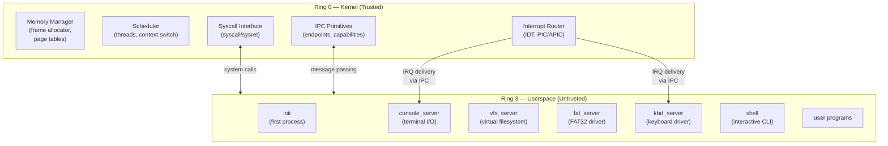
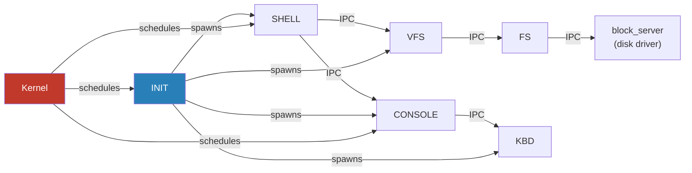

# Architecture

## Overview

m³OS follows a **microkernel architecture**: the kernel runs in privileged mode (ring 0)
and does the absolute minimum — memory management, thread scheduling, IPC, and interrupt
routing. Everything else (drivers, filesystems, network stack) runs in **userspace servers**
communicating via IPC.

This is philosophically similar to [L4](https://l4.org/), [seL4](https://sel4.systems/),
and [Redox OS](https://redox-os.org/).

---

## Privilege Rings



---

## Component Relationships



---

## What Lives in the Kernel

| Kernel Component | Responsibility |
|---|---|
| Frame allocator | Tracks which physical pages are free/used |
| Page table manager | Maps virtual → physical addresses, enforces isolation |
| Scheduler | Picks which thread runs next; handles preemption |
| IPC engine | Transfers messages between threads; blocks/unblocks |
| IDT & exception handlers | CPU faults, hardware interrupt dispatch |
| Capability system | Unforgeable references to kernel objects (TBD) |
| Syscall gate | Entry/exit point between ring 3 and ring 0 |

## What Lives in Userspace

| Server | Responsibility |
|---|---|
| `init` | First process; spawns all other servers |
| `console_server` | Wraps serial/VGA/framebuffer; provides read/write IPC |
| `vfs_server` | Namespace, mount points, path resolution |
| `fat_server` | FAT32 filesystem implementation |
| `block_server` | Disk I/O (ATA/AHCI) |
| `kbd_server` | Keyboard scancode → key event translation |
| `shell` | Interactive command interpreter |

---

## Memory Map (Virtual Address Space)

Each process has its own virtual address space. The kernel is mapped into the top of
every address space (but protected by page permissions — userspace cannot access it).

```
Virtual Address Space (x86_64, 48-bit)
┌─────────────────────────────────────┐ 0xFFFF_FFFF_FFFF_FFFF
│                                     │
│         Kernel Space                │  ← ring 0 only, shared across all processes
│   (kernel code, heap, page tables)  │
│                                     │
├─────────────────────────────────────┤ 0xFFFF_8000_0000_0000
│                                     │
│  [non-canonical hole — invalid]     │
│                                     │
├─────────────────────────────────────┤ 0x0000_7FFF_FFFF_FFFF
│                                     │
│         Userspace                   │  ← ring 3 accessible
│   (code, data, stack, heap)         │
│                                     │
└─────────────────────────────────────┘ 0x0000_0000_0000_0000
```

---

## Design Principles

1. **Minimal kernel** — If something can run in ring 3, it does.
2. **IPC is the only channel** — Servers communicate only through the kernel's IPC mechanism; no shared writable memory by default.
3. **Isolation by default** — Each process has its own page table root; bugs in one server cannot corrupt another.
4. **No kernel modules** — Drivers are userspace processes. Adding a driver means adding a new server binary, not modifying the kernel.
