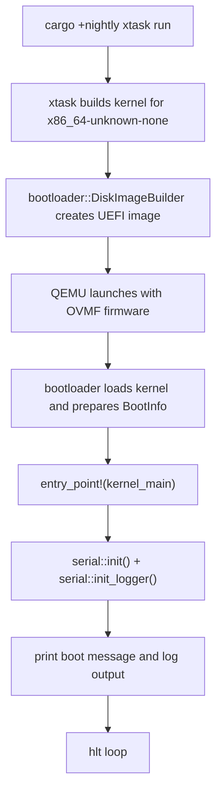
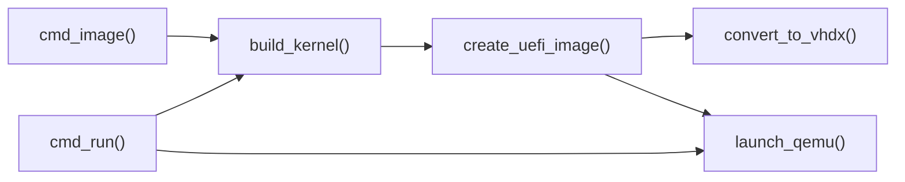

# Boot Process

This document is the Phase 1 implementation document for bootstrapping the kernel. It
explains what the boot feature is for, how the current repository implements it, and
which shortcuts are intentional in this toy project.

## Phase 1 Status

Phase 1 is functionally complete in the current repository:

- `cargo +nightly xtask run` builds the kernel, creates a UEFI disk image, and boots it in QEMU
- the kernel prints a startup message and logger output over serial
- the panic handler emits readable diagnostics and halts the machine

The implementation uses the built-in Rust target `x86_64-unknown-none` rather than a
project-specific target JSON. That is an intentional simplification and matches the
current build pipeline.

## Overview

The boot path has one job: get from a host-side Cargo command to running Rust code in a
`no_std` kernel with enough early diagnostics to understand what happened.

In m³OS, that means:

- `xtask` builds the kernel
- the `bootloader` crate wraps the kernel in a UEFI-bootable image
- QEMU launches with OVMF firmware
- the kernel starts in `kernel_main`
- serial logging becomes the primary debug surface

## Current Boot Flow

## Repository Implementation

### Build and Runner Configuration

The build configuration lives in `.cargo/config.toml`.

- the default target is `x86_64-unknown-none`
- the `runner` for bare-metal targets is `cargo xtask runner`
- the `xtask` alias forces the host build for the helper binary

This setup keeps the kernel on the bare-metal target while allowing the build tool to run
as a normal host executable.

### Host-Side Build Pipeline

The host-side logic lives in `xtask/src/main.rs`.

Key responsibilities:

- `build_kernel()` runs `cargo build --release --package kernel --target x86_64-unknown-none`
- `create_uefi_image()` uses `bootloader::DiskImageBuilder`
- `find_ovmf()` locates firmware or asks the user to install or configure it
- `launch_qemu()` starts `qemu-system-x86_64` with serial output on stdio and no graphical display

The `run` subcommand builds, images, optionally converts to VHDX, and then boots. The
`runner` subcommand is used by Cargo when a bare-metal target is executed through the
configured runner.

### Kernel Entry and Early Runtime

The kernel entry point lives in `kernel/src/main.rs`.

The startup sequence is intentionally small:

1. initialize serial output
2. install the logger backend
3. print a human-readable boot message
4. log one structured startup message
5. enter an infinite `hlt` loop

This is enough to prove that:

- the bootloader reached the kernel
- Rust code is running successfully
- serial I/O is available for future debugging

### Early Diagnostics

Phase 1 depends heavily on serial output because it is the simplest reliable diagnostic
channel in early boot.

The serial implementation in `kernel/src/serial.rs` provides:

- COM1 initialization at `0x3F8`
- `serial_print!` and `serial_println!` macros
- a `log` backend for `log::info!` and friends
- a panic-safe fallback printing path that avoids deadlock if the serial mutex is already held

### Panic Handling

The panic handler is part of the Phase 1 deliverable because early boot failures are
otherwise very hard to understand.

Current behavior:

- print `KERNEL PANIC at file:line`
- print the panic message
- stop in the `hlt` loop

That gives the project a stable failure mode before memory management, interrupts, and
tasking are introduced.

## BootInfo in Phase 1

The `bootloader` crate passes `BootInfo` to `kernel_main`. In Phase 1, the project mainly
proves the handoff works. Later phases make heavier use of:

- `memory_regions` for frame allocation
- `physical_memory_offset` for paging helpers
- `framebuffer` for on-screen text output
- `rsdp_addr` for future ACPI-related work

Phase 1 intentionally keeps `BootInfo` usage light so the boot pipeline can be verified
before more subsystems are added.

## Why `x86_64-unknown-none`

The project now uses the built-in `x86_64-unknown-none` target instead of a custom target
JSON.

That choice keeps the build simpler while still preserving the important kernel-friendly
properties:

- red zone disabled
- SIMD disabled by default for the kernel context
- `panic = abort`

For this phase, the exact goal is clarity: use a standard target when it already matches
the project's constraints.

## Acceptance Criteria for Phase 1

Phase 1 should be considered complete when:

- `cargo +nightly xtask run` boots the kernel in QEMU
- the serial console shows a clear startup message
- `cargo +nightly xtask image` produces a UEFI image
- panic output is readable enough to debug early failures

## How Real OS Implementations Differ

Real kernels usually support more than one boot environment, handle more firmware and
hardware variation, and invest much more in diagnostics and recovery.

At a high level, mature systems often add:

- multiple boot paths or boot protocols
- richer hardware discovery and firmware integration
- several logging backends, not just serial
- more elaborate crash reporting and debug hooks
- support for real hardware quirks, not just the QEMU happy path

This project intentionally does less. The goal is to make the boot chain easy to read and
easy to debug before introducing additional complexity.

## What This Phase Does Not Try to Solve

Phase 1 is deliberately narrow. It does not yet aim to provide:

- dynamic memory allocation
- interrupt handling
- multitasking
- userspace execution
- production-grade portability across machines and firmware setups

Those belong to later phases once the basic boot path is trustworthy.
