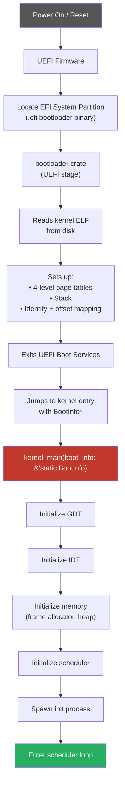

# Boot Process

## Overview

ostest uses the [`bootloader`](https://github.com/rust-osdev/bootloader) crate from the
`rust-osdev` community. It supports both UEFI and legacy BIOS, is written almost entirely
in Rust, and passes a `BootInfo` structure to the kernel containing memory maps, framebuffer
info, and the physical memory offset.

---

## Boot Flow



---

## `BootInfo` Structure

The `bootloader` crate passes a `BootInfo` struct to the kernel entry point containing
everything the kernel needs to start up:

```
BootInfo {
    memory_regions: &[MemoryRegion]   // physical memory map
    physical_memory_offset: u64       // base of identity-mapped physical memory
    framebuffer: Option<FrameBuffer>  // pixel buffer info (if available)
    rsdp_addr: Option<u64>            // ACPI root pointer
    recursive_index: Option<u16>      // optional recursive page table index
    tls_template: Option<TlsTemplate> // thread-local storage setup
}
```

---

## Project Layout for Boot

```
ostest/
├── kernel/
│   ├── Cargo.toml            # depends on bootloader_api
│   └── src/
│       └── main.rs           # #[entry] kernel_main(boot_info)
├── xtask/
│   └── src/main.rs           # calls bootloader builder to make disk image
└── .cargo/
    └── config.toml           # custom target, QEMU runner
```

### Kernel Entry Point

```rust
// kernel/src/main.rs
#![no_std]
#![no_main]

use bootloader_api::{entry_point, BootInfo};

entry_point!(kernel_main);

fn kernel_main(boot_info: &'static mut BootInfo) -> ! {
    // initialization sequence here
    loop {}
}
```

### xtask Build

The `xtask` crate uses the `bootloader` builder API to:
1. Compile the kernel binary
2. Bundle it with the bootloader into a bootable disk image
3. Optionally launch QEMU with the image

```rust
// xtask/src/main.rs (sketch)
use bootloader::DiskImageBuilder;

fn main() {
    let kernel = PathBuf::from("target/x86_64-ostest/release/kernel");
    let image = DiskImageBuilder::new(kernel)
        .create_bios_image("ostest.img")   // legacy BIOS
        .create_uefi_image("ostest.efi");  // UEFI
}
```

---

## Disk Image Formats

| Format | Use Case |
|---|---|
| Raw disk image (`.img`) | QEMU, `dd` to USB for real hardware (BIOS) |
| UEFI image (`.efi` in ESP) | Real hardware UEFI boot |
| ISO 9660 (future) | CD/DVD / easier USB boot |

---

## Real Hardware Boot

To boot on real hardware:
1. Build the UEFI disk image with `cargo xtask image`
2. Flash to USB: `dd if=ostest.img of=/dev/sdX bs=4M status=progress`
3. Or copy the `.efi` file to an EFI System Partition under `EFI/BOOT/BOOTX64.EFI`

---

## Custom Target

x86_64 kernels require a custom target JSON that disables the standard library, disables
the red zone (corrupted by hardware interrupts), enables soft floats, and sets the
appropriate ABI:

```json
{
  "llvm-target": "x86_64-unknown-none",
  "data-layout": "e-m:e-p270:32:32-p271:32:32-p272:64:64-i64:64-f80:128-n8:16:32:64-S128",
  "arch": "x86_64",
  "os": "none",
  "disable-redzone": true,
  "features": "-mmx,-sse,+soft-float",
  "panic-strategy": "abort",
  "exe-suffix": "",
  "executables": true
}
```

Key flags:
- `disable-redzone` — required; hardware interrupts use the stack and would corrupt the red zone
- `-mmx,-sse` — disable SIMD to avoid needing to save/restore FPU state on every context switch
- `panic-strategy: abort` — no unwinding in the kernel
