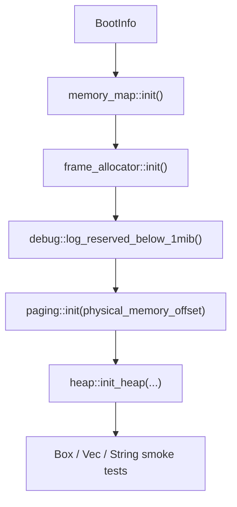

# Memory Management

**Aligned Roadmap Phase:** Phase 2
**Status:** Complete
**Source Ref:** phase-02

This document is the Phase 2 implementation document for the first memory subsystem.
It explains what this phase adds, how the tagged Phase 2 code works, and which
shortcuts are still intentional at this stage of the project.

## Phase 2 Status

Phase 2 is functionally complete in the tagged Phase 2 code:

- the kernel copies and logs the bootloader memory map
- a simple physical frame allocator hands out usable 4 KiB frames
- paging helpers reconstruct the active page-table mapper from the bootloader's
  physical-memory offset mapping
- a fixed 1 MiB kernel heap is mapped and installed as the global allocator
- `Box`, `Vec`, and `String` allocations work after memory init

This phase is intentionally conservative. It does not yet reclaim freed physical
frames, grow the heap, or implement advanced allocator policies.

## Overview

After Phase 1, the kernel could boot and print diagnostics, but it still had no
way to manage RAM dynamically. Phase 2 adds the minimum memory machinery needed
to build future subsystems:

1. capture the bootloader's memory map in kernel-owned state
2. hand out physical frames from usable RAM
3. rebuild a page-table mapper from `BootInfo::physical_memory_offset`
4. map a fixed kernel heap so Rust `alloc` types can be used safely

## Current Memory Setup Flow

## Repository Implementation

### Memory-Map Capture

The memory-map logic lives in `kernel/src/mm/memory_map.rs`.

Phase 2 does not build a complex ownership model for physical memory yet. Instead,
it stores the bootloader-provided `memory_regions` slice in a `spin::Once` and
logs each region so the kernel can reason about what RAM is usable.

Important details:

- `memory_map::init()` must only run once
- the stored slice is treated as valid for the kernel's lifetime
- region logging makes early boot failures easier to debug over serial

### Frame Allocator

The frame allocator lives in `kernel/src/mm/frame_allocator.rs`.

In Phase 2, this is a simple bump allocator over the usable regions from the
bootloader memory map. It is deliberately small and easy to read:

- only regions marked `Usable` are considered
- addresses are aligned to 4 KiB page boundaries
- frames below 1 MiB are skipped to avoid low-memory firmware hazards
- allocation advances monotonically through the usable regions

This means Phase 2 can allocate frames safely, but it does **not** reclaim them.
Physical frame reuse is deferred until later phases.

### Paging Helpers

The page-table helpers live in `kernel/src/mm/paging.rs`.

The bootloader sets up a physical-memory offset mapping. Phase 2 uses that to
recover a mutable reference to the active level-4 page table and construct an
`OffsetPageTable`.

Key properties of this implementation:

- `paging::init()` must only run once
- the `unsafe` pointer reconstruction stays inside the paging module
- `GlobalFrameAlloc` adapts the global frame allocator to the `x86_64` crate's
  `FrameAllocator<Size4KiB>` trait

This gives the kernel one controlled place where page-table manipulation becomes
safe to use from the rest of the memory subsystem.

### Kernel Heap

The heap setup lives in `kernel/src/mm/heap.rs`.

Phase 2 reserves a fixed virtual heap region:

- `HEAP_START = 0xFFFF_8000_0000_0000`
- `HEAP_SIZE = 1 MiB`

`init_heap()` walks the heap page range, allocates one physical frame per page,
maps each page writable, and then initializes `linked_list_allocator::LockedHeap`
as the `#[global_allocator]`.

This is the moment where normal Rust allocation becomes available inside the
kernel.

### Diagnostics and Validation

The debug helpers live in `kernel/src/mm/debug.rs`, and the smoke-test allocations
live in `kernel/src/main.rs`.

Phase 2 validates the subsystem in two ways:

- debug logging reports memory-map and frame-allocation information
- the kernel allocates a `Box<u64>`, a `Vec<u32>`, and a `String` after `mm::init()`

Those checks are intentionally simple, but they prove the heap mapping and global
allocator are wired correctly.

## Physical Frames vs Virtual Pages vs Kernel Heap

| Concept | Meaning in Phase 2 | Where it appears |
|---|---|---|
| **Physical frame** | A 4 KiB chunk of RAM handed out by the frame allocator | `kernel/src/mm/frame_allocator.rs` |
| **Virtual page** | A 4 KiB region of virtual address space mapped through page tables | `kernel/src/mm/paging.rs`, `kernel/src/mm/heap.rs` |
| **Kernel heap** | A fixed virtual range backed by mapped physical frames and managed by the global allocator | `kernel/src/mm/heap.rs` |

The important mental model is that the frame allocator manages physical memory,
the page-table code creates virtual mappings, and the heap allocator uses those
mappings to support dynamic kernel data structures.

## Why `physical_memory_offset` Matters

Phase 2 relies on the bootloader's offset mapping so the kernel can treat a
physical address `P` as accessible at `physical_memory_offset + P`.

Without that mapping:

- the kernel could not walk the active page tables easily
- `OffsetPageTable` could not be reconstructed safely
- heap page mapping would not have a practical way to reach paging structures

That is why the bootloader config enables dynamic physical-memory mapping before
the kernel starts.

## Acceptance Criteria for Phase 2

Phase 2 should be considered complete when:

- the kernel stores and logs the bootloader memory map
- a simple frame allocator hands out usable 4 KiB frames
- the page-table mapper is reconstructed from the physical-memory offset
- a fixed heap is mapped and installed as the global allocator
- small `alloc`-based smoke tests succeed after memory initialization

## How Real OS Implementations Differ

Real kernels usually add much more sophisticated memory management very early:

- reclaim and reuse of freed physical frames
- multiple allocator strategies for different object sizes
- demand paging and copy-on-write
- huge pages, NUMA awareness, and memory-pressure policies
- tighter accounting, isolation, and failure recovery

This project intentionally does less in Phase 2. The goal is to teach the first
working memory pipeline without hiding the core ideas behind a large allocator
stack.

## What This Phase Does Not Try to Solve

Phase 2 is deliberately narrow. It does not yet aim to provide:

- physical frame reclamation
- heap growth
- userspace address spaces
- copy-on-write or demand paging
- production-grade memory accounting

Those belong to later phases once the basic memory model is established and easy
to reason about.
