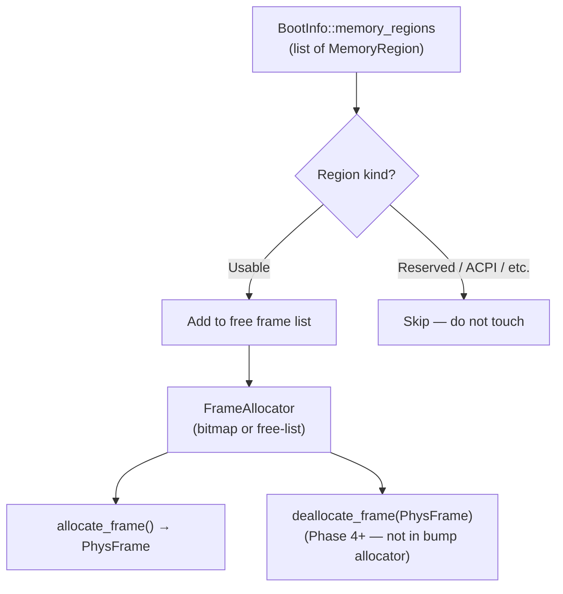
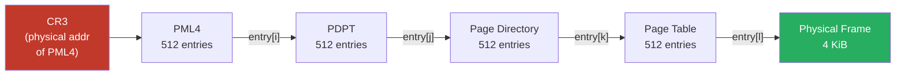
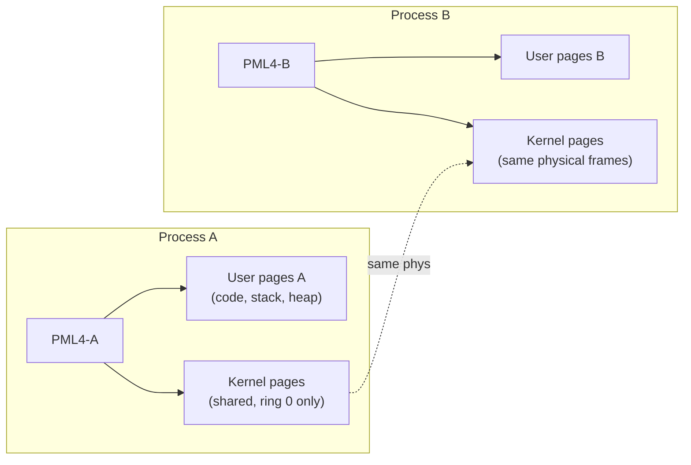

# Memory Management

## Overview

Memory management is one of the first things the kernel must set up after boot.
It has three layers:

1. **Physical frame allocator** — tracks which 4 KiB physical pages are free
2. **Page table manager** — maps virtual addresses to physical frames, enforcing isolation
3. **Kernel heap allocator** — provides `alloc` support (`Vec`, `Box`, etc.) inside the kernel

---

## Physical Memory Layout (at boot)

The `bootloader` crate provides a memory map via `BootInfo::memory_regions`. The kernel
must use this to determine which physical frames are usable.



---

## Physical Frame Allocator

### Phase 17 implementation: free-list allocator with reference counting

The frame allocator is an **intrusive free-list** — each free 4 KiB frame stores a
next pointer (bytes 0..8) and a magic sentinel (bytes 8..16) in its own memory, accessed
through the bootloader's physical-memory offset mapping.

- `allocate_frame()` pops from the head of the free list
- `free_frame(phys)` pushes back to the head; panics on double-free (magic check)
- `free_count()` / `total_frames()` for diagnostics
- Frames below 1 MiB are never allocated (`ALLOC_MIN_ADDR = 0x0010_0000`)

**Per-frame reference counting** is layered on top:
- A `Vec<AtomicU16>` table indexed by frame number (phys_addr / 4096)
- Initialized after heap init; frames allocated before refcounting starts are tracked
  with refcount 0 and freed directly
- `allocate_frame()` sets refcount to 1
- `free_frame()` decrements refcount; only pushes to free list when count reaches 0
- `refcount_inc(phys)` / `refcount_dec(phys)` / `refcount_get(phys)` for CoW support

### Concepts: physical frames vs virtual pages vs kernel heap

| Concept | What it is | How the kernel uses it |
|---|---|---|
| **Physical frame** | A 4 KiB-aligned region of RAM, identified by its physical address | Tracked by the frame allocator; handed to `map_to` when creating mappings |
| **Virtual page** | A 4 KiB-aligned region of virtual address space | What the kernel and userspace programs actually use; backed by a physical frame via page tables |
| **Kernel heap** | A fixed virtual address range (`0xFFFF_8000_0000_0000`, 1 MiB) with physical frames mapped behind it | Where `Box`, `Vec`, `Arc`, `String` allocate their backing memory |

The frame allocator works in *physical* space. The page mapper works across the *physical↔virtual* boundary. The heap allocator works entirely in *virtual* space, carving up the already-mapped heap region.

### Copy-on-write fork (Phase 17)

`sys_fork` uses CoW instead of eagerly copying all user pages:

1. `cow_clone_user_pages`: walks parent's PTEs; for writable pages, clears WRITABLE and
   sets BIT_9 (CoW marker) in both parent and child; increments refcount for each shared
   frame; maps same physical frame in child's page table. Read-only pages (.text/.rodata)
   are shared without BIT_9 so writes to them remain genuine protection violations.
2. Flushes parent TLB via CR3 reload
3. On write to a CoW page, a page fault fires:
   - Detection: ring-3 write fault, page present but not writable, PTE BIT_9 set
   - Resolution (in ISR): allocate fresh frame, copy 4 KiB, remap writable, clear BIT_9,
     decrement old frame's refcount. On OOM, falls through to kill the process.
   - Fast path: if refcount == 1 (sole owner), just remap writable without copying

### Future allocator evolution

Mature kernels add further refinements:

1. **Buddy allocator** — splits/merges power-of-two frame blocks; O(log n) alloc/free
2. **SLAB/SLUB allocator** — small-object caching on top of buddy
3. **Huge pages** — 2 MiB or 1 GiB mappings; fewer TLB entries
4. **Demand paging** — don't map physical frames until first access

```
Physical Memory
┌──────────────────┐ 0x0000_0000
│ First 1 MiB      │  ← BIOS/UEFI reserved, mostly off-limits
├──────────────────┤ 0x0010_0000
│ Kernel image     │  ← loaded by bootloader
│ (code + data)    │
├──────────────────┤
│ Bootloader data  │  ← BootInfo, page tables set up by bootloader
├──────────────────┤
│                  │
│  Usable RAM      │  ← managed by frame allocator
│                  │
├──────────────────┤
│ MMIO / PCI       │  ← memory-mapped hardware registers
└──────────────────┘ top of RAM
```

---

## x86_64 Virtual Memory — 4-Level Paging

x86_64 uses a 4-level page table hierarchy. Each level is a 512-entry table of 64-bit
entries. A virtual address is split into 5 fields:

```
Virtual Address (48 bits used):
 ┌────────┬────────┬────────┬────────┬─────────────┐
 │  PML4  │  PDPT  │   PD   │   PT   │   Offset    │
 │ [47:39]│ [38:30]│ [29:21]│ [20:12]│   [11:0]    │
 │  9 bits│  9 bits│  9 bits│  9 bits│   12 bits   │
 └────────┴────────┴────────┴────────┴─────────────┘
      ↓         ↓        ↓        ↓
    PML4      PDPT      PD       PT
   (L4)      (L3)     (L2)     (L1)
```



### Physical Memory Offset Mapping

The `bootloader` crate sets up an **offset mapping**: the entire physical memory is
mapped starting at a configurable virtual address (`physical_memory_offset`). This means
to access a physical address `P`, you just read from `physical_memory_offset + P`.

To receive `physical_memory_offset` in `BootInfo`, the kernel must opt in via a
`BootloaderConfig` constant at compile time:

```rust
const BOOTLOADER_CONFIG: BootloaderConfig = {
    let mut config = BootloaderConfig::new_default();
    config.mappings.physical_memory = Some(Mapping::Dynamic);
    config
};
entry_point!(kernel_main, config = &BOOTLOADER_CONFIG);
```

Without this, `BootInfo::physical_memory_offset` is `None` and the kernel panics on
the first attempt to walk page tables.

This avoids the complexity of recursive page tables and makes it easy to modify page
tables from the kernel:

```rust
let phys_addr = PhysAddr::new(0x1000);
let virt_addr = VirtAddr::new(physical_memory_offset + phys_addr.as_u64());
let page_table = unsafe { &mut *(virt_addr.as_mut_ptr::<PageTable>()) };
```

---

## Kernel Heap

The kernel heap starts at `HEAP_START = 0xFFFF_8000_0000_0000` with an initial size of
1 MiB. It uses `linked_list_allocator::LockedHeap` as the `#[global_allocator]`.

**Growable heap (Phase 17):** The heap can grow up to `HEAP_MAX_SIZE = 64 MiB`.
`grow_heap(bytes)` maps fresh frames and calls `ALLOCATOR.lock().extend()`. On partial
failure (mid-growth OOM), only successfully mapped pages are extended — no leaked frames.

The `#[alloc_error_handler]` attempts `try_grow_on_oom()` before panicking, but because
the handler's signature is `-> !` it cannot retry the failed allocation. In practice,
`extend()` adds the new memory to the free list so the *next* allocation succeeds; the
current allocation still panics. A custom allocator wrapper could retry transparently
but is deferred.

After `init_heap`, `alloc` types (`Vec`, `Box`, `Arc`, `String`, etc.) work in the kernel.

---

## Address Space per Process

Each userspace process gets its own **PML4 table** (page table root). The kernel
pages are mapped into the top half of every address space (but with supervisor-only
permissions — ring 3 cannot access them).



---

## Key Crates

| Crate | Role |
|---|---|
| `x86_64` | `PhysAddr`, `VirtAddr`, `PageTable`, `Mapper`, `FrameAllocator` trait |
| `linked_list_allocator` | `#[global_allocator]` for kernel heap |
| `bootloader_api` | `BootInfo::memory_regions`, `physical_memory_offset` |

---

## Process Exit Cleanup (Phase 17)

When a process exits (`sys_exit` or fault kill):
1. Read the process's CR3 from the process table
2. `restore_kernel_cr3()` — switch to the kernel's page table
3. `free_process_page_table(cr3_phys)` — walk PML4[0..256], skip entries shared with
   the kernel (detected by matching PDPT frame addresses), free user-accessible leaf
   pages and private page table structure frames via `free_frame()` (refcount-aware)
4. `mark_current_dead()` — scheduler removes the task; `Task::_stack` `Box<[u8]>` drops,
   freeing the kernel stack back to the heap

## Open Questions

- **Buddy allocator** — would give O(log n) allocation and coalescing for large allocations
- **Kernel stack guard pages** — unmapped page below each stack to catch overflow
- **Per-process memory limits** — tracking and capping process RSS
