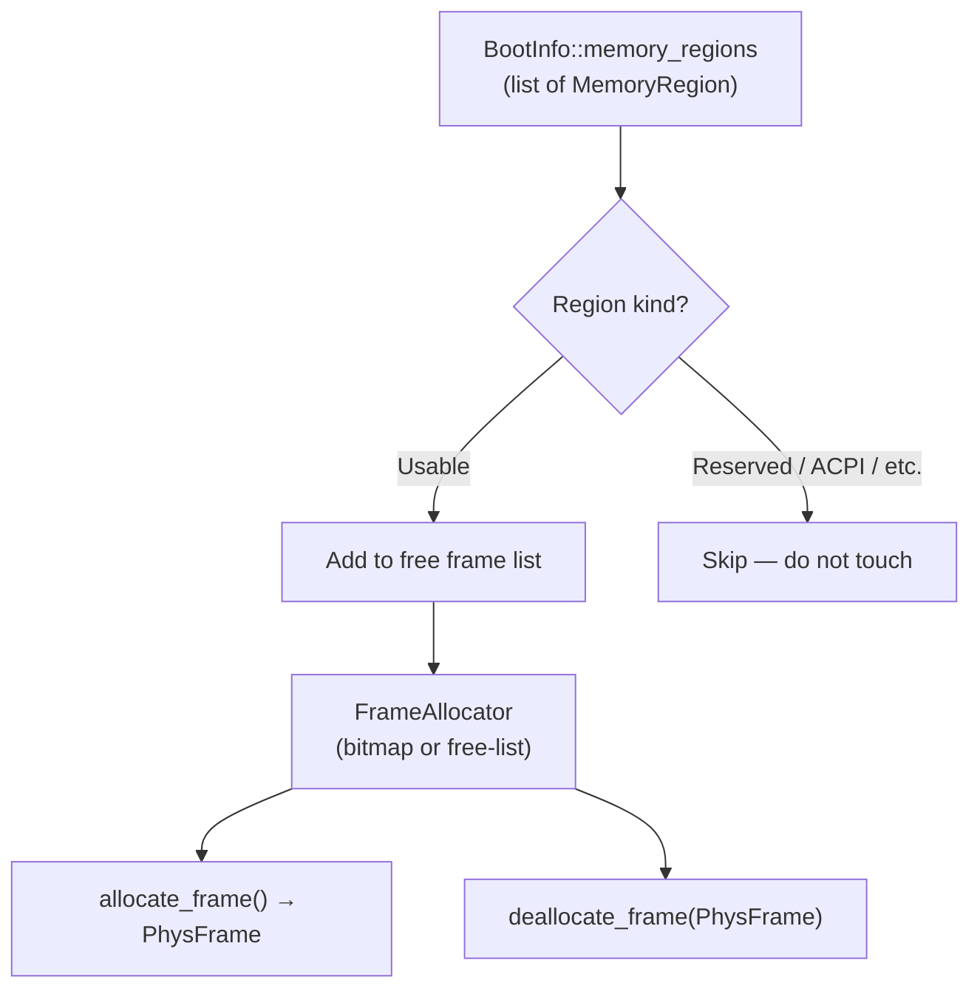
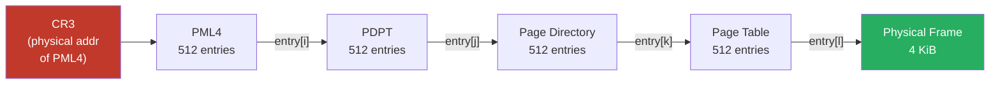
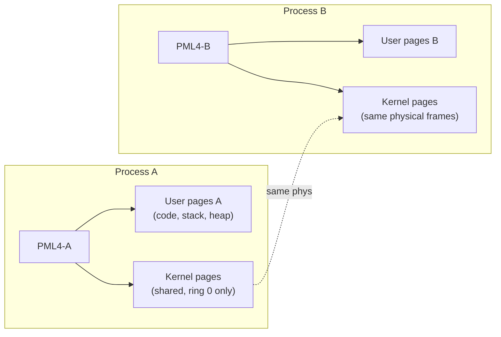

# Memory Management

## Overview

Memory management is one of the first things the kernel must set up after boot.
It has three layers:

1. **Physical frame allocator** — tracks which 4 KiB physical pages are free
2. **Page table manager** — maps virtual addresses to physical frames, enforcing isolation
3. **Kernel heap allocator** — provides `alloc` support (`Vec`, `Box`, etc.) inside the kernel

---

## Physical Memory Layout (at boot)

The `bootloader` crate provides a memory map via `BootInfo::memory_regions`. The kernel
must use this to determine which physical frames are usable.



---

## Physical Frame Allocator

A **bitmap allocator** is the simplest approach for a toy kernel:
- One bit per 4 KiB frame
- Set = used, clear = free
- Scan for first free bit on allocation

An alternative is a **free-list** (linked list of free frames stored in the frames
themselves), which avoids the bitmap overhead but is trickier to implement safely.

For Phase 2 we start with a simple **bump allocator** (allocate-only, no free), then
upgrade to a proper allocator in Phase 4 when process termination is needed.

```
Physical Memory
┌──────────────────┐ 0x0000_0000
│ First 1 MiB      │  ← BIOS/UEFI reserved, mostly off-limits
├──────────────────┤ 0x0010_0000
│ Kernel image     │  ← loaded by bootloader
│ (code + data)    │
├──────────────────┤
│ Bootloader data  │  ← BootInfo, page tables set up by bootloader
├──────────────────┤
│                  │
│  Usable RAM      │  ← managed by frame allocator
│                  │
├──────────────────┤
│ MMIO / PCI       │  ← memory-mapped hardware registers
└──────────────────┘ top of RAM
```

---

## x86_64 Virtual Memory — 4-Level Paging

x86_64 uses a 4-level page table hierarchy. Each level is a 512-entry table of 64-bit
entries. A virtual address is split into 5 fields:

```
Virtual Address (48 bits used):
 ┌────────┬────────┬────────┬────────┬─────────────┐
 │  PML4  │  PDPT  │   PD   │   PT   │   Offset    │
 │ [47:39]│ [38:30]│ [29:21]│ [20:12]│   [11:0]    │
 │  9 bits│  9 bits│  9 bits│  9 bits│   12 bits   │
 └────────┴────────┴────────┴────────┴─────────────┘
      ↓         ↓        ↓        ↓
    PML4      PDPT      PD       PT
   (L4)      (L3)     (L2)     (L1)
```



### Physical Memory Offset Mapping

The `bootloader` crate sets up an **offset mapping**: the entire physical memory is
mapped starting at a configurable virtual address (`physical_memory_offset`). This means
to access a physical address `P`, you just read from `physical_memory_offset + P`.

This avoids the complexity of recursive page tables and makes it easy to modify page
tables from the kernel:

```rust
let phys_addr = PhysAddr::new(0x1000);
let virt_addr = VirtAddr::new(physical_memory_offset + phys_addr.as_u64());
let page_table = unsafe { &mut *(virt_addr.as_mut_ptr::<PageTable>()) };
```

---

## Kernel Heap

Once paging is set up, the kernel allocates a heap region (e.g., 1 MiB at a fixed
virtual address) and initializes `linked_list_allocator` with it:

```rust
use linked_list_allocator::LockedHeap;

#[global_allocator]
static ALLOCATOR: LockedHeap = LockedHeap::empty();

pub fn init_heap(mapper: &mut impl Mapper<Size4KiB>, frame_allocator: &mut impl FrameAllocator<Size4KiB>) {
    // Map HEAP_START..HEAP_START+HEAP_SIZE to physical frames
    // Then:
    unsafe {
        ALLOCATOR.lock().init(HEAP_START as *mut u8, HEAP_SIZE);
    }
}
```

After this, `alloc` types (`Vec`, `Box`, `Arc`, `String`, etc.) work in the kernel.

---

## Address Space per Process

Each userspace process gets its own **PML4 table** (page table root). The kernel
pages are mapped into the top half of every address space (but with supervisor-only
permissions — ring 3 cannot access them).



---

## Key Crates

| Crate | Role |
|---|---|
| `x86_64` | `PhysAddr`, `VirtAddr`, `PageTable`, `Mapper`, `FrameAllocator` trait |
| `linked_list_allocator` | `#[global_allocator]` for kernel heap |
| `bootloader_api` | `BootInfo::memory_regions`, `physical_memory_offset` |

---

## Open Questions

- **Bitmap vs free-list** for the frame allocator — bitmap is simpler; free-list is faster at runtime
- **Heap size** — fixed 1–4 MiB initially; growable heap needed eventually
- **Copy-on-write fork** — not needed until we have process spawning from userspace; skip for now
