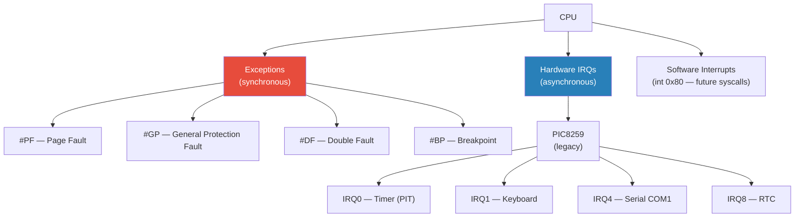
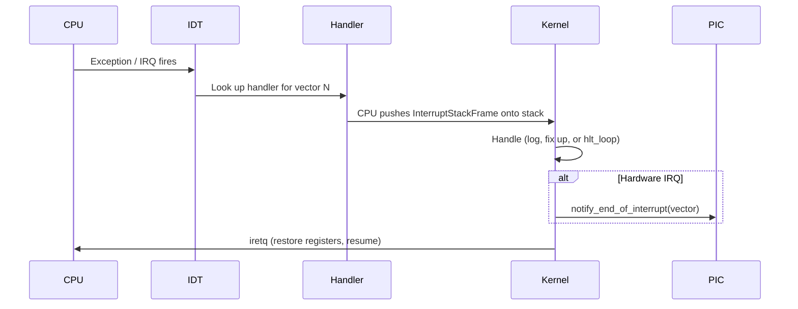
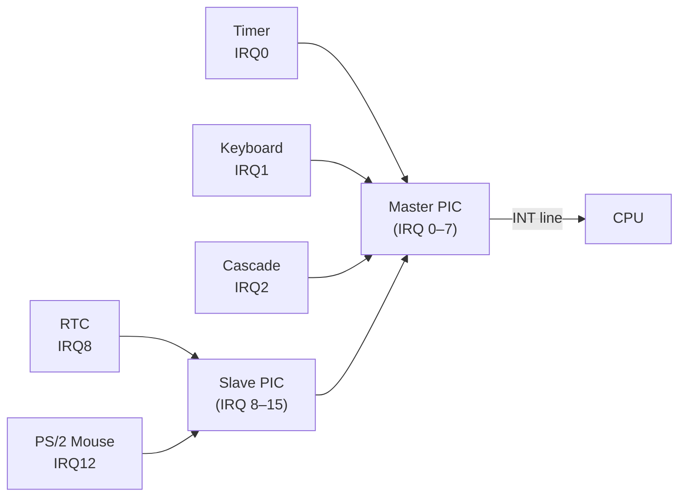

# Interrupts & Exceptions

## Overview

Interrupts allow the CPU to respond to asynchronous events (hardware I/O, timers) and
synchronous faults (invalid memory access, division by zero). The kernel configures
the **Interrupt Descriptor Table (IDT)** — a table of 256 handlers that the CPU
indexes into when an event fires.

---

## Interrupt Sources



---

## Interrupt Descriptor Table (IDT)

The IDT has 256 entries. Each entry points to a handler function and specifies the
privilege level, gate type (interrupt vs. trap), and an optional IST stack index.

```
IDT[3]   → breakpoint_handler
IDT[8]   → double_fault_handler      ← uses IST entry 0 (separate stack in TSS)
IDT[13]  → general_protection_handler
IDT[14]  → page_fault_handler
IDT[32]  → timer_interrupt_handler   ← IRQ0 (PIC remapped to offset 32)
IDT[33]  → keyboard_interrupt_handler ← IRQ1
...
IDT[255] → (reserved)
```

The `x86_64` crate provides the `InterruptDescriptorTable` struct and strongly-typed
handler function signatures. The IDT is a `spin::Lazy` static so it is initialized
once before it is loaded.

---

## Interrupt Path



### Why IRQ Handlers Must Stay Minimal

An IRQ handler runs with interrupts disabled and preempts whatever code was running.
Doing too much inside the handler causes problems:

- **No allocation** — the heap allocator may hold a spin lock; taking it again deadlocks.
- **No blocking** — the handler cannot sleep or wait for a lock held by preempted code.
- **No IPC** — the IPC engine is not re-entrant from interrupt context.

The correct pattern is: read the hardware register, push data to a lock-free or
single-producer ring buffer, send EOI, return. A kernel thread or userspace server
then processes the data at a lower priority.

---

## Exception Handling

### Key Exceptions to Handle

| Vector | Name | Response |
|---|---|---|
| 3 | Breakpoint | Log and continue — useful for debugging |
| 8 | Double Fault | **Panic immediately** — use a separate IST stack |
| 13 | General Protection | Log and `hlt_loop` (kill task in future) |
| 14 | Page Fault | Log CR2 address and error code, then `hlt_loop` |

### TSS and the Double-Fault Stack

A double fault occurs when an exception fires *while handling another exception*. This
is especially dangerous with stack overflows: the stack pointer is invalid, so pushing
the exception frame itself faults.

The CPU will use a separate, always-valid stack if we configure the
**IST (Interrupt Stack Table)** slot in the **TSS (Task State Segment)**:

```rust
// In gdt.rs — IST entry 0 points to the top of a 20 KiB stack.
pub const DOUBLE_FAULT_IST_INDEX: u16 = 0;

// 16-byte-aligned wrapper — plain [u8; N] is only 1-byte aligned, which
// violates the x86_64 ABI's 16-byte stack alignment requirement.
#[repr(align(16))]
struct AlignedStack([u8; 4096 * 5]);

static DOUBLE_FAULT_STACK: AlignedStack = AlignedStack([0; 4096 * 5]);

// In the IDT setup:
idt.double_fault
    .set_handler_fn(double_fault_handler)
    .set_stack_index(gdt::DOUBLE_FAULT_IST_INDEX);
```

The TSS must be registered in a GDT TSS descriptor and loaded with `ltr` before the
IDT is installed. `gdt::init()` handles this in the correct order.

---

## Hardware Interrupts — PIC8259

The Intel 8259A Programmable Interrupt Controller (PIC) is the legacy hardware interrupt
controller. x86 PCs have two cascaded PICs (master + slave), giving 15 usable IRQ lines.



The PIC's default IRQ vectors (0–15) overlap with CPU exception vectors (0–31), so we
**remap** them to vectors 32–47:

```rust
// interrupts.rs — PICS is private; only this module sends EOI.
static PICS: Mutex<ChainedPics> =
    Mutex::new(unsafe { ChainedPics::new(32, 40) });

// Safety: must be called after the IDT is loaded and before interrupts are enabled.
pub unsafe fn init_pics() {
    PICS.lock().initialize();
}

// call site in arch/x86_64/mod.rs:
pub unsafe fn enable_interrupts() {
    interrupts::init_pics();
    x86_64::instructions::interrupts::enable();
}
```

Each hardware interrupt handler must send an **End of Interrupt (EOI)** signal back to
the PIC after handling, or no further interrupts will fire.

---

## Timer Interrupt (IRQ0, vector 32)

The **Programmable Interval Timer (PIT)** fires IRQ0 at ~18.2 Hz by default. The
handler does nothing except increment an atomic tick counter and send EOI:

```rust
extern "x86-interrupt" fn timer_handler(_stack_frame: InterruptStackFrame) {
    TICK_COUNT.fetch_add(1, Ordering::Relaxed);
    unsafe { PICS.lock().notify_end_of_interrupt(InterruptIndex::Timer as u8); }
}
```

No logging inside the handler — the logging backend takes a spin lock and logging on
every tick (18+ times per second) would be extremely noisy. The tick counter is
readable from outside via `tick_count()`.

---

## Keyboard Interrupt (IRQ1, vector 33)

The PS/2 keyboard fires IRQ1 on each key press/release. The handler reads the scancode
from I/O port `0x60` and places it in a 64-byte ring buffer:

```rust
extern "x86-interrupt" fn keyboard_handler(_stack_frame: InterruptStackFrame) {
    let mut port: Port<u8> = Port::new(0x60);
    let scancode: u8 = unsafe { port.read() };
    // push to ring buffer; drop silently if full
    unsafe { PICS.lock().notify_end_of_interrupt(InterruptIndex::Keyboard as u8); }
}
```

The ring buffer is consumed via `interrupts::read_scancode()`. In the microkernel
design, a `kbd_server` userspace process will drain the buffer via a system call.

---

## Future: APIC

The legacy PIC8259 is single-CPU only. For SMP support the kernel will eventually
replace it with the **APIC (Advanced Programmable Interrupt Controller)**:

- **Local APIC** — one per CPU core, handles timer and IPIs (inter-processor interrupts).
  Configured by writing to memory-mapped registers in the LAPIC MMIO region.
- **IOAPIC** — one per motherboard, routes external IRQs to CPU cores. Replaces the
  8259 PIC entirely.

Both are discovered via the ACPI `MADT` table, reachable from `BootInfo::rsdp_addr`.
Modern kernels use the APIC from the start and never initialize the legacy PIC at all.
Linux, FreeBSD, and seL4 all follow this path.

---

## Key Crates

| Crate | Role |
|---|---|
| `x86_64` | `InterruptDescriptorTable`, `InterruptStackFrame`, `Port`, `TaskStateSegment` |
| `pic8259` | `ChainedPics` — PIC initialization and EOI |
| `spin` | `Mutex` for protecting `PICS`; scancode buffer is lock-free (SPSC atomics, no `Mutex` in the IRQ path) |
