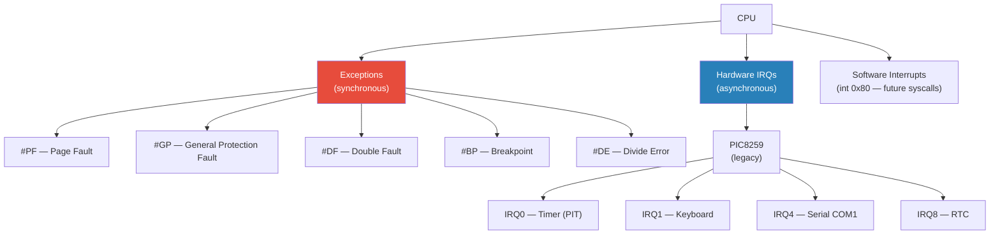
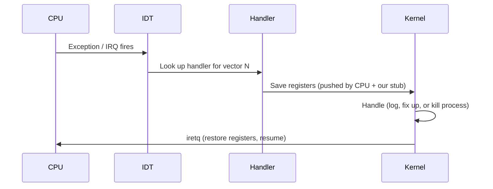
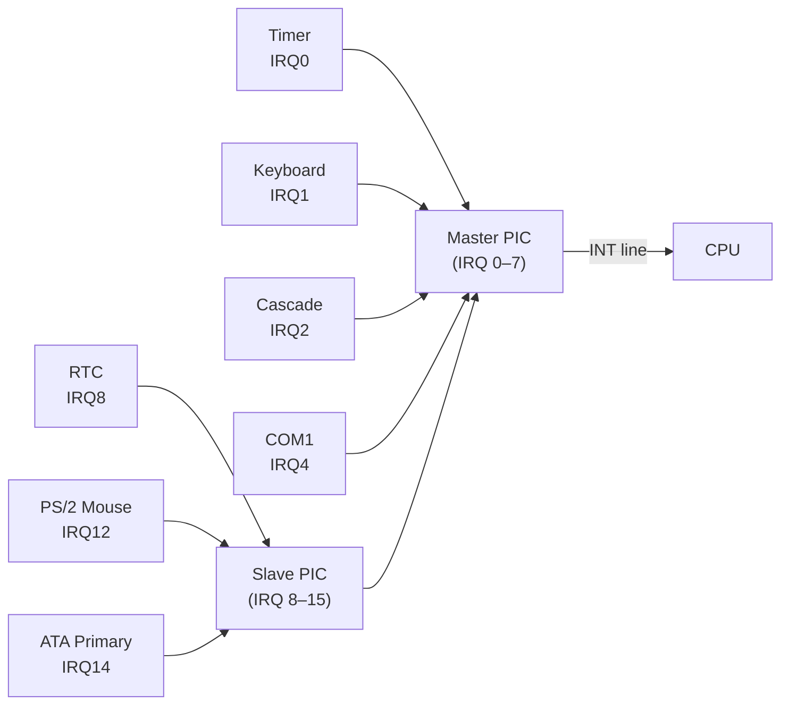

# Interrupts & Exceptions

## Overview

Interrupts allow the CPU to respond to asynchronous events (hardware I/O, timers) and
synchronous faults (invalid memory access, division by zero). The kernel configures
the **Interrupt Descriptor Table (IDT)** — a table of 256 handlers that the CPU
indexes into when an event fires.

---

## Interrupt Sources



---

## Interrupt Descriptor Table (IDT)

The IDT has 256 entries. Each entry points to a handler function and specifies the
privilege level, gate type (interrupt vs. trap), and an optional IST stack index.

```
IDT[0]   → divide_error_handler
IDT[3]   → breakpoint_handler
IDT[8]   → double_fault_handler      ← uses IST stack 1
IDT[13]  → general_protection_handler
IDT[14]  → page_fault_handler
IDT[32]  → timer_interrupt_handler   ← IRQ0 (PIC offset 32)
IDT[33]  → keyboard_interrupt_handler ← IRQ1
...
IDT[255] → (reserved)
```

The `x86_64` crate provides the `InterruptDescriptorTable` struct and strongly-typed
handler function signatures.

---

## Exception Handling Flow



### Key Exceptions to Handle

| Vector | Name | Initial Response |
|---|---|---|
| 0 | Divide Error | Kill current task (in future), panic in early boot |
| 3 | Breakpoint | Log and continue — useful for debugging |
| 8 | Double Fault | **Panic immediately** — use a separate IST stack |
| 13 | General Protection | Kill task / panic |
| 14 | Page Fault | Check if access is valid (future: demand paging); else kill/panic |

### Double Fault Stack

A double fault occurs when an exception fires *while handling another exception*. This
can happen if the original exception was triggered by a stack overflow — the stack pointer
is invalid, so pushing the exception frame itself faults.

The CPU will use a separate, always-valid stack for double faults if we configure the
**IST (Interrupt Stack Table)** in the **TSS (Task State Segment)**:

```rust
// The double fault handler runs on a completely separate stack
// defined in the TSS, not the current task's stack.
static DOUBLE_FAULT_IST_STACK: [u8; 4096 * 5] = [0; 4096 * 5];
```

---

## Hardware Interrupts — PIC8259

The Intel 8259A Programmable Interrupt Controller (PIC) is the legacy hardware interrupt
controller. x86 PCs have two cascaded PICs (master + slave), giving 15 usable IRQ lines.



The PIC's default IRQ vectors (0–15) overlap with CPU exception vectors (0–31), so we
**remap** them to vectors 32–47:

```rust
use pic8259::ChainedPics;

const PIC_1_OFFSET: u8 = 32;
const PIC_2_OFFSET: u8 = PIC_1_OFFSET + 8;

static PICS: Mutex<ChainedPics> = Mutex::new(
    unsafe { ChainedPics::new(PIC_1_OFFSET, PIC_2_OFFSET) }
);
```

Each hardware interrupt handler must send an **End of Interrupt (EOI)** signal back to
the PIC after handling, or no further interrupts will fire.

---

## Timer Interrupt (IRQ0)

The **Programmable Interval Timer (PIT)** fires IRQ0 at a configurable rate (default
~18.2 Hz; we'll set it to ~100 Hz for scheduling).

The timer interrupt is the kernel's heartbeat — it's the trigger for:
- Incrementing a global tick counter
- Preempting the current task (kicking the scheduler)

```rust
extern "x86-interrupt" fn timer_interrupt_handler(_stack_frame: InterruptStackFrame) {
    TICK_COUNT.fetch_add(1, Ordering::Relaxed);
    // TODO: kick scheduler
    unsafe { PICS.lock().notify_end_of_interrupt(InterruptIndex::Timer.as_u8()); }
}
```

---

## Keyboard Interrupt (IRQ1)

The PS/2 keyboard fires IRQ1 on each key press/release. The kernel reads a **scancode**
from I/O port `0x60`:

```rust
extern "x86-interrupt" fn keyboard_interrupt_handler(_stack_frame: InterruptStackFrame) {
    let mut port = Port::new(0x60);
    let scancode: u8 = unsafe { port.read() };
    // push scancode to a queue; a userspace kbd_server will consume it
    unsafe { PICS.lock().notify_end_of_interrupt(InterruptIndex::Keyboard.as_u8()); }
}
```

In the microkernel design, the raw scancode is pushed to a kernel ring buffer, and the
`kbd_server` userspace process reads it via a system call (or IPC wakeup).

---

## Future: APIC

The legacy PIC8259 does not support multiple CPUs (SMP). For SMP support, we'll replace
it with the **APIC (Advanced Programmable Interrupt Controller)**:

- **Local APIC** — one per CPU core, handles timer and IPIs (inter-processor interrupts)
- **IOAPIC** — one per motherboard, routes external IRQs to CPU cores

APIC is detected and configured via ACPI tables (`MADT` table from `BootInfo::rsdp_addr`).

---

## Key Crates

| Crate | Role |
|---|---|
| `x86_64` | `InterruptDescriptorTable`, `InterruptStackFrame`, `Port` |
| `pic8259` | `ChainedPics` — PIC initialization and EOI |
