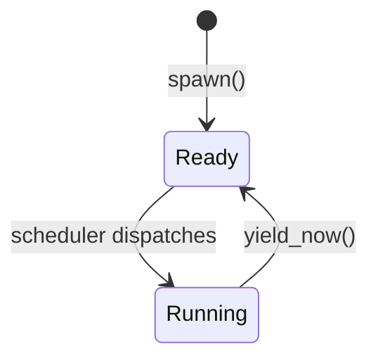

# Tasking & Context Switching

**Aligned Roadmap Phase:** Phase 4
**Status:** Complete
**Source Ref:** phase-04

## Overview

Phase 4 introduces cooperative multi-tasking to the kernel.  Each **task** is an
independent unit of execution with its own stack.  The kernel switches between tasks
by saving and restoring a small register frame — the **context** — without involving
the CPU's hardware task-switching mechanism (which is too heavy-weight for a
microkernel).

---

## Context-Switch Contract (P4-T010)

### Which registers are saved and why

`switch_context` saves and restores the six **callee-saved** registers defined by
the x86-64 System V ABI, plus `RFLAGS`:

| Register | Role |
|---|---|
| `rbx` | General-purpose (callee-saved) |
| `rbp` | Frame pointer (callee-saved) |
| `r12` | General-purpose (callee-saved) |
| `r13` | General-purpose (callee-saved) |
| `r14` | General-purpose (callee-saved) |
| `r15` | General-purpose (callee-saved) |
| `RFLAGS` | Includes the Interrupt Flag (IF) bit |

**Caller-saved registers** (`rax`, `rcx`, `rdx`, `rsi`, `rdi`, `r8`–`r11`) are
_not_ saved by the stub.  The compiler already emits save/restore code for them at
every call site.  Saving them again in the stub would be redundant work.

`rip` is not explicitly saved either — the `call` that transfers control to
`switch_context` pushes the return address onto the stack, and `ret` at the end of
the stub pops it back.  From the compiler's perspective `switch_context` looks like
any other function call.

Saving `RFLAGS` means each task carries its own interrupt state.  A freshly-spawned
task has `RFLAGS = 0x202` (IF=1) written by `init_stack`, so interrupts are enabled
automatically the moment `popf` runs on the first dispatch.

`cli` after `pushf` disables interrupts before the RSP swap so no IRQ can push a
frame onto the new stack mid-restore.  `popf` then atomically re-enables IF from the
saved value, keeping the critical window non-interruptible without requiring callers
to wrap the call in `without_interrupts`.

### Assembly stub

```asm
switch_context:           ; rdi = *save_rsp,  rsi = load_rsp
  push rbx
  push rbp
  push r12
  push r13
  push r14
  push r15
  pushf                   ; save RFLAGS (includes IF bit)
  cli                     ; disable interrupts to protect the stack-swap window
  mov  [rdi], rsp         ; save current RSP into *save_rsp
  mov  rsp, rsi           ; load the new stack (IF=0 while RSP is mid-swap)
  popf                    ; restore RFLAGS → atomically re-enables IF
  pop  r15
  pop  r14
  pop  r13
  pop  r12
  pop  rbp
  pop  rbx
  ret                     ; pop rip from new stack → jump to resumed task
```

Arguments follow the SysV AMD64 ABI: `rdi` = first arg, `rsi` = second arg.

---

## Stack Layout for a New Task (P4-T002)

`init_stack` writes an initial register frame at the top of the allocated stack so
that the very first `switch_context` into the task behaves identically to any
subsequent one.

```text
high address ──────────────────────────────
  raw_top   (past-the-end of Box<[u8]>)
  rip_addr  = (raw_top − 8) & !0xf          ← 16-byte aligned; entry fn stored here
  ...
  frame_start = rip_addr − 56               ← saved_rsp points here

  Offset from frame_start:
  +56  rip    entry fn address
  +48  rbx    0
  +40  rbp    0
  +32  r12    0
  +24  r13    0
  +16  r14    0
  + 8  r15    0
  + 0  RFLAGS 0x202 (IF=1)   ← saved_rsp
low address  ──────────────────────────────
```

**Alignment invariant**: `rip_addr` is 16-byte aligned (ensured by `& !0xf`).
Subtracting 8 before masking prevents an out-of-bounds write when `raw_top` is
already 16-byte aligned.  `frame_start = rip_addr − 56 ≡ −56 ≡ 8 (mod 16)`.
After `popf` + six `pop`s + `ret`, RSP advances 64 bytes to `frame_start + 64 ≡ 8
(mod 16)` — exactly what the SysV ABI requires at a function call boundary.

---

## Task State Machine



There are only two states in Phase 4.  Future phases will add `Blocked`
(waiting on IPC or a sleep timer) and `Exited`.

---

## Scheduler Model (P4-T011)

### Round-robin

The scheduler keeps all tasks in a `Vec<Task>`.  The idle task is registered
separately via `spawn_idle` and is excluded from the normal rotation; it is
selected only when no non-idle task is `Ready` (P4-T009).  On each timer tick
the scheduler picks the next `Ready` non-idle task starting from the slot
_after_ the last one that ran:

```text
tasks: [idle*, task-a, task-b]   (* excluded from normal rotation)
                ↑ last_run = 1 (task-a)

next tick  → start = (1+1)%3 = 2 → task-b  (last_run = 2)
next tick  → start = (2+1)%3 = 0 → idle* (skip) → task-a  (last_run = 1)
next tick  → start = (1+1)%3 = 2 → task-b  (last_run = 2)
...
idle selected only when task-a and task-b are both not Ready
```

Each non-idle ready task gets exactly one "slot" per round.  If a task is not
`Ready` it is skipped.

### Why round-robin for a teaching OS?

- **No bookkeeping**: there are no per-task weights, priorities, or decay counters.
- **Fairness**: every ready task gets equal CPU time.
- **Predictable**: the schedule is deterministic and easy to reason about in
  documentation and lectures.
- **Tiny code**: the entire scheduler fits in ~50 lines of safe Rust.

Real production schedulers sacrifice simplicity for throughput and latency.
Round-robin makes the _concepts_ visible without the noise.

### Timer-driven scheduling (cooperative)

> **Note:** This is a **cooperative** scheduler.  The timer interrupt sets a
> flag but does not forcibly preempt a running task.  Tasks must call
> `yield_now()` to return control to the scheduler.  True preemption — where
> the IRQ handler itself performs the context switch — is planned as future
> work.

```mermaid
sequenceDiagram
    participant PIT as PIT (IRQ0)
    participant ISR as timer_handler
    participant Atom as RESCHEDULE
    participant Loop as scheduler run()
    participant Task

    PIT->>ISR: fires ~18 Hz
    ISR->>Atom: signal_reschedule() — atomic store true
    ISR->>PIT: EOI
    Loop->>Loop: disable() + swap(false) — atomic check, no lost-wakeup
    Loop->>Task: switch_context(SCHEDULER_RSP, task_rsp)
    Task->>Task: executes one "slice" (IF=1; IRQs delivered normally)
    Task->>Loop: yield_now() → switch_context(task_rsp, SCHEDULER_RSP)
    Loop->>Loop: loop back, disable() + check RESCHEDULE again
```

`signal_reschedule` is the _only_ scheduler function called from the ISR.  It
performs a single atomic store — no locks, no allocation, no IPC — satisfying the
interrupt-handler minimalism rule from `docs/03-interrupts.md`.

### Idle behavior (P4-T005, P4-T009)

The idle task is registered via `spawn_idle` and excluded from the normal
round-robin rotation.  `pick_next` first scans all non-idle tasks; only if none
are `Ready` does it fall back to the idle task.  This ensures idle truly runs
only when no other work is available (P4-T009).

The idle task uses plain `hlt()`.  Because `switch_context` restores RFLAGS
(including IF=1) from the saved frame, the idle task runs with interrupts enabled
and `hlt` wakes normally when the timer IRQ fires.

---

## Key Crates

| Crate | Role |
|---|---|
| `x86_64` | `instructions::hlt()` used in idle_task and scheduler loop |
| `spin` | `Mutex<Scheduler>` protects the task list and scheduler state |
| `alloc` | `Box<[u8]>` owns each kernel stack; `Vec<Task>` is the ready queue |
| `core::arch::global_asm!` | Embeds the `switch_context` assembly stub |
| `core::sync::atomic` | `AtomicBool` (RESCHEDULE), `AtomicU64` (TaskId counter) |

---

## Future: Priorities, SMP, and Sleep Queues (P4-T012)

Round-robin treats all tasks equally.  Mature kernels layer several mechanisms on
top:

### Priorities and weighted fair queuing

Linux's **Completely Fair Scheduler (CFS)** tracks a per-task `vruntime` (virtual
runtime, scaled by priority weight).  The scheduler always picks the task with the
smallest `vruntime`, stored in a red-black tree for O(log n) lookup.  This gives
high-priority tasks proportionally more CPU without starving low-priority ones.

FreeBSD uses a **multilevel feedback queue**: tasks move between priority bands based
on CPU usage.  CPU-bound tasks drift toward lower priority; I/O-bound tasks stay
high.  This keeps interactive workloads responsive without programmer intervention.

### Affinity and per-CPU run queues

On multi-core hardware each CPU core has its own run queue.  A **load balancer**
periodically migrates tasks between queues when cores become idle.  **Affinity masks**
let a task pin itself to a subset of cores (e.g. to exploit cache locality or to
meet NUMA constraints).

seL4 exposes affinity as a kernel object capability so userspace schedulers can
enforce it without trust in the kernel policy.

### Sleep queues and wakeup paths

A `Blocked` state requires a complementary wakeup mechanism.  Common patterns:

- **Wait queue**: a task calls `wait_event(condition)`, which pushes it onto a list
  and calls `schedule()`.  When the condition becomes true, another task or an ISR
  calls `wake_up(list)` to move all waiters back to `Ready`.
- **Futex** (Linux): a fast userspace mutex backed by an in-kernel wait queue.  The
  common (uncontended) path never enters the kernel; only contention causes a syscall.
- **Notification objects** (seL4 / Phase 5 plan): a word-sized bitfield that ISRs
  signal atomically.  A server blocks on `wait()` and wakes when any bit is set.

Adding sleep and wakeup to m³OS is planned for Phase 5 (IPC), where the first
real inter-task communication will require tasks to block on endpoint receive.

---

## Block/Wake Protocol (v2 — Phase 57a)

> **Current protocol as of kernel v0.57.2.** Phase 57a rewrote the block/wake
> primitive to eliminate the lost-wake bug class that arose from v1's use of
> multiple boolean flags (`switching_out`, `wake_after_switch`,
> `PENDING_SWITCH_OUT`) as intermediate state. See
> [`docs/roadmap/tasks/57a-scheduler-rewrite-tasks.md`](./roadmap/tasks/57a-scheduler-rewrite-tasks.md)
> for the full rewrite reference, and
> [`docs/handoffs/57a-scheduler-rewrite-v2-transitions.md`](./handoffs/57a-scheduler-rewrite-v2-transitions.md)
> for the v2 state-transition table that forms the formal spec.

### Lock ordering

`pi_lock` is *outer*, `SCHEDULER.lock` is *inner* (Linux's `p->pi_lock` →
`rq->lock` pattern). A code path may hold `pi_lock` while acquiring
`SCHEDULER.lock`; the reverse is forbidden and panics in debug builds.

**State ownership:**
- `pi_lock` owns canonical block state: `TaskBlockState.state`, `wake_deadline`.
- `SCHEDULER.lock` owns scheduler-visible state: run-queue membership, `Task::on_cpu`.

### `block_current_until` — four-step Linux recipe

Mirrors Linux's `do_nanosleep` / `set_current_state` pattern
(`kernel/time/hrtimer.c`):

1. **State write under `pi_lock`.** Acquire `pi_lock`; write `task.state ←
   Blocked*`; set `task.wake_deadline`; release `pi_lock`. The Release barrier
   pairs with the Acquire barrier in the wake side's CAS, closing the lost-wake
   window.
2. **Release `pi_lock`** before the condition recheck so a concurrent waker
   can acquire `pi_lock` and CAS without deadlock.
3. **Condition recheck.** Read the `woken` `AtomicBool` (or compare
   `tick_count()` against `deadline_ticks`) *after* the state write. If the
   condition is already true, self-revert: acquire `pi_lock`; CAS `Blocked* →
   Running`; clear `wake_deadline`; release `pi_lock`; return without yielding.
4. **Yield via `SCHEDULER.lock`.** Acquire `SCHEDULER.lock`; remove task from
   run queue; call `switch_context` to the scheduler RSP. On resume, recheck
   the condition; if false (spurious wake), re-enter step 1.

### `wake_task` CAS rewrite

1. Acquire `pi_lock`; CAS `state` from any `Blocked*` to `Ready`; clear
   `wake_deadline`; release `pi_lock`.
2. If CAS failed (task was not `Blocked*`): return `AlreadyAwake`.
3. Acquire `SCHEDULER.lock`; if task is already enqueued (concurrent waker),
   return `Woken` (idempotency guard).
4. If `task.on_cpu == true` (RSP not yet published by the arch-level switch-out
   epilogue): spin-wait (`smp_cond_load_acquire`-style) until `on_cpu` becomes
   false. Replaces v1's `PENDING_SWITCH_OUT[core]` deferred-enqueue hand-off.
5. Enqueue task to its `assigned_core` run queue; if cross-core, send reschedule
   IPI.

### `Task::on_cpu` RSP-publication marker

`Task::on_cpu` (introduced in Phase 57a Track E.1) is set to `true` when a
task is dispatched (its RSP is live in hardware) and cleared in the arch-level
switch-out epilogue once `saved_rsp` is committed. The wake side spin-waits on
this field before enqueueing, replacing the v1 `PENDING_SWITCH_OUT[core]`
deferred-enqueue mechanism.

### v1 fields removed

The following v1 intermediate-state fields and their supporting infrastructure
are **absent** from the current codebase (deleted in Phase 57a Tracks E–F):
`switching_out`, `wake_after_switch`, `PENDING_SWITCH_OUT`. Any reference to
these names in source code is a bug; the v2 protocol uses `Task::on_cpu` and
`TaskBlockState.state` under `pi_lock` exclusively.

---

## Preempt-discipline (Phase 57b)

> **Current discipline as of kernel v0.57.2.** Phase 57b adds Linux-style
> `preempt_count` infrastructure as a no-op refactor: every spinlock callsite
> increments a per-task counter while the lock is held, but no IRQ handler
> consults it yet. The counter becomes load-bearing in Phase 57d (voluntary
> preemption) and Phase 57e (full kernel preemption). The design source of
> truth is
> [`docs/appendix/preemptive-multitasking.md`](./appendix/preemptive-multitasking.md);
> the phase rationale and acceptance criteria are in
> [`docs/roadmap/57b-preemption-foundation.md`](./roadmap/57b-preemption-foundation.md).
> The full top-of-file reference for the discipline lives at the head of
> `kernel/src/task/scheduler.rs` (`# preempt_count` section).

### `preempt_count`

Each `Task` carries a `preempt_count: AtomicI32` initialised to `0` at
construction. The counter is incremented on every spinlock acquire and
decremented on every release; it must return to `0` at every user-mode
return boundary. `Scheduler::tasks` is `Vec<Box<Task>>` so a cached raw
pointer into `Task::preempt_count` is stable for the task's lifetime — the
outer `Vec` may reallocate when growing, but the inner `Box` keeps each
`Task` at a fixed heap address.

The counter has a documented maximum nesting depth of 32 (16 for nested
locks plus 16 of slack for diagnostic frames); a `debug_assert!` in
`preempt_disable` panics if the post-increment value exceeds that bound.

### `current_preempt_count_ptr`

`PerCoreData::current_preempt_count_ptr: AtomicPtr<AtomicI32>` is the
per-CPU dispatch pointer that `preempt_disable` and `preempt_enable` read
on the hot path. It targets either the running task's `preempt_count` (in
task context) or one slot of the per-core
`SCHED_PREEMPT_COUNT_DUMMY: [AtomicI32; MAX_CORES]` array (in scheduler /
idle context). The dispatch path retargets the pointer in two phases —
switch-out epilogue retargets to the dummy; switch-in handoff retargets to
the incoming task — each wrapped in an explicit `cli` / interrupts-restore
window so no `IrqSafeMutex::lock` straddles a retarget. The per-CPU
indirection is what makes `preempt_disable` and `preempt_enable` lock-free
free functions: each helper performs a single `AtomicPtr::load(Acquire)`
followed by a single `fetch_add` / `fetch_sub` on the pointee, without
acquiring any scheduler lock.

### `IrqSafeMutex` integration (Track F)

`IrqSafeMutex::lock` calls `preempt_disable` *before* masking interrupts;
`IrqSafeGuard::Drop` calls `preempt_enable` *after* the spin guard releases
and IF is restored. The drop sequence (spin-unlock → IF restore →
`preempt_enable`) is load-bearing: the unlock-before-IF-restore window is
the same Phase 57a invariant that prevents an ISR from reaching a
just-freed lock with stale `was_enabled` state, and dropping the
`preempt_count` last keeps the count elevated for the entire critical
section. `try_lock` mirrors the pattern: it raises `preempt_count` before
the inner attempt and undoes the raise (paired `preempt_enable`) iff the
inner `try_lock` returned `None`, so a failed acquire has zero net effect.
This single integration point gives every existing `IrqSafeMutex` callsite
preempt-discipline for free; non-`IrqSafeMutex` callsites are migrated per
the durable per-callsite audit at
[`docs/handoffs/57b-spinlock-callsite-audit.md`](./handoffs/57b-spinlock-callsite-audit.md)
(Track G).

### User-mode-return invariant (Track D.3)

The earliest possible detection of a forgotten `preempt_enable` is at the
user-mode return boundary. Track D.3 installs a `debug_assert!` at the
syscall-return path (`kernel/src/arch/x86_64/syscall/mod.rs`) and at every
IRQ-return-to-ring-3 path (`kernel/src/arch/x86_64/interrupts.rs`) that
reads `(*per_core().current_preempt_count_ptr.load(Acquire)).load(Relaxed)`
and panics on a non-zero count. Release builds compile the assertion out
(no overhead); the 57a stuck-task watchdog is the coarse signal there.

`preempt_count` is **task-local** and does not participate in the lock
hierarchy from the v2 block/wake protocol above — acquiring or releasing
`preempt_count` does not invalidate any other lock held by the task.

---

## Audit-derived block+wake patterns (Phase 57c)

Phase 57c audited every `core::hint::spin_loop()` invocation in `kernel/src/` and classified
each as *convert*, *annotate* (hardware-bounded), or *leave* (already documented).  The
durable result is [`docs/handoffs/57c-busy-wait-audit.md`](./handoffs/57c-busy-wait-audit.md).

### The audit found zero new convert sites

All unbounded kernel busy-spins were converted in Phase 57a (`virtio_blk`, `sys_poll`,
`net_task`, `WaitQueue::sleep`, `futex_wait`, NVMe device-host).  The audit confirmed these
conversions intact and classified the remaining 15 spins as hardware-bounded.

### How to convert a kernel busy-spin

When you add a new kernel wait that depends on a software condition:

1. **Identify the holder** — what code, on what core, completes the condition?
   - *This-core IRQ handler* → use a `Notification` object as the wake source.
   - *Another task* → use `WaitQueue::wake_one` / `wake_all`.
   - *Hardware register* → document the hardware bound; leave as spin with annotation.

2. **Find or build a wake source** — an `AtomicBool` asserted by the holder:
   ```rust
   static MY_WOKEN: AtomicBool = AtomicBool::new(false);
   // In IRQ handler or task waker:
   MY_WOKEN.store(true, Ordering::Release);
   wake_task(waiting_task_id);
   ```

3. **Replace the spin with `block_current_until`**:
   ```rust
   // Before: busy-poll
   while !condition.load(Ordering::Acquire) {
       core::hint::spin_loop();
   }

   // After: block + wake
   // MY_WOKEN (from step 2) is the edge-triggered wake gate; `condition` is
   // the durable work predicate (often the same AtomicBool in simple drain loops).
   loop {
       MY_WOKEN.store(false, Ordering::Release);  // clear before checking (lost-wakeup safety)
       if condition.load(Ordering::Acquire) { break; }
       // Parks the task; self-reverts immediately if MY_WOKEN was set while draining.
       block_current_until(TaskState::BlockedOnRecv, &MY_WOKEN, None);
   }
   ```

4. **Add a doc comment** on the wait condition stating: what asserts it, who clears it,
   expected wake latency.

5. **Add a regression test** in `kernel-core` (host-testable structural test) or `kernel/tests/`
   (in-QEMU) verifying the block+wake contract.  See Phase 57c Track B for examples.

### When a spin should stay

A busy-spin may remain **if and only if**:
- The holder is hardware (not a software task that can be preempted); **and**
- The bound is documentable (hardware spec section or datasheet reference); **and**
- A context-switch would cost more than the spin (e.g., < 1 µs LAPIC delivery).

Every such spin must carry a comment of the form:
```rust
// HW-bounded: ~1 µs (Intel SDM Vol 3A §10.6, 'Local APIC ICR Delivery').
// preempt_disable() wrapper added in Phase 57e Track B (load-bearing for PREEMPT_FULL only).
```

---

## See Also

- `docs/03-interrupts.md` — timer ISR and the rule against allocation in IRQ handlers
- `docs/06-ipc.md` — IPC model that will require `Blocked` state in Phase 6
- `docs/roadmap/README.md` — per-phase scope and milestones
- `docs/roadmap/tasks/57a-scheduler-rewrite-tasks.md` — Phase 57a block/wake rewrite
- `docs/handoffs/57a-scheduler-rewrite-v2-transitions.md` — v2 state-transition spec
- `docs/handoffs/57c-busy-wait-audit.md` — Phase 57c durable audit catalogue
