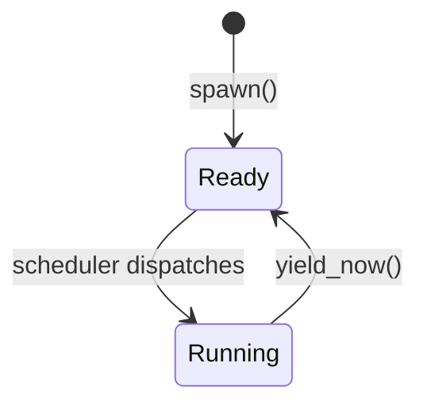

# Tasking & Context Switching

## Overview

Phase 4 introduces cooperative multi-tasking to the kernel.  Each **task** is an
independent unit of execution with its own stack.  The kernel switches between tasks
by saving and restoring a small register frame — the **context** — without involving
the CPU's hardware task-switching mechanism (which is too heavy-weight for a
microkernel).

---

## Context-Switch Contract (P4-T010)

### Which registers are saved and why

`switch_context` saves and restores only the six **callee-saved** registers defined
by the x86-64 System V ABI:

| Register | Role |
|---|---|
| `rbx` | General-purpose (callee-saved) |
| `rbp` | Frame pointer (callee-saved) |
| `r12` | General-purpose (callee-saved) |
| `r13` | General-purpose (callee-saved) |
| `r14` | General-purpose (callee-saved) |
| `r15` | General-purpose (callee-saved) |

**Caller-saved registers** (`rax`, `rcx`, `rdx`, `rsi`, `rdi`, `r8`–`r11`) are
_not_ saved by the stub.  The compiler already emits save/restore code for them at
every call site.  Saving them again in the stub would be redundant work.

`rip` is not explicitly saved either — the `call` that transfers control to
`switch_context` pushes the return address onto the stack, and `ret` at the end of
the stub pops it back.  From the compiler's perspective `switch_context` looks like
any other function call.

### Assembly stub

```asm
switch_context:           ; rdi = *save_rsp,  rsi = load_rsp
  push rbx
  push rbp
  push r12
  push r13
  push r14
  push r15
  mov  [rdi], rsp         ; save current RSP into *save_rsp
  mov  rsp, rsi           ; load the new stack
  pop  r15
  pop  r14
  pop  r13
  pop  r12
  pop  rbp
  pop  rbx
  ret                     ; pop rip from new stack → jump to resumed task
```

Arguments follow the SysV AMD64 ABI: `rdi` = first arg, `rsi` = second arg.

---

## Stack Layout for a New Task (P4-T002)

`init_stack` writes an initial register frame at the top of the allocated stack so
that the very first `switch_context` into the task behaves identically to any
subsequent one.

```text
high address ──────────────────────────────
  raw_top   (past-the-end of Box<[u8]>)
  rip_addr  (16-byte aligned ≤ raw_top)      ← entry fn pointer stored here
  ...
  frame_start = rip_addr − 48               ← saved_rsp points here

  Offset from frame_start:
  +48  rip   entry fn address
  +40  rbx   0
  +32  rbp   0
  +24  r12   0
  +16  r13   0
  + 8  r14   0
  + 0  r15   0   ← saved_rsp
low address  ──────────────────────────────
```

**Alignment invariant**: `rip_addr` is 16-byte aligned.  Because `48 % 16 == 0`,
`frame_start` is also 16-byte aligned.  After `ret` pops `rip` and advances RSP by
8, the entry function sees `RSP ≡ 8 (mod 16)` — exactly what the SysV ABI requires
at a function call boundary.

---

## Task State Machine



There are only two states in Phase 4.  Future phases will add `Blocked`
(waiting on IPC or a sleep timer) and `Exited`.

---

## Scheduler Model (P4-T011)

### Round-robin

The scheduler keeps all tasks in a `Vec<Task>`.  On each timer tick it picks the
next `Ready` task starting from the slot _after_ the last one that ran:

```text
tasks: [idle, task-a, task-b]
           ↑ last_run = 0

next tick  → start = (0+1)%3 = 1 → task-a  (last_run = 1)
next tick  → start = (1+1)%3 = 2 → task-b  (last_run = 2)
next tick  → start = (2+1)%3 = 0 → idle    (last_run = 0)
...
```

Each ready task gets exactly one "slot" per round.  If a task is not `Ready` it is
skipped.

### Why round-robin for a teaching OS?

- **No bookkeeping**: there are no per-task weights, priorities, or decay counters.
- **Fairness**: every ready task gets equal CPU time.
- **Predictable**: the schedule is deterministic and easy to reason about in
  documentation and lectures.
- **Tiny code**: the entire scheduler fits in ~50 lines of safe Rust.

Real production schedulers sacrifice simplicity for throughput and latency.
Round-robin makes the _concepts_ visible without the noise.

### Timer-driven preemption path

```mermaid
sequenceDiagram
    participant PIT as PIT (IRQ0)
    participant ISR as timer_handler
    participant Atom as RESCHEDULE
    participant Loop as scheduler run()
    participant Task

    PIT->>ISR: fires ~18 Hz
    ISR->>Atom: signal_reschedule() — atomic store true
    ISR->>PIT: EOI
    Loop->>Loop: hlt wakes on IRQ
    Loop->>Atom: swap(false) — true returned
    Loop->>Task: switch_context(SCHEDULER_RSP, task_rsp)
    Task->>Task: executes one "slice"
    Task->>Loop: yield_now() → switch_context(task_rsp, SCHEDULER_RSP)
    Loop->>Loop: loop back, hlt again
```

`signal_reschedule` is the _only_ scheduler function called from the ISR.  It
performs a single atomic store — no locks, no allocation, no IPC — satisfying the
interrupt-handler minimalism rule from `docs/04-interrupts.md`.

### Idle behavior (P4-T005, P4-T009)

When `pick_next` finds no `Ready` task the scheduler loop simply `continue`s back
to `hlt`.  The dedicated `idle_task` (always `Ready`) ensures there is normally
something to run, but if it were absent the scheduler would spin in idle-hlt until
a task becomes ready.

---

## Key Crates

| Crate | Role |
|---|---|
| `x86_64` | `instructions::hlt()` used in idle_task and scheduler loop |
| `spin` | `Mutex<Scheduler>` protects the task list and scheduler state |
| `alloc` | `Box<[u8]>` owns each kernel stack; `Vec<Task>` is the ready queue |
| `core::arch::global_asm!` | Embeds the `switch_context` assembly stub |
| `core::sync::atomic` | `AtomicBool` (RESCHEDULE), `AtomicU64` (TaskId counter) |

---

## Future: Priorities, SMP, and Sleep Queues (P4-T012)

Round-robin treats all tasks equally.  Mature kernels layer several mechanisms on
top:

### Priorities and weighted fair queuing

Linux's **Completely Fair Scheduler (CFS)** tracks a per-task `vruntime` (virtual
runtime, scaled by priority weight).  The scheduler always picks the task with the
smallest `vruntime`, stored in a red-black tree for O(log n) lookup.  This gives
high-priority tasks proportionally more CPU without starving low-priority ones.

FreeBSD uses a **multilevel feedback queue**: tasks move between priority bands based
on CPU usage.  CPU-bound tasks drift toward lower priority; I/O-bound tasks stay
high.  This keeps interactive workloads responsive without programmer intervention.

### Affinity and per-CPU run queues

On multi-core hardware each CPU core has its own run queue.  A **load balancer**
periodically migrates tasks between queues when cores become idle.  **Affinity masks**
let a task pin itself to a subset of cores (e.g. to exploit cache locality or to
meet NUMA constraints).

seL4 exposes affinity as a kernel object capability so userspace schedulers can
enforce it without trust in the kernel policy.

### Sleep queues and wakeup paths

A `Blocked` state requires a complementary wakeup mechanism.  Common patterns:

- **Wait queue**: a task calls `wait_event(condition)`, which pushes it onto a list
  and calls `schedule()`.  When the condition becomes true, another task or an ISR
  calls `wake_up(list)` to move all waiters back to `Ready`.
- **Futex** (Linux): a fast userspace mutex backed by an in-kernel wait queue.  The
  common (uncontended) path never enters the kernel; only contention causes a syscall.
- **Notification objects** (seL4 / Phase 5 plan): a word-sized bitfield that ISRs
  signal atomically.  A server blocks on `wait()` and wakes when any bit is set.

Adding sleep and wakeup to ostest is planned for Phase 5 (IPC), where the first
real inter-task communication will require tasks to block on endpoint receive.

---

## See Also

- `docs/04-interrupts.md` — timer ISR and the rule against allocation in IRQ handlers
- `docs/06-ipc.md` — IPC model that will require `Blocked` state in Phase 5
- `docs/08-roadmap.md` — per-phase scope and open design questions
