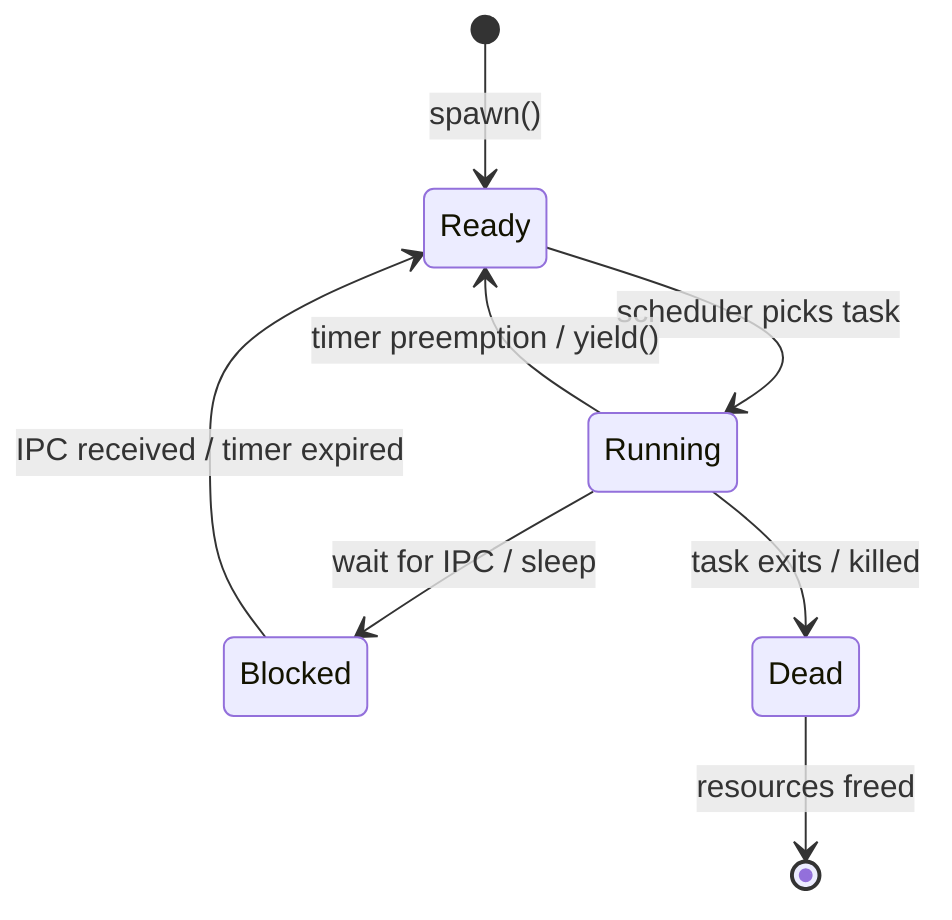
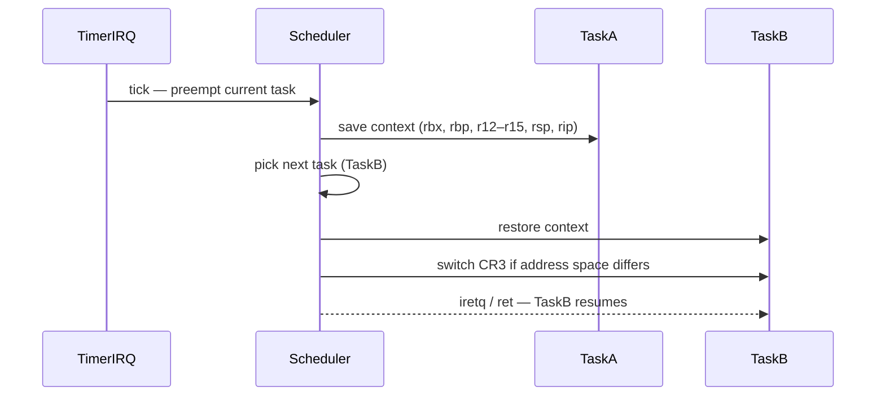
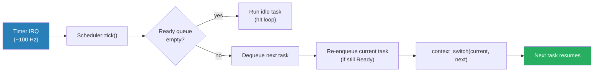

# Tasking & Scheduling

## Overview

Multitasking allows the kernel to run multiple threads of execution concurrently by
rapidly switching between them. The kernel manages:

- **Tasks** — the unit of execution (a thread with its own register state and stack)
- **Context switching** — saving one task's CPU state and restoring another's
- **Scheduler** — deciding which task runs next

In the microkernel model, the kernel only manages **kernel threads** (and each userspace
process has at least one thread). All userspace concurrency builds on top of these
kernel primitives.

---

## Task States



---

## Task Structure

Each task is represented by a `Task` struct stored in the kernel heap:

```rust
pub struct Task {
    pub id: TaskId,
    pub state: TaskState,
    pub context: TaskContext,    // saved register state
    pub stack: TaskStack,        // kernel stack (and user stack for ring 3 tasks)
    pub page_table: PageTable,   // address space root (CR3)
    pub priority: u8,
    pub ipc_state: IpcState,     // blocked on send/receive?
}

pub struct TaskContext {
    // callee-saved registers (System V AMD64 ABI)
    pub rbx: u64,
    pub rbp: u64,
    pub r12: u64,
    pub r13: u64,
    pub r14: u64,
    pub r15: u64,
    pub rsp: u64,  // stack pointer
    pub rip: u64,  // instruction pointer (return address)
}
```

---

## Context Switch

A context switch saves the current task's registers to its `TaskContext` and restores
the next task's registers. On x86_64, the caller-saved registers are on the stack
(handled by Rust/compiler); we only need to save/restore **callee-saved** registers.



The context switch itself is a small assembly function:

```asm
; switch_context(current: *mut TaskContext, next: *const TaskContext)
switch_context:
    ; save current task
    mov [rdi + 0],  rbx
    mov [rdi + 8],  rbp
    mov [rdi + 16], r12
    mov [rdi + 24], r13
    mov [rdi + 32], r14
    mov [rdi + 40], r15
    mov [rdi + 48], rsp
    lea rax, [rip + .return]
    mov [rdi + 56], rax

    ; restore next task
    mov rbx, [rsi + 0]
    mov rbp, [rsi + 8]
    mov r12, [rsi + 16]
    mov r13, [rsi + 24]
    mov r14, [rsi + 32]
    mov r15, [rsi + 40]
    mov rsp, [rsi + 48]
    jmp [rsi + 56]   ; jump to next task's saved rip

.return:
    ret
```

---

## Scheduler

Phase 4 implements a simple **round-robin scheduler** — tasks in the `Ready` queue
are run in a circular order, each getting one timer tick (configurable time slice).



### Scheduler Data Structure

```rust
pub struct Scheduler {
    ready_queue: VecDeque<TaskId>,
    tasks: BTreeMap<TaskId, Task>,
    current: Option<TaskId>,
    idle_task: TaskId,
}
```

### Future Scheduling Improvements

| Feature | Description |
|---|---|
| Priority scheduling | Higher-priority tasks preempt lower ones |
| Multi-level feedback queue | Automatically adjusts priority based on CPU usage |
| Real-time tasks | Hard deadline guarantees for driver servers |
| SMP | Per-core run queues + work stealing |

---

## Stacks

Each task has two stacks:

| Stack | Location | Used for |
|---|---|---|
| Kernel stack | Kernel heap (e.g., 16 KiB) | Syscall handlers, interrupt handlers, kernel threads |
| User stack | Userspace address space | Normal userspace execution |

On a syscall or interrupt, the CPU automatically switches to the kernel stack via the
**RSP0** field in the TSS. The kernel stack must never overflow — stack probes or guard
pages should be added in a later phase.

---

## Idle Task

When no tasks are `Ready`, the scheduler runs a special **idle task** that executes the
`hlt` instruction, pausing the CPU until the next interrupt:

```rust
fn idle_task() -> ! {
    loop {
        x86_64::instructions::hlt();
    }
}
```

This avoids busy-spinning and saves power / allows QEMU to behave correctly.

---

## Kernel Threads vs. Userspace Threads

In Phase 4, all tasks are **kernel threads** — they run entirely in ring 0. In Phase 5
we add support for **userspace tasks** (ring 3), which have a separate user stack and
address space. The kernel scheduler treats both uniformly; the distinction is in the
page tables and privilege level restored by `iretq`.
