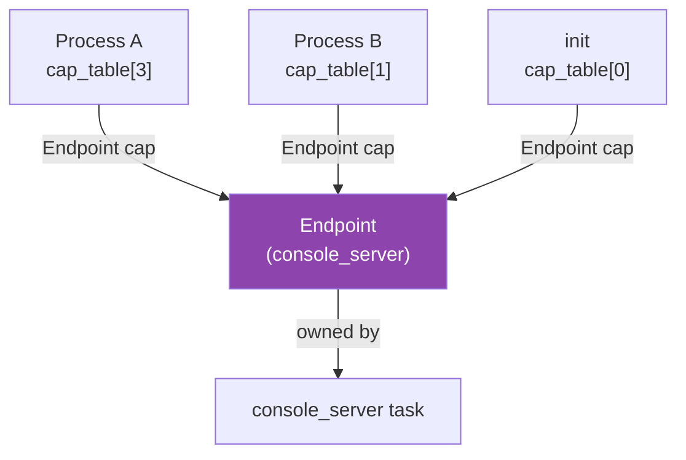
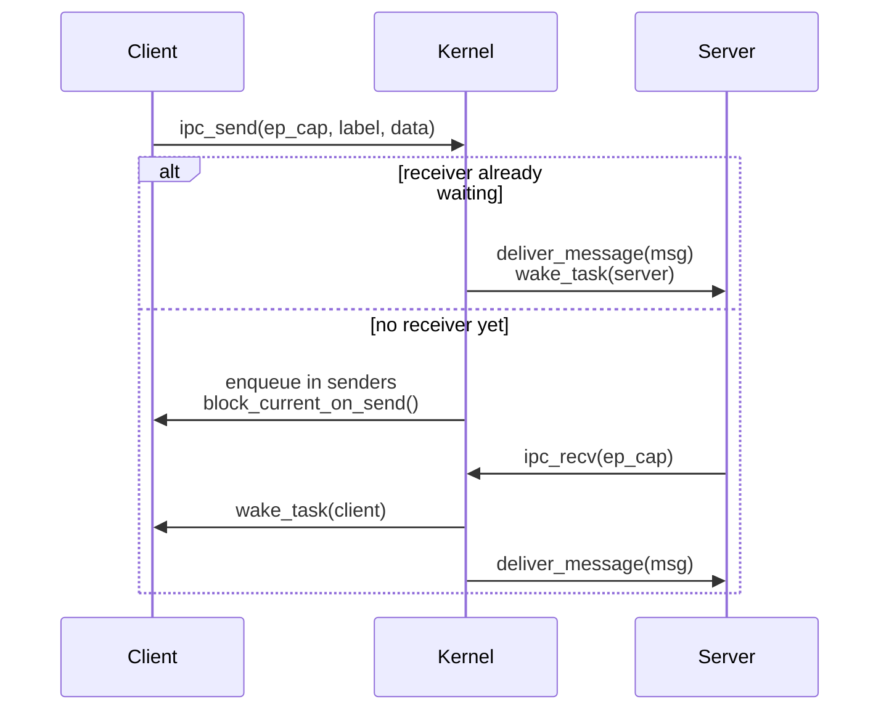
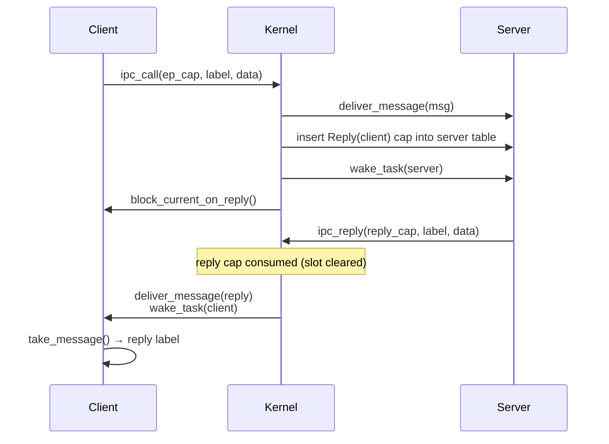
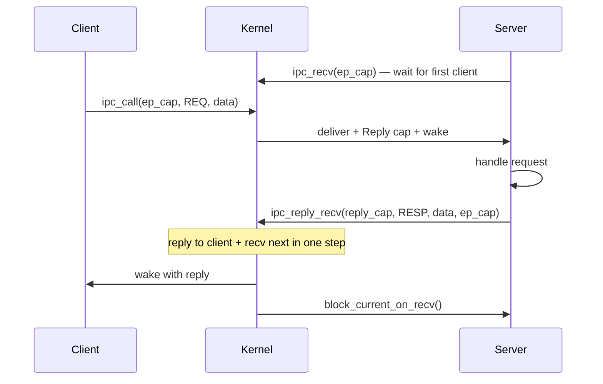
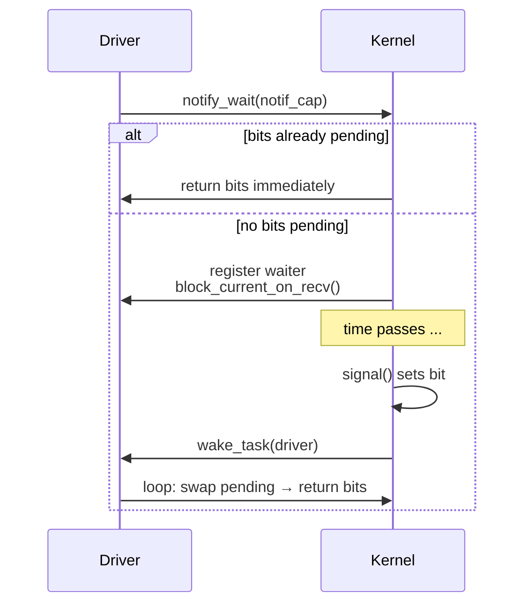
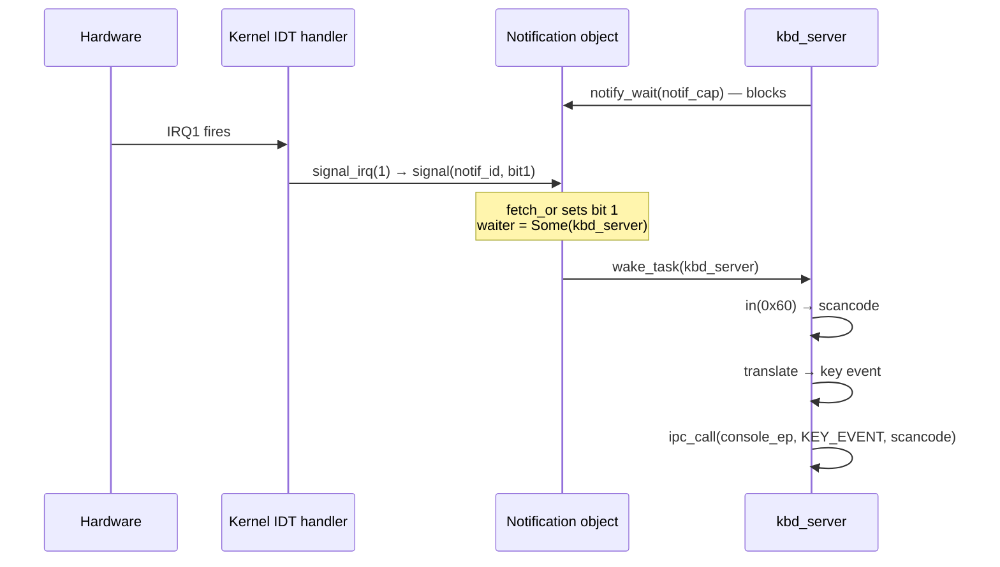
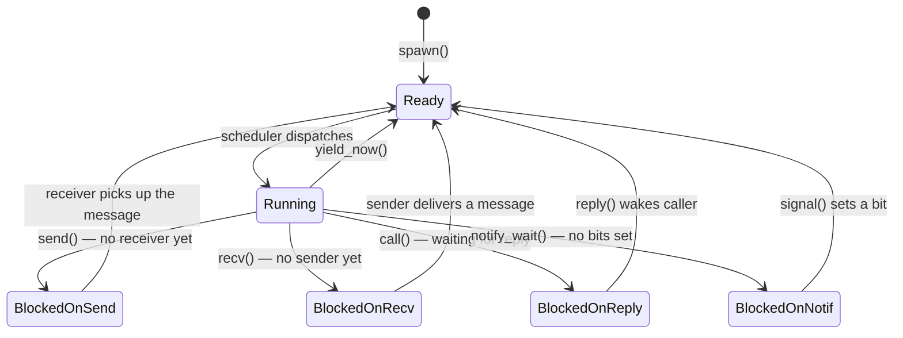

# IPC Core

## Overview

Phase 6 turns ostest into a real microkernel by wiring up the IPC subsystem
that all future userspace servers depend on.  By the end of this phase the
kernel:

- transfers messages between tasks through synchronous rendezvous endpoints,
- validates every capability handle on every syscall so no task can forge
  access to a kernel object it was never granted,
- delivers hardware IRQs to userspace drivers through asynchronous notification
  objects, and
- exposes the complete IPC surface via syscall numbers 1–5 and 7–8.

Everything from Phase 7 onward — the shell, console server, VFS — sits on top
of this foundation.  If the IPC contract is clean, those higher layers are
straightforward.  If it is muddled, nothing above it is trustworthy.

---

## Why Microkernels Use Explicit Message Passing

A monolithic kernel like Linux runs drivers, filesystems, and network stacks
inside ring 0.  A bug in any of them can corrupt kernel state, panic the
machine, or escalate privilege.

A microkernel moves those services into ring-3 processes.  The kernel becomes
a thin layer that provides only:

- memory management (frame allocator, page tables),
- scheduling (who runs, when),
- IPC (how processes talk to each other), and
- interrupt routing (delivering hardware events to the right process).

The price of this isolation is that a service can no longer call a driver
through a function pointer.  Instead it must ask the kernel to deliver a
message to the driver's endpoint.  The kernel validates the request, blocks the
caller, wakes the driver, copies the message, and unblocks the caller with the
reply.  This is more overhead than a direct call — but only slightly, because a
well-designed IPC path requires no allocation and fits in CPU registers.

The benefit is that a crashed driver does not corrupt the kernel.  The kernel
kills the task, cleans up its capabilities, and the supervisor can restart it.

---

## IPC Model: Synchronous Rendezvous + Async Notifications

ostest follows the **seL4 model**:

### Synchronous Rendezvous

Both sender and receiver must be ready before any transfer happens.  The kernel
copies the message directly through registers — no intermediate buffer, no heap
allocation on the hot path.  Whichever party arrives first at the endpoint
blocks until its counterpart shows up.

This fits every server use case in ostest perfectly.  Every interaction between
the shell and its servers (`console_server`, `vfs_server`) is request-response
by nature.  The shell blocks waiting for results; there is no benefit to
decoupling the two sides with a buffered channel.

### Async Notification Objects

One pattern is genuinely asynchronous: hardware interrupts.  A keypress fires
at an unpredictable time; the keyboard driver cannot afford to spin-poll in a
tight loop.

A `Notification` is a single machine-word bitfield.  Each bit is an independent
signal channel:

```text
Notification: [ bit63 | ... | bit2 | bit1 | bit0 ]
                                            ^
                                     IRQ1 (keyboard)
```

The kernel's interrupt handler sets a bit atomically (`fetch_or`) — no lock,
no allocation, safe to call from any interrupt handler.  A driver thread waits
on the notification object; when a bit is set the scheduler wakes it.

### Why Not Full Async Channels?

Async ring-buffer channels require kernel-managed buffers (heap allocation on
the hot IPC path), buffer-full/empty conditions, and a separate wakeup
mechanism anyway.  They add significant complexity for no benefit given the
synchronous request-response pattern all ostest services use.

### Bulk Data Transfers

IPC carries **control messages only** — never pixel data or file block contents.
For large transfers the pattern is:

1. Transfer a physical page into the receiver's address space via a **page
   capability grant** — atomic, kernel-mediated, zero-copy.
2. Use sync IPC to signal "data is ready in the shared region."

Page capability grants are deferred to Phase 7+.  In Phase 6 all data fits in
the four-word inline payload.

---

## Message Format

```rust
pub struct Message {
    pub label: u64,       // operation identifier (method selector)
    pub data:  [u64; 4],  // up to 4 words of inline payload
}
```

A `Message` is 40 bytes — five 64-bit registers.  It transfers entirely through
CPU registers: no pointer, no allocation, no cache miss.

`label` is a convention between sender and receiver: it identifies which
operation is being requested (analogous to a method ID in Mach or a message tag
in seL4).  `data` carries the arguments or the result.

The constructors match the number of data words used:

| Constructor | Data words set |
|---|---|
| `Message::new(label)` | none (all zero) |
| `Message::with1(label, d0)` | `data[0]` |
| `Message::with2(label, d0, d1)` | `data[0..1]` |

Capability grants in the message payload are deferred to Phase 7+.  For now, if
a server needs to share memory with a client it must use a pre-arranged shared
address.

---

## Capability Table

### What a Capability Is

A **capability** is an unforgeable token that grants the holder specific rights
to a kernel object.  In ostest, capabilities are integer handles — indices into
a per-task `CapabilityTable`.  The kernel validates every handle on every IPC
syscall.  Passing an out-of-range or empty-slot index returns `u64::MAX`
immediately; no kernel state changes.



### Phase 6 Capability Variants

| Variant | What it grants |
|---|---|
| `Capability::Endpoint(EndpointId)` | Send or receive on a specific IPC endpoint |
| `Capability::Notification(NotifId)` | Signal or wait on a notification object |
| `Capability::Reply(TaskId)` | One-shot right to reply to a specific blocked caller |

`Reply` capabilities are ephemeral.  The kernel inserts one into the server's
table when it delivers a `call` message; `reply` or `reply_recv` consumes it.
Attempting a second reply returns `u64::MAX` because the slot is already empty.

### Table Layout

Each task holds a fixed 64-slot table (`CapabilityTable::SIZE = 64`) allocated
alongside the task structure.  `insert` scans for the first `None` slot;
`remove` clears the slot.  A `TableFull` error is returned if all 64 slots are
occupied — this should not occur in a teaching OS with a handful of services.

Capability delegation (`sys_cap_grant`, transferring a capability to another
task via IPC) is deferred to Phase 7+.

---

## Endpoint Operations

An `Endpoint` is a kernel object that holds two queues:

- **`senders`** — tasks blocked in `send` or `call`, each with a pending
  `Message` and a `wants_reply` flag.
- **`receivers`** — tasks blocked in `recv`, waiting for any sender.

Up to 16 endpoints can exist simultaneously (`MAX_ENDPOINTS = 16`).

### Operations Summary

| Operation | Caller | Effect |
|---|---|---|
| `recv(ep)` | Server | Block until a sender arrives; dequeue and return its message |
| `send(ep, msg)` | Client | Block until a receiver is ready; deliver message |
| `call(ep, msg)` | Client | `send` + block waiting for a `Reply` cap to be consumed |
| `reply(reply_cap, msg)` | Server | Wake the blocked caller and deliver reply message |
| `reply_recv(reply_cap, msg, ep)` | Server | `reply` + immediately `recv` next message |

### Send Path



### Call / Reply Path

`call` is the RPC pattern: send a message and wait for a reply.  The kernel
inserts a one-shot `Reply` capability into the server's table instead of
immediately waking the caller.



### reply_recv Server Loop

A server that handles many clients back-to-back uses `reply_recv` to atomically
reply to the current caller and start waiting for the next one — all in a
single syscall:



The equivalent server loop in pseudocode:

```text
server loop:
    label = ipc_recv(my_ep)            // wait for first client
    loop:
        response = handle(label)
        label = ipc_reply_recv(reply_cap, response, my_ep)  // reply + wait next
```

This is more efficient than separate `reply` + `recv` syscalls because the
server thread does not return to the scheduler between the two operations.

---

## Notification Objects

### Structure

```rust
pub struct Notification {
    pending: AtomicU64,        // bitfield of undelivered signals
    waiter:  Option<TaskId>,   // at most one blocked waiter
}
```

Up to 16 notification objects can exist simultaneously (`MAX_NOTIFS = 16`).
Each object maps to a `NotifId` that is stored in a `Capability::Notification`
slot.

### signal (ISR-safe)

`signal(notif_id, bits)` performs an atomic `fetch_or` on the `pending` field.
This is async-signal-safe: no lock is held during the bit-set, so interrupt
handlers can call it without risk of deadlock.  After setting the bits it wakes
any blocked waiter.

### wait (blocking)

`wait(task_id, notif_id)` atomically swaps the `pending` field to zero.  If the
result is non-zero it returns immediately.  Otherwise it registers the calling
task as the waiter and calls `block_current_on_recv()`.  On wake it loops back
to drain the bits (to handle a signal that arrived between the first swap and
the block).



---

## IRQ Delivery

Hardware interrupts must reach userspace drivers without going through the
synchronous IPC path (which would require the kernel to block on a send, which
is never safe inside an interrupt handler).

The pattern:

1. At startup `kbd_server` allocates a `Notification` and calls `register_irq(1,
   notif_id)` to bind IRQ1 to it.
2. Every time IRQ1 fires, the kernel IDT handler calls `signal_irq(1)`.
3. `signal_irq` looks up the registered `NotifId` for IRQ1 and calls
   `signal(id, 1 << 1)` — setting bit 1 in the notification word.
4. `kbd_server` is blocked in `notify_wait(notif_cap)`.  `signal` wakes it.
5. The driver reads the scancode from I/O port `0x60`, translates it, and sends
   a key-event message to `console_server` via sync IPC.



This is the only place in the kernel where an interrupt handler triggers a
scheduler operation.  Because `signal` uses only an atomic store and a
conditional `wake_task` (which itself only does an atomic flag store + mutex
update), it is safe to call from inside an ISR.

---

## Scheduler Integration

### Task States Added in Phase 6

Phase 4 introduced `Ready` and `Running`.  Phase 6 adds four blocked states:



| State | Set by | Cleared by |
|---|---|---|
| `BlockedOnSend` | `block_current_on_send()` | `wake_task()` when a receiver picks up |
| `BlockedOnRecv` | `block_current_on_recv()` | `wake_task()` when a sender delivers |
| `BlockedOnReply` | `block_current_on_reply()` | `wake_task()` from `reply()` |
| `BlockedOnNotif` | `block_current_on_recv()` (notification wait) | `wake_task()` from `signal()` |

### How block_current_on_recv Works

All four "block and switch" primitives follow the same pattern:

```rust
pub fn block_current_on_recv() {
    let task_rsp_ptr: *mut u64 = {
        let mut sched = SCHEDULER.lock();
        let idx = sched.current.unwrap();
        sched.tasks[idx].state = TaskState::BlockedOnRecv;
        sched.current = None;
        core::ptr::addr_of_mut!(sched.tasks[idx].saved_rsp)
        // lock released here
    };
    let sched_rsp = unsafe { SCHEDULER_RSP };
    unsafe { switch_context(task_rsp_ptr, sched_rsp) };
}
```

Key details:

1. **Lock released before `switch_context`** — the scheduler loop also acquires
   `SCHEDULER` when picking the next task.  If we held the lock across
   `switch_context`, the scheduler loop would deadlock.
2. **`addr_of_mut!` avoids a &mut reference** — creating `&mut Task` through a
   `Mutex` guard would violate aliasing rules if the guard is dropped while the
   reference is live.  The raw pointer is safe because the `Task` outlives the
   switch.
3. **State is set before the switch** — the scheduler loop reads `.state` to
   decide what is runnable.  Setting `BlockedOnRecv` before releasing the lock
   ensures the scheduler never sees this task as `Ready` while it is mid-block.

### Message Delivery

The IPC core cannot copy a message directly into a task's registers — the task
is blocked and its register state is saved on its kernel stack.  Instead the
scheduler provides a per-task `pending_msg: Option<Message>` slot:

1. `deliver_message(task_id, msg)` — stores the message in the slot.
2. `wake_task(task_id)` — transitions the task to `Ready`.
3. When the scheduler dispatches the task, it continues executing after the
   `switch_context` call inside `block_current_on_recv`.
4. The task then calls `take_message(task_id)` to drain the slot and return
   the label to the caller.

---

## Syscall ABI

IPC syscalls follow the register convention established in Phase 5:

| Register | Role |
|---|---|
| `rax` | Syscall number (in) / return value (out) |
| `rdi` | Argument 0 (primary capability handle) |
| `rsi` | Argument 1 |
| `rdx` | Argument 2 |
| `r10` | Argument 3 |
| `r8` | Argument 4 |

`rcx` and `r11` are clobbered by `syscall`/`sysret` — never use them for
arguments.

### IPC Syscall Table (Phase 6)

| Number | Name | Arguments | Return |
|---|---|---|---|
| 1 | `ipc_recv` | `rdi` = ep_cap_handle | message label, or `u64::MAX` on error |
| 2 | `ipc_send` | `rdi` = ep_cap, `rsi` = label, `rdx` = data[0] | `0` on success, `u64::MAX` on error |
| 3 | `ipc_call` | `rdi` = ep_cap, `rsi` = label, `rdx` = data[0] | reply label, or `u64::MAX` on error |
| 4 | `ipc_reply` | `rdi` = reply_cap, `rsi` = label, `rdx` = data[0] | `0` on success, `u64::MAX` on error |
| 5 | `ipc_reply_recv` | `rdi` = reply_cap, `rsi` = label, `rdx` = data[0], `r8` = ep_cap | next message label, or `u64::MAX` on error |
| 7 | `notify_wait` | `rdi` = notif_cap_handle | pending bits (non-zero), or `0` on error |
| 8 | `notify_signal` | `rdi` = notif_cap_handle, `rsi` = bits | `0` on success, `u64::MAX` on error |

Note: syscall number 6 is `sys_exit` (Phase 5).  Syscall number 12 is
`sys_debug_print` (Phase 5).  Numbers 1–5 and 7–8 are reserved for IPC.

### Error Convention

All IPC syscalls return `u64::MAX` on any error:

- Invalid capability handle (out of range or empty slot)
- Wrong capability type (e.g., passing a `Notification` cap to `ipc_recv`)
- Capability table full (only on `ipc_call`, which inserts a `Reply` cap)

`u64::MAX` is chosen because it cannot be a valid message label, and it
clearly distinguishes success from failure without requiring a separate
error-code register.

---

## Phase 6 Simplifications vs. Real Microkernels

Phase 6 deliberately keeps the IPC contract small.  Here is what a production
microkernel does that ostest does not (yet):

### seL4

seL4 has a formally verified microkernel with a complete formal model of
capability semantics.  Its IPC uses "message registers" (a convention that the
compiler can map to physical registers on the fast path) and "IPC buffer" pages
for larger payloads.  It supports fine-grained capability rights (read-only vs.
read-write endpoint access), capability revocation trees, and priority-aware
IPC scheduling where a high-priority client can temporarily boost the
server's priority ("priority inheritance for IPC").

ostest Phase 6 has none of these.  Capability rights are all-or-nothing,
revocation is not implemented, and the round-robin scheduler has no priority
concept.

### Mach

Mach uses **ports** (similar to endpoints) and **port rights** (similar to
capability handles).  Messages can carry out-of-line data (copy-on-write pages)
and port rights in the same message.  The Mach IPC path is notoriously complex;
its performance was a major critique that drove the L4 lineage.

ostest Phase 6 carries only inline data (no out-of-line pages) and defers
capability grants in messages to Phase 7+.

### L4 / Fiasco.OC / Genode

L4-family kernels use typed message words and "message items" for capability
transfer.  Fiasco.OC has kernel-object reference counting.  Genode adds a
capability-based component framework on top.

ostest does not have reference-counted kernel objects or typed message words.
The 64-slot fixed capability table is sufficient for a teaching OS; a real
system would need growable per-process tables or a tree structure.

### What all of them share with ostest

All production microkernels use:

- rendezvous or near-rendezvous semantics (no unbounded kernel-side buffering),
- small inline message payloads plus separate page-grant paths for bulk data,
- capability-based access control validated in the kernel, not in userspace, and
- scheduler integration so blocked senders/receivers do not burn CPU time.

These are the ideas Phase 6 implements.  The differences above are engineering
refinements — important for production, deferred here for clarity.

---

## What Is Deferred to Phase 7+

| Feature | Why Deferred |
|---|---|
| **Capability grants via IPC** (`sys_cap_grant`) | Requires `ipc_call` to carry capability slots in the message, copy-on-revocation semantics, and a parent-child capability tree |
| **Page-capability bulk transfers** | Requires per-process page tables (CR3 switching) and page-mapping syscalls |
| **IPC timeouts / cancellation** | Requires a kernel timer list and a way to unblock a sender whose receiver never shows up |
| **Priority inheritance for IPC** | Requires a priority scheduler (deferred until after Phase 6) |
| **Multi-process userspace IPC** | Phase 6 exercises IPC with kernel tasks; full ring-3 multi-process IPC is Phase 7 |
| **Growable capability tables** | 64 slots is sufficient; growable tables need heap reallocation and handle remapping |

---

## See Also

- `docs/06-ipc.md` — IPC design rationale and open questions
- `docs/06-userspace-entry.md` — ring-3 execution model (Phase 5)
- `docs/08-roadmap.md` — per-phase scope and open design questions
- `docs/09-testing.md` — how to test IPC paths in QEMU
- `kernel/src/ipc/mod.rs` — module overview and syscall dispatcher
- `kernel/src/ipc/endpoint.rs` — rendezvous endpoint implementation
- `kernel/src/ipc/notification.rs` — async notification objects
- `kernel/src/ipc/capability.rs` — per-task capability table
- `kernel/src/task/scheduler.rs` — IPC scheduler primitives
