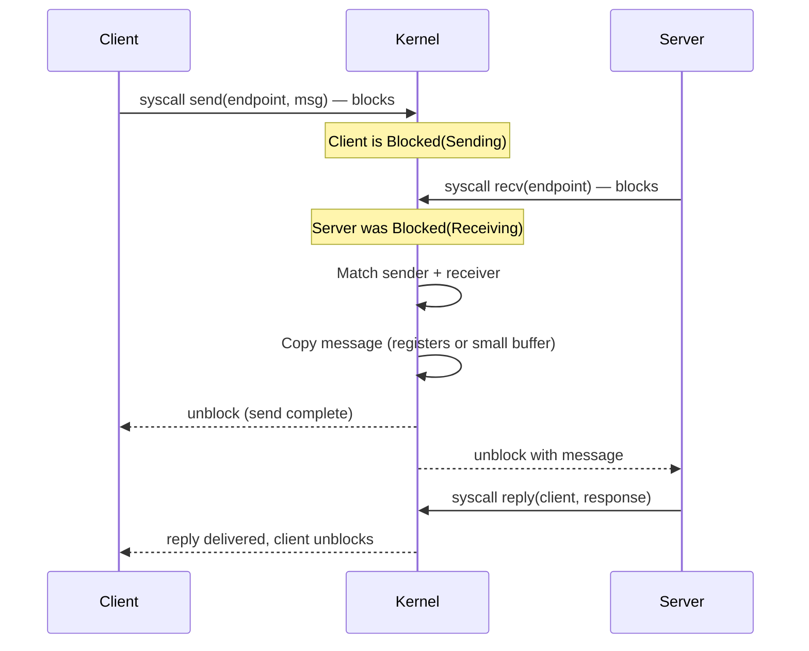
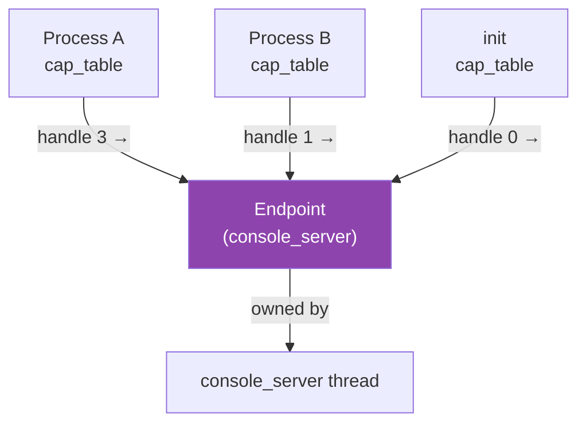
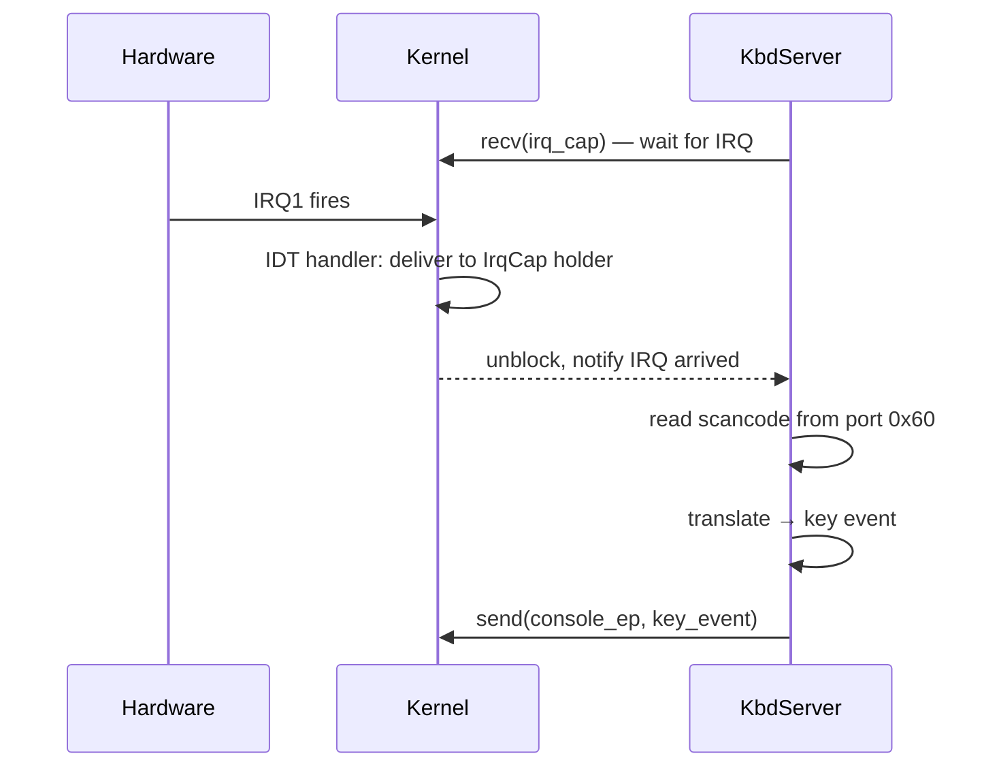
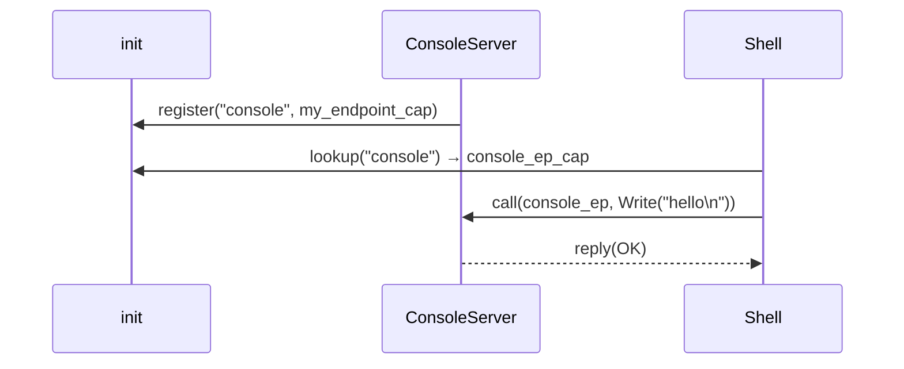

# IPC — Interprocess Communication

## Overview

IPC is the **core primitive of a microkernel**. Because drivers, filesystems, and most
OS services run in userspace, they must communicate with each other and with the kernel
through a well-defined, controlled mechanism.

The kernel enforces:
- **Isolation** — processes cannot access each other's memory directly
- **Security** — IPC endpoints are capabilities; you can only communicate with a server
  if you hold a valid handle to its endpoint
- **Scheduling integration** — blocked threads sleep until a message arrives; woken
  atomically on delivery

---

## IPC Model: Decided

**Synchronous rendezvous + async notification objects (seL4 model).**

### Synchronous Rendezvous

Both sender and receiver must be ready simultaneously. The kernel transfers the message
directly from one thread's registers into the other's — no intermediate buffer, no
allocation on the IPC path.

This fits all server use cases in m³OS perfectly: every interaction between the shell
and its servers (`console_server`, `vfs_server`, etc.) is request-response by nature.
The shell blocks waiting for results; there is no benefit to decoupling.

### Async Notification Objects

A `Notification` is a single machine-word bitfield — each bit is an independent signal
channel. The kernel can set bits without blocking (safe to call from interrupt handlers).
A thread can wait on a notification or poll it.

```
Notification: [bit7 | bit6 | ... | bit1 | bit0]
                                           ^
                                    IRQ1 (keyboard)
```

This handles the one genuinely async pattern: IRQ delivery to userspace drivers.
The kernel's interrupt handler sets a notification bit; the driver thread wakes up.

### Why not full async channels?

Async ring-buffer channels require kernel-managed buffers (allocation on the hot IPC
path), buffer-full/empty conditions, and a separate wakeup mechanism anyway. They add
significant complexity with no benefit for the use cases this OS has.

### Framebuffer / large data

IPC carries **control messages only** — never pixel data. For bulk transfers
(framebuffer updates, file block reads), the pattern is:
1. Transfer ownership of a physical page into the receiver's address space via a
   **page capability grant** (atomic, kernel-mediated, zero-copy)
2. Use sync IPC to signal "data is ready in the shared region"

This is how Mach, L4, and Redox all handle it. It composes cleanly with vsync: the
display driver fires a notification bit on each vsync interrupt; the compositor wakes,
composites, and replies to pending client calls.

---

## Synchronous Message Passing



### Call Semantics

| Operation | Description |
|---|---|
| `send(ep, msg)` | Send message to endpoint; block until received |
| `recv(ep)` | Wait for a message on endpoint; block until one arrives |
| `call(ep, msg)` | `send` + immediately wait for a reply (RPC pattern) |
| `reply(cap, msg)` | Send reply to the thread that called us |
| `reply_recv(cap, msg)` | Reply and immediately start waiting for next message |

The `call` + `reply_recv` pair enables a tight **server loop** without extra syscalls:

```
server loop:
    msg = recv(my_endpoint)        # wait for first client
    loop:
        response = handle(msg)
        msg = reply_recv(client, response)  # reply + wait for next
```

---

## Capabilities & Handles

A **capability** is an unforgeable token that grants the holder specific rights to a
kernel object (endpoint, memory page, interrupt, etc.). In our implementation:

- Capabilities are **integer handles** stored in a per-process **capability table**
- The kernel validates the handle on every syscall
- Capabilities can be **granted** (sent via IPC) or **revoked** by the parent



### Capability Types (initial set)

| Type | Description |
|---|---|
| `EndpointCap` | Right to send/receive on an IPC endpoint |
| `ThreadCap` | Right to manage (start/stop/kill) a thread |
| `PageCap` | Right to map a specific physical page |
| `IrqCap` | Right to receive delivery of a specific hardware IRQ |

---

## Message Format

Messages are small by design (synchronous zero-copy transfer through CPU registers):

```
Message {
    label:  u64,         // identifies the operation (like a method ID)
    data:   [u64; 4],    // up to 4 words of inline data (fits in registers)
    caps:   [CapSlot; 2] // up to 2 capability grants (optional)
}
```

For larger data transfers (e.g., reading a file block), the kernel supports
**shared memory grants**: temporarily mapping a physical page into the receiver's
address space, then revoking it after the call. This is the "zero-copy" path.

---

## IPC and IRQ Delivery

Hardware interrupts need to reach userspace drivers (e.g., `kbd_server`). The pattern:

1. At init time, `kbd_server` registers for IRQ1 via a syscall, receiving an `IrqCap`
2. The kernel's IRQ handler, instead of doing work, sends a notification to the `IrqCap`
3. `kbd_server` blocks on `recv(irq_cap)` — woken up on each keypress
4. `kbd_server` reads the scancode from port `0x60` (permitted via an `IoCap`)



---

## Server Registration Pattern

Servers register themselves with `init` at startup, which acts as a nameserver:



---

## Open Questions

1. **Capability table size** — Fixed-size per process (simple) or growable?
2. **Capability delegation depth** — Can a server re-grant capabilities it received?
3. **Large data transfer** — Page grants immediately, or copy-on-write semantics?
4. **Timeout on IPC calls** — Should `call()` support a timeout to prevent deadlock?
