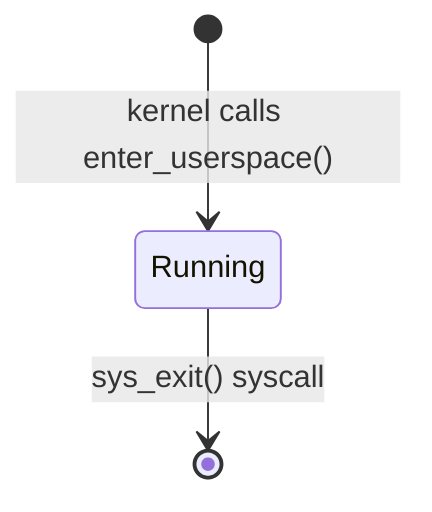

# Userspace Entry

## Overview

Phase 5 delivers the first ring-3 program running on ostest.  By the end of
this phase the kernel:

- switches CPU privilege from ring 0 to ring 3 via `iretq`,
- enforces a clean privilege boundary so userspace cannot touch kernel memory,
- installs a `syscall` gate that brings control back to ring 0 on demand, and
- runs a tiny embedded binary that calls `sys_debug_print` and then `sys_exit`.

This is the foundational step for everything in the userspace roadmap.  All
later phases (IPC, servers, shell) build on the ring-3 execution model
established here.

---

## Privilege Levels (P5-T003)

### Ring 0 vs ring 3 on x86-64

x86-64 has four privilege levels (rings 0–3); ostest uses only two:

| Ring | Name | What runs there |
|---|---|---|
| 0 | Kernel mode | Bootloader, kernel, interrupt handlers |
| 3 | User mode | All userspace programs and servers |

In ring 0 the CPU allows any instruction and any memory access.  In ring 3
the CPU enforces two hardware-backed rules:

1. **Page-level protection** — a page table entry without the `USER_ACCESSIBLE`
   bit set causes a page fault if ring-3 code touches it.  Kernel pages lack
   this bit, so userspace simply cannot read or write them.
2. **Privileged instructions** — instructions such as `cli`, `sti`, `lgdt`,
   `lidt`, `in`/`out`, and `wrmsr` raise a General Protection Fault (#GP) from
   ring 3.

### Entering ring 3 with `iretq`

`iretq` ("interrupt return, 64-bit") is the standard x86-64 mechanism for
transitioning to a lower-privilege level.  The CPU reads five words from the
current stack and loads them all atomically:

```text
Stack layout at iretq time (top → bottom, low address first):
  RIP      — entry point of the user program
  CS       — user code segment selector (DPL=3)
  RFLAGS   — initial flags for ring-3 code
  RSP      — top of the user stack
  SS       — user stack segment selector (DPL=3)
```

Because CS carries DPL=3 the CPU switches to ring 3 before executing the first
user instruction.  There is no way to forge this transition without kernel
cooperation.

### `enter_userspace` signature

```rust
pub unsafe fn enter_userspace(
    entry:          u64, // RIP — instruction pointer in user image
    user_stack_top: u64, // RSP — top of user stack (grows downward)
) -> !
```

The user code (CS = `0x23`) and data (SS = `0x1B`) selectors are hardcoded
from the GDT constants — callers do not supply them.

The function is `unsafe` because it transfers execution to arbitrary ring-3
code and never returns to the caller.  The `!` return type documents that the
kernel stack frame that called `enter_userspace` is abandoned — the only way
back to ring 0 is through an interrupt or a `syscall` instruction.

### RFLAGS value (0x202)

The initial RFLAGS pushed for ring 3 is `0x202`:

| Bit | Name | Value | Meaning |
|---|---|---|---|
| 1 | reserved | 1 | Always-1 reserved bit (must be set per Intel SDM) |
| 9 | IF | 1 | Interrupts enabled |
| 12–13 | IOPL | 0 | No I/O port access from ring 3 |
| all others | — | 0 | Default / clear |

Setting IF=1 ensures the timer and other hardware interrupts can fire normally
once the first user instruction runs.  IOPL=0 prevents ring-3 code from issuing
`in`/`out` instructions directly.

---

## GDT Layout for Userspace (P5-T001)

The Global Descriptor Table must contain entries for all four segment roles —
kernel code, kernel data, user data, user code — plus a Task State Segment.
The full Phase 5 layout:

| Index | Base selector | Effective selector (RPL=3) | Descriptor | DPL |
|---|---|---|---|---|
| 0 | `0x00` | — | null | — |
| 1 | `0x08` | — | kernel code | 0 |
| 2 | `0x10` | — | kernel data | 0 |
| 3 | `0x18` | `0x1B` | user data | 3 |
| 4 | `0x20` | `0x23` | user code | 3 |
| 5 | `0x28` | — | TSS | 0 |

**RPL (Requested Privilege Level)** lives in the low two bits of a segment
selector.  When loading a user selector into CS or SS you OR in `3` to assert
ring 3 — hence `0x18 | 3 = 0x1B` and `0x20 | 3 = 0x23`.

**Ordering matters**: `STAR` MSR arithmetic (see next section) assumes user data
is one slot below user code.  Swapping them breaks `SYSRETQ`.

### Why the TSS and RSP0 are required

When a hardware interrupt fires while the CPU is in ring 3, the processor must
switch to a ring-0 stack _before_ pushing the interrupt frame.  The address of
that ring-0 stack comes from `TSS.RSP0`.  Without a valid `RSP0` the CPU would
push the interrupt frame onto the user stack — which the kernel cannot safely
trust.

Phase 5 sets `TSS.RSP0` to the kernel's interrupt stack.  Every time a new
kernel stack is allocated for a process, `RSP0` must be updated to point at
its top.

---

## Syscall Gate (P5-T004)

### SYSCALL/SYSRET vs INT 0x80

x86-64 provides two mechanisms for userspace→kernel transitions:

| Mechanism | How it works | Overhead |
|---|---|---|
| `INT 0x80` | Software interrupt; goes through IDT; pushes full exception frame | Higher — IDT lookup + privilege check every call |
| `SYSCALL` / `SYSRET` | Dedicated fast-path instructions; CS/SS loaded from MSRs | Lower — no IDT, no stack frame from CPU |

Phase 5 uses `SYSCALL`/`SYSRET`.  The CPU knows nothing about the syscall
convention beyond what the three control MSRs say.

### The three MSRs

| MSR | Name | Purpose |
|---|---|---|
| `STAR` | Syscall Target Address Register | Encodes kernel CS/SS and user CS/SS selectors |
| `LSTAR` | Long-mode STAR | 64-bit address of the kernel syscall entry stub |
| `SFMASK` | Syscall Flag Mask | RFLAGS bits to clear on `SYSCALL` entry |

**STAR arithmetic** — STAR bits [47:32] hold `kernel_cs_base` and bits [63:48]
hold `user_cs_base`:

- On `SYSCALL`: `CS = kernel_cs_base` (0x08), `SS = kernel_cs_base + 8` (0x10).
- On `SYSRETQ`: `SS = user_cs_base + 8` (0x18, user data), `CS = user_cs_base + 16` (0x20, user code).

This is why the GDT must place user data (0x18) one slot below user code (0x20)
with `user_cs_base = 0x10`.

**SFMASK** — Phase 5 sets bit 9 (IF) in SFMASK.  The CPU clears IF atomically
on `SYSCALL` entry so interrupt handlers cannot fire while the kernel stack is
in an unknown state.  Interrupts remain disabled for the entire syscall; the
user's original RFLAGS (saved in R11 by the CPU) are restored by `SYSRETQ`,
which re-enables IF.  No explicit `sti` is issued by the dispatcher.

**LSTAR** — written with the address of the assembly stub below.

### Entry sequence

On `SYSCALL` the CPU does _not_ switch the stack automatically.  The entry stub
must save the user context and load the kernel stack before calling any Rust
code:

1. `RCX` ← saved user `RIP` (the instruction after `syscall`)
2. `R11` ← saved user `RFLAGS`
3. `CS` / `SS` set from STAR; privilege changes to ring 0
4. **RSP is still the user stack** — the stub must swap it immediately

### Assembly stub

```asm
syscall_entry:
    ; On entry: RCX=user RIP, R11=user RFLAGS, RSP=user RSP, IF=0
    swapgs                       ; switch to kernel GS base (per-CPU area)
    mov  [gs:USER_RSP_OFFSET], rsp   ; stash user RSP in per-CPU slot
    mov  rsp, [gs:KERNEL_RSP_OFFSET] ; load kernel RSP (from per-CPU area)

    ; Save caller-saved registers the ABI doesn't protect across the call
    push rcx                     ; user RIP (SYSRETQ restores RIP from RCX)
    push r11                     ; user RFLAGS (SYSRETQ restores RFLAGS from R11)
    push rdi
    push rsi
    push rdx
    push r10
    push r8
    push r9

    ; ABI: rax=syscall#, rdi=arg0, rsi=arg1, rdx=arg2, r10=arg3, r8=arg4, r9=arg5
    ; (r10 replaces rcx because rcx is clobbered by the syscall instruction itself)
    mov  rcx, r10                ; restore arg3 into rcx for the Rust dispatcher
    call syscall_dispatch         ; returns result in rax

    pop  r9
    pop  r8
    pop  r10
    pop  rdx
    pop  rsi
    pop  rdi
    pop  r11                     ; RFLAGS for SYSRETQ
    pop  rcx                     ; RIP for SYSRETQ

    mov  rsp, [gs:USER_RSP_OFFSET]   ; restore user RSP
    swapgs
    sysretq                      ; → ring 3, RIP=RCX, RFLAGS=R11
```

> **Note:** The stub above shows a full production-quality entry sequence.
> Phase 5 differs in two ways:
> 1. No `swapgs` / per-CPU storage — a single global `SYSCALL_USER_RSP` static
>    saves the user RSP; the kernel stack top is stored in `SYSCALL_STACK_TOP`.
> 2. Only **callee-saved** registers (`rbx`, `rbp`, `r12`–`r15`) are preserved,
>    not the caller-saved set shown above.  The SysV ABI allows the Rust
>    dispatcher to freely clobber caller-saved registers; only callee-saved ones
>    must be explicitly saved across the `call syscall_handler`.

---

## Syscall ABI (P5-T005, P5-T010)

### Register convention

| Register | Role |
|---|---|
| `rax` | Syscall number (in) / return value (out) |
| `rdi` | Argument 0 |
| `rsi` | Argument 1 |
| `rdx` | Argument 2 |
| `r10` | Argument 3 (`rcx` is clobbered by `syscall`) |
| `r8` | Argument 4 |
| `r9` | Argument 5 |

`rcx` and `r11` are always clobbered by the `syscall`/`sysret` pair — never
use them for arguments.

### Phase 5 syscall table

Only two syscalls are implemented in Phase 5:

| Number | Name | Description |
|---|---|---|
| 6 | `sys_exit` | Terminate the current process; `rdi` = exit code |
| 12 | `sys_debug_print` | Write a UTF-8 string to the kernel serial log; `rdi` = pointer, `rsi` = byte length |

The full syscall table — including `sys_send`, `sys_recv`, `sys_cap_grant`,
and friends — is defined in `docs/07-userspace.md` and will be implemented in
Phase 6 (IPC) and beyond.

---

## Userspace Address Space Layout (P5-T002, P5-T011)

### Phase 5 simplification: shared PML4

A mature OS gives each process its own page table root (CR3).  Phase 5 uses a
simpler model: all userspace code runs in the _same_ PML4 as the kernel.
User-accessible pages are marked `USER_ACCESSIBLE`; kernel pages are not.
This avoids the complexity of CR3 switching and TLB shootdowns while still
enforcing a real hardware privilege boundary.

The trade-off is that two userspace processes could in principle see each
other's code (if both are mapped simultaneously).  Phase 5 runs only one user
program, so this is acceptable.  Per-process page tables are planned for Phase 6.

### Virtual address layout

```text
Virtual Address Space (Phase 5, shared kernel+user PML4)
┌────────────────────────────────────┐ 0xFFFF_FFFF_FFFF_FFFF
│ Kernel (mapped by bootloader)      │ no USER_ACCESSIBLE flag
│  - Physical memory map             │
│  - Kernel heap                     │
│  - Stack, GDT, IDT                 │
├────────────────────────────────────┤ ~0xFFFF_8000_0000_0000
│ (non-canonical gap)                │
├────────────────────────────────────┤ 0x0000_0000_8000_0000
│ User stack (grows down, 16 KiB)    │ USER_ACCESSIBLE | WRITABLE | NX
│   ↓                                │
├────────────────────────────────────┤
│ (unmapped user space)              │
├────────────────────────────────────┤ 0x0000_0000_0040_0000
│ User code (16 KiB, read+write+exec)│ USER_ACCESSIBLE | WRITABLE (W^X deferred to Phase 6+)
└────────────────────────────────────┘
```

### Why kernel pages are safe from userspace

The `USER_ACCESSIBLE` bit (bit 2) in every level of the page table hierarchy
must be set for a page to be reachable from ring 3.  The bootloader maps all
kernel memory _without_ this bit.  If ring-3 code attempts to read or write a
kernel address, the CPU raises a Page Fault (#PF) before any data is
transferred.  In Phase 5 the kernel's page-fault handler prints debug
information and then halts the machine via `hlt_loop()`.  Per-process fault
recovery and termination are deferred to a later phase.

---

## The Hello Userspace Binary (P5-T006)

### Why a flat binary, not ELF

Phase 5 does not implement an ELF loader.  Instead, the user program is an
embedded **flat binary** — raw x86-64 machine code with no headers, no
relocations, and no dynamic linking.  The kernel copies it directly to
`USER_CODE_BASE` and jumps to the first byte.

This keeps the scope small: ELF parsing, segment mapping, and relocation
handling are non-trivial; they belong in Phase 6's `exec` server.

### Binary structure

```asm
; Loaded at 0x0040_0000 (USER_CODE_BASE)
mov rax, 12             ; sys_debug_print
lea rdi, [rip+0x14]    ; pointer to .msg — RIP-relative, position-independent
mov rsi, 13             ; byte length of "hello world!\n"
syscall
mov rax, 6              ; sys_exit
xor edi, edi            ; exit code 0
syscall
ud2                     ; unreachable — traps if the kernel fails to exit
.msg: "hello world!\n"
```

**RIP-relative addressing** (`lea rdi, [rip+offset]`) makes the string pointer
work correctly regardless of where the binary is loaded — the offset from the
instruction to `.msg` is fixed at assemble time.  However, Phase 5 always loads
the binary at the fixed address `0x0040_0000`, so this flexibility is not
strictly needed yet.  It is used anyway as good practice and to keep the binary
identical to what a real position-independent executable would produce.

---

## Process State Machine (P5-T001)

Phase 5 has exactly one userspace process.  There is no scheduling of multiple
user tasks — that comes in Phase 6 when the scheduler gains a `Blocked` state
and IPC wait queues.



The `sys_exit` handler terminates the process and halts the machine (or returns
to a kernel idle loop) in Phase 5.  A graceful process lifecycle with
`wait`/`reap` semantics is planned for Phase 7.

---

## Key Crates

| Crate | Role |
|---|---|
| `x86_64` | MSR access (`LStar`, `Star`, `SFMask`), segment selectors, `VirtAddr` |
| `spin` | `Once` for initializing the physical-memory offset used in address translation |

---

## How Real OSes Differ (P5-T012)

Phase 5 deliberately simplifies several things that production kernels handle
in full.  Here is what a real OS does differently:

### ELF loading

When a process calls `execve`, the kernel (or an in-kernel loader, or a
userspace `exec` server) reads the ELF header, iterates over `PT_LOAD`
segments, and maps each at its specified virtual address with the declared
permissions (`R`, `W`, `X`).  Dynamic executables also need the dynamic linker
(`ld.so`) mapped and started first.  Phase 5 bypasses all of this with a
position-dependent flat binary.

### Per-process page tables

Every process gets its own PML4 root.  On a context switch the kernel writes
the new PML4 physical address into `CR3`, which flushes the TLB (or uses
PCID-tagged entries to avoid the flush on modern CPUs).  This is what provides
true address-space isolation between processes.  Phase 5 shares one PML4 and
relies solely on the `USER_ACCESSIBLE` bit for protection.

### SWAPGS and per-CPU kernel stacks

Linux uses the `swapgs` instruction on syscall entry to swap the GS base from
the user-visible value to a kernel-private per-CPU pointer.  That pointer gives
the kernel RSP to load without touching any user-controlled memory.  This
prevents a class of attacks where a user program places a malicious kernel RSP
in a predictable location.  Phase 5 uses a single global kernel stack slot
which is sufficient for one process.

### Full process lifecycle

Production OSes support `fork` (clone address space), `exec` (replace image),
`wait` (reap exit status), signal delivery, and `ptrace` for debugging.  Each
of these interacts with the address space, capability table, and scheduler in
non-trivial ways.  Phase 5 implements only `sys_exit` as a proof of concept.

### Security: SMEP and SMAP

- **SMEP** (Supervisor Mode Execution Prevention, CR4.SMEP): prevents the CPU
  from executing a page marked `USER_ACCESSIBLE` while in ring 0.  Stops
  kernel-mode code-injection attacks where an attacker tricks the kernel into
  jumping to a user-controlled buffer.
- **SMAP** (Supervisor Mode Access Prevention, CR4.SMAP): prevents ring-0 code
  from _reading or writing_ user pages unless `RFLAGS.AC` is set.  Forces the
  kernel to use explicit `copy_from_user` / `copy_to_user` helpers, preventing
  accidental dereferences of user pointers in kernel code.

Both are enabled by default in any modern Linux kernel.  ostest will add them
in a later hardening phase.

---

## See Also

- `docs/07-userspace.md` — full userspace design and future server architecture
- `docs/06-ipc.md` — IPC model (Phase 6)
- `docs/08-roadmap.md` — per-phase scope and open design questions
