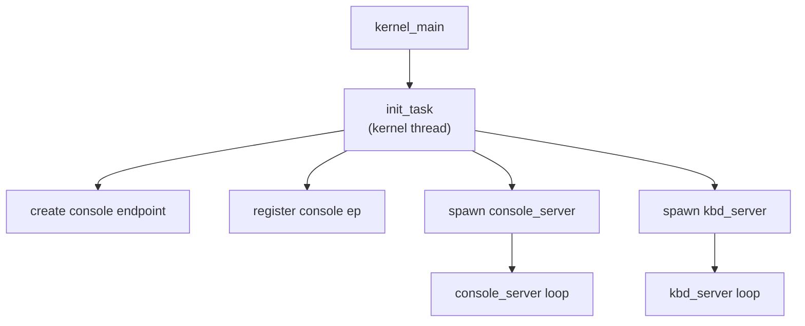

# Core Servers — Phase 7

**Aligned Roadmap Phase:** Phase 7
**Status:** Complete
**Source Ref:** phase-07

## Overview

Phase 7 introduces the first layer of server infrastructure on top of the IPC engine built in
Phase 6. The additions are:

- **Service registry** — a static name-to-endpoint table that lets tasks find each other by name
- **init orchestration** — a kernel task that creates endpoints, spawns servers, and registers them
- **console_server** — receives formatted string messages over IPC and writes them to serial
- **kbd_server** — waits on a keyboard IRQ notification and forwards key events to clients

### Why structure output and input as servers?

A common question is: "why not just call the serial driver and keyboard driver directly?"

The microkernel answer is **policy/mechanism separation**:

- The kernel owns the *mechanism* — port I/O, interrupt routing, IPC delivery.
- A server owns the *policy* — which clients may write, how output is formatted, which
  process receives key events first.

Moving these decisions out of the kernel has concrete benefits:

1. **Auditability** — every console write and every key event passes through a named endpoint;
   you can log, filter, or redirect it by changing one server, not the kernel.
2. **Replaceability** — swap `console_server` for a framebuffer terminal server without
   touching the kernel.
3. **Least privilege** — a process that holds only a console endpoint capability cannot perform
   arbitrary I/O; it can only write strings to the console service.

---

## Service Registry

### Data model

The registry is a flat array of at most **8 entries**, each holding a name and an `EndpointId`:

```
ServiceEntry {
    name:     [u8; 32],  // raw bytes; not NUL-terminated
    name_len: usize,     // actual byte count, 0–32
    ep_id:    EndpointId,
}

Registry {
    entries: [Option<Entry>; 8],
}
```

There is no heap allocation. The array lives in a static global protected by a spinlock.
Slots that have not been populated are `None`; there is no separate validity flag.
Names are not NUL-terminated; the registry uses an explicit `name_len` field.
The 8-entry limit is intentional: Phase 7 has four services at most (init, console, kbd, and
one spare), and a larger table would invite scope creep.

### API

```
register(name: &str, ep_id: EndpointId) -> Result<(), RegistryError>
lookup(name: &str) -> Option<EndpointId>
```

`register` fails if the name is already present or the table is full.
`lookup` performs a linear scan; with at most 8 entries this is always fast enough.

### Ring-3 access (syscalls 9 and 10)

When real userspace processes exist (Phase 8+), they cannot call the registry directly because
it lives in kernel address space. Two syscalls provide the bridge:

| Syscall | Number | Arguments | Returns |
|---|---|---|---|
| `sys_registry_register` | 9 | endpoint cap handle, name ptr, name len | `u64` — `0` on success; `u64::MAX` on error |
| `sys_registry_lookup` | 10 | name ptr, name len | `u64` — new endpoint `CapHandle` on success; `u64::MAX` on error |

In Phase 7, these syscalls are wired up but only used internally: all servers are kernel tasks
and can call the registry functions directly.

### Comparison with real systems

| System | Service discovery mechanism |
|---|---|
| seL4 (CapDL) | Endpoints are pre-allocated by a static capability description; no runtime nameserver needed at boot |
| Mach / macOS | Bootstrap server holds a port (Mach port = endpoint); clients look up names via `bootstrap_look_up()` |
| L4/Fiasco | No built-in nameserver; convention is that the root task distributes capabilities directly |
| Plan 9 | Every service is a filesystem; discovery is `open("/srv/console")` |

Our registry is closest to Mach's bootstrap server, simplified to a static array because we
have no dynamic allocation requirement in Phase 7.

---

## Bootstrap Sequence

### Who starts what

The kernel's `kernel_main` function calls `init_task` as its final initialization step, after
memory, interrupts, and the scheduler are running. `init_task` is the only task the kernel
creates directly; everything else is started by `init_task`.



### Step-by-step ordering

Each step emits a `log::info!` line so the boot log shows the exact sequence:

```
[init] service registry: console=EndpointId(0)
[init] service set started — yielding
```

The ordering guarantee is intentional: the console endpoint is registered *before* the server
tasks are spawned. This means any task that calls `lookup("console")` after init completes
will always find a valid endpoint — even if `console_server` has not yet executed a single
instruction.

`console_server` enters `Blocked(Receiving)` state immediately on creation and will only
consume CPU time when a client sends it a message. `kbd_server` blocks on its IRQ notification
object rather than on an IPC recv, so it wakes only when IRQ1 fires.

### Comparison with real init daemons

| System | How services are ordered |
|---|---|
| systemd | Dependency graph (`Requires=`, `After=`); parallel startup with socket activation |
| s6 | Supervision tree; `s6-rc` computes ordering from service definitions |
| launchd (macOS) | Mach port activation — service is launched on first port message |
| OpenRC | Shell scripts with `need` / `use` dependency keywords |

Phase 7 uses **fixed ordering** because there are only four services and their dependency
graph is trivial. A production system needs dynamic ordering because the graph has hundreds
of nodes and contains cycles that require activation-on-demand to break.

---

## console_server

### What it does

`console_server` exposes a single operation: write a string to the serial output.

Message format (using the Phase 6 `Message` type):

```
label:     CONSOLE_WRITE = 0
data[0]:   pointer to string (kernel virtual address)
data[1]:   string length in bytes
data[2..]: unused
```

The server loop:

```
recv(console_ep) -> msg
while running:
    match msg.label:
        CONSOLE_WRITE =>
            ptr  = msg.data[0] as *const u8
            len  = msg.data[1] as usize
            // write len bytes from ptr to serial
            reply(msg.client, Message { label: 0, .. })  // acknowledge
        _ =>
            reply(msg.client, Message { label: ERR_UNKNOWN_OP, .. })
    msg = reply_recv(console_ep)
```

The reply label `0` means success. Clients block on `call(console_ep, msg)` and unblock when
the reply arrives — the write is synchronous from the client's perspective.

### Why route through IPC instead of calling the serial driver directly?

In Phase 7, with all tasks in kernel address space, the server adds latency rather than
removing it. The value is architectural:

- A future `console_server` can buffer writes, rate-limit noisy tasks, or redirect output
  to a framebuffer terminal — all without changing any client.
- Access control becomes possible: only tasks that hold a console endpoint capability can
  write output.

### Comparison with production consoles

| Feature | Phase 7 console_server | Production (e.g., Linux tty subsystem) |
|---|---|---|
| Output path | IPC message -> serial write | write() syscall -> line discipline -> UART driver |
| Virtual terminals | None | Multiple VTs per physical console |
| Per-client state | None | Each open fd has its own line discipline state |
| Framebuffer mixing | None | fbcon or DRM/KMS composites text layer |
| ANSI escape handling | None | Full termios processing |

---

## kbd_server

### What it does

`kbd_server` handles hardware keyboard events. In Phase 7 it has one active side:

1. **IRQ side** — waits on a keyboard notification object; woken by each IRQ1, then drains the scancode ring buffer and logs each key

Client-side forwarding (sending `KEY_EVENT` messages to registered clients) is deferred to Phase 8+.

### IRQ side

Phase 6 introduced `Notification` objects: a machine-word bitfield the kernel can set
atomically from an interrupt handler. `kbd_server` allocates a notification object at startup
and binds it to IRQ1:

```
let kbd_notif = Notification::new();
bind_irq(IRQ_KEYBOARD, &kbd_notif, bit: 0);

loop:
    kbd_notif.wait()              // block until IRQ1 fires
    // drain scancode ring buffer (populated by the ISR)
    while scancode = read_scancode():
        log("[kbd] scancode=0xNN")
    // Phase 8+: translate and forward to subscribed clients
```

The interrupt handler itself does nothing except set the notification bit and return. All
real work happens in the `kbd_server` task context after the notification wakes it. This is
why the CLAUDE.md rule says "no allocation, no blocking, no IPC from within an interrupt
handler" — those operations happen here, in the server, not in the handler.

### Client side (Phase 8+)

In Phase 8+, `kbd_server` will forward key events to registered clients via IPC:

```
send(client_ep, Message { label: KEY_EVENT, data: [scancode, 0, 0, 0] })
```

The server will not wait for a reply before accepting the next IRQ; key events are fire-and-forget from `kbd_server`'s perspective.

This is not implemented in Phase 7. Currently `kbd_server` only logs scancodes to the serial output.

### Comparison with production input stacks

| Feature | Phase 7 kbd_server | Production (Linux evdev / Wayland) |
|---|---|---|
| Input source | PS/2 port 0x60 | HID subsystem (USB HID, PS/2, I2C) |
| Event format | Raw scancode | `struct input_event` (type/code/value) |
| Focus routing | Single static client | Wayland compositor tracks focused surface |
| Buffering | None; blocks on client | Kernel ring buffer per `/dev/input/eventN` fd |
| Key repeat | Not implemented | Handled by evdev at configurable rate |
| Multi-device | Not implemented | Merged by libinput or compositor |

---

## Limitations and Deferred Work

### Servers are kernel tasks, not ring-3 processes (transition underway)

In Phase 7, `console_server` and `kbd_server` run as kernel threads in ring 0, sharing the
kernel address space. They are not isolated processes.

As of Phase 50, the IPC transport model is complete: capability grants, validated
`copy_from_user` paths, and page-grant bulk transfers mean services **can** be ring-3
processes communicating through the standard IPC contract. The remaining work to actually
extract them into ring-3 binaries is planned for Phase 52 (First Service Extractions).

The architecture is otherwise identical to what ring-3 servers would look like: the IPC paths,
the endpoint capability model, and the service registry all work the same way. Moving servers
to ring 3 will be a contained change to how tasks are *created*, not to how they *communicate*.

### No process isolation

Because servers share the kernel address space, a bug in `console_server` can corrupt kernel
data structures. In a real microkernel, this is impossible by construction: each server runs in
its own page table and can only reach kernel memory through validated syscalls.

### String pointers are kernel addresses (Phase 7 only)

The Phase 7 `CONSOLE_WRITE` message passes a pointer directly in the IPC payload:

```
data[0]: pointer to string (kernel virtual address)
```

Phase 50 defines the intended migration of the console server data path to validated
`copy_from_user` and, for transfers larger than 64 KiB, page capability grants
(`Capability::Grant`) as a zero-copy path. The current Phase 7-style pointer-in-message
path still uses `copy_nonoverlapping` with basic address-range validation, not full
page-table-walking `copy_from_user`. See `docs/50-ipc-completion.md` for the planned
bulk-data transport model.

### Registry is static (Phase 7 only)

The Phase 7 service registry supports `register` and `lookup` but not deregistration,
restart policy, or health monitoring.

As of Phase 50, the registry tracks service owners via `TaskId`, supports
re-registration for restarted services via `replace_service()`, and has been
expanded to 16 entries. Phase 46 added a full service manager with
dependency-ordered boot, automatic restart, and system logging.

---

## Phase 52 Update: Console and Keyboard Extracted to Ring 3

As of Phase 52 (First Service Extractions), ring-3 `console_server` and
`kbd_server` binaries have been added as supervised userspace services.
However, the kernel still runs its own `console_server_task` and
`kbd_server_task` in parallel during the transition period.  The kernel
tasks will be removed once the userspace services fully handle all
rendering and scancode delivery through IPC.  The kernel retains the
minimal privileged substrate: framebuffer mapping, IRQ handling, scancode
ring buffer, and notification delivery.  See
[docs/52-first-service-extractions.md](./52-first-service-extractions.md)
for the full extraction design.

## See Also

- `docs/06-ipc.md` — IPC model, message format, capabilities, and notification objects
- `docs/52-first-service-extractions.md` — Phase 52 console and keyboard extraction
- `docs/roadmap/07-core-servers.md` — phase milestone plan and acceptance criteria
- `docs/roadmap/README.md` — overall project milestones and phase scope
