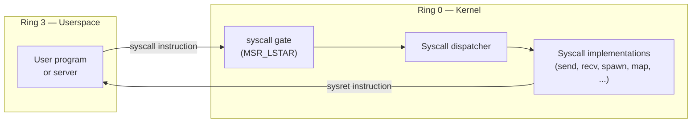
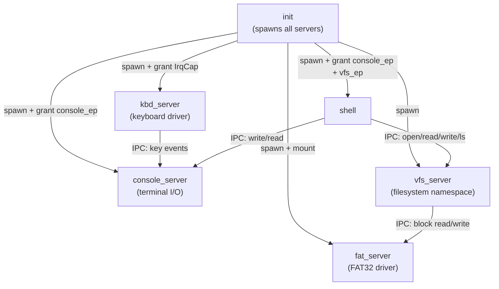

# Userspace & System Calls

## Overview

Userspace (ring 3) is where everything except the kernel runs: `init`, device driver
servers, the filesystem, and the shell. The kernel provides a **system call interface**
as the only sanctioned entry point from ring 3 to ring 0.

---

## Privilege Transition



The `syscall`/`sysret` instruction pair (AMD64) is faster than the legacy `int 0x80`
approach. The kernel sets `MSR_LSTAR` to the address of the syscall entry stub.

---

## Syscall ABI

We define a custom syscall convention (similar to Linux x86_64):

| Register | Role |
|---|---|
| `rax` | Syscall number (input) / return value (output) |
| `rdi` | Argument 1 |
| `rsi` | Argument 2 |
| `rdx` | Argument 3 |
| `r10` | Argument 4 (note: not `rcx` — that's clobbered by `syscall`) |
| `r8`  | Argument 5 |
| `r9`  | Argument 6 |

`rcx` and `r11` are clobbered by the `syscall` instruction itself (they save `rip`
and `rflags` respectively).

---

## Syscall Table (Initial)

| Number | Name | Description |
|---|---|---|
| 0 | `sys_send` | Send IPC message to endpoint |
| 1 | `sys_recv` | Receive IPC message from endpoint |
| 2 | `sys_call` | Send + receive reply (RPC) |
| 3 | `sys_reply` | Reply to calling thread |
| 4 | `sys_reply_recv` | Reply + wait for next message |
| 5 | `sys_yield` | Voluntarily yield CPU |
| 6 | `sys_exit` | Terminate current thread |
| 7 | `sys_spawn` | Create a new thread / process |
| 8 | `sys_map` | Map physical page into address space |
| 9 | `sys_unmap` | Unmap page |
| 10 | `sys_irq_register` | Request delivery of a hardware IRQ |
| 11 | `sys_cap_grant` | Send a capability to another process via IPC |
| 12 | `sys_debug_print` | Write to serial (debug only, remove later) |

---

## Entering Userspace (First Ring 3 Task)

The kernel must perform a controlled jump into ring 3 for the first time to start
`init`. This uses `iretq` with a crafted stack frame that sets:

- `CS` = user code segment selector (RPL=3)
- `SS` = user data segment selector (RPL=3)
- `RFLAGS` = interrupts enabled, IOPL=0
- `RIP` = entry point of `init`
- `RSP` = top of user stack

```rust
pub unsafe fn enter_userspace(entry: VirtAddr, user_stack_top: VirtAddr) -> ! {
    asm!(
        "push {ss}",        // SS
        "push {rsp}",       // RSP
        "push {rflags}",    // RFLAGS (interrupts enabled)
        "push {cs}",        // CS
        "push {rip}",       // RIP (entry point)
        "iretq",
        ss     = in(reg) GDT.user_data.0,
        rsp    = in(reg) user_stack_top.as_u64(),
        rflags = in(reg) 0x200u64, // IF=1
        cs     = in(reg) GDT.user_code.0,
        rip    = in(reg) entry.as_u64(),
        options(noreturn)
    );
}
```

---

## Process Address Space Layout

```
User Virtual Address Space
┌────────────────────────────────────┐ 0x0000_7FFF_FFFF_FFFF
│ Stack (grows down)                 │
│  ↓                                 │
├────────────────────────────────────┤ stack top
│                                    │
│ ...                                │
│                                    │
├────────────────────────────────────┤
│ Heap (grows up)                    │
│  ↑                                 │
├────────────────────────────────────┤ heap start
│ BSS segment (.bss)                 │
├────────────────────────────────────┤
│ Data segment (.data)               │
├────────────────────────────────────┤
│ Read-only data (.rodata)           │
├────────────────────────────────────┤
│ Code segment (.text)               │
└────────────────────────────────────┘ 0x0000_0000_0040_0000
```

---

## Userspace Servers

Each server is a separate Rust binary compiled as a `no_std` (or eventually `std`-ish)
userspace binary. They communicate with each other exclusively through IPC.



### init

The `init` process is the first userspace program. It:
1. Receives an initial set of capabilities from the kernel (console endpoint, IRQ caps)
2. Loads and spawns all other servers
3. Acts as a simple nameserver (maps names → endpoint capabilities)
4. Supervises servers: if one crashes, it can restart it

### console_server

Wraps the serial port (or VGA/framebuffer later). Provides:
- `write(bytes)` — write to console
- `read() → bytes` — read from console (line-buffered)

Receives keyboard events from `kbd_server` via IPC; accumulates them into a line buffer.

### vfs_server

Provides a POSIX-ish virtual filesystem interface:
- `open(path, flags) → fd`
- `read(fd, buf, len) → n`
- `write(fd, buf, len) → n`
- `close(fd)`
- `readdir(path) → [DirEntry]`

Internally maintains a mount table. Dispatches to the appropriate filesystem server
based on path prefix.

### fat_server

Implements FAT32 (or a simpler custom read-only FS initially). Communicates with the
block device layer for raw sector reads.

### shell

A simple interactive command interpreter:
- Reads a line from `console_server`
- Parses into command + arguments
- Executes built-in commands (`echo`, `ls`, `help`, `reboot`)
- Spawns child processes for external commands (future)

---

## Userspace Runtime

Each userspace binary needs a minimal runtime to:
1. Set up a stack
2. Call `main()` (or the server entry point)
3. Call `sys_exit` when done

Initially this is a tiny hand-written assembly stub. Eventually it could grow into a
small libc-compatible layer, or we could adopt
[`relibc`](https://gitlab.redox-os.org/redox-os/relibc) from Redox OS for broader
compatibility.

```asm
; userspace/crt0.s — minimal C runtime zero
.global _start
_start:
    call main
    mov rdi, rax    ; exit code from main
    mov rax, 6      ; sys_exit
    syscall
    ud2             ; unreachable
```

---

## Open Questions

1. **ELF loading** — Does `init` parse and load ELF binaries, or does the kernel do it?
2. **Userspace heap** — How does a userspace process grow its heap? (a `sys_map` wrapper, or a dedicated `sys_brk`?)
3. **libc compatibility** — Custom ABI forever, or plan to be `relibc`-compatible for porting software?
4. **File descriptors** — Are they managed by the kernel or entirely in the VFS server?
5. **Signals** — Do we ever need POSIX signals? Or is IPC sufficient for async notification?
