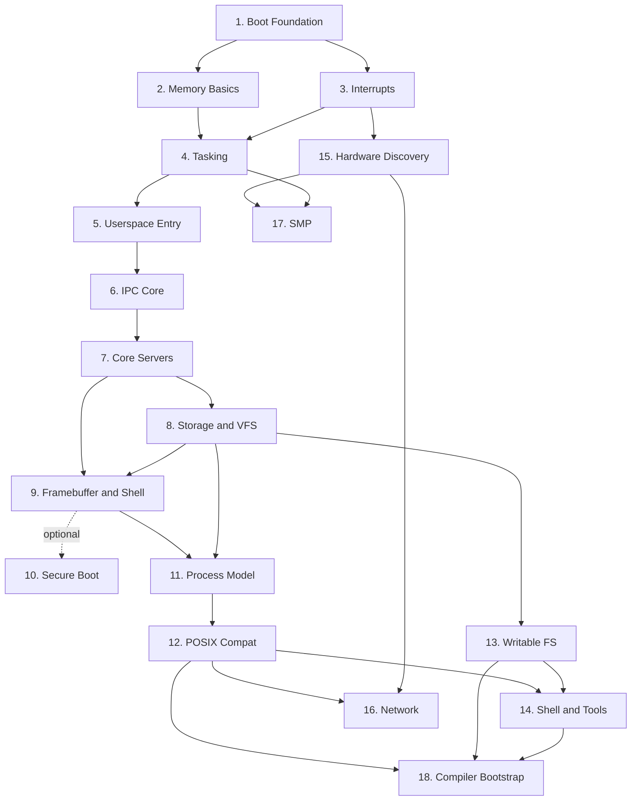

# Roadmap Summary

This file is the short version of the roadmap. The detailed milestone set now lives in
[`docs/roadmap/`](./roadmap/README.md), where each phase has its own page covering the
feature goal, implementation approach, acceptance criteria, deferrals, and a short note
about how real operating systems usually differ. Actionable task lists now live in
[`docs/roadmap/tasks/`](./roadmap/tasks/README.md).

## Phase Overview

## Detailed Phase Pages

### Original Phases (complete)

| Phase | Focus | Link |
|---|---|---|
| 1 | Bootable kernel, serial, panic path | [Boot Foundation](./roadmap/01-boot-foundation.md) |
| 2 | Frames, paging, heap | [Memory Basics](./roadmap/02-memory-basics.md) |
| 3 | Exceptions, timer, keyboard IRQ | [Interrupts](./roadmap/03-interrupts.md) |
| 4 | Context switching and scheduler | [Tasking](./roadmap/04-tasking.md) |
| 5 | Ring 3 and syscall entry | [Userspace Entry](./roadmap/05-userspace-entry.md) |
| 6 | Endpoints, capabilities, notifications | [IPC Core](./roadmap/06-ipc-core.md) |
| 7 | `init`, console, keyboard services | [Core Servers](./roadmap/07-core-servers.md) |
| 8 | VFS and read-only storage | [Storage and VFS](./roadmap/08-storage-and-vfs.md) |
| 9 | Screen output and shell | [Framebuffer and Shell](./roadmap/09-framebuffer-and-shell.md) |
| 10 *(optional)* | Secure Boot signing for real hardware | [Secure Boot](./roadmap/10-secure-boot.md) |

### Extended Phases

| Phase | Focus | Link |
|---|---|---|
| 11 | ELF loader; fork, exec, wait | [Process Model](./roadmap/11-process-model.md) |
| 12 | Linux syscall ABI; musl libc; C programs run unmodified | [POSIX Compat](./roadmap/12-posix-compat.md) |
| 13 | tmpfs and FAT32 write path | [Writable FS](./roadmap/13-writable-fs.md) |
| 14 | Pipes, redirection, job control, core utilities | [Shell and Tools](./roadmap/14-shell-and-tools.md) |
| 15 | ACPI parsing, PCI enumeration, APIC replaces PIC | [Hardware Discovery](./roadmap/15-hardware-discovery.md) |
| 16 | virtio-net driver, Ethernet/ARP/IP/UDP/TCP | [Network](./roadmap/16-network.md) |
| 17 | AP startup, per-core scheduler, TLB shootdown | [SMP](./roadmap/17-smp.md) |
| 18 | TCC runs and compiles itself inside the OS | [Compiler Bootstrap](./roadmap/18-compiler-bootstrap.md) |

## Documentation Expectation Per Phase

Each phase should produce documentation that explains:

- what the feature is for
- how it is implemented in this project
- which parts are intentionally simplified
- how mature operating systems would usually approach the same problem

## Related Reading

- [Roadmap Guide](./roadmap/README.md)
- [Roadmap Task Lists](./roadmap/tasks/README.md)
- [Architecture](./01-architecture.md)
- [IPC](./06-ipc.md)
- [Userspace & Syscalls](./07-userspace.md)
- [Testing](./09-testing.md)
