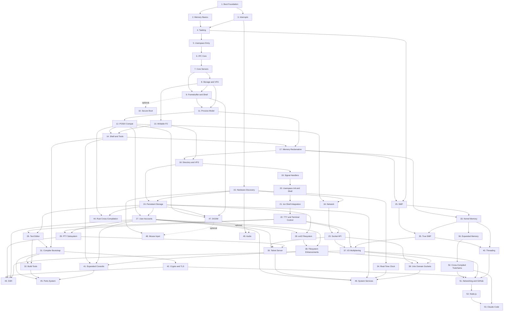

# Roadmap Summary

This file is the short version of the roadmap. The detailed milestone set now lives in
[`docs/roadmap/`](./roadmap/README.md), where each phase has its own page covering the
feature goal, implementation approach, acceptance criteria, deferrals, and a short note
about how real operating systems usually differ. Actionable task lists now live in
[`docs/roadmap/tasks/`](./roadmap/tasks/README.md).

## Phase Overview

## Detailed Phase Pages

### Foundation Phases (complete)

| Phase | Focus | Link |
|---|---|---|
| 1 | Bootable kernel, serial, panic path | [Boot Foundation](./roadmap/01-boot-foundation.md) |
| 2 | Frames, paging, heap | [Memory Basics](./roadmap/02-memory-basics.md) |
| 3 | Exceptions, timer, keyboard IRQ | [Interrupts](./roadmap/03-interrupts.md) |
| 4 | Context switching and scheduler | [Tasking](./roadmap/04-tasking.md) |
| 5 | Ring 3 and syscall entry | [Userspace Entry](./roadmap/05-userspace-entry.md) |
| 6 | Endpoints, capabilities, notifications | [IPC Core](./roadmap/06-ipc-core.md) |
| 7 | `init`, console, keyboard services | [Core Servers](./roadmap/07-core-servers.md) |
| 8 | VFS and read-only storage | [Storage and VFS](./roadmap/08-storage-and-vfs.md) |
| 9 | Screen output and shell | [Framebuffer and Shell](./roadmap/09-framebuffer-and-shell.md) |
| 10 *(optional)* | Secure Boot signing for real hardware | [Secure Boot](./roadmap/10-secure-boot.md) |

### POSIX and Userspace Phases (complete)

| Phase | Focus | Link |
|---|---|---|
| 11 | ELF loader; fork, exec, wait | [Process Model](./roadmap/11-process-model.md) |
| 12 | Linux syscall ABI; musl libc; C programs run unmodified | [POSIX Compat](./roadmap/12-posix-compat.md) |
| 13 | tmpfs writable filesystem | [Writable FS](./roadmap/13-writable-fs.md) |
| 14 | Pipes, redirection, job control, core utilities | [Shell and Tools](./roadmap/14-shell-and-tools.md) |
| 15 | ACPI parsing, PCI enumeration, APIC replaces PIC | [Hardware Discovery](./roadmap/15-hardware-discovery.md) |
| 16 | virtio-net driver, Ethernet/ARP/IP/UDP/TCP | [Network](./roadmap/16-network.md) |

### Usability Phases (complete)

| Phase | Focus | Link |
|---|---|---|
| 17 | Frame reclaim, heap growth, CoW fork, kernel stack cleanup | [Memory Reclamation](./roadmap/17-memory-reclamation.md) |
| 18 | `getdents64`, directory fds, real cwd, ramdisk layout | [Directory and VFS](./roadmap/18-directory-vfs.md) |
| 19 | User signal handlers, trampolines, `sigreturn`, `sigprocmask` | [Signal Handlers](./roadmap/19-signal-handlers.md) |
| 20 | Userspace PID 1 init, ring-3 shell, remove kernel shell | [Userspace Init and Shell](./roadmap/20-userspace-init-shell.md) |
| 21 | ion shell (Redox OS) replaces minimal custom shell | [Ion Shell Integration](./roadmap/21-ion-shell.md) |
| 22 | termios, cooked/raw mode, PTY stubs, window size, ion default shell | [TTY and Terminal Control](./roadmap/22-tty-pty.md) |
| 22b | ANSI/VT100 escape sequences, CSI parser, cursor movement, erase, SGR colors | [ANSI Escape Sequences](./roadmap/22-tty-pty.md#phase-22b-vt100--ansi-escape-sequence-processing-completed) |
| 23 | Socket syscalls, expose TCP/UDP stack to userspace, userspace ping | [Socket API](./roadmap/23-socket-api.md) |
| 24 | virtio-blk driver, FAT32 read/write, persistent `/data` | [Persistent Storage](./roadmap/24-persistent-storage.md) |
| 25 | AP startup, per-core scheduler, TLB shootdown | [SMP](./roadmap/25-smp.md) |

### Productivity Phases (planned -- "do real work inside the OS")

| Phase | Focus | Link |
|---|---|---|
| 26 | Full-screen text editor (kilo-based) | [Text Editor](./roadmap/26-text-editor.md) |
| 27 | User accounts, login, file permissions | [User Accounts](./roadmap/27-user-accounts.md) |
| 28 | ext2 filesystem with native Unix permissions | [ext2 Filesystem](./roadmap/28-ext2-filesystem.md) |
| 29 | Pseudo-terminal pairs for remote sessions | [PTY Subsystem](./roadmap/29-pty-subsystem.md) |
| 30 | Telnet server for remote shell access | [Telnet Server](./roadmap/30-telnet-server.md) |
| 31 | TCC compiles C programs and itself inside the OS | [Compiler Bootstrap](./roadmap/31-compiler-bootstrap.md) |
| 32 | make, ar, and scripting for multi-file projects | [Build Tools](./roadmap/32-build-tools.md) |

### Kernel Infrastructure Phases (planned -- "Linux/Unix compatibility and performance")

| Phase | Focus | Link |
|---|---|---|
| 33 | Slab allocator, OOM retry, working munmap, heap coalescing | [Kernel Memory Improvements](./roadmap/33-kernel-memory-improvements.md) |
| 34 | CMOS RTC driver, wall-clock time, CLOCK_REALTIME | [Real-Time Clock](./roadmap/34-real-time-clock.md) |
| 35 | Per-core syscall stacks, multi-core dispatch, priorities, load balancing | [True SMP Multitasking](./roadmap/35-true-smp-multitasking.md) |
| 36 | Demand paging, mprotect, large mmap, disk/RAM expansion | [Expanded Memory](./roadmap/36-expanded-memory.md) |
| 37 | select, epoll, non-blocking I/O | [I/O Multiplexing](./roadmap/37-io-multiplexing.md) |
| 38 | Symlinks, hard links, /proc, permission enforcement, device nodes | [Filesystem Enhancements](./roadmap/38-filesystem-enhancements.md) |
| 39 | AF_UNIX stream and datagram sockets, socketpair | [Unix Domain Sockets](./roadmap/39-unix-domain-sockets.md) |
| 40 | clone CLONE_THREAD, futex, TLS, thread groups | [Threading Primitives](./roadmap/40-threading-primitives.md) |

### Application Phases (planned -- "ecosystem and services")

| Phase | Focus | Link |
|---|---|---|
| 41 | head, tail, sort, find, diff, ps, less, and more | [Expanded Coreutils](./roadmap/41-expanded-coreutils.md) |
| 42 | RustCrypto + rustls + TLS 1.3 | [Crypto and TLS](./roadmap/42-crypto-primitives.md) |
| 43 | SSH client and server (sunset or Dropbear) | [SSH](./roadmap/43-ssh-server.md) |
| 44 | Rust programs cross-compiled on host run in the OS | [Rust Cross-Compilation](./roadmap/44-rust-cross-compilation.md) |
| 45 | Source-based ports tree for building third-party software | [Ports System](./roadmap/45-ports-system.md) |
| 46 | Service manager, syslog, cron, shutdown/reboot | [System Services](./roadmap/46-system-services.md) |

### Showcase Phases (planned -- "it runs DOOM")

| Phase | Focus | Link |
|---|---|---|
| 47 | DOOM runs inside the OS with framebuffer and keyboard | [DOOM](./roadmap/47-doom.md) |
| 48 | PS/2 mouse driver for graphical programs | [Mouse Input](./roadmap/48-mouse-input.md) |
| 49 | Sound card driver (HDA/AC97) for audio output | [Audio](./roadmap/49-audio.md) |

### Cross-Compiled Runtimes (planned -- "real tools and AI agents")

| Phase | Focus | Link |
|---|---|---|
| 50 | git, Python, Clang cross-compiled and bundled on disk | [Cross-Compiled Toolchains](./roadmap/50-cross-compiled-toolchains.md) |
| 51 | GitHub CLI (gh), git HTTPS, DNS resolution | [Networking and GitHub](./roadmap/51-networking-and-github.md) |
| 52 | Node.js with V8 and libuv | [Node.js](./roadmap/52-nodejs.md) |
| 53 | Claude Code AI agent running on m3OS | [Claude Code](./roadmap/53-claude-code.md) |

## Documentation Expectation Per Phase

Each phase should produce documentation that explains:

- what the feature is for
- how it is implemented in this project
- which parts are intentionally simplified
- how mature operating systems would usually approach the same problem

## Related Reading

- [Roadmap Guide](./roadmap/README.md)
- [Roadmap Task Lists](./roadmap/tasks/README.md)
- [Architecture](./01-architecture.md)
- [IPC](./06-ipc.md)
- [Userspace & Syscalls](./07-userspace.md)
- [Testing](./09-testing.md)
- [OS State Analysis](./17-os-state-analysis.md)
- [Clang/LLVM Roadmap](./clang-llvm-roadmap.md)
- [Python Roadmap](./python-roadmap.md)
- [Node.js Roadmap](./nodejs-roadmap.md)
- [git Roadmap](./git-roadmap.md)
- [GitHub CLI Roadmap](./github-cli-roadmap.md)
- [Claude Code Roadmap](./claude-code-roadmap.md)
- [Rust Crate Acceleration](./rust-crate-acceleration.md)
