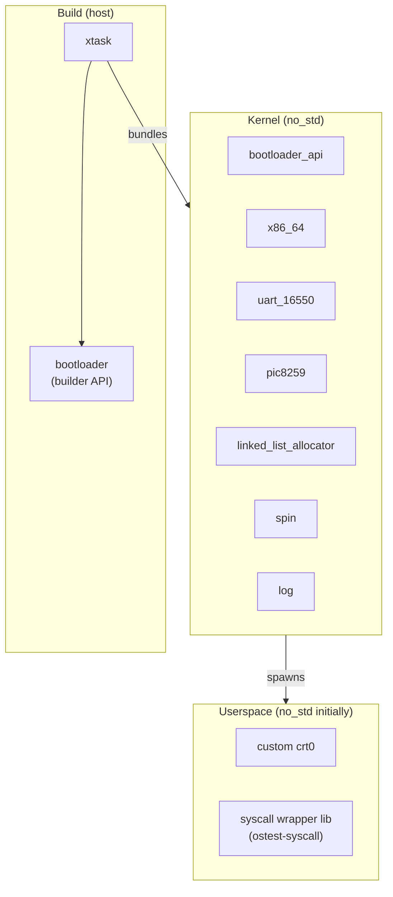

# Roadmap

## Implementation Phases

Each phase produces a **runnable artifact** — nothing is left in a broken state
between phases. Phases can overlap slightly (e.g., framebuffer work in Phase 8
can start once Phase 3 is complete).

```mermaid
gantt
    title ostest Implementation Roadmap
    dateFormat  X
    axisFormat  Phase %s

    section Foundation
    Phase 1 - Foundation          :p1, 0, 1
    Phase 2 - Memory              :p2, after p1, 1
    Phase 3 - Interrupts          :p3, after p1, 1

    section Kernel Core
    Phase 4 - Tasking             :p4, after p2, 1
    Phase 4 - Tasking             :     after p3, 0

    section Userspace
    Phase 5 - Userspace           :p5, after p4, 1
    Phase 6 - IPC                 :p6, after p5, 1

    section Servers & Shell
    Phase 7 - Servers             :p7, after p6, 1
    Phase 8 - Framebuffer         :p8, after p3, 1
    Phase 9 - Shell               :p9, after p7, 1
    Phase 9 - Shell               :     after p8, 0
```

---

## Phase Details

> Task tracking is handled in the project issue tracker. The deliverable for each phase
> is listed here; refer to open issues for the current work breakdown.

### Phase 1 — Foundation ✦ Start Here

**Goal:** A kernel that boots, prints to serial, and halts cleanly in QEMU.

Covers: Cargo workspace (`kernel/`, `xtask/`), `no_std` freestanding binary, custom
x86_64 target, `bootloader` crate integration, `BootInfo` parsing, serial output via
`uart_16550`, `log` crate with serial backend, GDT setup, panic handler, `cargo xtask
run` and `cargo xtask image` commands.

**Deliverable:** `[ostest] Hello from kernel!` appears on serial; QEMU exits cleanly.

---

### Phase 2 — Memory Management

**Goal:** Dynamic allocation works in the kernel (`Vec`, `Box`, `String`).

Covers: Physical frame allocator (bump allocator) from `BootInfo::memory_regions`, page
table walker via `x86_64` crate + `physical_memory_offset`, kernel heap mapping,
`linked_list_allocator` as `#[global_allocator]`.

**Deliverable:** Kernel can call `Vec::new()` and `Box::new()` without panic.

---

### Phase 3 — Interrupts & Exceptions

**Goal:** Hardware interrupts work; keyboard input is captured.

Covers: IDT setup (breakpoint, page fault, double fault with IST stack, GPF), TSS
configuration, PIC8259 init (remapped to vectors 32–47), timer IRQ0 at ~100 Hz, keyboard
IRQ1 scancode ring buffer.

**Deliverable:** Pressing a key in QEMU triggers IRQ1; scancode appears in the log.

---

### Phase 4 — Multitasking

**Goal:** Multiple kernel threads run concurrently, preempted by the timer.

Covers: `Task` struct (register context, kernel stack, state machine), `switch_context`
assembly stub, round-robin scheduler (`VecDeque<TaskId>`), timer-driven preemption, idle
task (`hlt` loop), `spawn_kernel_thread(fn)` API.

**Deliverable:** Two concurrent kernel threads interleave output on serial.

---

### Phase 5 — Userspace

**Goal:** First ring 3 process runs.

Covers: Per-process page tables (separate PML4), `enter_userspace` via `iretq`,
`syscall`/`sysret` gate (`MSR_LSTAR`), syscall dispatcher, `sys_debug_print`,
`sys_exit`, minimal `crt0` for userspace binaries, static blob loading.

**Deliverable:** A tiny ring 3 binary prints "Hello from userspace!" and exits cleanly.

---

### Phase 6 — IPC

**Goal:** Two userspace processes communicate via message passing.

> ⚠️ **Resolve the IPC model design decision before starting this phase.** See
> `docs/06-ipc.md` — synchronous rendezvous is recommended for Phase 6.

Covers: `Endpoint` kernel object, per-process capability table, `sys_send`/`sys_recv`/
`sys_call`/`sys_reply`/`sys_reply_recv`, IRQ delivery via `IrqCap`, `sys_irq_register`.

**Deliverable:** A client process calls a server process and receives a response.

---

### Phase 7 — Userspace Servers

**Goal:** A minimal OS stack: `init`, `console_server`, `vfs_server`, `fat_server`.

Covers: `init` process (server spawner + nameserver), `console_server` (serial I/O over
IPC), `kbd_server` (scancodes via `IrqCap`), `vfs_server` (path dispatch), `fat_server`
or custom flat FS (read-only), ELF loader.

**Deliverable:** `init` starts all servers; a userspace process can `open`/`read` a file.

---

### Phase 8 — Framebuffer

**Goal:** Pixel output and a terminal emulator rendering to the screen.

Covers: `BootInfo::framebuffer` parsing, `framebuffer_server`, pixel drawing primitives,
embedded 8×16 bitmap font, character-grid terminal emulator, `console_server` routing to
framebuffer.

**Deliverable:** Text appears on screen, not only on serial.

---

### Phase 9 — Shell

**Goal:** Interactive shell running in userspace.

Covers: `shell` process (IPC with `console_server`), line input (backspace/enter),
command parser, built-ins (`echo`, `ls`, `cat`, `help`, `clear`, `reboot`), `sys_spawn`
for external programs, PATH via `vfs_server`.

**Deliverable:** An interactive shell where commands can be run.

---

## Open Design Questions

These questions need answers before or during the relevant phase:

| Phase | Question | Options |
|---|---|---|
| 6 | IPC model | Sync rendezvous (recommended) vs. async channels |
| 6 | Capability table | Fixed-size array vs. growable |
| 6 | Large transfers | Page grant vs. copy |
| 7 | ELF loading | `init` does it vs. kernel does it |
| 7 | Filesystem | Custom flat FS vs. FAT32 |
| 7 | `init` nameserver | Simple string map vs. typed service registry |
| 8 | Framebuffer owner | Kernel-mapped vs. userspace-mapped |
| 9 | Process spawning | `spawn` syscall vs. `fork`+`exec` style |
| 9 | libc | Custom forever vs. `relibc` compatibility |
| — | SMP | Single-core throughout vs. add APIC/SMP after Phase 4 |
| — | ACPI | Needed for real hardware PCI enumeration? |

---

## Reference Material

| Resource | Relevance |
|---|---|
| [Writing an OS in Rust — blog_os](https://os.phil-opp.com/) | Phases 1–3 (canonical reference) |
| [Redox OS kernel](https://github.com/redox-os/kernel) | IPC, server design, VFS (Phases 6–7) |
| [seL4 design docs](https://sel4.systems/About/seL4-whitepaper.pdf) | Capability model, IPC formal design |
| [L4 x2 specification](https://l4.org/documentation/) | Synchronous IPC semantics |
| [OSDev Wiki — x86_64](https://wiki.osdev.org/X86_64) | Low-level hardware reference |
| [Intel SDM Vol 3](https://www.intel.com/content/www/us/en/developer/articles/technical/intel-sdm.html) | Authoritative: paging, interrupts, syscall |
| `docs/09-testing.md` | QEMU test harness, exit codes, integration test structure |

---

## Crate Dependency Summary

