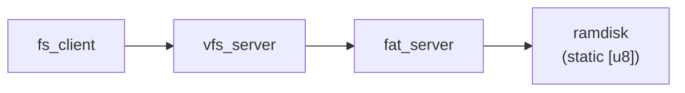

# Storage and VFS — Phase 8

## Overview

Phase 8 adds the first file-access layer to m³OS. The additions are:

- **File IPC protocol** — three operations (`FILE_OPEN`, `FILE_READ`, `FILE_CLOSE`) that let any
  kernel task open and read named files
- **`fat_server`** — a ramdisk backend that embeds files at compile time and serves them over IPC
- **`vfs_server`** — a routing layer that accepts file requests from clients and forwards them to
  the appropriate backend
- **`fs_client` demo task** — an `init_task`-spawned task that opens `hello.txt`, reads it, and
  logs the result to prove the stack works end-to-end



### Why route file access through IPC?

The same policy/mechanism argument from Phase 7 applies here. The kernel should own only the
mechanism — endpoint delivery, scheduling, memory protection. Policy questions (which process can
read which path, how to handle missing files, what backends exist) belong in userspace servers.

Routing through `vfs_server` instead of letting clients call `fat_server` directly also creates
the ownership boundary needed for Phase 9+: adding a second backend (tmpfs, network share) only
requires changing `vfs_server`'s routing table, not every client.

---

## File IPC Protocol

Phase 8 defines three label numbers in `kernel/src/fs/protocol.rs`. All use the existing
`Message` type: one `label` word and four `data` words.

| Label | Operation | Request `data` fields | Reply `data` fields |
|---|---|---|---|
| `1` | `FILE_OPEN` | `data[0]`: path pointer (kernel vaddr); `data[1]`: path length in bytes | `data[0]`: fd index (`u64`); `u64::MAX` if name not found |
| `2` | `FILE_READ` | `data[0]`: fd; `data[1]`: byte offset into file; `data[2]`: max bytes to read | `data[0]`: pointer to content in ramdisk (0 = error); `data[1]`: actual bytes from offset (0 = EOF or error; distinguish by `data[0]`) |
| `3` | `FILE_CLOSE` | `data[0]`: fd | `data[0]`: `0` (always succeeds) |

### Phase 8 limitations

**Pointer passing only works in a shared address space.** `FILE_OPEN` passes the path as a raw
kernel virtual address in `data[0]`. `FILE_READ` returns a pointer into the static ramdisk
content in its reply `data[0]`.
This works in Phase 8 because all tasks — `fs_client`, `vfs_server`, and `fat_server` — run as
kernel threads sharing the kernel address space. When servers move to ring-3 processes (Phase 9+),
a user virtual address cannot be dereferenced by a server in a different address space.

**File descriptors are stateless indices.** The fd returned by `FILE_OPEN` is simply the index of
the file in the ramdisk's static `FILES` table. There is no per-client fd table and no fd
allocation: two clients that open the same file get the same fd value, and neither has any
exclusive ownership.

**`FILE_CLOSE` is a no-op.** Because there is no per-process fd state to release, the close
operation acknowledges the message and returns immediately without changing any kernel data
structure.

### How this changes in Phase 9+

When ring-3 processes exist, the protocol must be redesigned:

- **Path and buffer transfer** will use page-capability grants. The client maps a page, writes the
  path or buffer into it, and sends the page capability to the server. The server maps the
  capability into its own address space, reads or writes, then unmaps it. No raw pointer values
  cross the IPC channel.
- **Per-process fd tables** will track open file state (position, flags, reference count) keyed
  by process identity. The fd returned to the client will be an index into that per-process table,
  not a global ramdisk index.
- **`FILE_CLOSE`** will decrement a reference count and potentially free position state.

---

## Ramdisk Backend (`fat_server`)

### How files are embedded

Phase 8 uses a compile-time ramdisk: file contents are baked into the kernel binary using
`include_bytes!`. There is no disk I/O, no FAT parsing, and no block device driver.

```rust
static HELLO: &[u8] = include_bytes!("../../initrd/hello.txt");
static README: &[u8] = include_bytes!("../../initrd/readme.txt");

struct RamdiskFile {
    name:    &'static str,
    content: &'static [u8],
}

static FILES: &[RamdiskFile] = &[
    RamdiskFile { name: "hello.txt", content: HELLO },
    RamdiskFile { name: "readme.txt", content: README },
];
```

The `include_bytes!` macro runs at compile time; `xtask` does not need to load files at runtime.
The paths `kernel/initrd/hello.txt` and `kernel/initrd/readme.txt` must exist in the repository
for the build to succeed.

### File descriptor semantics

The fd returned by `FILE_OPEN` is the index of the matched entry in `FILES` cast to `u64`:

- `hello.txt` → fd `0`
- `readme.txt` → fd `1`
- Any name not in the table → `u64::MAX` (error)

Valid fd range is `0..FILES.len()`. `FILE_READ` validates the fd (and requested offset) against
this range before accessing any data; an invalid fd or an offset past the end of the file is
reported as a zero-length read by setting `data[0] = 0` (null pointer) and `data[1] = 0`.
The `u64::MAX` sentinel is used only by `FILE_OPEN` when name lookup fails.

### Why no fd table is needed

All files in Phase 8 are read-only and the ramdisk has no mutable state. A client cannot change
the content of a file, advance a shared cursor, or hold exclusive access. Because every read
starts from the beginning of `content` and the max-bytes field in `data[2]` determines how much
to copy, the operation is stateless: running `FILE_READ` twice with the same fd and buffer
produces identical results. There is nothing to track per client.

### Comparison with production FAT drivers

| Feature | Phase 8 `fat_server` | Production FAT driver (e.g., Linux `vfat`) |
|---|---|---|
| Storage source | `include_bytes!` (compile-time) | Block device via buffer cache |
| Directory support | None (flat name list) | FAT directory chain traversal |
| Long file names | Full name as static string | VFAT LFN entries in directory |
| Writability | Read-only | Read/write with allocation bitmap updates |
| Seek | Implicit (reads from offset 0) | `lseek()` with per-fd position |
| Caching | None | Page cache with LRU eviction |

---

## VFS Routing Layer (`vfs_server`)

### What `vfs_server` does in Phase 8

`vfs_server` receives file IPC messages from clients and forwards them, unchanged, to
`fat_server`. It does not parse paths, maintain a mount table, or validate access permissions.
In Phase 8 it is a single-backend pass-through.

The server loop looks like:

```
recv_msg(vfs_ep) -> msg
while running:
    match msg.label:
        FILE_OPEN | FILE_READ | FILE_CLOSE =>
            reply_msg = call_msg(fat_ep, msg)   // forward full message to backend
            reply(msg.client, reply_msg)
        _ =>
            reply(msg.client, Message { label: ERR_UNKNOWN_OP, .. })
    msg = reply_recv_msg(vfs_ep)
```

### Why the VFS layer exists as a pass-through

A direct `fs_client → fat_server` call would be simpler and faster. The VFS layer exists because
removing it later is much more disruptive than adding routing logic to it now.

The division of responsibility is:

- **`vfs_server` owns path dispatch.** It decides which backend owns a given path prefix. In
  Phase 8 there is only one backend, so the answer is always `fat_server`.
- **`fat_server` owns file data and fd semantics.** It decides what a name means, what the
  content is, and whether an fd is valid.

This boundary means Phase 9+ can add a second backend (say, `tmpfs_server` for `/tmp`) by
teaching `vfs_server` a mount table without changing `fat_server` or any client.

### Phase 9+ evolution

| Phase | VFS capability |
|---|---|
| 8 | Single backend; fixed pass-through |
| 9 | Mount table; path prefix routing to multiple backends |
| 10+ | Per-process mount namespaces; capability-checked access per path |

---

## Bootstrap Sequence

### Who starts what

`init_task` creates endpoints and spawns servers in a fixed order before yielding to the
scheduler. `fat_server` must be registered before `vfs_server` is spawned, because `vfs_server`
calls `lookup("fat")` during its startup to find the backend endpoint.

```mermaid
flowchart TD
    IT["init_task"] --> CFE["create fat_ep"]
    CFE --> RF["register \"fat\""]
    RF --> SF["spawn fat_server"]
    IT --> CVE["create vfs_ep"]
    CVE --> RV["register \"vfs\""]
    RV --> SV["spawn vfs_server"]
    IT --> SC["spawn fs_client_task"]
    SC --> LV["lookup \"vfs\""]
    LV --> FO["FILE_OPEN(\"hello.txt\")"]
    FO --> FR["FILE_READ"]
    FR --> FC["FILE_CLOSE"]
```

### Step-by-step ordering

Each step emits a `log::info!` line so the boot log shows the exact sequence:

1. `init_task` creates the fat endpoint and registers it as `"fat"`.
2. `init_task` spawns `fat_server`. The server starts and logs `[fat] ready`, then blocks on
   `recv(fat_ep)`.
3. `init_task` creates the VFS endpoint and registers it as `"vfs"`.
4. `init_task` spawns `vfs_server`. The server calls `lookup("fat")` to obtain the backend
   endpoint, logs `[vfs] ready, backend=EndpointId(N)`, then blocks on `recv(vfs_ep)`.
5. `init_task` spawns `fs_client_task` and yields.
6. `fs_client_task` calls `lookup("vfs")`, then sends `FILE_OPEN`, `FILE_READ`, and `FILE_CLOSE`
   in sequence.

The ordering guarantee matters: the fat endpoint is registered *before* `vfs_server` spawns, so
`lookup("fat")` in step 4 always succeeds regardless of scheduler ordering between steps 2 and 4.

### Expected boot log

```
[init] service registry: fat=EndpointId(1)
[init] service registry: vfs=EndpointId(2)
[fat] ready
[vfs] ready, backend=EndpointId(1)
[fs-client] opened hello.txt → fd=0
[fs-client] read 38 bytes: "Hello from the m3os filesystem!..."
[fs-client] Phase 8 storage demo complete
```

---

## Limitations and Deferred Work

### Servers are kernel tasks, not ring-3 processes

The most important limitation: in Phase 8, `fat_server`, `vfs_server`, and `fs_client_task` all
run as kernel threads in ring 0, sharing the kernel address space. They are not isolated processes.

This is the same deferral as Phase 7. Moving servers to ring 3 requires an ELF loader and a
process manager, both planned for Phase 9+. The IPC paths, endpoint capability model, and service
registry all work the same way they will for ring-3 servers — only the task creation mechanism
changes.

### Pointer-based data transfer

`FILE_OPEN` and `FILE_READ` pass raw kernel virtual address pointers in the IPC payload. In
Phase 9+, when servers run in separate address spaces, this cannot work. The replacement
mechanism is **page-capability grants**: the client maps a shared page, places the path or
receive buffer there, and sends the page capability handle. The server maps the capability, reads
or writes through it, then releases it. No raw pointer ever crosses the IPC channel.

### Stateless file descriptors

There is no per-process fd table. The fd value is a global ramdisk index, not a per-client
handle. Two tasks that both open `hello.txt` receive fd `0`; neither can tell that the other
holds the same fd. Phase 9+ will introduce per-process fd tables so that fd values are local to
the calling process and can carry per-open state (position, flags, reference count).

### No disk I/O

The ramdisk is embedded via `include_bytes!` at build time. There is no block device driver, no
partition table parser, and no FAT directory traversal. Real block I/O and a FAT parser are
Phase 9+ work.

### No writable filesystem

All files in Phase 8 are read-only static byte slices. There is no `FILE_WRITE`, no allocation
of new files, and no way to persist data across reboots. This is intentional: read-only access
teaches the layering and naming conventions without introducing crash-consistency problems
(journaling, write-back ordering, fsync).

### Inconsistent error sentinels in the file protocol

`FILE_OPEN` and `FILE_READ` use different conventions to signal errors in their reply messages:

- `FILE_OPEN` error: `data[0] = u64::MAX` (the fd field holds the sentinel)
- `FILE_READ` error: `data[0] = 0, data[1] = 0` (the len field being zero signals failure;
  `data[0]` is `0` not `u64::MAX`)

A client that copies the `FILE_OPEN` error-check pattern (`data[0] == u64::MAX`) to a
`FILE_READ` error check will **never detect a read error**: `FILE_READ` failures return
`data[0] = 0, data[1] = 0`, not `data[0] = u64::MAX`, so such a client will silently
treat every read error as a successful EOF.  The current `fs_client_task` correctly
checks `data[0]` (the pointer) for null rather than comparing against `u64::MAX`, but
the asymmetry is a latent trap for future clients.

Phase 9+ should unify the protocol — the simplest fix is to use `data[0] = 0` (null
pointer) as the consistent error indicator across all operations, and reserve
`data[1] = 0` to mean EOF only when `data[0] != 0` in length-carrying replies.  This
will be a natural point to revisit when the protocol is redesigned for page-capability
grants.

### Name-length limits are not shared

`MAX_NAME_LEN` in `fs/protocol.rs` is 64 bytes, while the service registry
(`ipc/registry.rs`) caps names at 32 bytes.  These are different domains (filenames
vs. service names), so separate limits are correct.  However, the values are currently
unrelated magic numbers.  If either limit is raised independently in Phase 9+, the
mismatch could cause confusion.  Consider a shared constant or at minimum a comment
cross-referencing the two limits when either is changed.

### Comparison with a production VFS

| Feature | Phase 8 | Production (e.g., Linux VFS) |
|---|---|---|
| Storage source | Static ramdisk (embedded bytes) | Block devices, network, FUSE |
| File descriptors | Stateless index into static table | Per-process fd table with flags |
| Data transfer | Kernel pointer in IPC payload | `copy_to_user()` into user buffers |
| Mount table | None (single backend) | Full mount namespace per process |
| Permissions | None | DAC + MAC (capabilities, SELinux) |
| Caching | None | Page cache (LRU eviction) |
| Writeback | None | Write-back with journal/fsync |

---

## See Also

- `docs/07-core-servers.md` — service registry, console_server, kbd_server (Phase 7 foundation)
- `docs/roadmap/08-storage-and-vfs.md` — phase milestone plan and acceptance criteria
- `docs/roadmap/tasks/08-storage-and-vfs-tasks.md` — per-task breakdown (P8-T009 through P8-T011)
