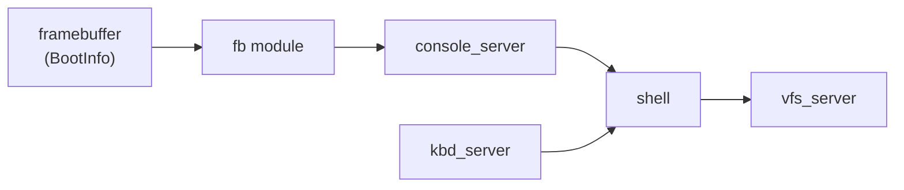
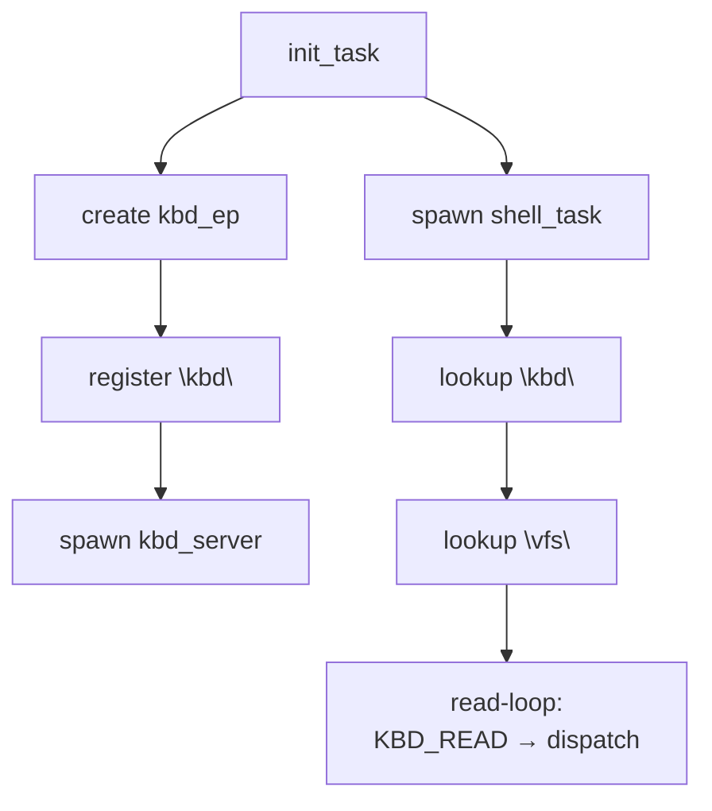

# Framebuffer and Shell — Phase 9

**Aligned Roadmap Phase:** Phase 9
**Status:** Complete
**Source Ref:** phase-09

## Overview

Phase 9 adds the first interactive layer to m³OS: a pixel framebuffer text console, keyboard
IPC, and a tiny shell with built-in file commands. The additions are:

- **Framebuffer text console** — `fb::init()` claims the bootloader framebuffer and provides a
  `write_str` interface for drawing ASCII text directly to screen
- **Console dual output** — `console_server` routes output to both serial and the framebuffer
- **Keyboard IPC** — `kbd_server` exposes a `KBD_READ` operation so the shell can read keystrokes
  over synchronous IPC
- **Shell** — `shell_task` reads lines from `kbd_server`, dispatches built-in commands (`help`,
  `echo`, `ls`, `cat`), and routes file-oriented commands through `vfs_server`
- **`FILE_LIST` protocol extension** — label `4` added to the file IPC protocol so `ls` can
  enumerate ramdisk files without knowing filenames in advance



---

## Framebuffer Text Console

### How the framebuffer is accessed (T001)

`bootloader_api` provides a `&'static mut FrameBuffer` embedded in `BootInfo`. During
`kernel_main` init, the kernel first extracts `(buf_ptr, info)` from `BootInfo`, then calls
`fb::init_from_parts()` after `mm::init()`:

- Extracts the raw pointer, stride, width, height, and pixel format from `BootInfo`.
- Stores them in a `static Mutex<FbConsole>` (using `spin::Mutex`).
- The `BootInfo` reference is not retained after framebuffer init completes.

Why a raw pointer: the CLAUDE.md convention requires that `BootInfo` is not held long-lived.
`fb::init_from_parts()` takes ownership of the framebuffer data after the one-time extraction, so
the rest of the kernel interacts with `fb::write_str()` without knowing about `BootInfo` at all.

### Text rendering (T002)

The font is an 8×16 bitmap: one byte per row, 16 rows per glyph, covering the printable ASCII
range. Rendering a character at `(col, row)`:

1. Compute pixel origin: `x = col * 8`, `y = row * 16`.
2. For each font row `r` (0–15), fetch the byte `font[glyph][r]`.
3. For each bit `b` (0–7), if the bit is set write a foreground pixel at `(x + b, y + r)`;
   otherwise write a background pixel.
4. Pixel address = `framebuffer_base + (y + r) * stride + (x + b) * bytes_per_pixel`.

**Scroll:** When `cursor_row` reaches `height / char_h`, the buffer is shifted up by `char_h`
rows using a `memmove`-style byte copy (`ptr::copy`), and the bottom row is cleared. If the
framebuffer is too small to fit even one 8×16 glyph cell, the text console stays disabled rather
than attempting to render or scroll.

**Pixel formats:** `Rgb` and `Bgr` are both supported. The renderer writes the first three bytes
of each pixel (`[r, g, b]` or `[b, g, r]`) and leaves any 4th padding byte unchanged. For
`PixelFormat::U8`, it writes an 8-bit luma value derived from the RGB colour.

### Console dual output (T003)

`console_server_task` already sends all output to serial via `log::info!`. After Phase 9 it also
calls `fb::write_str(text)` for every string it would write to serial. The framebuffer write is
best-effort:

- If `fb::init()` was never called (bootloader provided no framebuffer), `write_str` is a no-op.
- If the framebuffer is smaller than one character cell, `fb::init()` leaves the console disabled.

This means existing serial logging is unchanged; the framebuffer is an additive output channel.

### Phase 9 limitations

- No hardware cursor or blink (cursor is a software tracking variable only).
- No color support — all text is white-on-black.
- No Unicode beyond ASCII — non-ASCII bytes are rendered as a placeholder glyph (e.g., `?`).
- The framebuffer pointer is a kernel virtual address; it is inaccessible to ring-3 processes.
  Phase 10+ will map the framebuffer into a dedicated display server's address space.

---

## Keyboard IPC (T004)

### KBD_READ operation

`kbd_server_task` registers a `KBD_READ` (label=`1`) operation on the `"kbd"` endpoint. The
server loop:

1. Block on `recv(kbd_ep)`.
2. When a `KBD_READ` message arrives:
   - If the scancode ring buffer is non-empty, pop one scancode and reply with it.
   - If the ring buffer is empty, block on the keyboard IRQ `Notification` until a scancode
     arrives, then reply with that scancode.
3. Reply contains the raw PS/2 scancode byte in `data[0]`. `kbd_server` does not perform ASCII
   translation.

The shell calls `KBD_READ` synchronously: one IPC round-trip per keystroke.

### Scancode-to-ASCII

The shell performs scancode-to-ASCII translation in userspace. A compile-time lookup table maps
PS/2 scancodes `0x01`–`0x3A` to ASCII characters using the US-QWERTY layout. Shift state is
maintained by monitoring make/break codes for left shift (`0x2A`) and right shift (`0x36`). A
shifted lookup table handles uppercase letters and punctuation. Function keys, arrow keys, and
other non-ASCII scancodes are ignored by the shell, so they do not append printable bytes to the
line buffer.

---

## Shell (T005, T006)

### Command dispatch

`shell_task` reads scancodes from `kbd_server` via `KBD_READ` IPC, translates them to printable
ASCII (tracking shift state), and accumulates them into a line buffer. The line is considered
complete when the Enter make scancode (`0x1C`) is received; Backspace removes the last character.
On Enter:

1. Split the line once at the first ASCII space character (`splitn(2, ' ')`).
2. First token = command name; second token (if present) = the rest of the line as one argument string.
3. Dispatch to the matching built-in handler.
4. Print the result via `console_server` (which routes to both serial and framebuffer).

Built-in commands: `help`, `echo`, `ls`, `cat`.

### File-oriented commands (T006)

**`ls`** sends a `FILE_LIST` (label=`4`) message to `vfs_server`. The reply's `data[0]` is a
pointer to a null-separated byte buffer; `data[1]` is the total byte length. The shell iterates
through the buffer, printing each null-terminated name on its own line.

**`cat <file>`** sends `FILE_OPEN` → `FILE_READ` → `FILE_CLOSE` to `vfs_server`, then prints
the content bytes to the console. On `FILE_OPEN` error (`data[0] == u64::MAX`) it prints
`cat: file not found`.

Both `ls` and `cat` route through `vfs_server` → `fat_server`, exercising the same two-hop IPC
chain introduced in Phase 8.

### Shell limitations

- No pipes, redirection, or job control.
- No command history or cursor movement (only backspace line editing).
- No process launching; all commands are built-in kernel tasks.
- Line buffer grows dynamically (`Vec<u8>`), so practical limits are set by the kernel heap.

---

## Bootstrap Sequence

`init_task` creates endpoints and spawns servers in a fixed order. `kbd_server` must be
registered before `shell_task` spawns because the shell calls `lookup("kbd")` during startup.



The Phase 7 and Phase 8 services (`console_server`, `fat_server`, `vfs_server`) are spawned
before `kbd_server` and `shell_task` using the same ordering rules documented in
`docs/08-storage-and-vfs.md`.

### Expected boot log

```
[fb] framebuffer console initialised
[init] service registry: kbd=EndpointId(N)
[kbd] ready, waiting for KBD_READ requests
[shell] ready — type 'help'
```

---

## Limitations and Deferred Work

### Comparison with a production shell

| Feature | Phase 9 | bash |
|---|---|---|
| Input | KBD_READ IPC, polling | termios, pty |
| Line editing | backspace only | readline |
| Commands | 4 built-ins | hundreds + $PATH |
| Output | console IPC + framebuffer | pty, tty |
| Process model | kernel tasks only | fork/exec |

### Framebuffer access model

The framebuffer is a kernel pointer. Ring-3 processes cannot write to it directly. Phase 10+
will introduce a display server that owns a mapped region of the physical framebuffer and
exposes a higher-level draw protocol to clients.

### Keyboard IPC is synchronous and single-consumer

Only one client (the shell) can call `KBD_READ` at a time. A second task that calls `KBD_READ`
concurrently will race with the shell for scancodes. Multi-client input multiplexing is deferred
to a future `tty_server`.

### FILE_LIST pointer lifetime

`FILE_LIST` replies with a kernel virtual address into static ramdisk data. This only works
while all tasks share the kernel address space. Phase 10+ will use page-capability grants so
ring-3 clients can receive the name buffer safely, following the same migration path described
for `FILE_READ` in `docs/08-storage-and-vfs.md`.

---

## Phase 52 Update: Framebuffer Rendering Moved to Userspace

As of Phase 52 (First Service Extractions), framebuffer rendering policy has
moved from kernel-resident code to the ring-3 `console_server` service. The
kernel retains only the physical framebuffer mapping (page grants to the console
service) and low-level pixel format detection. All text rendering, cursor
management, scroll behavior, and dual serial/framebuffer output routing are now
owned by the userspace console service. See
[docs/52-first-service-extractions.md](./52-first-service-extractions.md) for
the full design.

## See Also

- `docs/07-core-servers.md` — console_server, kbd_server (Phase 7 foundation)
- `docs/08-storage-and-vfs.md` — VFS and fat_server (Phase 8 foundation)
- `docs/52-first-service-extractions.md` — Phase 52 console and keyboard extraction
- `docs/roadmap/09-framebuffer-and-shell.md` — phase milestone and acceptance criteria
- `docs/roadmap/tasks/09-framebuffer-and-shell-tasks.md` — per-task breakdown
