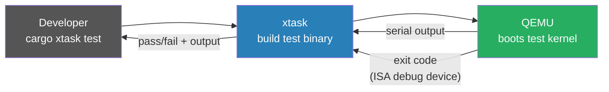

# Testing

## Overview

m3OS uses a two-tier testing strategy:

1. **Host-side unit tests** — Pure-logic code lives in `kernel-core` and runs on the host via
   `cargo test -p kernel-core`. These are fast (< 1 second) and cover networking, IPC, filesystem,
   and pipe logic.

2. **In-QEMU integration tests** — Tests that need real hardware (interrupts, page tables, serial
   I/O) run inside QEMU via a custom test harness driven by `cargo xtask test`.

---

## Host-Side Tests (kernel-core)

The `kernel-core` crate contains all pure-logic modules extracted from the kernel. It compiles
on the host (`x86_64-unknown-linux-gnu`) and supports standard `#[test]` functions.

### Running

```bash
# Run all host-side tests
cargo test -p kernel-core

# Run tests for a specific module
cargo test -p kernel-core -- net::ipv4

# Also runs as part of the full check suite
cargo xtask check
```

### Writing a host-side test

Add tests in `#[cfg(test)]` blocks within `kernel-core/src/` modules:

```rust
// kernel-core/src/net/ipv4.rs

#[cfg(test)]
mod tests {
    use super::*;

    #[test]
    fn parse_valid_packet() {
        let data = /* ... */;
        let header = Ipv4Header::parse(&data).unwrap();
        assert_eq!(header.version(), 4);
    }
}
```

### What belongs in kernel-core

- Data structures and their methods (no hardware access)
- Parsers and builders (network packets, filesystem structures)
- Pure algorithms (checksums, lookups, ring buffers)
- Anything that doesn't touch `x86_64` port I/O, page tables, or interrupts

---

## In-QEMU Tests

The kernel is a `no_std` binary targeting bare-metal x86_64. Tests that need real hardware
run inside QEMU via a custom test harness.

### How It Works



The flow for every test run:
1. `xtask` compiles a **test kernel binary** with `cargo build --tests`
2. `xtask` creates a UEFI disk image from the test binary
3. `xtask` launches QEMU with the disk image and the ISA debug exit device
4. The test kernel boots, runs `test_main()` (generated by `custom_test_frameworks`), and
   prints results to serial
5. On completion, the test kernel writes to the ISA debug exit device to terminate QEMU
6. `xtask` reads the exit code and serial output, reports pass/fail

### Running

```bash
# Run all in-QEMU kernel tests
cargo xtask test

# Run a single test binary (when integration tests exist in kernel/tests/)
cargo xtask test --test heap_allocation

# Run with visible QEMU window (useful for debugging hangs)
cargo xtask test --display

# Custom timeout (default: 60 seconds)
cargo xtask test --timeout 120
```

---

## QEMU Exit Device

QEMU is launched with `-device isa-debug-exit,iobase=0xf4,iosize=0x04`. Writing to
port `0xf4` causes QEMU to exit with code `(value << 1) | 1`.

Convention:

| Write to 0xf4 | QEMU exit code | Meaning |
|---|---|---|
| `0x10` | `0x21` | **Test passed** |
| `0x11` | `0x23` | **Test failed** |

```rust
// kernel/src/testing.rs
use x86_64::instructions::port::Port;

#[derive(Debug, Clone, Copy, PartialEq, Eq)]
#[repr(u32)]
pub enum QemuExitCode {
    Success = 0x10,
    Failure = 0x11,
}

pub fn exit_qemu(exit_code: QemuExitCode) -> ! {
    unsafe {
        let mut port = Port::new(0xf4);
        port.write(exit_code as u32);
    }
    loop {
        x86_64::instructions::hlt();
    }
}
```

---

## Test Harness

The test kernel uses a custom `#[test_runner]` instead of the standard one:

```rust
// kernel/src/main.rs (conditionally enabled in test builds)
#![cfg_attr(test, feature(custom_test_frameworks))]
#![cfg_attr(test, test_runner(crate::testing::test_runner))]
#![cfg_attr(test, reexport_test_harness_main = "test_main")]

// kernel/src/testing.rs
pub trait Testable {
    fn run(&self);
}

impl<T: Fn()> Testable for T {
    fn run(&self) {
        serial_print!("{}...\t", core::any::type_name::<T>());
        self();
        serial_println!("[ok]");
    }
}

pub fn test_runner(tests: &[&dyn Testable]) {
    serial_println!("Running {} tests", tests.len());
    for test in tests {
        test.run();
    }
    exit_qemu(QemuExitCode::Success);
}

pub fn test_panic_handler(info: &PanicInfo) -> ! {
    serial_println!("[failed]\n\nError: {}\n", info);
    exit_qemu(QemuExitCode::Failure);
}
```

---

## Writing an In-QEMU Test

Tests live alongside the code they test, in `#[cfg(test)]` blocks:

```rust
// kernel/src/main.rs (or any kernel module)

#[cfg(test)]
mod tests {
    use crate::serial_println;

    #[test_case]
    fn trivial_assertion() {
        assert_eq!(1 + 1, 2);
    }

    #[test_case]
    fn serial_output_works() {
        serial_println!("serial output from test");
    }
}
```

---

## Integration Tests

Each file in `kernel/tests/` becomes a **separate test binary** with its own `kernel_main`.
This means each integration test starts from scratch — no state leaks between test files.

```
kernel/
└── tests/
    ├── heap_allocation.rs   # tests the allocator in isolation
    ├── stack_overflow.rs    # verifies double fault handler fires
    └── basic_boot.rs        # sanity: serial works, no panic on boot
```

Each integration test file must define its own entry point and panic handler (which
calls `test_panic_handler` from `testing.rs`).

---

## Debugging a Test Hang

If a test hangs (QEMU doesn't exit), the most common causes:
1. **Deadlock on a spinlock** — check if an interrupt handler tries to acquire a lock already held in the test
2. **Interrupt not enabled** — test relies on an IRQ that was never enabled
3. **Double fault** — IDT not set up in the test binary's `kernel_main`

Run `cargo xtask test --display` to see QEMU's output window and use `-s -S` in
`QEMU_EXTRA_ARGS` to attach GDB:

```bash
# In one terminal:
QEMU_EXTRA_ARGS="-s -S" cargo xtask test --test my_test

# In another terminal:
gdb target/x86_64-m3os/debug/kernel \
    -ex "target remote :1234" \
    -ex "break kernel_main"
```
