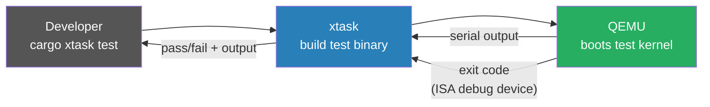

# Testing

## Overview

The kernel is a `no_std` binary targeting a custom x86_64 bare-metal target. It cannot
be tested with `cargo test` directly. All kernel tests run **inside QEMU** via a custom
test harness driven by `xtask`.

---

## How It Works



The flow for every test run:
1. `xtask` compiles a **test kernel binary** (a separate build profile that includes test harness code)
2. `xtask` launches QEMU with the test binary as the disk image
3. The test kernel runs tests, printing results to the serial port
4. On completion, the test kernel writes to the **ISA debug exit device** to terminate QEMU with a pass/fail code
5. `xtask` reads the exit code and serial output, reports results

---

## QEMU Exit Device

QEMU is launched with `-device isa-debug-exit,iobase=0xf4,iosize=0x04`. Writing to
port `0xf4` causes QEMU to exit with code `(value << 1) | 1`.

Convention:

| Write to 0xf4 | QEMU exit code | Meaning |
|---|---|---|
| `0x10` | `0x21` | **Test passed** |
| `0x11` | `0x23` | **Test failed** |

```rust
// kernel/src/testing.rs
use x86_64::instructions::port::Port;

#[derive(Debug, Clone, Copy, PartialEq, Eq)]
#[repr(u32)]
pub enum QemuExitCode {
    Success = 0x10,
    Failure = 0x11,
}

pub fn exit_qemu(exit_code: QemuExitCode) -> ! {
    unsafe {
        let mut port = Port::new(0xf4);
        port.write(exit_code as u32);
    }
    // should not reach here; QEMU exits immediately
    loop {
        x86_64::instructions::hlt();
    }
}
```

---

## Test Harness

The test kernel uses a custom `#[test_runner]` instead of the standard one:

```rust
// kernel/src/main.rs (test build)
#![feature(custom_test_frameworks)]
#![test_runner(crate::testing::test_runner)]
#![rerun_if_changed_env = "CARGO_TEST"]

// kernel/src/testing.rs
pub trait Testable {
    fn run(&self);
}

impl<T: Fn()> Testable for T {
    fn run(&self) {
        serial_print!("{}...\t", core::any::type_name::<T>());
        self();
        serial_println!("[ok]");
    }
}

pub fn test_runner(tests: &[&dyn Testable]) {
    serial_println!("Running {} tests", tests.len());
    for test in tests {
        test.run();
    }
    exit_qemu(QemuExitCode::Success);
}

pub fn test_panic_handler(info: &PanicInfo) -> ! {
    serial_println!("[failed]\n\nError: {}\n", info);
    exit_qemu(QemuExitCode::Failure);
}
```

---

## Writing a Test

Tests live alongside the code they test, in `#[cfg(test)]` blocks or in
`tests/` integration test files (which get their own binary):

```rust
// kernel/src/mm/frame_allocator.rs

#[cfg(test)]
mod tests {
    use super::*;

    #[test_case]
    fn allocate_frame_returns_unique_frames() {
        let mut allocator = /* ... */;
        let f1 = allocator.allocate_frame().unwrap();
        let f2 = allocator.allocate_frame().unwrap();
        assert_ne!(f1, f2);
    }
}
```

---

## Running Tests

```bash
# Run all kernel tests
cargo xtask test

# Run a single test binary (integration test named "heap_allocation")
cargo xtask test --test heap_allocation

# Run with QEMU display visible (useful for debugging test hangs)
cargo xtask test --display
```

---

## Integration Tests

Each file in `kernel/tests/` becomes a **separate test binary** with its own `kernel_main`.
This means each integration test starts from scratch — no state leaks between test files.

```
kernel/
└── tests/
    ├── heap_allocation.rs   # tests the allocator in isolation
    ├── stack_overflow.rs    # verifies double fault handler fires
    └── basic_boot.rs        # sanity: serial works, no panic on boot
```

Each integration test file must define its own entry point and panic handler (which
calls `test_panic_handler` from `testing.rs`).

---

## Debugging a Test Hang

If a test hangs (QEMU doesn't exit), the most common causes:
1. **Deadlock on a spinlock** — check if an interrupt handler tries to acquire a lock already held in the test
2. **Interrupt not enabled** — test relies on an IRQ that was never enabled
3. **Double fault** — IDT not set up in the test binary's `kernel_main`

Run `cargo xtask test --display` to see QEMU's output window and use `-s -S` in
`QEMU_EXTRA_ARGS` to attach GDB:

```bash
# In one terminal:
QEMU_EXTRA_ARGS="-s -S" cargo xtask test --test my_test

# In another terminal:
gdb target/x86_64-m3os/debug/kernel \
    -ex "target remote :1234" \
    -ex "break kernel_main"
```
