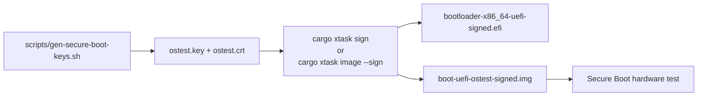

# Secure Boot Signing — Phase 10

## Overview

Phase 10 adds a host-side signing workflow so `ostest` can produce Secure Boot-friendly
artifacts for real UEFI hardware. The implementation has three pieces:

- `scripts/gen-secure-boot-keys.sh` generates a local RSA private key and self-signed
  certificate for personal Secure Boot enrollment.
- `cargo xtask sign <unsigned-efi>` signs any EFI executable with `sbsign` and verifies
  the result with `sbverify`.
- `cargo xtask image --sign` builds the kernel, signs the bootloader EFI, and assembles
  a signed UEFI disk image alongside the normal unsigned image.



---

## One-Time Key Generation

Run the helper from the repository root:

```bash
./scripts/gen-secure-boot-keys.sh
```

By default it writes:

- `./ostest.key` — 4096-bit RSA private key, mode `600`
- `./ostest.crt` — self-signed X.509 certificate, mode `644`

Both files are ignored by git. `cargo xtask sign` and `cargo xtask image --sign` look
for them in the repository root unless `--key` / `--cert` override paths are provided.

The script also accepts an optional output directory for disposable local testing:

```bash
./scripts/gen-secure-boot-keys.sh /tmp/ostest-secure-boot
```

The output directory is created with `umask 077`, so a newly created directory is not
world-readable.

---

## Command Surface

### Sign an arbitrary EFI executable

```bash
cargo xtask sign path/to/unsigned.efi
```

Optional overrides:

```bash
cargo xtask sign path/to/unsigned.efi --key custom.key --cert custom.crt
```

This produces a sibling `*-signed.efi` file, runs:

```bash
sbsign --key <key> --cert <cert> --output <signed.efi> <unsigned.efi>
sbverify --cert <cert> <signed.efi>
```

and prints the signed EFI path plus a MOK enrollment reminder.

### Build a signed boot image

```bash
cargo xtask image --sign
```

This keeps the existing unsigned outputs and additionally creates:

- `target/x86_64-unknown-none/release/boot-uefi-ostest-signed.img`
- `target/x86_64-unknown-none/release/boot-uefi-ostest-signed.vhdx`

The signed image uses a signed copy of the bootloader EFI and the same kernel binary as
the unsigned image.

---

## Why `image --sign` Needs a Custom Pack Step

`bootloader::DiskImageBuilder::create_uefi_image()` always writes its embedded
`efi/boot/bootx64.efi` into the FAT filesystem. That API does not expose a way to swap in
an already-signed bootloader executable.

To bridge that gap, `xtask` does the following for `cargo xtask image --sign`:

1. Build the kernel as usual.
2. Build the normal unsigned disk image.
3. Locate the host-built `bootloader-x86_64-uefi.efi` artifact under xtask's build output.
4. Sign that EFI with `sbsign`.
5. Verify the signed EFI with `sbverify`.
6. Assemble a fresh FAT filesystem containing:
   - `efi/boot/bootx64.efi` → the signed bootloader EFI
   - `kernel-x86_64` → the kernel binary
7. Wrap that FAT filesystem in a GPT disk image and optionally convert it to VHDX.

This keeps the Secure Boot-specific logic entirely on the host side. The kernel binary,
boot protocol, and boot-time runtime behavior remain unchanged.

---

## UEFI Secure Boot Trust Model

UEFI Secure Boot uses a key hierarchy:

- **PK (Platform Key)** — owns the firmware Secure Boot policy
- **KEK (Key Exchange Key)** — authorizes updates to the allowed/forbidden databases
- **db** — allowed signatures and certificates
- **dbx** — revoked signatures and certificates

Firmware checks the first-stage EFI executable against the trusted keys in `db` (and any
revocations in `dbx`). For `ostest`, the relevant requirement is: the certificate used to
sign the bootloader EFI must be trusted by the machine that boots it.

---

## Enrollment Paths

### Path A — shim MOK enrollment

Use this when the target machine already boots Linux through shim and exposes `mokutil`.

```bash
mokutil --import ostest.crt
```

Then reboot, complete the MOKManager enrollment flow, and reboot again.

Important: `mokutil` manages shim's **Machine Owner Key (MOK)** list, not the firmware's
native UEFI `db`. shim validates the next EFI stage against its own MOK trust store after
firmware has already trusted shim itself.

### Path B — direct UEFI `db` enrollment

Use this when you control the firmware Secure Boot configuration directly and want the
firmware to trust the `ostest` certificate without shim.

Typical flow:

1. Put the machine into Secure Boot setup mode.
2. Enroll your own PK / KEK / db certificates using firmware setup or `efi-updatevar`.
3. Boot the signed `ostest` image with Secure Boot enabled.

This gives more direct control, but it also replaces or augments the OEM trust chain and
may affect other operating systems on the same machine.

---

## Shim vs Distribution Secure Boot

shim is a small Microsoft-signed first-stage loader used by Linux distributions. Because
firmware already trusts Microsoft's UEFI CA, shim can start under Secure Boot and then use
its own trust store (the MOK list) to validate GRUB or another EFI payload.

That is different from the personal `ostest` workflow here:

- **Personal enrollment** — you generate your own key and enroll it on machines you control.
- **Distribution workflow** — a vendor ships a Microsoft-signed shim and maintains its own
  downstream signing chain for public distribution.

For this project, personal enrollment is sufficient; Microsoft CA submission and shim
distribution are intentionally out of scope.

---

## Verifying Secure Boot State on Hardware

After enrolling the certificate and booting a signed image on a Linux-capable target, the
most useful checks are:

```bash
mokutil --sb-state
dmesg | grep -i secure
```

Those commands confirm whether Secure Boot is active and help distinguish a genuinely
trusted boot from a fallback boot with Secure Boot disabled.

---

## Local Validation Completed

The following local checks were run during Phase 10 implementation:

```bash
cargo test -p xtask --target x86_64-unknown-linux-gnu
cargo xtask check
cargo xtask image --sign --key <tmp>/ostest.key --cert <tmp>/ostest.crt
sbverify --cert <tmp>/ostest.crt <signed-bootloader-efi>
sbverify --cert <tmp>/ostest.crt <unsigned-bootloader-efi>   # expected failure
```

Observed results:

- unit tests passed for the `xtask` argument parsing and bootloader artifact lookup
- `cargo xtask image --sign` produced a signed EFI plus signed `.img` / `.vhdx`
- `sbverify` succeeded for the signed EFI
- `sbverify` failed for the unsigned EFI, confirming that the signature check is meaningful

---

## Remaining Manual Validation

Phase 10 still has two hardware-only steps that cannot be completed inside this local
development environment:

- boot the signed image on a real Secure Boot-enabled machine after certificate enrollment
- confirm the machine rejects the unsigned (or no-longer-trusted) image when Secure Boot is enforcing

Until those checks are run on real hardware, the roadmap should treat Phase 10 as
implemented locally but not fully validated end-to-end.
