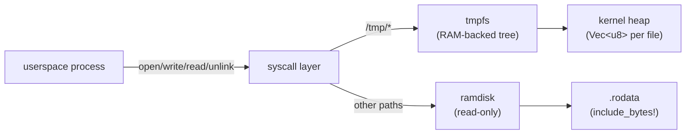

# Phase 13 — Writable Filesystem

## Overview

Phase 13 adds a writable in-memory filesystem (tmpfs) mounted at `/tmp`
and extends the Linux syscall ABI with file-mutation operations.  Userspace
C programs compiled with musl can now create, write, read, and delete files
using standard POSIX calls.

## Architecture



### Path routing

The syscall layer inspects the path prefix to select the backend:

| Path prefix | Backend | Permissions |
|---|---|---|
| `/tmp/` | tmpfs | read-write |
| everything else | ramdisk | read-only |

This routing happens directly in the syscall handlers (`sys_linux_open`,
`sys_linux_fstatat`, etc.) rather than through the IPC-based VFS server.
The IPC VFS path (Phase 8 `vfs_server` / `fat_server`) still works for
kernel tasks; the syscall path is for userspace processes.

## tmpfs Design

### Data structure

```
Tmpfs
  root: TmpfsNode::Dir
          children: BTreeMap<String, TmpfsNode>

TmpfsNode
  ├── File { content: Vec<u8> }
  └── Dir  { children: BTreeMap<String, TmpfsNode> }
```

Each file's data lives in a `Vec<u8>` on the kernel heap.  Directory
entries are stored in a `BTreeMap` keyed by name.  The entire tree is
protected by a single `spin::Mutex<Tmpfs>`.

### Operations

| Operation | Description |
|---|---|
| `create_file(path)` | Create empty file; parent dirs must exist |
| `write_file(path, offset, data)` | Write bytes at offset; extends file if needed |
| `read_file(path, offset, max)` | Read up to `max` bytes from offset |
| `unlink(path)` | Delete a file |
| `mkdir(path)` | Create empty directory |
| `rmdir(path)` | Remove empty directory |
| `rename(old, new)` | Move/rename within tmpfs |
| `truncate(path, size)` | Resize file (zero-fill if growing) |
| `stat(path)` | Return is_dir + size |
| `open_or_create(path, create)` | Open existing or create new file |

### Global instance

```rust
pub static TMPFS: Mutex<Tmpfs> = Mutex::new(Tmpfs::new());
```

Single global instance — no per-mount-point instances yet.

## FD Table Refactoring

The Phase 12 `FdEntry` stored a raw pointer into the ramdisk.  Phase 13
introduces `FdBackend` to support both ramdisk and tmpfs:

```rust
enum FdBackend {
    Ramdisk { content_addr: usize, content_len: usize },
    Tmpfs { path: String },
}

struct FdEntry {
    backend: FdBackend,
    offset: usize,
    readable: bool,
    writable: bool,
}
```

- Ramdisk FDs are read-only (`readable: true, writable: false`).
- Tmpfs FDs derive `readable`/`writable` from open flags (`O_RDONLY`,
  `O_WRONLY`, `O_RDWR`).  `read()` on a write-only fd returns `-EBADF`.
- Tmpfs FDs store the relative path and re-lock `TMPFS` on each read/write.
  As a consequence, if a tmpfs file is `rename`d or `unlink`ed, any existing
  FDs to that file will fail future I/O because they re-resolve the (now
  invalid) path; this diverges from POSIX semantics, where open FDs survive
  `rename`/`unlink`.
- The FD table is still global (not per-process); this is acceptable for
  the single-user model.

## New Syscalls

| Linux # | Name | Behaviour |
|---|---|---|
| 74 | `fsync` | No-op (tmpfs has no persistence) |
| 76 | `truncate` | Resize file by path |
| 77 | `ftruncate` | Resize file by fd |
| 82 | `rename` | Move/rename within tmpfs |
| 83 | `mkdir` | Create directory in tmpfs |
| 84 | `rmdir` | Remove empty directory in tmpfs |
| 87 | `unlink` | Delete file in tmpfs |

### Extended open() flags

`sys_linux_open` now supports:
- `O_CREAT` (0o100) — create file if it doesn't exist
- `O_TRUNC` (0o1000) — truncate to zero on open
- `O_APPEND` (0o2000) — start offset at end of file
- `O_WRONLY` (0o1) / `O_RDWR` (0o2) — mark fd as writable

### Extended write()

`sys_linux_write` now handles file FDs (not just stdout/stderr).  Writes
go in 4 KiB chunks to avoid large stack buffers.  The fd's offset advances
after each write.

## Validation

The `tmpfs-test.elf` binary (musl-linked C) runs at boot and exercises:

1. **Write-read roundtrip**: create `/tmp/test.txt`, write "Hello from tmpfs!",
   close, reopen, read back, verify contents match.
2. **mkdir + rmdir**: create and remove `/tmp/testdir`.
3. **unlink**: create file, delete it, verify open fails.
4. **ftruncate**: write 10 bytes, truncate to 5, verify.
5. **Sequential write**: two consecutive writes produce contiguous data.

All 5 tests pass in QEMU.

## What fsync Means (and Why tmpfs Ignores It)

`fsync(fd)` asks the kernel to flush dirty pages from the page cache to
the underlying storage device and wait for the write to complete.  On a
disk-backed filesystem this is essential for crash safety — without it, a
power loss could lose recently-written data.

tmpfs has no underlying device: all data lives in RAM and is gone on
reboot regardless.  So `fsync` is correctly a no-op.

## Crash-Safety Gap

tmpfs data is lost on any reboot or crash.  This is by design for a
scratch filesystem.  A future phase adding FAT32 write support will face
the real crash-safety problem: a power loss during a FAT table update can
leave the filesystem in an inconsistent state.  Production systems solve
this with journaling (ext4) or copy-on-write (btrfs, ZFS).

## How Real OS Implementations Differ

Production tmpfs (Linux, FreeBSD) uses the page cache: file data lives in
`struct page` entries that can be reclaimed under memory pressure and
written to swap.  Our tmpfs uses simple `Vec<u8>` heap allocations with no
reclaim.  This is fine for a toy OS where tmpfs holds only test files.

Real VFS layers use a mount table with per-superblock dispatch, dentry
caching, and inode abstraction.  Our path routing is a simple prefix check
in the syscall handler.  This works because we have exactly two backends.

## Deferred

- FAT32 write path (needs a block device driver)
- Page cache and write-back buffering
- Per-process FD tables with fork inheritance
- File permissions and ownership
- Hard/symbolic links
- File-backed mmap
