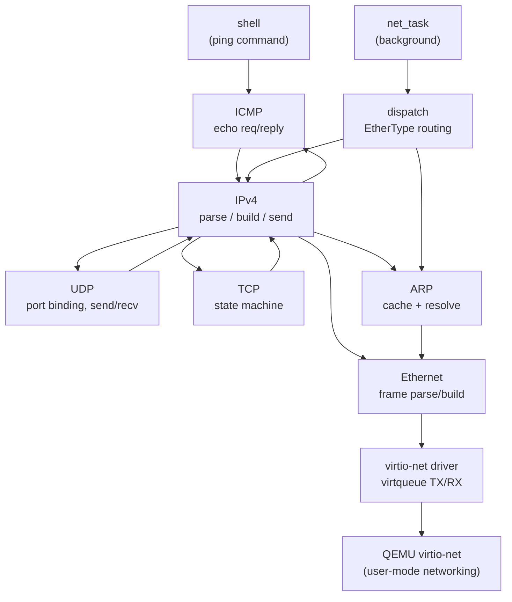
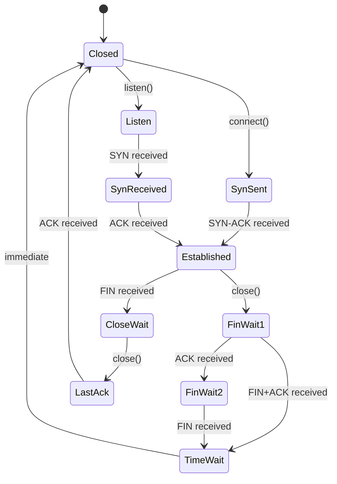

# Phase 16 - Network Stack

## What It Does

Phase 16 adds a minimal TCP/IP network stack over a virtio-net NIC. The OS can
now send and receive Ethernet frames, resolve IP addresses via ARP, respond to
and initiate ICMP pings, and handle UDP datagrams and TCP connections.

## Architecture

## Layer Details

### virtio-net Driver (`net/virtio_net.rs`)

Uses the legacy (0.9.5) virtio register layout via PCI BAR0 I/O ports:

- **Device discovery**: Finds vendor 0x1AF4, device 0x1000 (legacy/transitional) on the PCI bus
- **Reset and feature negotiation**: Supports MAC and STATUS features
- **Virtqueues**: Two queues (RX index 0, TX index 1), size read from device (up to 256 entries)
  - Descriptor table: 16 bytes per entry (addr, len, flags, next)
  - Available ring: producer (driver) posts buffer indices
  - Used ring: consumer (device) reports completed buffers
- **Buffers**: Pre-allocated 1524-byte buffers (MTU 1514 + 10-byte legacy virtio-net header)
- **IRQ**: Routed through I/O APIC, handler sets a flag for polling

### Ethernet (`net/ethernet.rs`)

14-byte header: 6-byte destination MAC, 6-byte source MAC, 2-byte EtherType.
EtherType dispatch routes 0x0806 to ARP and 0x0800 to IPv4.

### ARP (`net/arp.rs`)

- 28-byte ARP packets for Ethernet/IPv4 (hardware type 1, protocol 0x0800)
- 16-entry cache with LRU eviction based on tick count
- Request path: broadcasts ARP request on cache miss
- Reply handler: updates cache on incoming replies
- Responder: answers ARP requests for our IP (10.0.2.15)

### IPv4 (`net/ipv4.rs`)

- 20-byte header (no options), TTL=64, DF flag set
- RFC 1071 ones' complement checksum
- Routing: local subnet check against /24 mask, gateway for off-subnet
- Protocol dispatch: 1=ICMP, 17=UDP, 6=TCP

### ICMP (`net/icmp.rs`)

- Echo reply: responds to type 8 with type 0, same identifier/sequence/data
- Ping function: sends echo request, tracks reply via atomic flags

### UDP (`net/udp.rs`)

- 8-byte header, checksum set to 0 (optional for IPv4)
- Port binding table: 16 bindings, 32-deep receive queue each
- Non-blocking recv API

### TCP (`net/tcp.rs`)

Full state machine with 10 states:

- 4 concurrent connection slots
- Pseudo-header checksum (RFC 793)
- Simple flow control: honors receiver's advertised window
- No retransmission timer (simplified for this phase)
- Sends RST for unmatched incoming segments

## Network Configuration

Static configuration matching QEMU user-mode networking defaults:

| Parameter | Value |
|---|---|
| IP address | 10.0.2.15 |
| Subnet mask | 255.255.255.0 (/24) |
| Default gateway | 10.0.2.2 |

## Shell Integration

- `ping <ip>` sends 4 ICMP echo requests with RTT measurement
- Network processing runs as a background kernel task (`net_task`)

## QEMU Setup

The xtask build system adds `-device virtio-net-pci,netdev=net0 -netdev user,id=net0`
to the QEMU command line, providing a virtio-net NIC with user-mode networking.

## How Real Implementations Differ

Production network stacks are typically 50,000-200,000 lines of code and include:

- **TCP**: retransmission timers, SACK, congestion control (CUBIC, BBR), Nagle's
  algorithm, delayed ACKs, window scaling, timestamps
- **Zero-copy**: scatter-gather DMA, page flipping, sendfile()
- **Offload**: checksum offload, TSO/GSO, RSS
- **Protocols**: IPv6, DNS, DHCP, TLS, VLAN
- **Multiplexing**: epoll/kqueue for thousands of concurrent connections
- **Userspace stacks**: DPDK, io_uring for bypassing kernel overhead

This implementation is intentionally minimal — up to 4 concurrent TCP connections
with no retransmission, no congestion control, and static IP — but demonstrates
every layer of the network model from NIC driver to transport protocol.

## Deferred Items

- Socket syscalls (`sys_socket`, `sys_bind`, etc.) — requires IPC plumbing to
  a userspace net_server
- `nc`-like utility for TCP testing
- TCP retransmission and congestion control
- Multiple simultaneous TCP connections beyond 4
- IPv6, DNS, DHCP, TLS
- Non-blocking socket I/O (epoll/select/poll)
