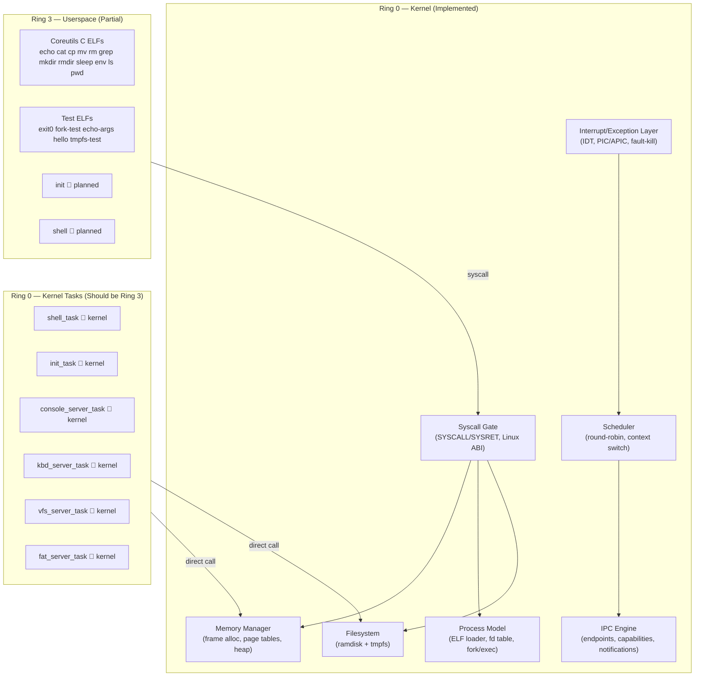
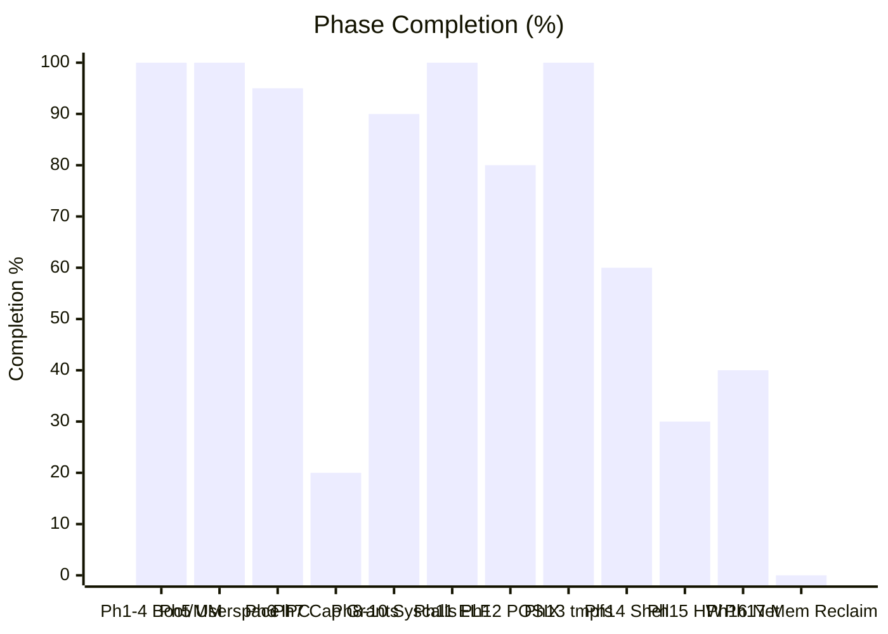
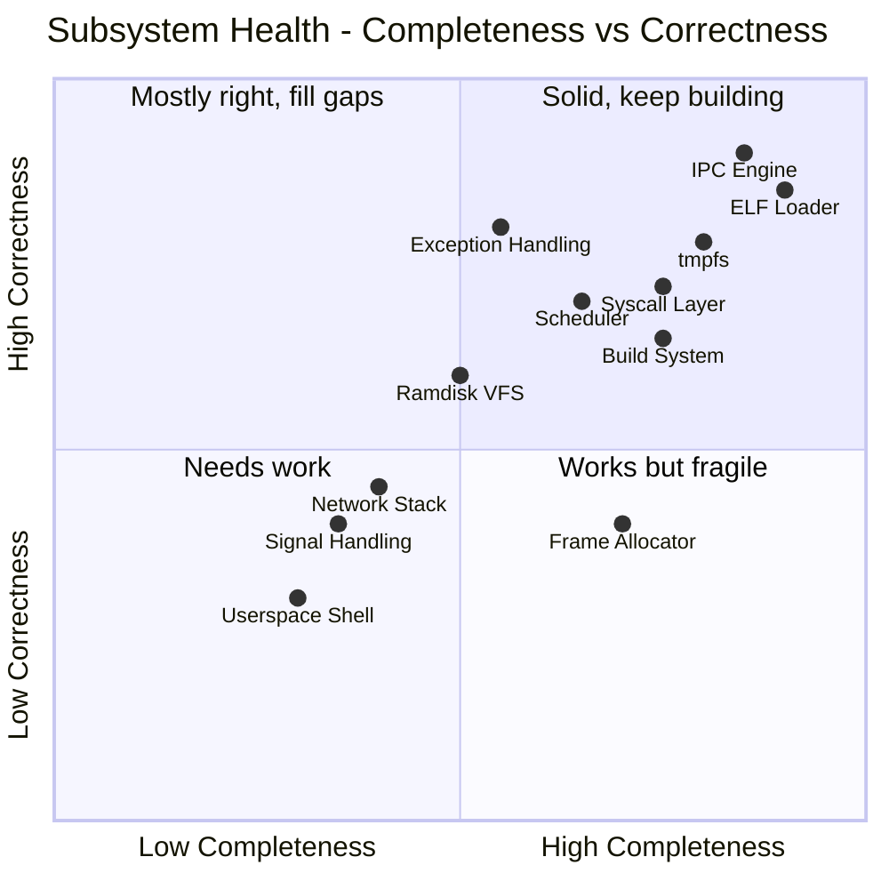
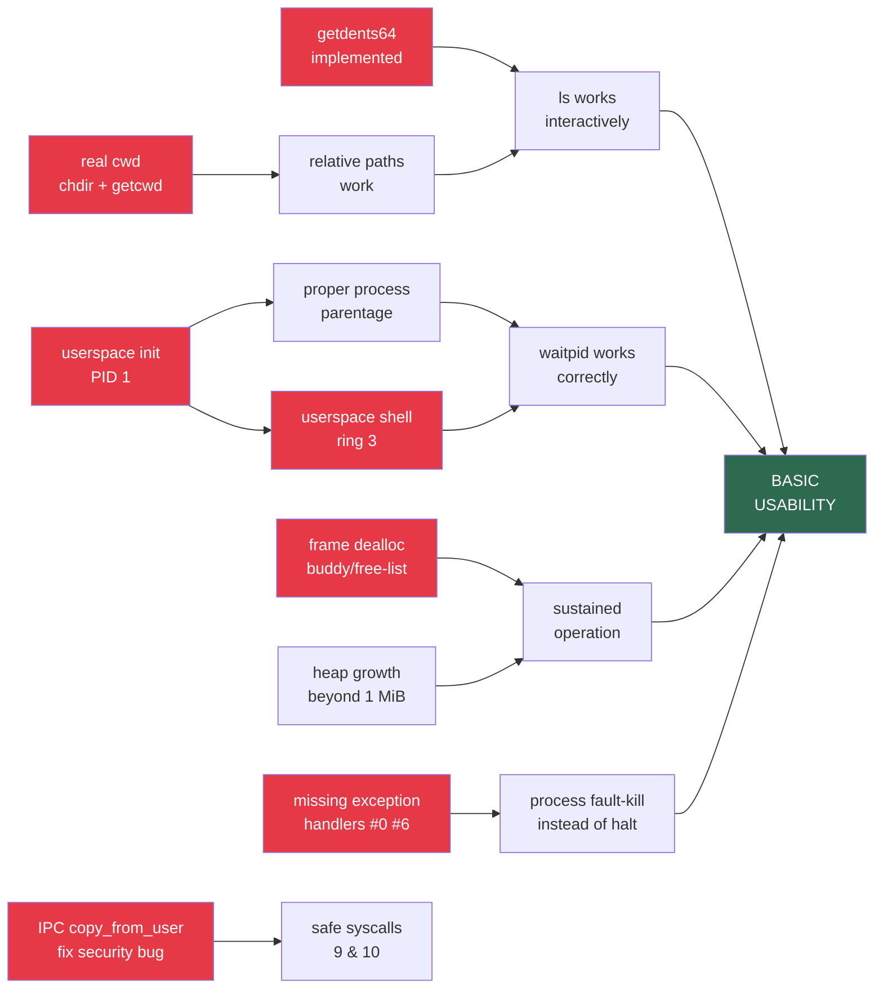
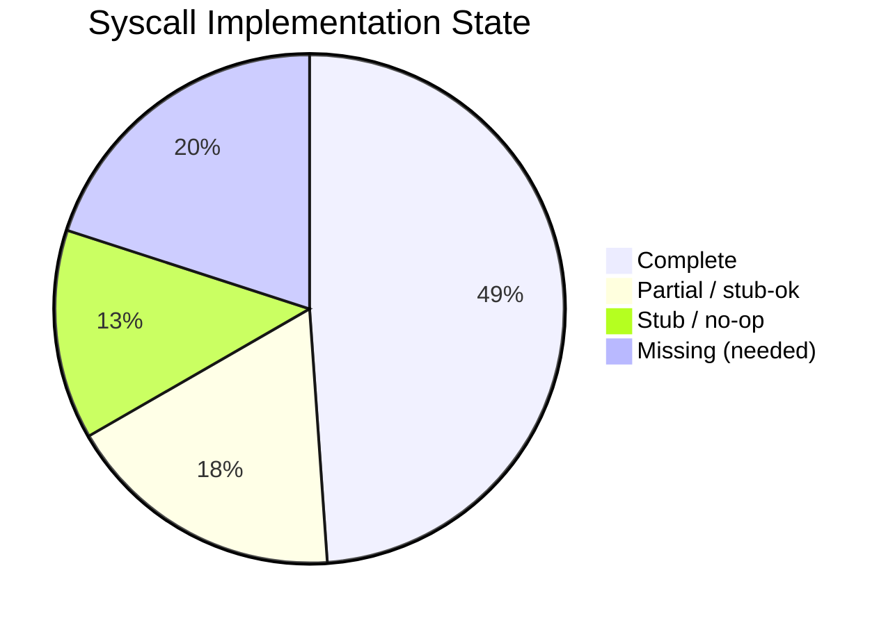
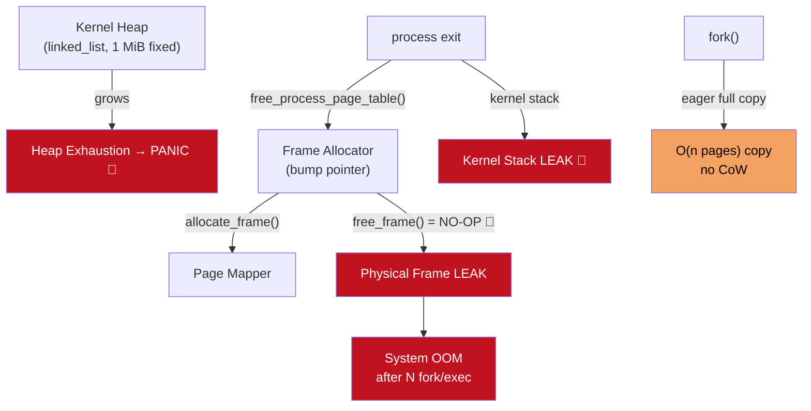
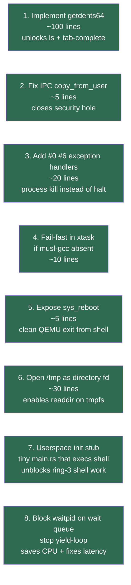
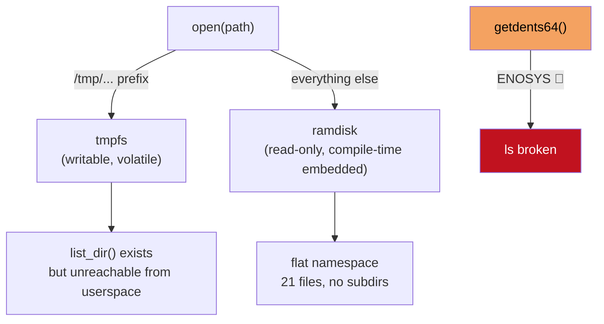
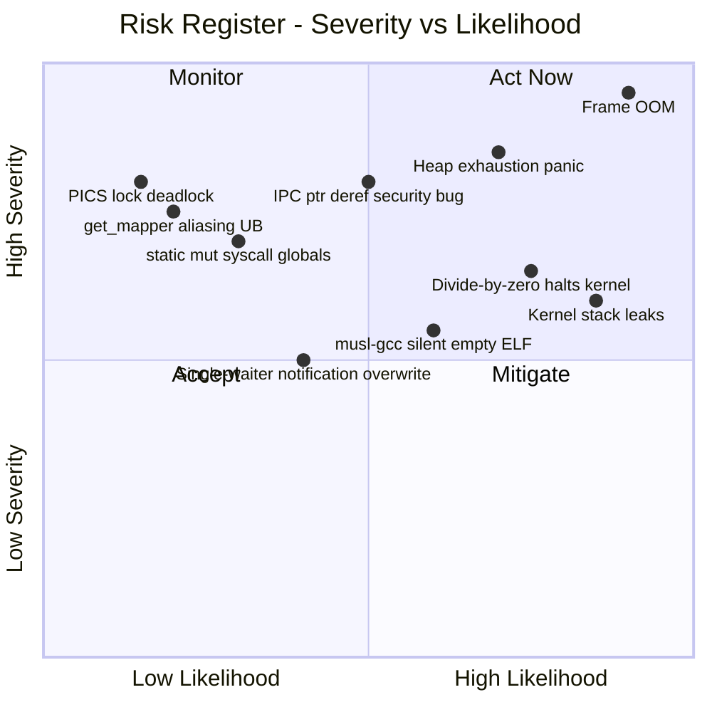

# m³OS State Analysis — March 2026

> **Multi-model analysis synthesised from:** Claude Opus 4.6 (kernel subsystems),
> GPT-5.4 (userspace & build system), Gemini 3 Pro (architecture & roadmap).

---

## Executive Summary

m³OS has a **solid kernel foundation** — real page tables, per-process address spaces, a
working ELF loader, fork/exec/wait, a functioning syscall layer, and a partial POSIX
compatibility shim sufficient to run static musl-linked C binaries. The IPC engine
(seL4-style synchronous rendezvous + notification objects) is the most architecturally
complete subsystem.

What the OS **cannot yet do** for basic interactive use:

- List files in a directory (`getdents64` returns `ENOSYS`)
- Run a real userspace shell (the shell is a ring-0 kernel task)
- Sustain operation past ~20 fork/exec cycles (physical frames are never freed)
- Navigate a real directory tree (`chdir`/`getcwd` are stubs)

The gap between "impressive demo" and "basic usability" is small in scope but
significant in depth: a handful of targeted fixes would unlock genuinely interactive use.

---

## 1. Architecture Overview



**Architecture compliance verdict:** The IPC mechanism faithfully implements a
seL4-style microkernel. However, all servers (`console`, `kbd`, `vfs`, `fat`) and the
interactive shell still run as **Ring 0 kernel tasks**, sharing the kernel address space.
This is a known transitional state (Phase 14), not a design violation.

---

## 2. Roadmap Phase Status



| Phase | Area | Done | Missing |
|-------|------|------|---------|
| 1–4 | Boot, MM, IDT, GDT | ✅ 100% | — |
| 5 | Userspace entry, ring-3 trampoline | ✅ 100% | — |
| 6 | IPC (endpoints, notifications, caps) | ✅ 95% | Capability grants via IPC |
| 7 | Capability grants | 🔶 20% | `sys_cap_grant` not exposed |
| 8–10 | Fork, exec, wait, signals (basic) | ✅ 90% | `clone`, user signal handlers |
| 11 | ELF loader, process model, fd table | ✅ 100% | — |
| 12 | POSIX compat layer | 🔶 80% | `getdents64`, `mprotect`, `poll`, real cwd |
| 13 | Writable tmpfs | ✅ 100% | — |
| 14 | Shell & coreutils | 🔶 60% | Userspace shell, `init`, working `ls` |
| 15 | HW discovery (ACPI, PCI) | 🔶 30% | Dynamic device tree, hotplug |
| 16 | Network (virtio-net, TCP/UDP) | 🔶 40% | Socket syscalls for userspace |
| 17 | SMP | ❌ 0% | AP startup, per-CPU queues, IPIs |
| 18 | TTY/PTY | ❌ 0% | Line discipline, PTY allocation |
| 19 | Persistent storage | ❌ 0% | ATA/AHCI, FAT32/ext2 driver |

---

## 3. Subsystem Health Matrix



---

## 4. Critical Gaps — Path to Basic Usability

These are the gaps that directly block interactive use. Fixing them in order unlocks
the most functionality per unit of effort.



### Priority-ordered gap list

| # | Gap | Impact | Effort | Blocks |
|---|-----|--------|--------|--------|
| 1 | `getdents64` returns `ENOSYS` | 🔴 Critical | Low | `ls`, shell tab-complete, any dir listing |
| 2 | Frame allocator never frees | 🔴 Critical | High | System OOM after ~20 fork/exec cycles |
| 3 | No userspace shell | 🔴 Critical | High | True ring-3 interactive use |
| 4 | No userspace `init` (PID 1) | 🔴 Critical | Medium | Proper process tree, orphan reaping |
| 5 | `chdir`/`getcwd` are stubs | 🔴 High | Medium | All relative-path navigation broken |
| 6 | Kernel heap fixed at 1 MiB | 🔴 High | Medium | Panics under heavy tmpfs/process load |
| 7 | Missing exception handlers (#0 divide, #6 invalid opcode) | 🟠 High | Low | Process fault → kernel halt not kill |
| 8 | IPC registry skips `copy_from_user` | 🟠 High | Low | Security: userspace can read kernel mem |
| 9 | Yield-loop blocking (stdin/waitpid/nanosleep) | 🟠 Medium | Medium | CPU burns 100% waiting on I/O |
| 10 | `static mut` syscall globals | 🟡 Medium | Medium | NMI/nested interrupt corruption risk |
| 11 | `ls` uses `getdents64` + `O_DIRECTORY` both broken | 🟠 Medium | Low (fix with #1 + dir open) | Entire directory browsing UX |
| 12 | No `mprotect` (syscall 10) | 🟡 Medium | Low | Some musl-linked programs crash on startup |
| 13 | Kernel stacks never freed on process exit | 🟡 Medium | Medium | Memory leak per process death |
| 14 | No `poll`/`select`/`epoll` | 🟡 Medium | High | Multiplexed I/O (shells, daemons) |
| 15 | xtask silently creates empty ELFs if musl-gcc absent | 🟡 Medium | Low | Silent runtime failures at boot |
| 16 | No signal trampolines / `sigreturn` | 🟡 Medium | High | No user signal handlers at all |
| 17 | No `clone` (threads) | 🟡 Low | High | Threaded programs impossible |
| 18 | No socket syscalls | 🟡 Low | High | Network unreachable from userspace |
| 19 | No persistent block device | 🟡 Low | Very High | All data lost on reboot |

---

## 5. Syscall Coverage Map



### Key syscalls by status

| Status | Syscalls |
|--------|----------|
| ✅ Complete | `read` `write` `open` `close` `fstat` `lseek` `mmap(anon)` `brk` `pipe` `dup2` `fork` `execve` `exit` `exit_group` `wait4` `kill` `getpid` `getppid` `uname` `arch_prctl(FS)` `openat` `newfstatat` `mkdir` `rmdir` `unlink` `rename` `truncate` `ftruncate` `nanosleep` `setpgid` `getpgid` `readv` `writev` |
| 🔶 Partial | `mmap` (anon only, no file-backed) `fstat` (partial fields) `rt_sigaction` (no user handlers) `ioctl` (TIOCGWINSZ only) `mprotect` (missing) |
| ⚠️ Stub | `munmap` (no-op) `getcwd` (always `/`) `chdir` (always ok) `rt_sigprocmask` `fsync` `set_tid_address` |
| ❌ Missing | `getdents64` `mprotect` `clone` `poll` `select` `epoll_*` `socket`/`bind`/`connect` `sigreturn` `fcntl` `access` |

---

## 6. Memory Subsystem Risk Map



---

## 7. Quick Wins (High Leverage, Low Effort)

These items can be shipped quickly and each unlock meaningful functionality:



---

## 8. Detailed Findings by Subsystem

### 8.1 Memory Management (`kernel/src/mm/`)

**Status: Partial — functional but not sustainable**

| Component | Status | Notes |
|-----------|--------|-------|
| Frame allocator | ⚠️ Partial | Bump allocator; `free_frame()` is a no-op — all freed frames are lost |
| Page table manager | ✅ Working | `OffsetPageTable` via x86_64 crate; per-process PML4 clone |
| Kernel heap | ⚠️ Fragile | Fixed 1 MiB at `0xFFFF_8000_0000_0000`; no growth |
| User memory copy | ✅ Safe | `copy_from_user`/`copy_to_user` with canonical/present/user checks; 64 KiB cap |
| ELF loader | ✅ Complete | ET_EXEC + PIE; BSS zero; SysV ABI stack (argc/argv/envp/auxv); stack guard |
| Per-process page tables | ✅ Working | Deep-copy, correct kernel upper-half sharing, `mapper_for_frame` |
| CoW fork | ❌ Missing | Eager full-copy; expensive for large address spaces |

**Key risks:**
- `get_mapper()` creates `&'static mut PageTable` — aliasing UB if two callers exist simultaneously
- `mmap` returns old break on alloc failure instead of `ENOMEM` — silent failure

---

### 8.2 Scheduler (`kernel/src/task/`)

**Status: Functional for demos; not production-ready**

| Component | Status | Notes |
|-----------|--------|-------|
| Round-robin scheduler | ✅ Working | RESCHEDULE atomic; wakeup-safe disable+hlt |
| Context switch | ✅ Correct | Callee-saved regs + RFLAGS; cli during stack swap |
| Task states | ✅ Complete | Ready/Running/BlockedOn{Recv,Send,Reply,Notif}/Dead |
| Blocking primitives | ✅ Correct | Lock dropped before `switch_context` |
| Priority scheduling | ❌ Missing | Pure round-robin; CPU-bound tasks starve others |
| Timed blocking | ❌ Missing | `nanosleep` / `waitpid` / stdin `read` all yield-loop |
| Kernel stack reclaim | 🔴 Leak | `alloc_kernel_stack()` never frees; each dead process leaks |
| `CURRENT_PID` restore | ⚠️ Fragile | 6 call sites must manually restore PID after `yield_now` |

---

### 8.3 IPC (`kernel/src/ipc/`)

**Status: Most complete subsystem**

| Component | Status | Notes |
|-----------|--------|-------|
| Endpoints (sync rendezvous) | ✅ Complete | send/recv/call/reply/reply_recv; FIFO queues |
| Capabilities | ✅ Complete | 64-slot per-task table; one-shot reply caps |
| Notifications | ✅ Complete | Lock-free AtomicU64; ISR-safe; double-check TOCTOU fix |
| Service registry | ⚠️ Bug | `ipc_register/lookup_service` dereference userspace ptr without `copy_from_user` |
| Capability grants | ❌ Missing | Cannot transfer caps between processes via IPC |
| IPC timeouts | ❌ Missing | Blocked `recv` waits forever |
| Bulk page transfers | ❌ Missing | Required for VFS bulk data; not yet implemented |

---

### 8.4 Interrupt & Exception Handling (`kernel/src/arch/x86_64/`)

**Status: Essentials covered; gaps cause kernel halts**

| Vector | Handler | Status |
|--------|---------|--------|
| #0 Divide-by-zero | ❌ | Unhandled → double fault → halt |
| #3 Breakpoint | ✅ | Logs and continues |
| #6 Invalid Opcode | ❌ | Unhandled → double fault → halt |
| #8 Double Fault | ✅ | IST0 handler; prints and halts |
| #13 GP Fault | ✅ | Ring-3: fault-kill trampoline; Ring-0: halt |
| #14 Page Fault | ✅ | Ring-3: fault-kill trampoline; Ring-0: halt |
| #32 Timer (PIT/LAPIC) | ✅ | Scheduler tick |
| #33 Keyboard (PS/2) | ✅ | Scancode ring buffer → stdin |
| #34 virtio-net | ✅ | Packet receive trigger |
| NMI #2 | ❌ | Unhandled → double fault |

**Fault-kill trampoline design** is elegant: ring-3 faults redirect IRET to a kernel
trampoline that runs in task context (safe to lock/context-switch), marks the process
Zombie, and delivers SIGSEGV.

---

### 8.5 Userspace & Shell

**Status: Kernel-resident shell with real ELF execution**

| Feature | Status | Notes |
|---------|--------|-------|
| External ELF execution | ✅ Working | Flat ramdisk lookup + execve |
| 2-stage pipes | ✅ Working | Hardcoded 2-process pipeline |
| Output redirection (`>`, `>>`) | ✅ Partial | `/tmp` only |
| Background jobs (`&`) | ✅ Partial | Last job only for fg/bg |
| `Ctrl-C` / `Ctrl-Z` | ✅ Working | SIGINT/SIGTSTP via stdin feeder |
| Shell builtins | ⚠️ Partial | `cd` cosmetic; `exit` yields forever |
| N-stage pipes | ❌ Missing | Max 2 |
| Stderr redirect | ❌ Missing | No `2>`, `2>&1` |
| Command history | ❌ Missing | — |
| `<` from `/tmp` | ❌ Broken | Input redirection uses ramdisk path only |
| Userspace shell | ❌ Missing | Shell is a ring-0 kernel task |
| Userspace init | ❌ Missing | All services spawn in ring-0 |

---

### 8.6 Filesystem

**Status: Read-only ramdisk + writable tmpfs; no directory enumeration**



| Feature | ramdisk | tmpfs |
|---------|---------|-------|
| read files | ✅ | ✅ |
| write files | ❌ | ✅ |
| create files | ❌ | ✅ |
| delete files | ❌ | ✅ |
| mkdir / rmdir | ❌ | ✅ |
| rename | ❌ | ✅ |
| directory listing | ❌ | ⚠️ (internal only) |
| `getdents64` | ❌ | ❌ (ENOSYS) |
| persistence | ❌ | ❌ |
| max file size | n/a | 16 MiB |

---

### 8.7 Build System (`xtask/`)

**Status: Solid pipeline; one critical silent failure mode**

| Feature | Status | Notes |
|---------|--------|-------|
| Kernel build (`cargo xtask image`) | ✅ | `x86_64-unknown-none` target |
| UEFI disk image | ✅ | bootloader crate |
| VHDX image | ✅ | Optional `qemu-img convert` |
| QEMU launch (headless + SDL) | ✅ | OVMF firmware |
| Rust userspace ELFs | ✅ | `x86_64-unknown-none` |
| C userspace ELFs (musl) | ⚠️ | Silent empty ELF if `musl-gcc` absent |
| Clippy / fmt check | ✅ | `cargo xtask check` |
| Test runner | ⚠️ | Planned; not yet functional |

---

## 9. Risk Register



---

## 10. Recommended Implementation Order

```mermaid
flowchart TD
    T1["T1: Implement getdents64<br/>+ directory fd open<br/>Unblocks: ls, shell completions"]
    T2["T2: Fix IPC copy_from_user<br/>Closes security hole<br/>syscalls 9 + 10"]
    T3["T3: Add #0 #6 exception handlers<br/>Process kill not kernel halt"]
    T4["T4: Fail-fast xtask<br/>if musl-gcc absent"]
    T5["T5: Real chdir/getcwd<br/>per-process cwd string<br/>Unblocks: relative paths"]
    T6["T6: Heap growth<br/>grow beyond 1 MiB on demand"]
    T7["T7: Block waitpid properly<br/>wait queue on zombie state<br/>stops yield-loop"]
    T8["T8: Userspace init (PID 1)<br/>tiny Rust binary<br/>spawns shell via execve"]
    T9["T9: Userspace shell<br/>ring-3 sh in Rust or C"]
    T10["T10: Frame allocator free<br/>buddy allocator or free-list<br/>Fixes OOM"]
    T11["T11: Signal trampolines<br/>sigreturn + user handlers"]
    T12["T12: CoW fork<br/>replace eager copy"]
    T13["T13: socket syscalls<br/>wire virtio-net to userspace"]

    T1 --> T5
    T2 --> T8
    T3 --> T8
    T4 --> T8
    T5 --> T8
    T6 --> T10
    T7 --> T8
    T8 --> T9
    T9 --> T11
    T10 --> T12
    T11 --> T13

    style T1 fill:#2d6a4f,color:#fff
    style T2 fill:#2d6a4f,color:#fff
    style T3 fill:#2d6a4f,color:#fff
    style T4 fill:#2d6a4f,color:#fff
    style T7 fill:#2d6a4f,color:#fff
    style T8 fill:#457b9d,color:#fff
    style T9 fill:#457b9d,color:#fff
    style T10 fill:#e63946,color:#fff
