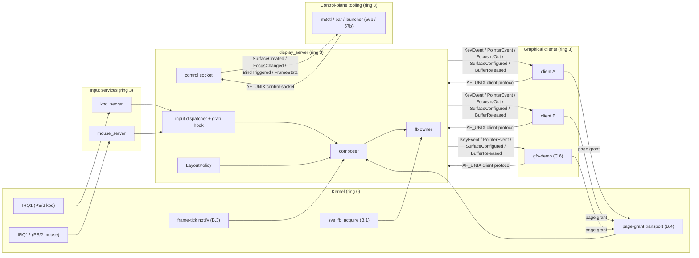

# Display and Input Architecture

**Aligned Roadmap Phase:** Phase 56
**Status:** Planned
**Source Ref:** phase-56

## Overview

Phase 56 is the phase where m3OS stops being a single-app graphical proof (Phase 47 DOOM) and becomes a real graphical architecture. One userspace service, `display_server`, owns presentation and composition. Keyboard and mouse events are mediated by userspace services (`kbd_server`, `mouse_server`) that publish a documented, focus-aware input protocol. Clients submit surfaces through a m3OS-native client protocol built on existing IPC primitives — AF_UNIX stream sockets for control messages and Phase 50 page grants for pixel data. A first-class control socket exposes the compositor's state and a keybind grab hook to future tooling without rebuilding the client protocol. Crash and fallback behavior are explicit. Tiling layouts, workspace state machines, animations, and native bar/launcher/lockscreen clients all live on top of the Phase 56 substrate in later phases (56b / 57b / 57c); Phase 56 does not ship them.

## What This Doc Covers

- Service topology and capability ownership (A.2)
- Client protocol wire format (A.3)
- Input event protocol + modifier / keymap model (A.4)
- Keybind grab hook (Goal-A decision 2, A.5)
- Surface roles including the layer-shell equivalent (Goal-A decision 3, A.6)
- Swappable layout module contract (Goal-A decision 1, A.7)
- Control socket protocol (Goal-A decision 4, A.8)
- Session integration, supervision, and recovery (Track F; summarized)
- Manual smoke validation (G.7)
- Protocol-reference demo (`gfx-demo`, C.6)
- Resource-bound defaults and accepted Phase 56 limitations

Cross-references: [`docs/appendix/gui/tiling-compositor-path.md`](./appendix/gui/tiling-compositor-path.md) for the Goal-A staging plan (what comes on top of Phase 56) and [`docs/appendix/gui/wayland-gap-analysis.md`](./appendix/gui/wayland-gap-analysis.md) for the non-Wayland framing and the three Wayland-direction paths.

## Service topology

Phase 56 introduces one new userspace service (`display_server`) and one new input service (`mouse_server`), and redefines the existing `kbd_server` to publish typed key events rather than raw scancodes to the graphical stack. Every graphical policy — which surface owns focus, how input routes, which pixels composite where, when a client disconnects — lives in userspace. The kernel retains only hardware-access mechanism: the framebuffer page grant, the IRQ notification channels, the periodic frame tick, and the PS/2 input rings.

### Processes and their single responsibility

| Service | Responsibility | Ring | Supervised by |
|---|---|---|---|
| `display_server` | Sole userspace owner of the primary framebuffer. Arbiter of surface composition, focus, and layer ordering. Owns the client listening socket, the control socket, and the grab-hook bind table. | 3 | `init` (Track F.1) |
| `kbd_server` | Sole source of keyboard events. Maintains modifier latch/lock state. Publishes typed `KeyEvent` messages to `display_server` on a dedicated endpoint; legacy text-mode consumers keep the scancode path alongside or via a TTY shim. | 3 | `init` |
| `mouse_server` | Sole source of pointer events. Drains the kernel PS/2 AUX ring, decodes motion / buttons / wheel deltas, publishes `PointerEvent` messages to `display_server`'s input endpoint. | 3 | `init` |

Baseline the shape: any later policy work (tiling layout engine, workspace state machine, chord engine) lands in or alongside `display_server`, not in the kernel and not in the input services. Any later hardware-path work (USB HID, touchpad, tablet) lands in new ring-3 driver processes feeding the same `mouse_server` / `kbd_server` endpoint shape or via a Phase 55b `driver_runtime`-style host.

### Capabilities each service holds

| Service | Capabilities at steady state |
|---|---|
| `display_server` | (a) framebuffer page grant from the B.1 `sys_fb_acquire` syscall — exclusive; (b) periodic vblank-substitute notification from Track B.3; (c) receive-cap on the typed input endpoint that `kbd_server` / `mouse_server` publish to; (d) AF_UNIX listener on the documented client-protocol socket path; (e) AF_UNIX listener on the documented control-socket path; (f) service-registry entry `"display"` |
| `kbd_server` | (a) IRQ1 notification (keyboard); (b) send-cap on `display_server`'s typed input endpoint; (c) legacy endpoint carrying the `KBD_READ` label for text-mode consumers; (d) service-registry entry `"kbd"` |
| `mouse_server` | (a) IRQ12 notification (PS/2 AUX); (b) send-cap on `display_server`'s typed input endpoint; (c) service-registry entry `"mouse"` |

No userspace service shares writable memory with another; input event transfer is pure IPC. Client pixel transfer uses the Phase 50 page-grant path (B.4) — read-only in the server, latched on `CommitSurface`, released back to the client on `BufferReleased`. This is the Phase 56 DRY rule: exactly one writer per region at a time.

### Data flow



The diagram names the exact sources, sinks, and transports the phase delivers — every arrow is either a Phase 50 IPC primitive, a kernel notification, or a page grant. No arrows bypass `display_server`.

## Client protocol wire format

The client protocol is the long-term shape of the GUI stack. Phase 56's acceptance criterion — "at least two graphical clients can coexist without raw-framebuffer conflicts" — depends on the protocol being documented clearly enough that later clients target it without guesswork. The wire format, opcodes, and byte layouts live in [`kernel-core::display::protocol`](../kernel-core/src/display/protocol.rs) (A.0); this section documents the behavior. Every type name in this section resolves to exactly one declaration in that module.

### Transport

- **Control / event messages:** AF_UNIX stream socket at a documented path (recorded below). Messages are length-prefixed binary frames — the same framing used by the control socket (A.8) so the codec is shared.
- **Surface pixel data:** Phase 50 page grants. Clients allocate a shared-memory region via the B.4 `SurfaceBuffer` helper, hand a page-grant capability to `display_server` through SCM_RIGHTS-equivalent capability transfer, and send the `AttachBuffer` control message naming the buffer id. Pixel bytes never ride the control channel; the control channel carries only the capability handle and coordination metadata.

**Socket path.** The default Phase 56 path is `/run/m3os/display.sock`. The path is fixed, documented, and owned by the graphical user; richer multi-seat / per-session paths are deferred past Phase 56.

### Frame format

All four message families (client → server, server → client, control command, control event) share the header:

```
[body_len: u16 LE] [opcode: u16 LE] [body: body_len bytes]
```

Total frame size is `4 + body_len`. Frames with `body_len > 4096` are rejected as `ProtocolError::BodyTooLarge` — no decoder ever allocates more than the stack-sized scratch buffer plus (for two specific control-event replies) a `Vec` bounded by `MAX_LIST_ENTRIES = 256`. This is the fuzzing bound: arbitrary `&[u8]` never drives the decoder into unbounded allocation, infinite loops, or panics.

### Client → server messages

| Opcode | Message | Body fields | Body bytes |
|---|---|---|---|
| `0x0001` | `Hello` | `protocol_version: u32`, `capabilities: u32` | 8 |
| `0x0002` | `Goodbye` | — | 0 |
| `0x0010` | `CreateSurface` | `surface_id: u32` | 4 |
| `0x0011` | `DestroySurface` | `surface_id: u32` | 4 |
| `0x0012` | `SetSurfaceRole` | `surface_id: u32`, `role_tag: u8`, role body | 5 (Toplevel) / 28 (Layer) / 13 (Cursor) |
| `0x0013` | `AttachBuffer` | `surface_id: u32`, `buffer_id: u32` | 8 |
| `0x0014` | `DamageSurface` | `surface_id: u32`, `rect { x: i32, y: i32, w: u32, h: u32 }` | 20 |
| `0x0015` | `CommitSurface` | `surface_id: u32` | 4 |
| `0x0016` | `AckConfigure` | `surface_id: u32`, `serial: u32` | 8 |

### Server → client messages

| Opcode | Message | Body fields | Body bytes |
|---|---|---|---|
| `0x0101` | `Welcome` | `protocol_version: u32`, `capabilities: u32` | 8 |
| `0x0102` | `Disconnect` | `reason: u8` (see `DisconnectReason`) | 1 |
| `0x0110` | `SurfaceConfigured` | `surface_id: u32`, `rect`, `serial: u32` | 24 |
| `0x0111` | `SurfaceDestroyed` | `surface_id: u32` | 4 |
| `0x0120` | `FocusIn` | `surface_id: u32` | 4 |
| `0x0121` | `FocusOut` | `surface_id: u32` | 4 |
| `0x0130` | `KeyEvent` | see [input event protocol](#input-event-protocol) | 19 |
| `0x0131` | `PointerEvent` | see [input event protocol](#input-event-protocol) | 37 |
| `0x0140` | `BufferReleased` | `surface_id: u32`, `buffer_id: u32` | 8 |

### Version negotiation and error handling

- The server expects `ClientMessage::Hello` as the first frame on a new connection. If `protocol_version` does not match `PROTOCOL_VERSION` (currently `1`), the server replies `ServerMessage::Disconnect { reason: VersionMismatch }` and closes the connection.
- Unknown opcodes close the connection with `DisconnectReason::UnknownOpcode`. The opcode value is available via the typed `ProtocolError::UnknownOpcode(u16)` for logging before the server emits the disconnect frame.
- Malformed framing (body-length mismatch, invalid enum tag, invalid anchor bitmask) close the connection with `DisconnectReason::MalformedFrame` or `DisconnectReason::ProtocolViolation` as appropriate.
- Resource-bound violations (see below) close the connection with `DisconnectReason::ResourceExhausted`.
- Graceful server shutdown emits `DisconnectReason::ServerShutdown` to every connected client before the socket closes.

The client is expected to log the disconnect reason and exit; reconnect is a session-level concern handled by the service manager (F.2).

### Out of scope for Phase 56

Explicitly not in the client protocol (deferred to later phases): subcompositors, viewporter, fractional scaling, output hotplug, drag-and-drop, clipboard, `xdg-foreign`-style cross-application surface sharing, multi-output geometry, any Wayland compatibility shim.

### Resource bounds (per-client)

| Bound | Phase 56 default | Enforced by | Exceed behavior |
|---|---|---|---|
| Surfaces per client | 16 | C.5 client state | Disconnect with `ResourceExhausted` |
| In-flight (attached but not yet released) buffers per surface | 2 | C.3 surface state machine | Disconnect with `ResourceExhausted` |
| Outbound event-queue depth per client | 128 | C.5 client backpressure | Disconnect with `ResourceExhausted` |
| Frame `body_len` | 4096 bytes (`MAX_FRAME_BODY_LEN`) | A.0 decoder | `ProtocolError::BodyTooLarge` |
| Control-event list count | 256 (`MAX_LIST_ENTRIES`) | A.0 decoder | `ProtocolError::ListTooLong` |

Bounds are intentionally conservative and will be revised as real clients land.

## Input event protocol

A GUI stack without a real key-event + modifier model cannot support chorded keybindings, text input, or focus rules. Scancodes alone are not enough. The input event types live in [`kernel-core::input::events`](../kernel-core/src/input/events.rs) (A.0); this section documents their meaning.

### `KeyEvent` (19 bytes on the wire)

| Field | Type | Meaning |
|---|---|---|
| `timestamp_ms` | `u64 LE` | Milliseconds since boot when `kbd_server` observed the event. |
| `keycode` | `u32 LE` | Hardware-neutral keycode (stable across scancode sets and USB HID). |
| `symbol` | `u32 LE` | Post-keymap code point (Unicode scalar for printable keys; a `kernel-core`-defined private-use value for function / arrow / modifier keys). |
| `modifiers` | `u16 LE` | Modifier-state bitmask (see below). |
| `kind` | `u8` | `0 = Down`, `1 = Up`, `2 = Repeat`. |

### Modifier bitmask

`kbd_server` maintains modifier state (latched and locked) so clients never reconstruct it from raw events:

| Bit | Constant | Semantics |
|---|---|---|
| `0x0001` | `MOD_SHIFT` | Held down. |
| `0x0002` | `MOD_CTRL` | Held down. |
| `0x0004` | `MOD_ALT` | Held down. |
| `0x0008` | `MOD_SUPER` | Held down. |
| `0x0010` | `MOD_CAPS` | Caps Lock latched. |
| `0x0020` | `MOD_NUM` | Num Lock latched. |

The decoder rejects any bit outside this union (`MOD_ALL`) as `EventCodecError::InvalidModifier` — no undefined bits on the wire.

### `PointerEvent` (37 bytes on the wire)

| Field | Type | Meaning |
|---|---|---|
| `timestamp_ms` | `u64 LE` | Milliseconds since boot. |
| `dx` / `dy` | `i32 LE` each | Relative motion since the last event (PS/2 native). |
| `abs_position` | `Option<(i32, i32)>` encoded as `flag: u8 + x: i32 + y: i32` | Absolute cursor position when the source can supply it; `None` for pure relative sources. |
| `button` | tagged u8 + u8 | `0 = None`, `1 = Down(index)`, `2 = Up(index)`. |
| `wheel_dx` / `wheel_dy` | `i32 LE` each | Wheel delta on each axis. `0, 0` when no wheel moved. |
| `modifiers` | `u16 LE` | Modifier state at event time. |

### Focus events

`ServerMessage::FocusIn` / `FocusOut` carry the `surface_id` that gained or lost keyboard focus so clients can drive IME / repaint state without guessing. Focus transitions between `Toplevel` surfaces are click-driven by default (D.3); `Layer` surfaces with `KeyboardInteractivity::Exclusive` preempt focus while mapped and release it on unmap.

### Keymap baseline

- **US QWERTY is mandatory** and ships in Phase 56 via the `kernel-core::input::keymap` module added in D.1.
- International layouts, IME, dead keys, and compose sequences are **deferred** past Phase 56 (tracked under Deferred Topics).

### Pointer scope

- **In scope:** relative motion, absolute position when available, 3 buttons + wheel.
- **Deferred:** precise touchpad gestures, tablet / pen input, multi-touch, USB HID breadth.

## Keybind grab hook

Mod-key chords are the entire tiling UX. Phase 56 ships the *mechanism* — a table of `(modifier_mask, keycode) → action` entries that the input dispatcher consults before focus routing — so the later chord engine (Phase 56b) is additive policy code, not a protocol rewrite. This is Goal-A decision 2 ([`docs/appendix/gui/tiling-compositor-path.md`](./appendix/gui/tiling-compositor-path.md)).

### Semantics

- The bind table is a set of `BindKey(modifier_mask: u16, keycode: u32)` entries, each associated with a `BindId` and a server-internal action.
- On every `KeyEvent`, the input dispatcher evaluates the bind hook **before** focus routing:
  1. Look up `(modifiers, keycode)` in the table.
  2. If present, the event is swallowed — no client sees it — and the internal action fires.
  3. Otherwise, the event flows through normal focus routing.
- Matching uses **exact mask equality**, not "at least these modifiers". `SUPER+SHIFT+1` and `SUPER+1` are distinct binds.
- Once a `KeyDown` matches a bind, the dispatcher suppresses the matching `KeyUp` and any intervening `KeyRepeat` for the same keycode until a `KeyUp` arrives without an outstanding grab. Clients never see half a chord.

### Internal APIs

Phase 56 exposes these only to `display_server`-internal code and to the control socket (E.4); there is no client-protocol entry point:

| Verb | Effect |
|---|---|
| `register_bind(modifier_mask, keycode)` | Allocates a new `BindId` or returns a typed error if already registered. |
| `unregister_bind(modifier_mask, keycode)` | Removes the bind matching the `(modifier_mask, keycode)` pair. Mirrors `ControlCommand::UnregisterBind`. |
| `match_bind(modifier_mask, keycode) -> Option<BindId>` | Pure-logic lookup used by the dispatcher and unit tests. |

The matcher and grab state machine live in `kernel-core::input::bind_table` (D.4) so the policy is host-testable.

### Phase 56 vs Phase 56b

| Phase | Responsibility |
|---|---|
| 56 | The hook mechanism. A bind registered via the control socket swallows the key from the focused client and emits a `BindTriggered` control-socket event. |
| 56b | The chord engine, default bindings, config reload, leader-key and per-mode binding tables, the `m3ctl`-driven scripting surface beyond the minimum verb set. |

The G.2 regression test demonstrates the mechanism end-to-end.

## Surface roles

Status bars, launchers, lockscreens, and notifications all need to render above or below normal windows with reserved screen space. Without a layer-shell-equivalent role on day one, every one of those clients becomes a protocol hack. Phase 56 defines three roles — enough for the first real compositor and enough for Phase 57b's native bar / launcher / lockscreen clients to target without further protocol work. This is Goal-A decision 3.

### Defined roles

| Role | Wire tag | Purpose | Config |
|---|---|---|---|
| `Toplevel` | `0` | Normal application window. | None. |
| `Layer` | `1` | Anchored overlay: status bars, launchers, notifications, lockscreens. Phase 56's `wlr-layer-shell` equivalent. | `LayerConfig` (see below). |
| `Cursor` | `2` | Pointer image; sampled by the composer at the current pointer position minus `hotspot`. | `CursorConfig { hotspot_x, hotspot_y }`. |

Additional roles (e.g. `Popup`, `Subsurface`, tablet-specific roles) are not required in Phase 56 and are not declared in A.0.

### `LayerConfig`

| Field | Type | Semantics |
|---|---|---|
| `layer` | `u8` | `0 = Background`, `1 = Bottom`, `2 = Top`, `3 = Overlay`. Determines compose ordering relative to `Toplevel`. |
| `anchor_mask` | `u8` | Bitmask: `TOP=1`, `BOTTOM=2`, `LEFT=4`, `RIGHT=8`, `CENTER=16`. `CENTER` is mutually exclusive with the edge-anchor bits; a mixed mask (`CENTER` plus any of `TOP` / `BOTTOM` / `LEFT` / `RIGHT`) is rejected by both encoder and decoder with `ProtocolError::InvalidAnchorMask`. The predicate [`is_valid_anchor_mask`] encodes the rule. |
| `exclusive_zone` | `u32` | Pixels reserved from the `Toplevel` band on the anchored edge. `0` means no reservation. |
| `keyboard_interactivity` | `u8` | `0 = None` (no key events), `1 = OnDemand` (only when focused), `2 = Exclusive` (claims focus while mapped). At most one `Exclusive` layer surface per seat; a second attempt is rejected with a typed protocol error (E.2). |
| `margin` | `[i32; 4]` | `[top, right, bottom, left]` pixels between the anchor and the surface rect. |

### Exclusive zone behavior

The composer derives an "exclusive rect set" per output on every frame tick. `LayoutPolicy::arrange` (see below) receives this set and returns `Toplevel` geometry that does not overlap it. The G.3 regression test creates a top-anchored layer surface with a 24 px exclusive zone and confirms the toplevel band shrinks by 24 px.

### Layer ordering

```
Background < Bottom < Toplevel band < Top < Overlay < Cursor
```

The composer walks surfaces in that order (C.4). Only `Cursor` surfaces render above `Overlay`; the pointer is always on top.

### Phase 56 vs Phase 57b

| Phase | Responsibility |
|---|---|
| 56 | The `Layer` role surface + anchor / exclusive-zone / keyboard-interactivity semantics. The grab-hook target for a future bar's scripted bindings (via A.8). |
| 57b | Native bar / launcher / notification daemon / lockscreen *client implementations* consuming the Phase 56 `Layer` role. |

## Layout module contract

If Phase 56 bakes "clients are floating with a title bar" into the core, the later tiling-first compositor has to be a fork, not a module swap. A thin layout trait on day one keeps the tiling work additive. This is Goal-A decision 1.

### The `LayoutPolicy` trait

Consumed by `display_server` (E.1) and implemented by `FloatingLayout` in Phase 56:

```rust
pub trait LayoutPolicy {
    fn arrange(
        &mut self,
        toplevels: &[SurfaceRef],
        output: OutputGeometry,
        exclusive_zones: &[Rect],
    ) -> Vec<(SurfaceRef, Rect)>;

    fn on_surface_added(&mut self, surface: SurfaceRef);
    fn on_surface_removed(&mut self, surface: SurfaceRef);
    fn on_focus_changed(&mut self, surface: Option<SurfaceRef>);
}
```

- `arrange` is deterministic — identical inputs produce identical outputs.
- Returned rects never overlap any `exclusive_zones` rect unless the output cannot fit them otherwise; this degenerate case is documented per-impl.
- `display_server` holds the current policy as `Box<dyn LayoutPolicy>` (or an equivalent generic seam) constructed once at startup; no module outside the layout module reaches into toplevel geometry directly.

### Phase 56 default: `FloatingLayout`

Each new `Toplevel` is placed at an output-centered default size with a small cascade offset so concurrent new surfaces do not stack identically. Removal returns the arrangement to its prior state. The contract-test suite in `kernel-core::display::layout` (E.1) runs against any impl — present or future — so Liskov substitutability is enforced by code, not by reviewer vigilance.

### Phase 56 vs Phase 56b

| Phase | Responsibility |
|---|---|
| 56 | The `LayoutPolicy` trait plus `FloatingLayout`. The `layout_contract_suite<P: LayoutPolicy>` harness. |
| 56b | Tiling layouts (master-stack, dwindle, spiral, manual / BSP, grid, tabbed), floating-override per window, per-workspace layout selection. Each lands by implementing `LayoutPolicy` and registering the impl in a one-line factory call — the contract suite re-runs without modification. |

See [`docs/appendix/gui/tiling-compositor-path.md` § Layout](./appendix/gui/tiling-compositor-path.md) for the target set of future layouts.

## Control socket protocol

`hyprctl`-style tooling and the eventual native bar / launcher / lockscreen clients depend on a command / event channel that is **not** the graphical client protocol. Adding it later means clients grow their own ad-hoc control planes. Phase 56 ships the channel on day one. This is Goal-A decision 4.

### Transport and socket path

- Separate AF_UNIX stream socket, distinct from the client-protocol socket.
- Documented path: **`/run/m3os/display-ctl.sock`**. Path is filesystem-permission-restricted to the owning user; richer ACLs (per-tool capability tokens, seat-aware paths) are deferred.
- Wire format: same length-prefixed binary framing as the client protocol. **Rationale:** reuses the A.0 codec in `kernel-core::display::protocol` so `m3ctl` and future tools link against one implementation, decoding is alloc-free for the hot verbs (`version`, `focus`, `register-bind`, `subscribe`), and no external dependency on a JSON / YAML library is pulled into `kernel-core`.

### Minimum verb set

The minimum Phase 56 verb set is sufficient to validate the protocol and drive the Phase 56b / 57b clients on top of it:

| Verb | Opcode | Request body | Reply |
|---|---|---|---|
| `version` | `0x0201` | — | `VersionReply { protocol_version: u32 }` |
| `list-surfaces` | `0x0202` | — | `SurfaceListReply { ids: Vec<SurfaceId> }` — bounded at `MAX_LIST_ENTRIES = 256` |
| `focus <id>` | `0x0203` | `surface_id: u32` | `Ack` or `Error { code: UnknownSurface }` |
| `register-bind <mask> <keycode>` | `0x0204` | `mask: u16`, `keycode: u32` | `Ack` |
| `unregister-bind <mask> <keycode>` | `0x0205` | `mask: u16`, `keycode: u32` | `Ack` |
| `subscribe <event-kind>` | `0x0206` | `event_kind: u8` | `Ack` (stream continues) |
| `frame-stats` | `0x0207` | — | `FrameStatsReply { samples: Vec<FrameStatSample> }` |

`frame-stats` exposes the rolling window of compose durations required by the Engineering Discipline observability rule; it's the signal a regression test or a future animation engine uses to see whether the compositor is keeping pace with the frame tick.

### Subscribed events

Once a caller has sent `subscribe <event-kind>`, the server delivers events on that socket in addition to reply frames for commands. Available event kinds:

| Event | Opcode | Body |
|---|---|---|
| `SurfaceCreated` | `0x0310` | `surface_id: u32`, `role: u8` |
| `SurfaceDestroyed` | `0x0311` | `surface_id: u32` |
| `FocusChanged` | `0x0312` | `flag: u8` + `surface_id: u32` (`flag = 0` means "no focus") |
| `BindTriggered` | `0x0313` | `mask: u16`, `keycode: u32` |

### Error handling

- Unknown verb → `Error { code: UnknownVerb }`; the stream is **not** closed (so tooling that sends multiple commands is not interrupted by a typo).
- Malformed framing → close the control connection with a typed reason (`MalformedFrame`). Length-prefix recovery is not attempted.
- Argument-count mismatch → `Error { code: BadArgs }`; stream stays open.
- Unknown `surface_id` for `focus` → `Error { code: UnknownSurface }`.

### Phase 56 vs later phases

- Phase 56 ships the channel plus the minimum verb set and the validation harness (E.4, G.4).
- The bar / launcher / notification daemon / lockscreen *client implementations* that consume the control socket live in Phase 57b.
- The richer `hyprctl`-style verbs (workspaces, layouts, gaps, animations, per-window scripting) live in Phase 56b (tiling) / 57c (animations).

The control socket is **not** a Wayland adapter. It speaks only m3OS's native control language. Path A of [`docs/appendix/gui/wayland-gap-analysis.md`](./appendix/gui/wayland-gap-analysis.md) (`wl_shm` shim) is an optional additive phase on top of Phase 56 and has no dependency on the control socket.

## Session integration, supervision, and recovery

Phase 56 registers `display_server`, `kbd_server`, and `mouse_server` as supervised services under `init` (Track F.1) with explicit startup order and restart policies. `display_server` gains an `on-restart` hook that re-acquires the framebuffer via `sys_fb_acquire` with bounded backoff and re-establishes the control socket. Manifests mirror the Phase 55b `etc/services.d/*.conf` shape so the ext2-embedding and `KNOWN_CONFIGS` registration flow is reused rather than reinvented.

On `display_server` crash (F.2), the kernel reclaims the framebuffer, the kernel console resumes so the system is not left with a dead screen, the service manager restarts the service within a bounded number of attempts, and connected clients see their sockets close cleanly. Exceeding the restart cap triggers the documented text-mode-fallback path (F.3): serial login stays live, the kernel framebuffer console handles kernel-side output, and `init` logs a named failure reason. The G.5 regression test exercises this end-to-end; the F.3 regression confirms the serial shell remains reachable when `display_server`'s startup manifest is disabled.

This is the minimum a real graphical architecture requires — not the maximum. Richer session semantics (login-to-graphical flow, user sessions, seat management) are Phase 57 concerns and are not in Phase 56 scope.

## Manual smoke validation

Phase 56 ships `gfx-demo` (C.6) as a protocol-reference visual smoke client so a learner or reviewer running `cargo xtask run-gui --fresh` sees a filled toplevel, a visible cursor, and input-event echoes from a real graphical client — not just the C.2 background fill.

### What a successful smoke run looks like

1. **Launch:** `cargo xtask run-gui --fresh`
2. **Expected visible state:**
   - Solid background fill color: the `display_server` startup color (recorded below) covers the full framebuffer.
   - Default arrow cursor is visible and moves in response to PS/2 mouse input.
   - One `gfx-demo` toplevel is visible, filled with its distinctive solid color (recorded below) so the tester knows exactly what to look for.
   - Key presses produce serial-log event-echo lines from `gfx-demo`.
3. **Expected serial-log signatures** — each supervised service reaches a healthy state:
   - `display_server: banner …` followed by a framebuffer-acquisition log line.
   - `kbd_server: banner …` followed by an IRQ1 attach log line.
   - `mouse_server: banner …` followed by an IRQ12 attach log line.
   - `gfx-demo: banner …` followed by a `SurfaceConfigured` receipt.
4. **Control-socket smoke:** with QEMU still running, open a second guest shell and run:
   - `m3ctl version` — returns the Phase 56 protocol version string.
   - `m3ctl list-surfaces` — lists the `gfx-demo` toplevel.
   - `m3ctl frame-stats` — returns a non-empty window of samples with strictly-increasing frame indices and positive compose durations.

### Known-acceptable visual artifacts

Phase 56 does not ship a back-buffer. Tearing under rapid motion is an accepted Phase 56 limitation (documented below under "Accepted Phase 56 limitations"); testers should not file it as a regression.

### One-page checklist

Copy this into review checklists:

- [ ] Background color present across full framebuffer
- [ ] Default arrow cursor visible; moves with PS/2 mouse
- [ ] `gfx-demo` toplevel visible with the expected solid fill
- [ ] `m3ctl version` succeeds
- [ ] `m3ctl list-surfaces` shows the `gfx-demo` surface
- [ ] `m3ctl frame-stats` returns a non-empty window
- [ ] Key-press → serial-log event echo from `gfx-demo`
- [ ] No kernel log output written to framebuffer while `display_server` is alive

### Artifact capture

The PR that closes Phase 56 attaches a serial-log transcript demonstrating all the above lines. A screenshot of the QEMU framebuffer is encouraged when practical.

## Protocol-reference demo

`userspace/gfx-demo` (C.6) is a deliberately minimal visual smoke client: a colored `Toplevel` surface plus cursor motion plus key / pointer event echoes to serial. It exercises the full A.0 codec, the B.4 page-grant surface-buffer path, the C.1–C.5 composer + client loop, the D.3 input dispatcher, and the E.3 default-cursor path in one runnable binary. It is **not** a terminal, a launcher, or a useful app — Phase 57 owns the real graphical-client story (terminal emulator + PTY bridge + font rendering + session entry). `gfx-demo` may be retired or retained as a reference client at Phase 57's discretion; either choice is consistent with its documented role.

Fill colors (fixed so testers know exactly what to look for):

- `display_server` startup background: `#1a1a2e` (dark indigo).
- `gfx-demo` toplevel fill: `#f4b400` (goldenrod).

## Resource bounds

Phase 56 sets every collection to a fixed compile-time bound rather than an `alloc`-driven dynamic limit. The bounds are deliberately conservative — small enough that overflow is observable in test, large enough for the protocol-reference demo (`gfx-demo`) and the regression tests in Track G to pass without hitting them. Later phases may revise these upward as real clients land (e.g. a tiling compositor with a status bar, a native terminal, and a launcher all connected at once); the *shape* of "fixed bound, fail-closed when exceeded" is intended to outlive Phase 56 even when the numbers change.

| Bound | Phase 56 default | Where it lives | Exceed behavior |
|---|---|---|---|
| `MAX_BINDS` | 64 | `kernel-core::input::bind_table` (D.4) | Bind registration returns a typed error; existing binds keep working. |
| `MAX_GRABS` | 8 | `kernel-core::input::bind_table` (D.4) | New simultaneous grabs are rejected; existing grabs keep working. |
| `MAX_PENDING_BULK` | 4 | C.3 / E.2 surface registry | Buffer attachments past this are rejected; client disconnects with `ResourceExhausted`. |
| Held-key table | 8 | `kbd_server` (D.1) | Additional held-key tracking is dropped at the source; no client visibility. |
| `EnterLeaveBuf::CAP` | 2 | D.3 dispatcher (`kernel-core::input::dispatch`) | Coalesces the at-most-two enter/leave transitions per dispatch; the dispatcher contract guarantees only ever 0–2 transitions per input event. |
| `MAX_SUBSCRIBERS_PER_KIND` | 16 | E.4 control socket | Sixteenth-and-later subscribers receive `ResourceExhausted` and the connection is closed. |
| `MAX_OUTBOUND_PER_SUBSCRIBER` | 32 | E.4 control socket | Slow-subscriber backpressure: the subscriber is dropped with `ResourceExhausted` when the outbound queue fills. |
| `FrameStatsRing::CAPACITY` | 64 | E.4 frame-stats ring | Oldest sample is overwritten; `frame-stats` always returns at most the last 64 samples. |
| `MAX_BULK_BYTES` (kernel `MAX_BULK_LEN`) | 4096 | Kernel IPC bulk transport | Per-message bulk payloads larger than this are rejected by the kernel; userspace decoders mirror the limit as `MAX_FRAME_BODY_LEN`. |

These are Phase 56 defaults. Later phases (a tiling compositor in 56b, a native session in 57+, the broader graphical client ecosystem) may revise the numeric values; the spec for revising them is "the bound is still a fixed compile-time constant, the per-client failure mode is still typed, and the regression tests still observe the cap." The bound *names* are stable and intended to be referenced from later phases without renaming.

## Key Files

| File | Purpose |
|---|---|
| `kernel-core/src/display/protocol.rs` | Client / server / control-command / control-event wire codec (A.0). |
| `kernel-core/src/input/events.rs` | `KeyEvent`, `PointerEvent`, `ModifierState` types + codec (A.0). |
| `kernel-core/src/input/keymap.rs` | Scancode → keycode + symbol translation (D.1). |
| `kernel-core/src/input/mouse.rs` | PS/2 AUX packet decoder + `Ps2MouseDecoder` state machine (B.2). |
| `kernel-core/src/input/dispatch.rs` | Pure-logic input dispatcher + `InputSource` trait (D.3). |
| `kernel-core/src/input/bind_table.rs` | Bind matcher + grab state (D.4). |
| `kernel-core/src/display/surface.rs` | Surface state machine (C.3). |
| `kernel-core/src/display/compose.rs` | Compose math + damage arithmetic (C.4). |
| `kernel-core/src/display/fb_owner.rs` | `FramebufferOwner` trait + recording test double (C.2). |
| `kernel-core/src/display/layout.rs` | `LayoutPolicy` trait + `FloatingLayout` + contract-test harness (E.1). |
| `kernel-core/src/display/cursor.rs` | `CursorRenderer` trait + `DefaultArrowCursor` + cursor-damage math (E.3). |
| `kernel-core/src/display/control.rs` | Control-command / control-event parser (E.4). |
| `kernel-core/src/display/frame_tick.rs` | Frame-tick metadata (B.3). |
| `userspace/display_server/` | The compositor process itself (C.1–C.5, E.2, E.4, F.2). |
| `userspace/kbd_server/` | Existing keyboard service, extended to emit typed `KeyEvent` (D.1). |
| `userspace/mouse_server/` | New pointer service (D.2). |
| `userspace/m3ctl/` | Minimal control-socket client used by regression tests and by future tooling (E.4, G.4). |
| `userspace/gfx-demo/` | Protocol-reference visual-smoke client (C.6, G.7). |

## How This Phase Differs From Later GUI Work

- **Phase 56b (proposed)** — tiling layout engine, workspace state machine, chord engine + config reload, per-window borders and gaps, the richer `hyprctl`-style control-socket verbs. All additive on top of the four Phase 56 contract points; no protocol rework.
- **Phase 57 (planned)** — audio plus the first real graphical client (a native terminal emulator integrated with the existing PTY work) plus the broader local-session flow.
- **Phase 57b (proposed)** — native bar / launcher / notification daemon / lockscreen *client implementations* consuming the Phase 56 `Layer` role and control-socket event stream.
- **Phase 57c (proposed)** — animation engine: timing curves, vblank-aligned scheduling, damage output for window slide / fade / workspace slide / rounded corners.
- **Wayland** — not in Phase 56 and not in any currently-planned later phase. The `wl_shm` shim described as Path A in [`docs/appendix/gui/wayland-gap-analysis.md`](./appendix/gui/wayland-gap-analysis.md) is an optional additive phase that could land after Phase 56 if there is concrete demand for a specific Wayland-app compatibility; it has no dependency on any Phase 56 design choice.

## Related Roadmap Docs

- [Phase 56 roadmap doc](./roadmap/56-display-and-input-architecture.md)
- [Phase 56 task doc](./roadmap/tasks/56-display-and-input-architecture-tasks.md)
- [Goal-A tiling-compositor staging plan (`docs/appendix/gui/tiling-compositor-path.md`)](./appendix/gui/tiling-compositor-path.md)
- [Non-Wayland gap analysis (`docs/appendix/gui/wayland-gap-analysis.md`)](./appendix/gui/wayland-gap-analysis.md)
- [Phase 47 DOOM (single-app graphics precedent)](./47-doom.md)
- [Phase 50 IPC completion — page-grant transport](./50-ipc-completion.md)
- [Phase 55b ring-3 driver host — supervisor / restart template](./55b-ring-3-driver-host.md)
- [`docs/09-framebuffer-and-shell.md`](./09-framebuffer-and-shell.md) — Phase 9 kernel framebuffer console; superseded by Phase 56 during normal operation, retained for pre-init / panic / failover.
- [`docs/29-pty-subsystem.md`](./29-pty-subsystem.md) — text-mode administration path that remains live alongside the graphical compositor.

## Deferred or Later-Phase Topics

### Client-protocol features

- Subcompositors, viewporter, fractional scaling, drag-and-drop, clipboard, `xdg-foreign`-style cross-application sharing — not needed for the first multi-client architecture.
- Output hotplug, multi-output geometry, multi-seat — Phase 56 targets a single output, single seat; later phase.

### Input breadth

- USB HID breadth beyond the PS/2 AUX mouse path — later phase, almost certainly through a `driver_runtime`-style ring-3 driver.
- Touchpad gestures, tablet / pen input, multi-touch — later phase.
- International / non-US keymap layouts, IME, dead keys, compose sequences — Phase 57+.

### Presentation

- Back-buffer / double-buffering — deferred until the phase that introduces a real vblank source.
- Hardware-accelerated composition, GL/GLES2/EGL/DRM/KMS, Mesa, DMA-BUF — deferred indefinitely; see [`wayland-gap-analysis.md`](./appendix/gui/wayland-gap-analysis.md) for the sizing of these substrates.
- Live blur, fancy shaders, high-DPI scaling with composited effects — deferred until a GPU substrate exists.

### Tiling UX

- Tiling layouts (master-stack, dwindle, BSP, manual, grid, tabbed), floating-override per window, per-workspace layout selection — Phase 56b.
- Workspace state machine — Phase 56b.
- Keybind chord engine, leader keys, per-mode binding tables, config reload — Phase 56b.
- Animation engine (timing curves, vblank-aligned scheduling, damage output) — Phase 57c.

### Native client ecosystem

- Native bar, launcher, notification daemon, lockscreen — Phase 57b.
- Native terminal emulator integrated with the existing PTY work — Phase 57.

### Accepted Phase 56 limitations

- Tearing under rapid motion (no back-buffer) — documented in "Manual smoke validation" under "Known-acceptable visual artifacts".
- US-QWERTY-only keymap.
- PS/2 AUX mouse only.
- Software-only composition, no hardware acceleration.
- Single output, single seat.
- The client protocol is m3OS-native, not Wayland; no adapter in Phase 56.

### Deferred follow-ups

These are concrete gaps that Phase 56 leaves behind. Each is documented inline at the relevant call site (commit message, `TODO` marker, or track report) so a later phase can pick them up without rediscovery work.

- **Userspace bulk-reply drain helper.** Gates the runtime byte-flow on D.3 (input dispatcher) and E.4 (control-socket subscriber outbound queue). Cited in commit messages and `TODO` markers for Track D and Track E. Until the helper lands, the dispatcher and the control socket exercise their state machines but do not pump real bytes through the page-grant path on every dispatch.
- **True zero-copy via page-grant capabilities.** Track B.4 ships the `SurfaceBuffer` helper but routes the grant through a copy-friendly path during the Phase 56 bring-up. The deferral is documented in B.4's track report; the protocol surface (`AttachBuffer`, `BufferReleased`) is shaped so the later swap to a real zero-copy grant does not change the client-visible wire format.
- **`mouse_server` dependency direction reversal.** F.1 currently registers `mouse_server` with `depends=display`, which inverts the conceptual ownership: `display_server` is the consumer of pointer events, not the producer. A later session-manifest pass (Phase 57+ or a Phase 56 follow-up) should reverse this so `display_server` depends on `mouse_server`, mirroring `kbd_server`. Cited in `track-report-phase56-f1-manifests.md`.
- **Distinct `on-restart=` supervisor directive.** F.1 piggybacks restart behavior on the existing service-manifest restart policy. A separate `on-restart=` hook (re-acquire framebuffer with bounded backoff, re-bind control socket) is documented as a Phase 56 deferral and is expected to land alongside the Phase 51 service-model maturity work, not inside Phase 56's surface.
- **Standalone modifier-key edges on the `kbd_server` pull path.** D.1 emits modifier state inside every `KeyEvent` (the `modifiers` field on the wire) but does not yet emit standalone `Down` / `Up` events for the modifier keys themselves on the pull path. Clients that want to draw a "hold-Super" overlay must use the chord-style approach — push events with the modifier set — until the standalone-edge path is added in 56b or 57+.
- **L/R modifier chord differentiation.** A.0's `MOD_*` bitmask does not distinguish left- and right-side modifiers (no `MOD_LSHIFT` vs `MOD_RSHIFT`, etc.). Adding L/R differentiation is a wire-format change to the `KeyEvent` modifier byte and is deferred — it would break Phase 56 clients without a versioned wire-format bump.
