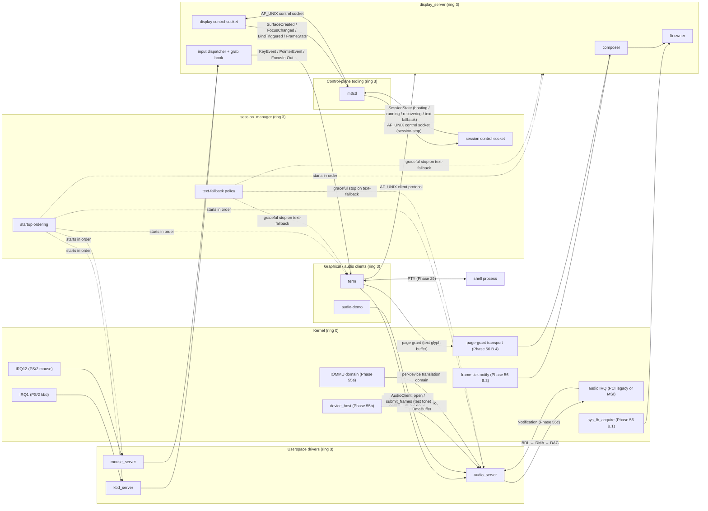

# Audio and Local Session

**Aligned Roadmap Phase:** Phase 57
**Status:** Planned (Track A — design memos in progress; full doc lands in I.1)
**Source Ref:** phase-57
**Supersedes Legacy Doc:** (none — new content)

> **Note (A.2 placeholder).** This is the learning-doc stub created during Track A. Track A.2 only requires the **Service topology** section to be present; the rest of the doc is marked `TBD` and will be filled in I.1 once the implementation tracks B–H land. Cross-link the design memos in the meantime: [`docs/appendix/phase-57-audio-target-choice.md`](./appendix/phase-57-audio-target-choice.md), [`docs/appendix/phase-57-audio-abi.md`](./appendix/phase-57-audio-abi.md), [`docs/appendix/phase-57-session-entry.md`](./appendix/phase-57-session-entry.md), [`docs/roadmap/57-audio-and-local-session.md`](./roadmap/57-audio-and-local-session.md).

## Overview

`TBD (I.1).` One paragraph describing how Phase 57 turns Phase 56's graphical architecture into a coherent local-system milestone by adding audio output, a defined session-entry flow, and a graphical terminal client.

## What This Doc Covers

`TBD (I.1).`

- Service topology — present below (A.2).
- Audio device contract — `TBD (I.1)`, references [`docs/appendix/phase-57-audio-target-choice.md`](./appendix/phase-57-audio-target-choice.md) and [`docs/appendix/phase-57-audio-abi.md`](./appendix/phase-57-audio-abi.md).
- Local-session startup flow — `TBD (I.1)`, references [`docs/appendix/phase-57-session-entry.md`](./appendix/phase-57-session-entry.md).
- Terminal baseline (`term`) — `TBD (I.1)`.
- Crash, restart, and fallback behavior — `TBD (I.1)`.

## Service topology

Phase 57 introduces two new userspace services on top of the Phase 56 substrate: `audio_server` (sole owner of the chosen audio device — Intel 82801AA AC'97 per [`phase-57-audio-target-choice.md`](./appendix/phase-57-audio-target-choice.md)) and `session_manager` (orchestrator of the graphical session lifecycle). It also introduces the first useful graphical client, `term`. Every audio policy, every session-state transition, and every terminal-rendering decision lives in userspace. The kernel retains only hardware-access mechanism: the audio device claim path (Phase 55b `sys_device_claim` + Phase 55a IOMMU coverage), the audio IRQ notification (Phase 55c bound-notification + `RecvResult`), and the existing Phase 56 framebuffer / input plumbing. **The kernel does not learn audio**; it only learns "device claim covers the audio BAR(s)" — see Phase 57's design doc, "Driver hosting and supervision" subsection, and A.5.

### Processes and their single responsibility

| Service | Responsibility | Ring | Supervised by |
|---|---|---|---|
| `audio_server` | Sole userspace owner of the AC'97 audio device. Single-stream PCM-out arbiter — second client connect returns `-EBUSY` per the YAGNI rule. Owns the AF_UNIX listening socket for `audio_client` connections, the control endpoint, and the audio IRQ notification. | 3 | `init` (Phase 55b ring-3 driver host pattern; Phase 56 manifest shape) |
| `session_manager` | Orchestrator of the graphical-session lifecycle. Runs the ordered startup sequence (`display_server` → `kbd_server` → `mouse_server` → `audio_server` → `term`), enforces the per-service boot retry cap (3), and on exhaustion escalates to `text-fallback` per Phase 56 F.3. **Does not own the framebuffer, input devices, or audio device** — those belong to `display_server`, `kbd_server` / `mouse_server`, and `audio_server` respectively. Owns its own AF_UNIX control socket on `/run/m3os/session.sock` for the `m3ctl session-stop` verb. | 3 | `init` |
| `term` | Regular `display_server` client + regular `audio_client` consumer. Renders bitmap-font text into a `display_server` surface; reads keyboard events from `display_server`'s typed input dispatcher; speaks to a PTY (Phase 29) for shell I/O; rings the bell via `audio_client`'s `submit_frames` of a short pre-baked PCM tone. Holds **no** privileged capabilities. | 3 | `init` (started by `session_manager` after `audio_server` is ready) |

The boundaries are deliberate. `audio_server` is the only process that holds the audio device claim and the only process that programs the AC'97 BDL. `session_manager` is the only process that decides "the session is up" or "the session has fallen back to text mode." `term` is a client of both — it does not regain device ownership for either subsystem under any circumstance.

### Capabilities each service holds

| Service | Capabilities at steady state |
|---|---|
| `audio_server` | (a) `Device` capability from `sys_device_claim(0x8086:0x2415)` — exclusive ownership of the AC'97 controller; (b) `Mmio` capabilities for BAR0 (NAM mixer block) and BAR1 (NABM bus-master block) via `sys_device_mmio_map`; (c) `DmaBuffer` capabilities for the BDL page and the PCM data ring via `sys_device_dma_alloc` (both routed through the per-device IOMMU domain established at claim time, per Phase 55a); (d) `IrqNotification` from `sys_device_irq_subscribe` for the audio IRQ vector, bound to the audio_server endpoint via Phase 55c `IrqNotification::bind_to_endpoint`; (e) AF_UNIX listener on the documented client-protocol socket (`/run/m3os/audio.sock`); (f) AF_UNIX listener on the documented control-socket path (`/run/m3os/audio-control.sock`); (g) service-registry entry `"audio"` |
| `session_manager` | (a) Service-supervisor caps to start, stop, and signal `display_server`, `kbd_server`, `mouse_server`, `audio_server`, and `term` (granted by `init` at startup); (b) read-cap on `/run/services.status` to observe each child's `running` / `permanently-stopped` state; (c) AF_UNIX listener on its control socket (`/run/m3os/session.sock`) gated by the control-socket cap (granted only to `m3ctl` at session-manager startup, consistent with the Phase 56 m3ctl precedent); (d) send-caps on each managed service's control socket so it can issue graceful `stop` verbs during `text-fallback` transitions; (e) service-registry entry `"session"` |
| `term` | (a) Client send-cap on `display_server`'s AF_UNIX listening socket (Phase 56 client protocol); (b) client send-cap on `audio_server`'s AF_UNIX listening socket (Phase 57 audio ABI per [`phase-57-audio-abi.md`](./appendix/phase-57-audio-abi.md)); (c) PTY file descriptor pair (Phase 29) for the shell it spawns; (d) no privileged capabilities — `term` cannot claim devices, cannot open new framebuffer surfaces beyond the one `display_server` issues it, and cannot signal other services |

No userspace service in Phase 57 shares writable memory with another. Audio sample bytes ride the AF_UNIX stream as raw PCM payload following the `SubmitFrames` control header (per A.3); display pixel data continues to ride the Phase 50 page-grant transport (per Phase 56). This is the Phase 56 "exactly one writer per region at a time" rule extended to audio.

### Data flow

The diagram names every Phase 57 process, every endpoint, and every transport. Solid arrows are runtime data flow; dotted arrows are lifecycle (start / stop / state) flow. Every solid arrow is either a Phase 50 IPC primitive, a kernel notification, a page grant, or — new in Phase 57 — an AC'97 BDL DMA write that the kernel forwarded to `audio_server` via the existing Phase 55b mechanism. **No arrow bypasses `audio_server` for audio output, and no arrow bypasses `session_manager` for session lifecycle.**

### What is *not* in this topology (and why)

- **Audio mixer / multi-stream router.** Phase 57 is single-client per the YAGNI rule; a second client gets `-EBUSY`. A future audio-mixer phase introduces a `pipewire`-class daemon that talks to `audio_server` as the single device owner and exposes its own multi-client surface — `audio_server`'s contract does not need to change for that to land.
- **Login manager.** Phase 57's session entry is a fixed boot sequence ordered by `session_manager` (see [`phase-57-session-entry.md`](./appendix/phase-57-session-entry.md)). A future console-session-UID phase replaces the fixed sequence with a per-login-session `session_manager` instance; that work is not in Phase 57.
- **Multiple TTYs / fast user switching.** Out of scope per the YAGNI rule. The single graphical session and the serial console coexist as today.
- **Notification daemon, bar, launcher, lockscreen.** Phase 56's deferred-to-Phase-57b items remain deferred. `term` is the one Phase 57 graphical client.

## Audio device contract

`TBD (I.1).` See [`phase-57-audio-target-choice.md`](./appendix/phase-57-audio-target-choice.md) for the AC'97 target choice and BDL DMA model; see [`phase-57-audio-abi.md`](./appendix/phase-57-audio-abi.md) for the pure-userspace IPC contract.

## Local-session startup flow

`TBD (I.1).` See [`phase-57-session-entry.md`](./appendix/phase-57-session-entry.md) for the fixed-boot-sequence trigger, ordered startup steps, and failure-recovery contract.

## Terminal baseline (`term`)

`TBD (I.1).` Bitmap font, ANSI parser reuse from Phase 22b, PTY connection per Phase 29, render path through `display_server`, bell path through `audio_client`.

## Crash, restart, and fallback

`TBD (I.1).` Two-cap supervision (boot-retry cap in `kernel-core::session::startup`; steady-state cap in `etc/services.d/*.conf`), text-fallback transition, m3ctl session-stop verb. See [`phase-57-session-entry.md`](./appendix/phase-57-session-entry.md).

## Key Files

`TBD (I.1).` Will tabulate `userspace/audio_server/src/*.rs`, `userspace/lib/audio_client/src/lib.rs`, `userspace/audio-demo/src/main.rs`, `userspace/session_manager/src/*.rs`, `userspace/term/src/*.rs`, `kernel-core/src/audio/*.rs`, `kernel-core/src/session/*.rs` once the implementation tracks land.

## How This Phase Differs From Later Audio / Session Work

`TBD (I.1).`

- This phase introduces single-client AC'97 PCM-out plus a fixed-boot session orchestrator.
- Later phases add: HDA backend, multi-stream mixing, sample-rate conversion, audio capture, console-session UIDs, multiple graphical sessions, login manager, bar / launcher / notification daemon, lockscreen.

## Related Roadmap Docs

- [Phase 57 roadmap doc](./roadmap/57-audio-and-local-session.md)
- [Phase 57 task doc](./roadmap/tasks/57-audio-and-local-session-tasks.md)
- [Phase 57 audio target choice (A.1)](./appendix/phase-57-audio-target-choice.md)
- [Phase 57 audio ABI (A.3)](./appendix/phase-57-audio-abi.md)
- [Phase 57 session entry (A.4)](./appendix/phase-57-session-entry.md)
- [Phase 56 display and input architecture](./56-display-and-input-architecture.md)
- [Phase 55b ring-3 driver host](./55b-ring-3-driver-host.md)
- [Phase 55a IOMMU substrate](./55a-iommu-substrate.md)

## Deferred or Later-Phase Topics

- Multi-client audio mixing, sample-rate conversion, format conversion, audio capture, audio routing
- Console-session UIDs and per-login-session orchestration
- Multiple graphical sessions, fast user switching, lock/unlock, idle timeout
- Login manager (graphical login screen)
- Native bar / launcher / notification daemon / lockscreen clients
- Configurable fonts, scrollback beyond the 1000-line cap, transparency, tab support beyond ANSI HT
