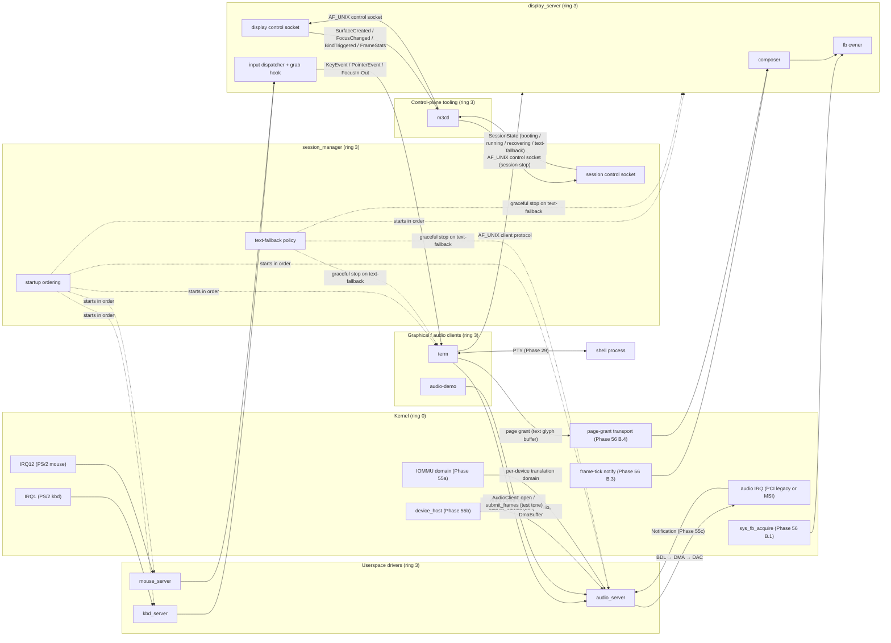

# Audio and Local Session

**Aligned Roadmap Phase:** Phase 57
**Status:** Phase 57 — under implementation
**Source Ref:** phase-57
**Supersedes Legacy Doc:** N/A

## Overview

Phase 57 turns Phase 56's userspace display-and-input architecture into a coherent local-system milestone. Three additions land in this phase: (a) the first real audio-output path, an Intel 82801AA AC'97 controller driven by a ring-3 `audio_server` over a typed pure-userspace IPC contract; (b) a deterministic graphical session-entry flow run by a new userspace daemon, `session_manager`, with a recovery contract that falls back to the kernel framebuffer console + serial admin shell when the boot sequence cannot be salvaged; and (c) the first genuinely useful graphical client, `term`, a display-server-client terminal emulator wired to the existing PTY subsystem so the local session feels like a system, not a demo.

Every audio policy, every session-state transition, and every terminal-rendering decision lives in userspace. The kernel surface grows by exactly one device-claim entry (Intel AC'97, PCI ID `0x8086:0x2415`) and one bound-notification slot for the audio IRQ — there are no new syscalls. The Phase 56 framebuffer-acquisition path, the focus-aware input dispatcher, the layer-shell-equivalent surface roles, and the Phase 55b ring-3 driver-host primitives are all reused unchanged. Phase 57 is therefore an **additive** phase: it teaches the rest of the codebase what audio looks like, and it teaches the codebase what a graphical session feels like, without renegotiating the substrate underneath.

## What This Doc Covers

1. The chosen audio target (Intel 82801AA AC'97) and the PCM contract — sample format, channel layout, sample rate, Buffer Descriptor List DMA model, and the four-verb client surface (`open` / `submit_frames` / `drain` / `close`).
2. The graphical session-entry flow and the recovery contract — the fixed boot sequence run by `session_manager`, the per-step retry budget, the `text-fallback` escalation path, and the `m3ctl session-stop` operator entry-point into text-mode admin.
3. The `term` graphical-client baseline and how it composes Phase 22b/29/56 outputs — Phase 22b ANSI parser, Phase 29 PTY pair, Phase 56 `Toplevel` surface and focus-aware input dispatch, plus the new Phase 57 audio bell.
4. The deferred boundary between Phase 57 and a later media/desktop phase — what is **not** in this phase (audio mixing, multi-stream, capture, console-session UIDs, native bar/launcher/lockscreen, configurable fonts) and where each item is parked.

## Service topology

Phase 57 introduces two new userspace services on top of the Phase 56 substrate: `audio_server` (sole owner of the chosen audio device — Intel 82801AA AC'97 per [`phase-57-audio-target-choice.md`](./appendix/phase-57-audio-target-choice.md)) and `session_manager` (orchestrator of the graphical session lifecycle). It also introduces the first useful graphical client, `term`. Every audio policy, every session-state transition, and every terminal-rendering decision lives in userspace. The kernel retains only hardware-access mechanism: the audio device claim path (Phase 55b `sys_device_claim` + Phase 55a IOMMU coverage), the audio IRQ notification (Phase 55c bound-notification + `RecvResult`), and the existing Phase 56 framebuffer / input plumbing. **The kernel does not learn audio**; it only learns "device claim covers the audio BAR(s)" — see Phase 57's design doc, "Driver hosting and supervision" subsection, and A.5.

### Processes and their single responsibility

| Service | Responsibility | Ring | Supervised by |
|---|---|---|---|
| `audio_server` | Sole userspace owner of the AC'97 audio device. Single-stream PCM-out arbiter — second client connect returns `-EBUSY` per the YAGNI rule. Owns the AF_UNIX listening socket for `audio_client` connections, the control endpoint, and the audio IRQ notification. | 3 | `init` (Phase 55b ring-3 driver host pattern; Phase 56 manifest shape) |
| `session_manager` | Orchestrator of the graphical-session lifecycle. Runs the ordered startup sequence (`display_server` → `kbd_server` → `mouse_server` → `audio_server` → `term`), enforces the per-service boot retry cap (3), and on exhaustion escalates to `text-fallback` per Phase 56 F.3. **Does not own the framebuffer, input devices, or audio device** — those belong to `display_server`, `kbd_server` / `mouse_server`, and `audio_server` respectively. Owns its own AF_UNIX control socket on `/run/m3os/session.sock` for the `m3ctl session-stop` verb. | 3 | `init` |
| `term` | Regular `display_server` client + regular `audio_client` consumer. Renders bitmap-font text into a `display_server` surface; reads keyboard events from `display_server`'s typed input dispatcher; speaks to a PTY (Phase 29) for shell I/O; rings the bell via `audio_client`'s `submit_frames` of a short pre-baked PCM tone. Holds **no** privileged capabilities. | 3 | `init` (started by `session_manager` after `audio_server` is ready) |

The boundaries are deliberate. `audio_server` is the only process that holds the audio device claim and the only process that programs the AC'97 BDL. `session_manager` is the only process that decides "the session is up" or "the session has fallen back to text mode." `term` is a client of both — it does not regain device ownership for either subsystem under any circumstance.

### Capabilities each service holds

| Service | Capabilities at steady state |
|---|---|
| `audio_server` | (a) `Device` capability from `sys_device_claim(0x8086:0x2415)` — exclusive ownership of the AC'97 controller; (b) `Mmio` capabilities for BAR0 (NAM mixer block) and BAR1 (NABM bus-master block) via `sys_device_mmio_map`; (c) `DmaBuffer` capabilities for the BDL page and the PCM data ring via `sys_device_dma_alloc` (both routed through the per-device IOMMU domain established at claim time, per Phase 55a); (d) `IrqNotification` from `sys_device_irq_subscribe` for the audio IRQ vector, bound to the audio_server endpoint via Phase 55c `IrqNotification::bind_to_endpoint`; (e) AF_UNIX listener on the documented client-protocol socket (`/run/m3os/audio.sock`); (f) AF_UNIX listener on the documented control-socket path (`/run/m3os/audio-control.sock`); (g) service-registry entry `"audio.cmd"` |
| `session_manager` | (a) Service-supervisor caps to start, stop, and signal `display_server`, `kbd_server`, `mouse_server`, `audio_server`, and `term` (granted by `init` at startup); (b) read-cap on `/run/services.status` to observe each child's `running` / `permanently-stopped` state; (c) AF_UNIX listener on its control socket (`/run/m3os/session.sock`) gated by the control-socket cap (granted only to `m3ctl` at session-manager startup, consistent with the Phase 56 m3ctl precedent); (d) send-caps on each managed service's control socket so it can issue graceful `stop` verbs during `text-fallback` transitions; (e) service-registry entry `"session-control"` |
| `term` | (a) Client send-cap on `display_server`'s AF_UNIX listening socket (Phase 56 client protocol); (b) client send-cap on `audio_server`'s AF_UNIX listening socket (Phase 57 audio ABI per [`phase-57-audio-abi.md`](./appendix/phase-57-audio-abi.md)); (c) PTY file descriptor pair (Phase 29) for the shell it spawns; (d) no privileged capabilities — `term` cannot claim devices, cannot open new framebuffer surfaces beyond the one `display_server` issues it, and cannot signal other services |

No userspace service in Phase 57 shares writable memory with another. Audio sample bytes ride the AF_UNIX stream as raw PCM payload following the `SubmitFrames` control header (per A.3); display pixel data continues to ride the Phase 50 page-grant transport (per Phase 56). This is the Phase 56 "exactly one writer per region at a time" rule extended to audio.

### Data flow

The diagram names every Phase 57 process, every endpoint, and every transport. Solid arrows are runtime data flow; dotted arrows are lifecycle (start / stop / state) flow. Every solid arrow is either a Phase 50 IPC primitive, a kernel notification, a page grant, or — new in Phase 57 — an AC'97 BDL DMA write that the kernel forwarded to `audio_server` via the existing Phase 55b mechanism. **No arrow bypasses `audio_server` for audio output, and no arrow bypasses `session_manager` for session lifecycle.**

### What is *not* in this topology (and why)

- **Audio mixer / multi-stream router.** Phase 57 is single-client per the YAGNI rule; a second client gets `-EBUSY`. A future audio-mixer phase introduces a `pipewire`-class daemon that talks to `audio_server` as the single device owner and exposes its own multi-client surface — `audio_server`'s contract does not need to change for that to land.
- **Login manager.** Phase 57's session entry is a fixed boot sequence ordered by `session_manager` (see [`phase-57-session-entry.md`](./appendix/phase-57-session-entry.md)). A future console-session-UID phase replaces the fixed sequence with a per-login-session `session_manager` instance; that work is not in Phase 57.
- **Multiple TTYs / fast user switching.** Out of scope per the YAGNI rule. The single graphical session and the serial console coexist as today.
- **Notification daemon, bar, launcher, lockscreen.** Phase 56's deferred-to-Phase-57b items remain deferred. `term` is the one Phase 57 graphical client.

## Core Implementation

### Audio output path

The audio path is end-to-end pure-userspace IPC. The kernel does not learn audio.

- **Pure-logic substrate (`kernel-core::audio`).** PCM format math (`format.rs`), the single-producer / single-consumer ring-buffer state machine (`ring.rs`), the wire codec (`protocol.rs`), the typed errno mapping (`errno.rs`), and the property-test ring harness (`ring_proptest.rs`) all live host-testable in `kernel-core`. Every consumer — `audio_server`, `audio_client`, `audio-demo`, `term`'s bell — links the same `kernel-core::audio` symbols. A workspace-wide grep for `PcmFormat`, `MAX_SUBMIT_BYTES`, or `audio_error_to_neg_errno` returns exactly one declaration site. This is the DRY discipline made into a build invariant.
- **`audio_server`, the ring-3 supervised driver.** Following the Phase 55b ring-3 driver-host pattern, `audio_server` claims `0x8086:0x2415` via `sys_device_claim`, maps NAM (BAR0, mixer block, ~64 bytes) and NABM (BAR1, bus-master block, ~192 bytes) via `sys_device_mmio_map`, allocates the Buffer Descriptor List page and the PCM data ring through `sys_device_dma_alloc` (so they ride the per-device IOMMU domain established at claim time per Phase 55a), and binds the audio IRQ to a `Notification` object via `sys_device_irq_subscribe` + Phase 55c `IrqNotification::bind_to_endpoint`. The single-threaded io loop multiplexes the IRQ source and the AF_UNIX client endpoint through the same `RecvResult` machinery the e1000 driver introduced. Per the design doc's YAGNI rule, audio is **single-client** in Phase 57: a second `OpenStream` call returns `-EBUSY` and a structured `audio.client` log event.
- **`audio_client` (`userspace/lib/audio_client/src/lib.rs`).** The public client surface is locked to four verbs — `open`, `submit_frames`, `drain`, `close` — each returning `Result<_, AudioClientError>`. The library encodes/decodes via `kernel-core::audio::protocol`; nothing in the client crate knows the byte layout. `audio-demo` and `term`'s bell both link this library and call exactly the same way.
- **`audio-demo` (`userspace/audio-demo/src/main.rs`).** The reference client. Plays a documented 440 Hz sine-wave test tone for ~1 s by encoding 48000-frame chunks of 16-bit signed little-endian stereo into the PCM ring. `cargo xtask audio-smoke` (Track H) drives this in headless QEMU with `-audiodev none,id=snd0` and asserts the `frames_consumed` counter advances; the manual checklist below validates audible output on a host with PulseAudio.

### Session lifecycle

`session_manager` is a userspace daemon supervised by `init`, started once at boot, that orchestrates the graphical-session lifecycle. The lifecycle is locked into a typed state machine in `kernel-core::session::startup` (host-testable) and the daemon driver in `userspace/session_manager` (the ring-3 binary).

- **`StartupSequence` (`kernel-core/src/session/startup.rs`).** The pure-logic sequencer. Owns the ordered start sequence (`display_server` → `kbd_server` → `mouse_server` → `audio_server` → `term`), the per-step retry budget (default `3` per `MAX_RETRIES_PER_STEP`), and the typed `SessionState` enum (`Booting` / `Running` / `Recovering { step_name, retry_count }` / `TextFallback`). Consumers depend on the trait `SessionStep`, not on the daemon, so unit tests substitute recording impls and verify ordering invariants without spawning a process.
- **`Recovery` (`kernel-core/src/session/recover.rs`).** The transition-only side: maps "this start step exhausted its retry budget" to "begin the text-fallback motion (graceful stop in reverse start order, supervisor reaps stragglers, exit with code 2)." The escalation policy is data, not code; tests verify every escalation path before the daemon runs.
- **`session_manager` daemon (`userspace/session_manager/src/main.rs` + `boot.rs` + `recover.rs` + `control.rs`).** Splits into per-concern modules per the SOLID SRP rule: `boot.rs` runs the start sequence, `recover.rs` drives the text-fallback motion, `control.rs` handles the F.5 control-socket dispatcher (consumed by `m3ctl session-state` / `session-stop` / `session-restart`). The control socket lives at `/run/m3os/session.sock` and is gated by a capability minted at session-manager startup and granted only to `m3ctl`.
- **`session_supervisor` (`kernel-core/src/session_supervisor.rs`).** The internal verb surface `session_manager` issues to `init` (start / stop / restart / await-ready / on-exit-observed). Distinct from `session_control` (the external surface to `m3ctl`) per ISP: different actor, different cap, different direction.
- **Two-cap supervision.** The boot retry cap (3 attempts per step, lives in `kernel-core::session::startup`) governs "how hard does session_manager try to bring the session up?" The steady-state restart cap (`max_restart=N` in `etc/services.d/*.conf`, default 3) governs "how often can a service crash before we give up?" Both caps map exhaustion to `SessionState::TextFallback`. Phase 57 introduces no kernel-side claim persistence across restart and no UID-based access control — session_manager re-runs every claim from scratch on each boot, and the m3ctl control surface is gated entirely by capability per the F.5 design.

### Text-fallback recovery

`session_manager` does not implement text-mode itself. Phase 56 F.3 already implements text-mode fallback at the `init` + kernel-framebuffer level: when no userspace process holds the framebuffer, `kernel/src/fb/mod.rs` resumes producing characters. Phase 57's `text-fallback` is therefore a **state transition emitted by `session_manager` that drops its framebuffer-using children**. Once `display_server` exits, the kernel's existing fallback path takes over without further action. The serial `login` path remains live throughout the transition.

The graceful-stop motion is reverse start order (`term` → `audio_server` → `mouse_server` → `kbd_server` → `display_server`); each service gets 1 s for `stop`, then `SIGTERM`, then `SIGKILL`. `session_manager` exits with code `2` so `init` records the named reason. `m3ctl session-stop` drives the same motion from any serial / SSH shell.

### Terminal composition (`term`)

`term` is the first useful Phase 57 graphical client. It composes existing substrate without growing any of it.

- **PTY layer (`userspace/term/src/pty.rs`, Phase 29).** `term` allocates a PTY pair via `openpty()`, forks the configured shell on the slave side (per the Phase 27 user-account discipline), reads bytes from the master, and writes keypresses back. Phase 57 introduces no new PTY syscalls or capabilities.
- **ANSI parser (`userspace/term/src/screen.rs`, Phase 22b reuse).** PTY output bytes go through the existing Phase 22b VT100 CSI parser to update the on-screen `Screen` state — cursor position, attributes, dirty rows — within a fixed 1000-line scrollback cap. The parser code is reused, not forked.
- **Render path (`userspace/term/src/render.rs`).** Dirty rows render via `kernel-core::session::font::FontProvider` (the centralized bitmap-glyph data added in G.2) into a `surface_buffer::SurfaceBuffer`, which `term` hands to `display_server` over the Phase 56 page-grant transport. The `Toplevel` surface role applies — `term` is a regular, focusable, click-to-focus client like any future graphical app.
- **Input path (`userspace/term/src/input.rs`).** `term` subscribes to `display_server`'s focus-aware input dispatcher via the Phase 56 client protocol; typed `KeyEvent` arrivals translate to UTF-8 keystrokes (and the Ctrl-letter mappings — `Ctrl-C` → `0x03` — that the existing PTY line discipline expects) and write to the master side.
- **Bell path (`userspace/term/src/bell.rs`).** A BEL (`0x07`) byte from the slave triggers a short pre-baked PCM tone submitted through `audio_client`. The bell is throttled (one tone per ~250 ms) so a chatty shell does not flood `audio_server`. If `audio_server` is unavailable the bell silently no-ops; the terminal stays usable.

## Key Files

| File | Purpose |
|---|---|
| `kernel-core/src/audio/format.rs` | `PcmFormat`, `SampleRate`, `ChannelLayout`, `frame_size_bytes` — single source of truth for PCM math |
| `kernel-core/src/audio/ring.rs` | `AudioRingState`, `AudioSink` trait, `RingError` — single-producer / single-consumer ring-buffer state machine |
| `kernel-core/src/audio/protocol.rs` | `ClientMessage`, `ServerMessage`, `AudioControlCommand`, `AudioControlEvent`, `MAX_SUBMIT_BYTES` (64 KiB), `encode`/`decode` — wire codec |
| `kernel-core/src/audio/errno.rs` | `audio_error_to_neg_errno` — single mapping site |
| `kernel-core/src/audio/ring_proptest.rs` | property tests: codec round-trip, ring invariants under arbitrary write/consume interleavings |
| `kernel-core/src/session/startup.rs` | `StartupSequence`, `SessionStep` trait, `SessionState` enum, `MAX_RETRIES_PER_STEP` — pure-logic session boot sequencer |
| `kernel-core/src/session/recover.rs` | `Recovery`, `RecoveryAction` — escalation policy (boot-retry exhaustion → `TextFallback`) |
| `kernel-core/src/session/font.rs` | `FontProvider` trait, `BasicBitmapFont`, `Glyph`, `FontError` — centralized bitmap font surface |
| `kernel-core/src/session/font_data.rs` | Centralized 8×16 bitmap glyph data (CP437, ASCII 0x20–0x7E) |
| `kernel-core/src/session_supervisor.rs` | Internal verb surface `session_manager` ↔ `init` (start/stop/restart/await-ready/on-exit-observed) |
| `kernel-core/src/session_control.rs` | External verb surface `m3ctl` ↔ `session_manager`: `ControlVerb`, `ControlReply`, `ControlSocketCap`, `dispatch_authenticated`, codec |
| `userspace/audio_server/src/main.rs` | `audio_server` daemon entry point + io loop scaffold |
| `userspace/audio_server/src/device.rs` | `AudioBackend` trait + `Ac97Backend` impl (BDL programming, register layout, FakeMmio-driven tests) |
| `userspace/audio_server/src/stream.rs` | `Stream`, `StreamRegistry` (single-stream policy) |
| `userspace/audio_server/src/irq.rs` | `subscribe_and_bind`, `run_io_loop` — Phase 55c bound-notification multiplex |
| `userspace/audio_server/src/client.rs` | `ClientRegistry` — single-client policy, `-EBUSY` on second open |
| `userspace/lib/audio_client/src/lib.rs` | Public client library; `AudioClient::open` / `submit_frames` / `drain` / `close` |
| `userspace/audio-demo/src/main.rs` | Reference client; plays 440 Hz sine for ~1 s |
| `userspace/session_manager/src/main.rs` | `session_manager` daemon entry point |
| `userspace/session_manager/src/boot.rs` | start-sequence runner |
| `userspace/session_manager/src/recover.rs` | text-fallback motion executor |
| `userspace/session_manager/src/control.rs` | F.5 control-socket dispatcher (consumed by `m3ctl`) |
| `userspace/term/src/main.rs` | `term` daemon entry point |
| `userspace/term/src/pty.rs` | PTY pair allocator + shell forker |
| `userspace/term/src/screen.rs` | ANSI parser + scrollback (Phase 22b reuse) |
| `userspace/term/src/render.rs` | Glyph render path → `display_server` |
| `userspace/term/src/input.rs` | `KeyEvent` → keystroke translation |
| `userspace/term/src/bell.rs` | Throttled BEL → audio_client submit |
| `userspace/m3ctl/src/main.rs` | Phase 57 I.2 adds `session-state` / `session-stop` / `session-restart` verbs alongside the Phase 56 display-control verbs |
| `etc/services.d/audio_server.conf` | supervised audio_server manifest (`restart=on-failure max_restart=3`) |
| `etc/services.d/session_manager.conf` | supervised session_manager manifest (`restart=on-failure max_restart=3`) |
| `etc/services.d/term.conf` | supervised term manifest (`depends=display_server,kbd_server,session_manager`) |

## Resource-bound defaults

These are named once in code and quoted here so an operator can validate the running system against the design.

| Bound | Value | Where it lives | Why |
|---|---|---|---|
| Audio DMA ring size | 4 KiB ≤ N ≤ 64 KiB (default at the upper bound) | `kernel-core::audio::protocol::MAX_SUBMIT_BYTES` and constants in `kernel-core::audio` | A single submit larger than the ring forces server-side fragmentation policy that belongs to the client; 64 KiB is the maximum safe frame for a `SubmitFrames` over IPC |
| `term` scrollback | 1000 lines | `userspace/term/src/screen.rs` (named constant) | Bounded memory for a terminal session; deferred work raises the cap or makes it configurable |
| Boot retry cap (per session step) | 3 attempts per step before escalation | `kernel-core::session::MAX_RETRIES_PER_STEP` | Matches the A.4 memo's "per-service retry up to 3 attempts; on exhaustion, escalate to `text-fallback`" |
| Steady-state restart cap (per service) | `max_restart=3` per minute (configurable per manifest) | `etc/services.d/*.conf` | Phase 56 manifest convention reused; on exhaustion the supervisor flips the service to `permanently-stopped` and `session_manager` observes the state change to escalate |
| Audio stream count | 1 (single-client) | `userspace/audio_server/src/client.rs::ClientRegistry` | YAGNI; second client returns `-EBUSY` |
| Audio bell throttle | one tone per ~250 ms | `userspace/term/src/bell.rs` | Prevents a chatty shell from saturating `audio_server` with BEL |

## Manual smoke checklist

The validation gate for Phase 57 includes a manual checklist — some failure modes only show up on real hardware or a developer's QEMU with a real audio fixture. Run this after a clean build (`cargo xtask check && cargo xtask run-gui --device audio`) to confirm the local-system milestone holds end-to-end.

| # | Item | Command(s) | Expected observable outcome |
|---|---|---|---|
| 1 | `audio-demo` produces audible tone on a host with working audio | `cargo xtask run-gui --device audio` (QEMU launches with `-device AC97,audiodev=snd0` and `-audiodev pa,id=snd0`); inside the guest, `audio-demo` is launched by `init`. **Override for audible output:** `QEMU_AUDIO_DRV=pa cargo xtask run-gui --device audio` | A ~1 second 440 Hz sine wave is audible on the host's default PulseAudio sink. The guest serial log shows `audio.demo: submitted N frames; frames_consumed=N` |
| 2 | `term` BEL produces audible bell | Once the graphical session is up (Item 3), focus the `term` window and run `printf '\007'` from the shell prompt | A short pre-baked PCM tone (~150 ms) plays on the host audio sink. The bell-throttle limits playback to one tone per ~250 ms regardless of repeats |
| 3 | Graphical session reaches `Running` from cold boot | `cargo xtask run-gui --device audio --fresh`; wait up to 5 s after the QEMU window opens | Serial log emits `session_manager: session.boot: state=running`. The graphical surface shows a `term` window with a shell prompt. `m3ctl session-state` from a serial shell prints `state=running` |
| 4 | Keypress reaches a shell prompt visibly in `term` | With Item 3 reached, click the `term` window to focus it, then type `ls /` | The keystrokes appear in `term` (echoed by the line discipline) and the `ls` output renders as bitmap text in the surface |
| 5 | `Ctrl-C` from `term` reaches the shell as `0x03` | With Item 3 reached, run `sleep 30` in `term`, then press `Ctrl-C` | The `sleep` is interrupted; the shell prompt returns. The serial log shows the SIGINT delivery (`tty: ldisc: signal-byte 0x03 → SIGINT`) |
| 6 | Killing `display_server` falls back to text-mode admin within the documented cap | With Item 3 reached, from a serial / SSH shell run `m3ctl session-stop`, OR send SIGKILL to `display_server` 3 times in succession | Serial log emits `session_manager: session.boot.escalate { service=display_server, reason=... }` (or `session.recover.text_fallback` for the steady-state path); the kernel framebuffer console resumes; the serial admin shell stays reachable. Total elapsed time ≤ 5 s from the trigger to the framebuffer-console resume |

If any item above fails, the local-system milestone is regressed. File a bug citing the item number and the observed deviation; rollback per the design doc's "Rollback Plan" section.

## How This Phase Differs From Later Work

Phase 57 ships single-client AC'97 PCM-out plus a fixed-boot session orchestrator plus a one-font `term` baseline. Each is a deliberate scope choice; later phases extend each axis additively without rewriting Phase 57:

- **Audio is single-client.** A second client gets `-EBUSY`. Multi-stream mixing, sample-rate conversion, format conversion, audio capture, and audio routing are deferred to a later "audio mixer" phase that introduces a `pipewire`-class daemon talking to `audio_server` as the single device owner. The Phase 57 `audio_server` contract does not change for that to land.
- **HDA is the natural follow-up backend.** A second `AudioBackend` impl (Intel HDA — `-device intel-hda` + `-device hda-output`) lands in a later phase by adding a new impl behind the trait declared in D.2, not by editing existing callers. Phase 57's chosen-target memo records the rejection rationale so the later phase does not re-litigate.
- **Session is single.** No multiple TTYs, no fast user switching, no lock/unlock, no idle timeout. A future "console sessions" phase introduces per-login `session_manager` instances driven by a UID-based session model; the Phase 57 daemon's lifecycle is already factored as a separate process from `init`, so transplantation is "spawn one per login" rather than "rewrite the orchestrator."
- **No login manager.** A graphical login screen is deferred. Phase 57's session-entry trigger is a fixed boot sequence that runs at every boot.
- **`term` ships one bitmap font at one size.** Configurable fonts, scrollback beyond the 1000-line cap, transparency, and tab support beyond ANSI HT semantics are deferred. The font-provider trait is already in place, so a later phase plugs in additional fonts behind the trait without protocol rework.
- **No richer shell.** Notifications, settings panels, an app ecosystem, a native bar / launcher / lockscreen — all deferred. Phase 57's `term` is the one Phase 57 graphical client; the bar / launcher / notification daemon / lockscreen work is parked under "Phase 57b" in the GUI strategy doc and consumes the existing Phase 56 `Layer` role and control-socket event stream when it lands.

## Related Roadmap Docs

- [Phase 57 design doc](./roadmap/57-audio-and-local-session.md)
- [Phase 57 task list](./roadmap/tasks/57-audio-and-local-session-tasks.md)
- [Phase 57 audio target choice (A.1)](./appendix/phase-57-audio-target-choice.md)
- [Phase 57 audio ABI (A.3)](./appendix/phase-57-audio-abi.md)
- [Phase 57 session entry (A.4)](./appendix/phase-57-session-entry.md)
- [Phase 47 — DOOM (graphics proof)](./47-doom.md)
- [Phase 55 — Hardware Substrate](./55-hardware-substrate.md)
- [Phase 55a — IOMMU Substrate](./55a-iommu-substrate.md)
- [Phase 55b — Ring-3 Driver Host](./55b-ring-3-driver-host.md)
- [Phase 55c — Ring-3 Driver Correctness Closure](./55c-ring-3-driver-correctness-closure-learning.md)
- [Phase 56 — Display and Input Architecture](./56-display-and-input-architecture.md)
- [Phase 22b — ANSI Escape Sequences](./22b-ansi-escape.md) (reused by `term`'s screen state machine)
- [Phase 27 — User Accounts](./27-user-accounts.md) (`term` runs the configured shell under the existing UID model — no new UID concepts in Phase 57)
- [Phase 29 — PTY Subsystem](./29-pty-subsystem.md) (`term` is the first graphical PTY consumer)

## Deferred or Later-Phase Topics

- Multi-client audio mixing, sample-rate conversion, format conversion, audio capture, audio routing
- Intel HDA backend (second `AudioBackend` impl behind the existing trait)
- Console-session UIDs and per-login-session orchestration
- Multiple graphical sessions, fast user switching, lock/unlock, idle timeout
- Login manager (graphical login screen)
- Native bar / launcher / notification daemon / lockscreen clients (Phase 57b)
- Animation engine (timing curves, vblank-aligned scheduling, damage output) — Phase 57c
- Tiling-first compositor — Phase 56b
- Configurable fonts, scrollback beyond the 1000-line cap, transparency
- Tab support beyond ANSI HT semantics
- POSIX-audio compatibility shim (`/dev/dsp`-style)
- Kernel-side audio facade (`RemoteAudio` analogous to `RemoteBlockDevice`) — additive when a future kernel caller needs it; not required by any Phase 57 caller
