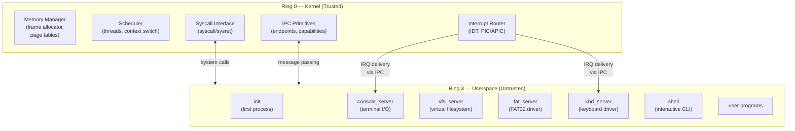
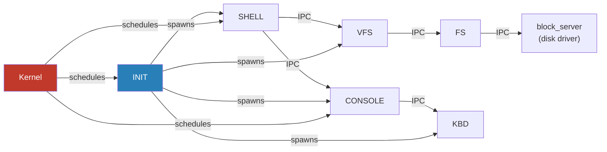
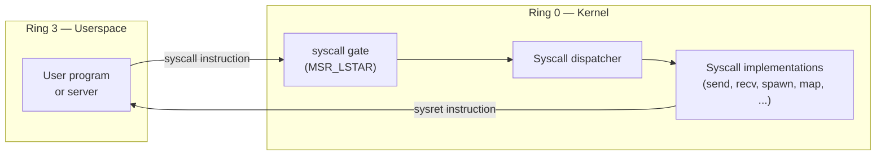

# Architecture and Syscall Reference

**Type:** Cross-cutting reference (not aligned to a single phase)
**Supersedes:** `docs/01-architecture.md`, `docs/07-userspace.md`

This document combines the microkernel architecture overview with the
userspace and syscall reference. It describes the intended design of m3OS
at a high level. For phase-specific implementation details, see the
individual learning docs and roadmap phases.

---

## Overview

m3OS follows a **microkernel architecture**: the kernel runs in privileged mode (ring 0)
and does the absolute minimum — memory management, thread scheduling, IPC, and interrupt
routing. Everything else (drivers, filesystems, network stack) is *intended* to run in
**userspace servers** communicating via IPC.

This is philosophically similar to [L4](https://l4.org/), [seL4](https://sel4.systems/),
and [Redox OS](https://redox-os.org/).

> **Note:** The current implementation deviates significantly from this target.
> See [Current Architecture](#current-architecture) and [Target Architecture](#target-architecture)
> below for a gap analysis.

---

## Privilege Rings



---

## Component Relationships



---

## What Lives in the Kernel (Target)

These components are *intended* to be the only things in ring 0 at the target architecture:

| Kernel Component | Responsibility |
|---|---|
| Frame allocator | Tracks which physical pages are free/used |
| Page table manager | Maps virtual -> physical addresses, enforces isolation |
| Scheduler | Picks which thread runs next; handles preemption |
| IPC engine | Transfers messages between threads; blocks/unblocks |
| IDT & exception handlers | CPU faults, hardware interrupt dispatch |
| Capability system | Unforgeable references to kernel objects |
| Syscall gate | Entry/exit point between ring 3 and ring 0 |

## What Lives in the Kernel (Current Reality)

In addition to the target components above, the kernel currently also contains:

| In-Kernel Component | Intended Location | Status |
|---|---|---|
| VFS layer (`fs/vfs.rs`) | Ring 3 server | Transition — runs as kernel task |
| FAT32 driver (`fs/fat32.rs`) | Ring 3 server | Transition — kernel task |
| ext2 driver (`fs/ext2.rs`) | Ring 3 server | Transition — kernel task |
| ramdisk (`fs/ramdisk.rs`) | Ring 3 server | Transition — kernel task |
| tmpfs (`fs/tmpfs.rs`) | Ring 3 server | Transition — kernel task |
| procfs (`fs/procfs.rs`) | Ring 3 server | Transition — kernel task |
| TCP/UDP/ICMP stack (`net/`) | Ring 3 server | Transition — kernel code |
| ARP (`net/arp.rs`) | Ring 3 server | Transition — kernel code |
| Socket table (`net/mod.rs`) | Ring 3 server | Transition — kernel code |
| Unix sockets (`net/unix.rs`) | Ring 3 server | Transition — kernel code |
| VirtIO-net driver (`net/virtio_net.rs`) | Ring 3 driver | Transition — kernel driver |
| VirtIO-blk driver (`blk/`) | Ring 3 driver | Transition — kernel driver |
| TTY subsystem (`tty.rs`) | Ring 3 server | Transition — kernel code |
| PTY subsystem (`pty.rs`) | Ring 3 server | Transition — kernel code |
| Signal delivery (`signal.rs`) | Keep (kernel) | Correctly placed |
| Framebuffer console (`fb/`) | Ring 3 server | Transition — kernel driver |
| console_server_task | Ring 3 server | Runs as kernel task in `main.rs` |
| kbd_server_task | Ring 3 server | Runs as kernel task in `main.rs` |
| fat_server_task | Ring 3 server | Runs as kernel task in `main.rs` |
| vfs_server_task | Ring 3 server | Runs as kernel task in `main.rs` |
| net_task | Ring 3 server | Runs as kernel task in `main.rs` |

## What Lives in Userspace

| Server | Responsibility |
|---|---|
| `init` | First process (PID 1); service manager, spawns servers, reaps orphans |
| `shell` | Interactive command interpreter (sh0) |
| `login` | Authentication and session management |
| `telnetd` | Telnet server daemon |
| `sshd` | SSH server daemon |
| `syslogd` | System logging daemon |
| `crond` | Cron scheduler daemon |
| coreutils | cat, ls, grep, cp, mv, rm, etc. |
| coreutils-rs | Rust reimplementations + system tools |

---

## Privilege Transition



The `syscall`/`sysret` instruction pair (AMD64) is faster than the legacy `int 0x80`
approach. The kernel sets `MSR_LSTAR` to the address of the syscall entry stub.

---

## Syscall ABI

| Register | Role |
|---|---|
| `rax` | Syscall number (input) / return value (output) |
| `rdi` | Argument 1 |
| `rsi` | Argument 2 |
| `rdx` | Argument 3 |
| `r10` | Argument 4 (note: not `rcx` — that's clobbered by `syscall`) |
| `r8`  | Argument 5 |
| `r9`  | Argument 6 |

`rcx` and `r11` are clobbered by the `syscall` instruction itself (they save `rip`
and `rflags` respectively).

---

## Virtual Address Space Layout

Each process has its own virtual address space. The kernel is mapped into the top of
every address space (but protected by page permissions — userspace cannot access it).

```
Virtual Address Space (x86_64, 48-bit)
+-------------------------------------+ 0xFFFF_FFFF_FFFF_FFFF
|                                     |
|         Kernel Space                |  <- ring 0 only, shared across all processes
|   (kernel code, heap, page tables)  |
|                                     |
+-------------------------------------+ 0xFFFF_8000_0000_0000
|                                     |
|  [non-canonical hole -- invalid]    |
|                                     |
+-------------------------------------+ 0x0000_7FFF_FFFF_FFFF
|                                     |
|         Userspace                   |  <- ring 3 accessible
|   (code, data, stack, heap)         |
|                                     |
+-------------------------------------+ 0x0000_0000_0000_0000
```

### Per-Process Address Space

```
User Virtual Address Space
+------------------------------------+ 0x0000_7FFF_FFFF_FFFF
| Stack (grows down)                 |
|  v                                 |
+------------------------------------+ stack top
|                                    |
| ...                                |
|                                    |
+------------------------------------+
| Heap (grows up)                    |
|  ^                                 |
+------------------------------------+ heap start
| BSS segment (.bss)                 |
+------------------------------------+
| Data segment (.data)               |
+------------------------------------+
| Read-only data (.rodata)           |
+------------------------------------+
| Code segment (.text)               |
+------------------------------------+ 0x0000_0000_0040_0000
```

---

## Entering Userspace (First Ring 3 Task)

The kernel performs a controlled jump into ring 3 for the first time to start
`init`. This uses `iretq` with a crafted stack frame that sets:

- `CS` = user code segment selector (RPL=3)
- `SS` = user data segment selector (RPL=3)
- `RFLAGS` = interrupts enabled, IOPL=0
- `RIP` = entry point of `init`
- `RSP` = top of user stack

```rust
pub unsafe fn enter_userspace(entry: VirtAddr, user_stack_top: VirtAddr) -> ! {
    asm!(
        "push {ss}",        // SS
        "push {rsp}",       // RSP
        "push {rflags}",    // RFLAGS (interrupts enabled)
        "push {cs}",        // CS
        "push {rip}",       // RIP (entry point)
        "iretq",
        ss     = in(reg) GDT.user_data.0,
        rsp    = in(reg) user_stack_top.as_u64(),
        rflags = in(reg) 0x200u64, // IF=1
        cs     = in(reg) GDT.user_code.0,
        rip    = in(reg) entry.as_u64(),
        options(noreturn)
    );
}
```

---

## Design Principles

1. **Minimal kernel** — If something can run in ring 3, it does.
2. **IPC is the only channel** — Servers communicate only through the kernel's IPC mechanism; no shared writable memory by default.
3. **Isolation by default** — Each process has its own page table root; bugs in one server cannot corrupt another.
4. **No kernel modules** — Drivers are userspace processes. Adding a driver means adding a new server binary, not modifying the kernel.

---

## Current Architecture

Today (v0.50.0), m3OS is architecturally a **monolithic kernel with microkernel IPC
infrastructure**. All subsystems run in ring 0:

- **Memory** (mm/): buddy frame allocator, slab caches, page tables, heap, ELF loader,
  demand paging, mprotect, munmap — all ring 0.
- **Scheduler** (task/): SMP-aware round-robin with priority scheduling, per-CPU run
  queues, load balancing — ring 0.
- **IPC** (ipc/): seL4-style synchronous rendezvous endpoints, async notifications,
  capability tables — ring 0 (correctly placed).
- **Process management** (process/): fork, exec, exit, wait, threads, futex — ring 0.
- **Filesystem** (fs/): VFS routing, FAT32, ext2, ramdisk, tmpfs, procfs — all run as
  kernel tasks via `fat_server_task` / `vfs_server_task` in `main.rs`.
- **Network** (net/): full IPv4/TCP/UDP/ICMP/ARP stack, Unix domain sockets, socket
  table — all ring 0 kernel code, driven by `net_task` in `main.rs`.
- **Drivers**: VirtIO-blk, VirtIO-net, framebuffer, serial, keyboard, RTC — all ring 0.
- **TTY/PTY** (tty.rs, pty.rs): terminal subsystem — ring 0.
- **Signals** (signal.rs): POSIX signal delivery — ring 0.
- **SMP** (smp/): AP boot, IPI, TLB shootdown — ring 0 (correctly placed).

The kernel-resident service tasks (`console_server_task`, `kbd_server_task`,
`fat_server_task`, `vfs_server_task`, `net_task`) use the IPC endpoint infrastructure
but run entirely in kernel address space with ring-0 privileges. The `stdin_feeder_task`
and `serial_stdin_feeder_task` are transitional glue that bridge hardware interrupts to
the IPC-based server model.

True userspace processes (init, shell, login, telnetd, sshd, coreutils) communicate with
the kernel via the Linux-compatible syscall ABI (~90 syscalls), bypassing the IPC
endpoints entirely for filesystem and network operations.

---

## Target Architecture

The target microkernel architecture keeps only these primitives in ring 0:

1. **Memory management** — frame allocator, page tables, address space creation/destruction
2. **Scheduler** — thread state, context switch, CPU dispatch, SMP coordination
3. **IPC** — synchronous endpoints, async notifications, capability validation
4. **Process lifecycle** — fork, exec, exit, wait (the mechanism, not policy)
5. **Interrupt routing** — IDT, APIC, EOI, IRQ-to-notification delivery
6. **Hardware access control** — I/O port and MMIO capability grants

Everything else moves to ring-3 servers:

- **Filesystem server** — VFS routing, FAT32, ext2, tmpfs, procfs
- **Block driver** — VirtIO-blk (with kernel-granted I/O capabilities)
- **Network server** — TCP/UDP/ICMP/ARP protocol stack
- **Network driver** — VirtIO-net (with kernel-granted I/O capabilities)
- **Console server** — framebuffer, serial output
- **Keyboard server** — scancode translation
- **TTY/PTY server** — terminal line discipline, pseudo-terminal management

---

## Architecture Gap Analysis

| Aspect | Current | Target | Gap |
|---|---|---|---|
| FS implementation | Ring 0 kernel tasks (~3,842 lines) | Ring 3 server | Full extraction needed |
| Network stack | Ring 0 kernel code (~2,205 lines) | Ring 3 server | Full extraction needed |
| VirtIO drivers | Ring 0 | Ring 3 with I/O caps | Driver extraction needed |
| TTY/PTY | Ring 0 | Ring 3 server | Extraction needed |
| Console/keyboard | Ring 0 kernel tasks | Ring 3 servers | IPC path exists, need true ring-3 |
| Syscall surface | ~90 monolithic syscalls | ~15 kernel + IPC forwarding | Decomposition needed |
| Service tasks | Kernel threads in `main.rs` | Userspace ELF binaries | Process migration needed |

The IPC infrastructure (endpoints, capabilities, notifications) is in place and functional.
The primary work remaining is extracting policy code from ring 0 into ring-3 servers and
converting the monolithic syscall surface into IPC-forwarded operations.

---

## Keep / Move / Transition Matrix

Every major kernel subsystem classified by its microkernel ownership:

- **Keep** = permanently ring 0 (hardware mediation, scheduler, memory, IPC, interrupt handling)
- **Move** = target is ring 3 (filesystem, network protocol stack, console, keyboard)
- **Transition** = currently ring 0, expected to move but no immediate plan

For Move/Transition subsystems, the migration stage refers to the planned extraction order.

| Subsystem | Classification | Justification | Migration Stage |
|---|---|---|---|
| mm (buddy+slab+paging) | Keep | Physical memory and address space isolation require ring-0 privilege | N/A |
| scheduler (task/) | Keep | CPU dispatch and context switching require ring-0 privilege | N/A |
| ipc (endpoints+caps+notif) | Keep | IPC is the kernel's core communication primitive in a microkernel | N/A |
| process (fork/exec/exit/wait) | Keep | Process lifecycle management requires ring-0 page table and privilege control | N/A |
| signal | Keep | Signal delivery requires ring-0 stack manipulation and register restoration | N/A |
| smp | Keep | AP boot, IPI, and TLB shootdown require ring-0 APIC and CR3 access | N/A |
| acpi | Keep | ACPI table parsing runs once at boot and requires physical memory access | N/A |
| pci | Keep | PCI enumeration requires I/O port access; runs once at boot | N/A |
| serial | Keep | Primary debug output; must remain available even during kernel panics | N/A |
| rtc | Keep | CMOS RTC requires direct I/O port access (ports 0x70/0x71) | N/A |
| blk/virtio_blk | Move | Hardware driver — can run in ring 3 with kernel-granted I/O capabilities | Stage 2 |
| net/virtio_net | Move | Hardware driver — can run in ring 3 with kernel-granted I/O capabilities | Stage 2 |
| fb (framebuffer) | Move | Display driver — can run in ring 3 with MMIO capability grant | Stage 2 |
| fs/fat32 | Move | Filesystem policy — pure data structure manipulation, no hardware access | Stage 3 |
| fs/ext2 | Move | Filesystem policy — pure data structure manipulation, no hardware access | Stage 3 |
| fs/ramdisk | Move | Filesystem policy — memory-backed file serving | Stage 3 |
| fs/tmpfs | Move | Filesystem policy — memory-backed writable filesystem | Stage 3 |
| fs/procfs | Move | Filesystem policy — virtual filesystem exposing kernel state via IPC | Stage 3 |
| fs/vfs | Transition | VFS routing is policy, but currently tightly coupled to in-kernel FS backends | Stage 3 |
| fs/protocol | Keep | IPC message protocol definitions shared between kernel and servers | N/A |
| net/tcp | Move | Protocol stack policy — no hardware access needed | Stage 4 |
| net/udp | Move | Protocol stack policy — no hardware access needed | Stage 4 |
| net/icmp | Move | Protocol stack policy — no hardware access needed | Stage 4 |
| net/arp | Move | Protocol stack policy — no hardware access needed | Stage 4 |
| net/ipv4 | Move | Protocol stack policy — no hardware access needed | Stage 4 |
| net/unix | Transition | Unix domain sockets use kernel-internal buffer management; extraction requires IPC redesign | Stage 4 |
| net/mod (socket table) | Transition | Socket lifecycle management is policy but deeply integrated with syscall layer | Stage 4 |
| tty | Transition | TTY line discipline is policy but signal delivery coupling keeps it ring-0 for now | Stage 3 |
| pty | Move | PTY pairs are pure data buffering — can run as ring-3 server | Stage 3 |
| kbd/keyboard/input | Move | Input device driver — can run in ring 3 with IRQ notification capabilities | Stage 2 |

### Migration Stages

- **Stage 0** (complete): All subsystems in ring 0. IPC infrastructure exists but servers run as kernel tasks.
- **Stage 1** (complete): Syscall surface decomposed (Phase 49). IPC transport model completed with capability grants, bulk-data paths, ring-3-safe registry, and server-loop failure semantics (Phase 50).
- **Stage 2**: Hardware drivers (VirtIO-blk, VirtIO-net, framebuffer, keyboard/input) extracted to ring-3 with I/O capability grants.
- **Stage 3**: Filesystem stack extracted to ring-3 VFS/FS servers. Syscalls forwarded via IPC.
- **Stage 4**: Network protocol stack extracted to ring-3 network server. Socket syscalls forwarded via IPC.

---

## Syscall Ownership Classification

All ~90 implemented syscalls classified by owning subsystem and whether they implement
kernel mechanism (must stay ring-0) or policy/compatibility (extraction candidate).

**Mechanism** syscalls perform operations that inherently require ring-0 privilege
(page table manipulation, context switching, signal frame setup, I/O port access).

**Policy/compat** syscalls implement POSIX compatibility or filesystem/network policy
that could be forwarded to a ring-3 server via IPC in the target architecture.

| Number | Name | Subsystem | Classification | Notes |
|---|---|---|---|---|
| 0 | read | io | Policy/compat | Dispatches to FD-based backends; forward to FS/net server (Stage 3-4) |
| 1 | write | io | Policy/compat | Dispatches to FD-based backends; forward to FS/net server (Stage 3-4) |
| 2 | open | fs | Policy/compat | Path resolution and file creation; forward to VFS server (Stage 3) |
| 3 | close | io | Policy/compat | FD table cleanup; forward to owning server (Stage 3-4) |
| 4 | stat | fs | Policy/compat | File metadata via path; forward to VFS server (Stage 3) |
| 5 | fstat | fs | Policy/compat | File metadata via FD; forward to VFS server (Stage 3) |
| 6 | lstat | fs | Policy/compat | Symlink-aware stat; forward to VFS server (Stage 3) |
| 7 | poll | io | Policy/compat | I/O multiplexing; forward to owning servers (Stage 3-4) |
| 8 | lseek | fs | Policy/compat | File position management; forward to FS server (Stage 3) |
| 9 | mmap | mm | Mechanism | Page table manipulation requires ring-0 privilege |
| 10 | mprotect | mm | Mechanism | Page permission changes require ring-0 page table access |
| 11 | munmap | mm | Mechanism | Page table teardown requires ring-0 privilege |
| 12 | brk | mm | Mechanism | Heap expansion via page table manipulation |
| 13 | rt_sigaction | signal | Mechanism | Signal handler registration modifies kernel-internal signal tables |
| 14 | rt_sigprocmask | signal | Mechanism | Signal mask manipulation is per-thread kernel state |
| 15 | rt_sigreturn | signal | Mechanism | Restores user register frame from signal stack — requires ring-0 |
| 16 | ioctl | io | Policy/compat | Terminal/device control; forward to device server (Stage 2-3) |
| 19 | readv | io | Policy/compat | Scatter-gather read; wrapper over read (Stage 3-4) |
| 20 | writev | io | Policy/compat | Scatter-gather write; wrapper over write (Stage 3-4) |
| 21 | access | fs | Policy/compat | Permission check; forward to VFS server (Stage 3) |
| 22 | pipe | io | Policy/compat | Pipe creation; could be IPC-managed (Stage 3) |
| 23 | select | io | Policy/compat | I/O multiplexing; forward to owning servers (Stage 3-4) |
| 32 | dup | io | Policy/compat | FD table manipulation (Stage 3) |
| 33 | dup2 | io | Policy/compat | FD table manipulation (Stage 3) |
| 34 | nice | process | Mechanism | Priority adjustment modifies scheduler state |
| 35 | nanosleep | time | Mechanism | Timer-based blocking via scheduler sleep queues |
| 39 | getpid | process | Mechanism | Returns kernel-maintained PID |
| 41 | socket | net | Policy/compat | Socket creation; forward to network server (Stage 4) |
| 42 | connect | net | Policy/compat | TCP/Unix connection; forward to network server (Stage 4) |
| 43 | accept | net | Policy/compat | Connection acceptance; forward to network server (Stage 4) |
| 44 | sendto | net | Policy/compat | Network send; forward to network server (Stage 4) |
| 45 | recvfrom | net | Policy/compat | Network receive; forward to network server (Stage 4) |
| 48 | shutdown | net | Policy/compat | Socket shutdown; forward to network server (Stage 4) |
| 49 | bind | net | Policy/compat | Socket binding; forward to network server (Stage 4) |
| 50 | listen | net | Policy/compat | Socket listen; forward to network server (Stage 4) |
| 51 | getsockname | net | Policy/compat | Socket query; forward to network server (Stage 4) |
| 52 | getpeername | net | Policy/compat | Socket query; forward to network server (Stage 4) |
| 53 | socketpair | net | Policy/compat | Socket pair creation; forward to network server (Stage 4) |
| 54 | setsockopt | net | Policy/compat | Socket options; forward to network server (Stage 4) |
| 55 | getsockopt | net | Policy/compat | Socket options; forward to network server (Stage 4) |
| 56 | clone | process | Mechanism | Thread/process creation requires page table + stack setup |
| 57 | fork | process | Mechanism | Address space duplication requires ring-0 page table cloning |
| 59 | execve | process | Mechanism | ELF loading and address space replacement require ring-0 |
| 60 | exit | process | Mechanism | Process teardown requires ring-0 resource cleanup |
| 61 | wait4 | process | Mechanism | Process status collection from kernel-maintained process table |
| 62 | kill | signal | Mechanism | Signal delivery to kernel-maintained process/thread structures |
| 63 | uname | misc | Policy/compat | Returns static identity string (Stage 1) |
| 72 | fcntl | io | Policy/compat | FD flag manipulation; forward to owning server (Stage 3) |
| 74 | fsync | fs | Policy/compat | Sync to storage; forward to FS server (Stage 3) |
| 76 | truncate | fs | Policy/compat | File truncation; forward to FS server (Stage 3) |
| 77 | ftruncate | fs | Policy/compat | File truncation via FD; forward to FS server (Stage 3) |
| 79 | getcwd | fs | Policy/compat | Working directory query; forward to VFS server (Stage 3) |
| 80 | chdir | fs | Policy/compat | Working directory change; forward to VFS server (Stage 3) |
| 82 | rename | fs | Policy/compat | File rename; forward to FS server (Stage 3) |
| 83 | mkdir | fs | Policy/compat | Directory creation; forward to FS server (Stage 3) |
| 84 | rmdir | fs | Policy/compat | Directory removal; forward to FS server (Stage 3) |
| 86 | link | fs | Policy/compat | Hard link creation; forward to FS server (Stage 3) |
| 87 | unlink | fs | Policy/compat | File deletion; forward to FS server (Stage 3) |
| 88 | symlink | fs | Policy/compat | Symbolic link creation; forward to FS server (Stage 3) |
| 89 | readlink | fs | Policy/compat | Symbolic link reading; forward to FS server (Stage 3) |
| 90 | chmod | fs | Policy/compat | Permission change; forward to FS server (Stage 3) |
| 91 | fchmod | fs | Policy/compat | Permission change via FD; forward to FS server (Stage 3) |
| 92 | chown | fs | Policy/compat | Ownership change; forward to FS server (Stage 3) |
| 93 | fchown | fs | Policy/compat | Ownership change via FD; forward to FS server (Stage 3) |
| 95 | umask | process | Policy/compat | Per-process file creation mask (Stage 3) |
| 96 | gettimeofday | time | Mechanism | Reads kernel-maintained wall clock |
| 100 | times | time | Mechanism | Returns kernel-maintained per-process CPU tick counters |
| 102 | getuid | process | Mechanism | Returns kernel-maintained credential |
| 104 | getgid | process | Mechanism | Returns kernel-maintained credential |
| 105 | setuid | process | Mechanism | Modifies kernel-maintained credential with privilege check |
| 106 | setgid | process | Mechanism | Modifies kernel-maintained credential with privilege check |
| 107 | geteuid | process | Mechanism | Returns kernel-maintained credential |
| 108 | getegid | process | Mechanism | Returns kernel-maintained credential |
| 109 | setpgid | process | Mechanism | Process group manipulation in kernel process table |
| 110 | getppid | process | Mechanism | Returns kernel-maintained parent PID |
| 111 | getpgrp | process | Mechanism | Returns kernel-maintained process group |
| 112 | setsid | process | Mechanism | Session creation modifies kernel process table |
| 113 | setreuid | process | Mechanism | Credential manipulation with privilege check |
| 114 | setregid | process | Mechanism | Credential manipulation with privilege check |
| 121 | getpgid | process | Mechanism | Returns kernel-maintained process group |
| 124 | getsid | process | Mechanism | Returns kernel-maintained session ID |
| 131 | sigaltstack | signal | Mechanism | Alternate signal stack setup modifies kernel-internal state |
| 137 | statfs | fs | Policy/compat | Filesystem metadata; forward to FS server (Stage 3) |
| 138 | fstatfs | fs | Policy/compat | Filesystem metadata via FD; forward to FS server (Stage 3) |
| 158 | arch_prctl | mm | Mechanism | Sets FS base register (ARCH_SET_FS) — ring-0 MSR write |
| 165 | mount | fs | Policy/compat | Mount management; forward to VFS server (Stage 3) |
| 166 | umount2 | fs | Policy/compat | Unmount; forward to VFS server (Stage 3) |
| 169 | reboot | misc | Mechanism | System halt/restart requires ring-0 I/O port access |
| 186 | gettid | process | Mechanism | Returns kernel-maintained thread ID |
| 200 | tkill | signal | Mechanism | Thread-directed signal delivery |
| 202 | futex | process | Mechanism | Futex wait/wake operates on kernel wait queues |
| 203 | sched_setaffinity | process | Mechanism | CPU affinity modifies scheduler-internal state |
| 204 | sched_getaffinity | process | Mechanism | Returns scheduler-internal CPU affinity mask |
| 217 | getdents64 | fs | Policy/compat | Directory listing; forward to FS server (Stage 3) |
| 218 | set_tid_address | process | Mechanism | Thread TID pointer for futex-based thread exit |
| 228 | clock_gettime | time | Mechanism | Reads kernel-maintained monotonic/realtime clocks |
| 231 | exit_group | process | Mechanism | Thread group termination requires ring-0 cleanup |
| 232 | epoll_wait | io | Policy/compat | I/O multiplexing; forward to owning servers (Stage 3-4) |
| 233 | epoll_ctl | io | Policy/compat | Epoll registration; forward to owning servers (Stage 3-4) |
| 257 | openat | fs | Policy/compat | AT-relative open; forward to VFS server (Stage 3) |
| 262 | newfstatat | fs | Policy/compat | AT-relative stat; forward to VFS server (Stage 3) |
| 265 | linkat | fs | Policy/compat | AT-relative link; forward to FS server (Stage 3) |
| 266 | symlinkat | fs | Policy/compat | AT-relative symlink; forward to FS server (Stage 3) |
| 267 | readlinkat | fs | Policy/compat | AT-relative readlink; forward to FS server (Stage 3) |
| 270 | pselect6 | io | Policy/compat | I/O multiplexing; forward to owning servers (Stage 3-4) |
| 273 | set_robust_list | misc | Policy/compat | Stub (returns 0) |
| 280 | utimensat | fs | Policy/compat | Timestamp modification; forward to FS server (Stage 3) |
| 288 | accept4 | net | Policy/compat | Connection acceptance with flags; forward to network server (Stage 4) |
| 291 | epoll_create1 | io | Policy/compat | Epoll instance creation (Stage 3-4) |
| 292 | dup3 | io | Policy/compat | FD table manipulation (Stage 3) |
| 293 | pipe2 | io | Policy/compat | Pipe creation with flags (Stage 3) |
| 302 | prlimit64 | misc | Policy/compat | Stub (returns ENOSYS) |
| 318 | getrandom | misc | Mechanism | CSPRNG access — reads kernel entropy pool |
| 0x1000 | debug_print | misc | Mechanism | Direct serial output for kernel debugging |
| 0x1001 | meminfo | mm | Mechanism | Kernel memory statistics from allocator internals |
| 0x1002 | ktrace | misc | Mechanism | Kernel trace ring access |
| 0x1003 | ipc_cap_grant | ipc | Mechanism | Capability transfer between task capability tables — ring-0 table manipulation (Phase 50) |
| 0x1005 | framebuffer_info | misc | Policy/compat | Framebuffer metadata; forward to display server (Stage 2) |
| 0x1006 | framebuffer_mmap | mm | Mechanism | Maps framebuffer MMIO into user address space — ring-0 page table op |
| 0x1007 | read_scancode | misc | Policy/compat | Raw keyboard input; forward to keyboard server (Stage 2) |

### Summary

| Classification | Count | Percentage |
|---|---|---|
| Mechanism (ring-0 required) | ~36 | ~39% |
| Policy/compat (extraction candidate) | ~55 | ~60% |

The ~55 policy/compat syscalls are candidates for IPC forwarding in Stages 2-4.
The ~35 mechanism syscalls must remain in ring 0 as they require direct hardware
access, page table manipulation, or scheduler/process table operations.

---

## Userspace-First Rule

New high-level policy defaults to userspace implementation unless a documented
ring-0 justification is provided.

This rule exists to prevent the kernel from growing by convenience. As m3OS
moves toward a properly enforced microkernel boundary, the default placement
for any new subsystem, protocol handler, policy module, or service is
**userspace (ring 3)**.

### Valid justifications for ring-0 placement

Code belongs in the kernel only when one or more of the following apply:

1. **Hardware mediation** -- the code requires direct access to privileged
   hardware registers, MMIO regions, or I/O ports that cannot be safely
   delegated to a userspace driver without kernel support.
2. **Scheduler or memory primitives** -- the code implements core scheduling
   decisions, page table manipulation, frame allocation, or address-space
   management that fundamentally requires ring-0 privilege.
3. **Interrupt handling** -- the code is part of the minimal interrupt service
   routine path (ISR entry, device acknowledgment, EOI, ring-buffer push) that
   must execute before returning to the interrupted context.
4. **IPC mechanism** -- the code implements the IPC fast path, capability
   validation, endpoint/notification object management, or other primitives
   that form the kernel's communication substrate.

### Documenting a ring-0 exception

When a phase design doc proposes placing policy-heavy code in ring 0, the
author must add a **Ring-0 Justification** section to that phase's design
document. The section must:

1. Name the specific code or subsystem being placed in ring 0.
2. State which valid justification(s) from the list above apply.
3. Explain why a userspace implementation is not practical for this case.
4. Declare whether the placement is **permanent** (mechanism that inherently
   requires ring 0) or **transitional** (will be moved to userspace when
   prerequisites like IPC buffer grants are available).

If no Ring-0 Justification section exists and the code adds policy to ring 0,
the phase should be treated as incomplete.

---

## Architecture Review Checklist

Use this checklist when evaluating whether new code belongs in ring 0 or
userspace. Any "yes" answer without a documented Ring-0 Justification is a
sign that the code should be reconsidered.

- [ ] **Syscall surface growth** -- Does this change add new syscall numbers?
  Each new syscall widens the kernel's attack surface and ABI commitment.
  Prefer routing new functionality through existing IPC or file-descriptor
  interfaces rather than adding kernel entry points.

- [ ] **New kernel-resident service tasks** -- Does this change introduce a new
  long-running task or server loop inside the kernel? Kernel tasks share
  ring-0 fate with the scheduler and memory manager. Services that can crash
  independently should be userspace processes supervised by init.

- [ ] **New policy logic in existing kernel modules** -- Does this change add
  decision-making, configuration parsing, access-control rules, or protocol
  state machines to an existing kernel module? Policy accumulation is the
  primary way kernels grow beyond their intended scope. Prefer thin kernel
  mechanisms that delegate policy to userspace.

- [ ] **New filesystem or network protocol handling** -- Does this change add a
  new filesystem type, network protocol, or socket family implementation
  inside the kernel? These are classic candidates for userspace servers in a
  microkernel. Unless the protocol requires interrupt-level or page-table-level
  integration, it should be a userspace service.

- [ ] **Shared-state assumptions** -- Does this change rely on accessing
  another subsystem's internal state directly (e.g., reading scheduler
  structures from a filesystem module)? Cross-subsystem coupling in ring 0
  makes future extraction harder. Prefer explicit interfaces that could later
  become IPC boundaries.

---

## Related Docs

- [Phase 5 — Userspace Entry](../05-userspace-entry.md) — Ring 3 execution model
- [Phase 6 — IPC](../06-ipc.md) — IPC implementation details
- [Phase 7 — Core Servers](../07-core-servers.md) — Server infrastructure
- [Phase 12 — POSIX Compat](../12-posix-compatibility-layer.md) — Linux syscall ABI
- [Roadmap Guide](../roadmap/README.md) — Per-phase milestones
