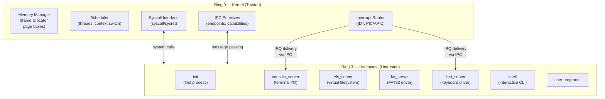
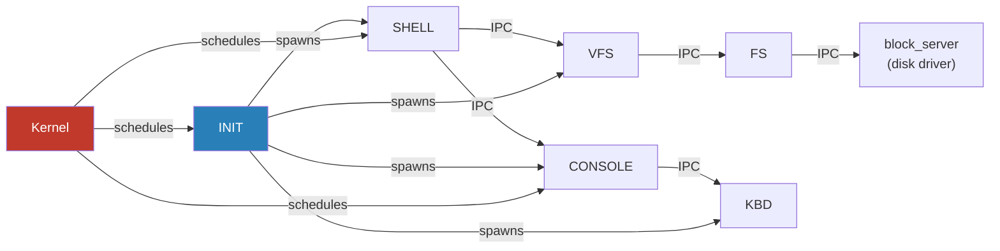
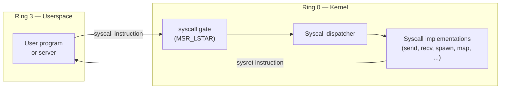

# Architecture and Syscall Reference

**Type:** Cross-cutting reference (not aligned to a single phase)
**Supersedes:** `docs/01-architecture.md`, `docs/07-userspace.md`

This document combines the microkernel architecture overview with the
userspace and syscall reference. It describes the intended design of m3OS
at a high level. For phase-specific implementation details, see the
individual learning docs and roadmap phases.

---

## Overview

m3OS follows a **microkernel architecture**: the kernel runs in privileged mode (ring 0)
and does the absolute minimum — memory management, thread scheduling, IPC, and interrupt
routing. Everything else (drivers, filesystems, network stack) runs in **userspace servers**
communicating via IPC.

This is philosophically similar to [L4](https://l4.org/), [seL4](https://sel4.systems/),
and [Redox OS](https://redox-os.org/).

---

## Privilege Rings



---

## Component Relationships



---

## What Lives in the Kernel

| Kernel Component | Responsibility |
|---|---|
| Frame allocator | Tracks which physical pages are free/used |
| Page table manager | Maps virtual -> physical addresses, enforces isolation |
| Scheduler | Picks which thread runs next; handles preemption |
| IPC engine | Transfers messages between threads; blocks/unblocks |
| IDT & exception handlers | CPU faults, hardware interrupt dispatch |
| Capability system | Unforgeable references to kernel objects |
| Syscall gate | Entry/exit point between ring 3 and ring 0 |

## What Lives in Userspace

| Server | Responsibility |
|---|---|
| `init` | First process (PID 1); spawns all other servers; reaps orphans |
| `console_server` | Wraps serial/VGA/framebuffer; provides read/write IPC |
| `vfs_server` | Namespace, mount points, path resolution |
| `fat_server` | FAT32 filesystem implementation |
| `block_server` | Disk I/O (ATA/AHCI) |
| `kbd_server` | Keyboard scancode -> key event translation |
| `shell` | Interactive command interpreter |

---

## Privilege Transition



The `syscall`/`sysret` instruction pair (AMD64) is faster than the legacy `int 0x80`
approach. The kernel sets `MSR_LSTAR` to the address of the syscall entry stub.

---

## Syscall ABI

| Register | Role |
|---|---|
| `rax` | Syscall number (input) / return value (output) |
| `rdi` | Argument 1 |
| `rsi` | Argument 2 |
| `rdx` | Argument 3 |
| `r10` | Argument 4 (note: not `rcx` — that's clobbered by `syscall`) |
| `r8`  | Argument 5 |
| `r9`  | Argument 6 |

`rcx` and `r11` are clobbered by the `syscall` instruction itself (they save `rip`
and `rflags` respectively).

---

## Virtual Address Space Layout

Each process has its own virtual address space. The kernel is mapped into the top of
every address space (but protected by page permissions — userspace cannot access it).

```
Virtual Address Space (x86_64, 48-bit)
+-------------------------------------+ 0xFFFF_FFFF_FFFF_FFFF
|                                     |
|         Kernel Space                |  <- ring 0 only, shared across all processes
|   (kernel code, heap, page tables)  |
|                                     |
+-------------------------------------+ 0xFFFF_8000_0000_0000
|                                     |
|  [non-canonical hole -- invalid]    |
|                                     |
+-------------------------------------+ 0x0000_7FFF_FFFF_FFFF
|                                     |
|         Userspace                   |  <- ring 3 accessible
|   (code, data, stack, heap)         |
|                                     |
+-------------------------------------+ 0x0000_0000_0000_0000
```

### Per-Process Address Space

```
User Virtual Address Space
+------------------------------------+ 0x0000_7FFF_FFFF_FFFF
| Stack (grows down)                 |
|  v                                 |
+------------------------------------+ stack top
|                                    |
| ...                                |
|                                    |
+------------------------------------+
| Heap (grows up)                    |
|  ^                                 |
+------------------------------------+ heap start
| BSS segment (.bss)                 |
+------------------------------------+
| Data segment (.data)               |
+------------------------------------+
| Read-only data (.rodata)           |
+------------------------------------+
| Code segment (.text)               |
+------------------------------------+ 0x0000_0000_0040_0000
```

---

## Entering Userspace (First Ring 3 Task)

The kernel performs a controlled jump into ring 3 for the first time to start
`init`. This uses `iretq` with a crafted stack frame that sets:

- `CS` = user code segment selector (RPL=3)
- `SS` = user data segment selector (RPL=3)
- `RFLAGS` = interrupts enabled, IOPL=0
- `RIP` = entry point of `init`
- `RSP` = top of user stack

```rust
pub unsafe fn enter_userspace(entry: VirtAddr, user_stack_top: VirtAddr) -> ! {
    asm!(
        "push {ss}",        // SS
        "push {rsp}",       // RSP
        "push {rflags}",    // RFLAGS (interrupts enabled)
        "push {cs}",        // CS
        "push {rip}",       // RIP (entry point)
        "iretq",
        ss     = in(reg) GDT.user_data.0,
        rsp    = in(reg) user_stack_top.as_u64(),
        rflags = in(reg) 0x200u64, // IF=1
        cs     = in(reg) GDT.user_code.0,
        rip    = in(reg) entry.as_u64(),
        options(noreturn)
    );
}
```

---

## Design Principles

1. **Minimal kernel** — If something can run in ring 3, it does.
2. **IPC is the only channel** — Servers communicate only through the kernel's IPC mechanism; no shared writable memory by default.
3. **Isolation by default** — Each process has its own page table root; bugs in one server cannot corrupt another.
4. **No kernel modules** — Drivers are userspace processes. Adding a driver means adding a new server binary, not modifying the kernel.

---

## Related Docs

- [Phase 5 — Userspace Entry](../05-userspace-entry.md) — Ring 3 execution model
- [Phase 6 — IPC](../06-ipc.md) — IPC implementation details
- [Phase 7 — Core Servers](../07-core-servers.md) — Server infrastructure
- [Phase 12 — POSIX Compat](../12-posix-compatibility-layer.md) — Linux syscall ABI
- [Roadmap Guide](../roadmap/README.md) — Per-phase milestones
