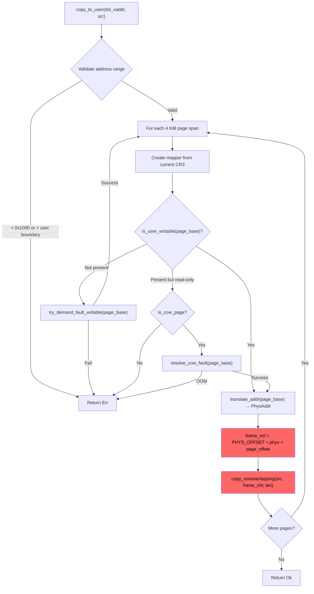
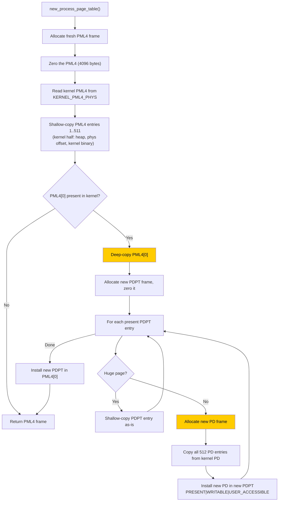
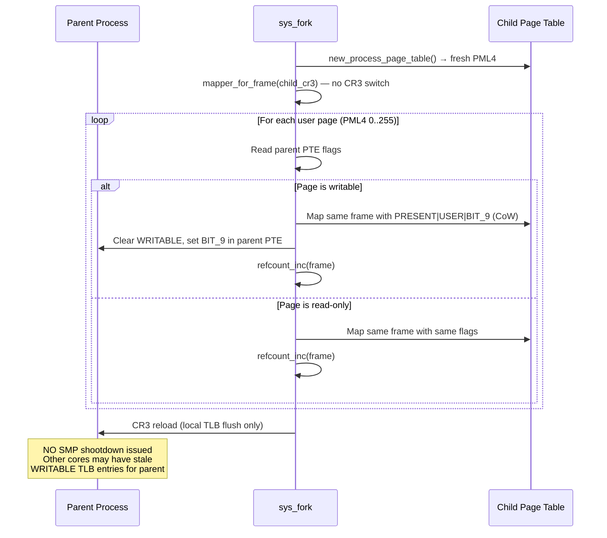
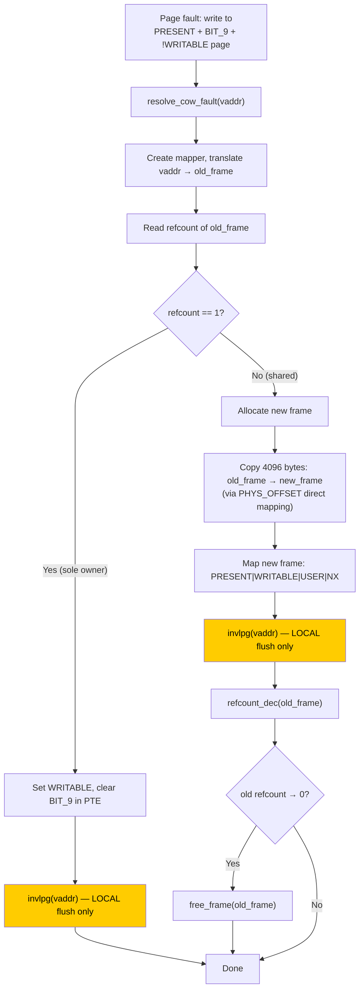
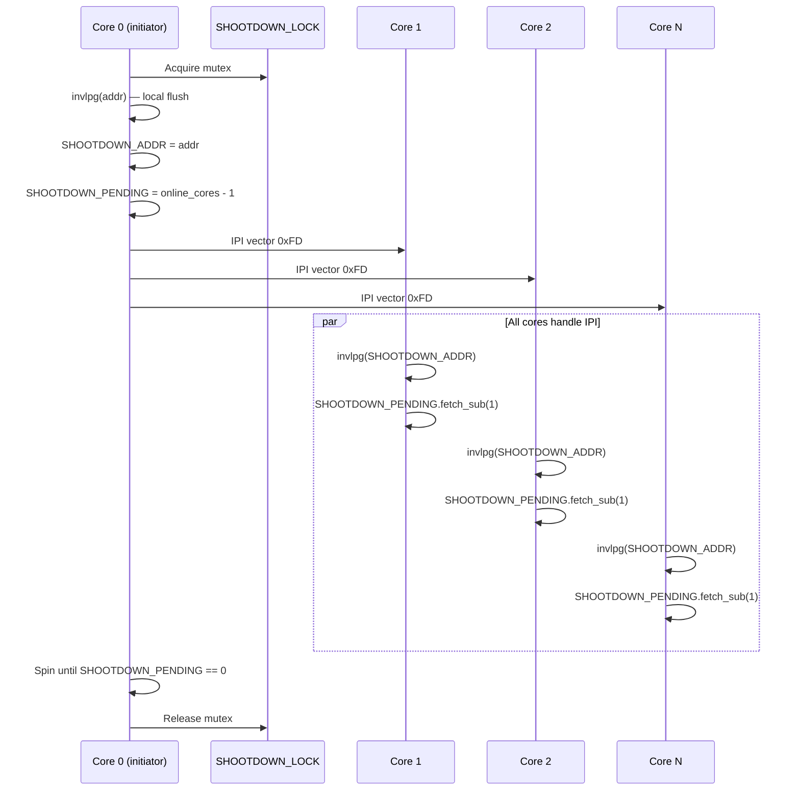
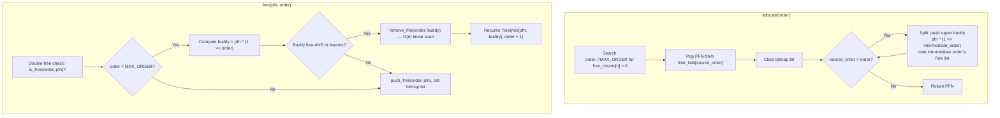
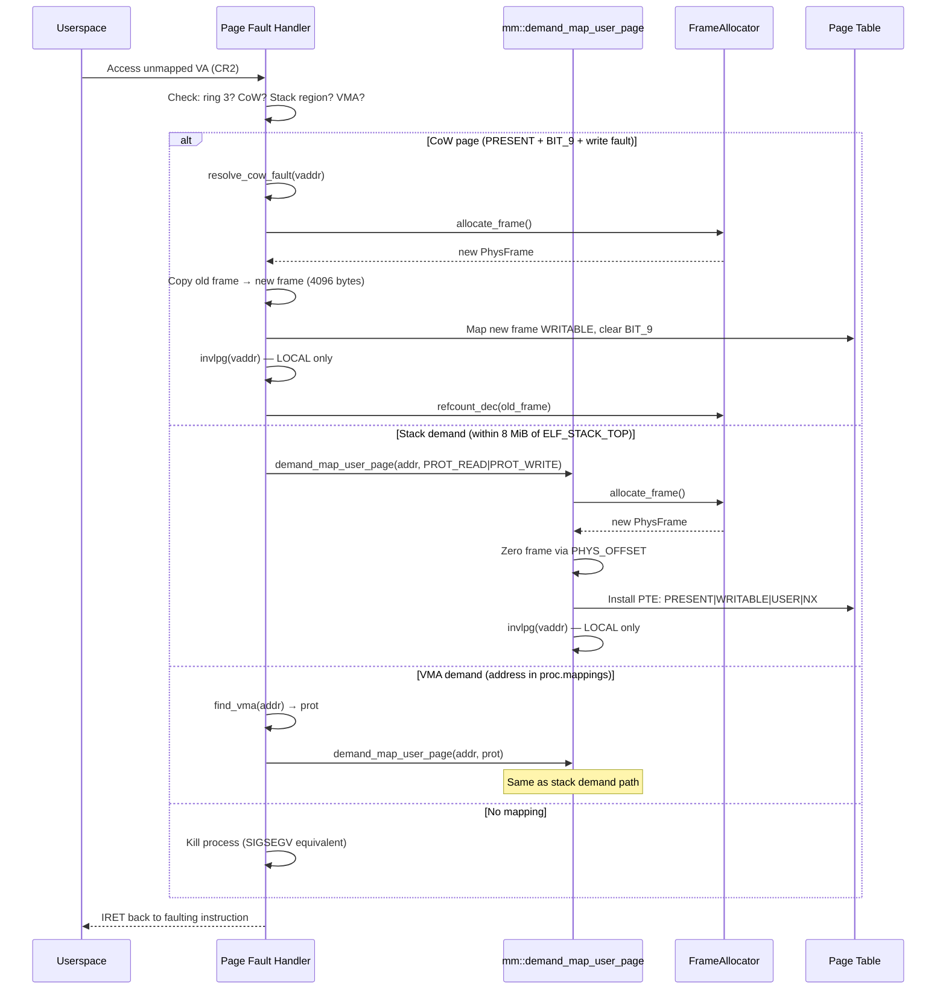

# Current Architecture: Memory Management

**Subsystem:** Page tables, copy_to_user/copy_from_user, TLB management, frame allocator, slab allocator, address space management
**Key source files:**
- `kernel/src/mm/paging.rs` — page table initialization and accessor
- `kernel/src/mm/mod.rs` — MM init, per-process page table create/free
- `kernel/src/mm/user_mem.rs` — copy_to_user, copy_from_user, demand fault helpers
- `kernel/src/mm/frame_allocator.rs` — intrusive free list + buddy allocator
- `kernel/src/mm/heap.rs` — kernel heap (linked_list_allocator)
- `kernel/src/mm/slab.rs` — kernel slab cache wrappers
- `kernel/src/smp/tlb.rs` — TLB shootdown protocol
- `kernel-core/src/buddy.rs` — buddy allocator algorithm
- `kernel-core/src/slab.rs` — slab cache algorithm
- `kernel/src/arch/x86_64/interrupts.rs` — page fault handler, CoW resolution, demand paging

## 1. Overview

m3OS uses x86_64 4-level paging (PML4 -> PDPT -> PD -> PT -> 4 KiB pages). The bootloader provides a physical memory offset mapping that makes all physical memory accessible at `PHYS_OFFSET + phys_addr`. The kernel uses this direct mapping for all kernel-to-user data transfers — `copy_to_user` never writes through user virtual addresses.

Address spaces are not first-class objects. A process's address space is identified by a single `PhysAddr` value (the PML4 physical frame) stored in `Process::page_table_root`. The hardware CR3 register determines which address space is active.

## 2. Address Space Layout

```
Virtual Address Space (48-bit, 256 TiB)
================================================

0x0000_0000_0000_0000  ┌──────────────────────┐
                       │  (unmapped null page) │  Guard: < 0x1000 rejected
0x0000_0000_0040_0000  ├──────────────────────┤
                       │  User code + data     │  ELF loader: USER_VADDR_MIN
                       │  (PT_LOAD segments)   │
                       ├──────────────────────┤
0x0000_0002_0000_0000  │  Heap (brk)          │  BRK_BASE, grows upward
                       │  ↓                    │
                       ├──────────────────────┤
0x0000_0020_0000_0000  │  Anonymous mmap       │  ANON_MMAP_BASE, grows upward
                       │  ↓                    │
                       ├──────────────────────┤
                       │                      │
                       │  (unmapped gap)       │
                       │                      │
0x0000_7FFF_FF00_0000  ├──────────────────────┤
                       │  ↑                    │
                       │  User stack           │  ELF_STACK_TOP, grows downward
                       │  (64 pages pre-mapped)│  Demand-paged within 8 MiB
0x0000_8000_0000_0000  ├══════════════════════┤  ← Kernel/user boundary
                       │  Kernel half          │  PML4 entries 256-511
                       │                      │
0xFFFF_8000_0000_0000  │  Kernel heap          │  HEAP_START, 8-64 MiB
                       │                      │
                       │  Physical offset map  │  All phys RAM at PHYS_OFFSET+
                       │                      │
                       │  Kernel binary        │  Bootloader-mapped
0xFFFF_FFFF_FFFF_FFFF  └──────────────────────┘
```

## 3. Data Structures

### 3.1 Global State

```rust
// kernel/src/mm/mod.rs
static PHYS_OFFSET: Once<u64>;        // Virtual base of physical memory mapping
static KERNEL_PML4_PHYS: Once<u64>;   // Physical address of kernel's original PML4
```

`KERNEL_PML4_PHYS` is captured at boot from CR3 before any process CR3 is loaded. It is the authoritative reference for building new process page tables — never `Cr3::read()`, which could return a process's CR3 during a syscall.

### 3.2 Per-Process Address Space Fields

```rust
// kernel/src/process/mod.rs (Process struct, line 518)
pub struct Process {
    pub page_table_root: Option<x86_64::PhysAddr>,  // PML4 physical address; None = no AS
    pub brk_current: u64,           // Current heap break (0 = uninitialized)
    pub mmap_next: u64,             // Next VA for anonymous mmap (0 = uninitialized)
    pub mappings: Vec<MemoryMapping>, // Tracked anonymous/file VMAs
    // ...
}

pub struct MemoryMapping {
    pub start: u64,   // Page-aligned start VA
    pub len: u64,     // Page-aligned length
    pub prot: u64,    // PROT_READ | PROT_WRITE | PROT_EXEC
    pub flags: u64,   // MAP_PRIVATE | MAP_ANONYMOUS + kernel flags
}
```

**There is no dedicated `AddressSpace` struct.** An address space is simply a `PhysAddr` pointing to a PML4 frame plus the `Vec<MemoryMapping>` for VMA tracking. No generation counter, no refcount, no per-CPU usage tracking.

### 3.3 Frame Allocator

```rust
// kernel/src/mm/frame_allocator.rs
struct FrameAllocator {
    head: u64,            // Physical addr of first free frame (intrusive list)
    free_count: usize,
    total_frames: usize,
    phys_offset: u64,
    max_frame_number: u64,
    buddy: Option<BuddyAllocator>,  // Replaces intrusive list after heap init
}

static FRAME_ALLOCATOR: Mutex<FrameAllocator>;

// Per-frame reference counting (for CoW)
static REFCOUNT_TABLE: Once<Vec<AtomicU16>>;  // Indexed by frame number
```

### 3.4 Buddy Allocator

```rust
// kernel-core/src/buddy.rs
pub const MAX_ORDER: usize = 9;  // Order 0 = 4 KiB, Order 9 = 2 MiB

pub struct BuddyAllocator {
    free_lists: [Vec<usize>; MAX_ORDER + 1],  // Per-order free list (Vec as stack)
    bitmaps:    [Vec<u64>;   MAX_ORDER + 1],  // Per-order bitmap (1 = free)
    free_counts:[usize;      MAX_ORDER + 1],
    total_pages: usize,
}
```

### 3.5 Slab Allocator

```rust
// kernel-core/src/slab.rs
struct Slab {
    base: usize,            // Base address of backing page
    free_bitmap: Vec<u64>,  // 1 = free slot, 0 = allocated
    free_count: usize,
    total_slots: usize,
}

pub struct SlabCache {
    object_size: usize,
    page_size: usize,        // Always 4096
    slots_per_slab: usize,   // page_size / object_size
    slabs: Vec<Slab>,
}

// kernel/src/mm/slab.rs — defined but NOT YET USED
pub struct KernelSlabCaches {
    task_cache:     Mutex<SlabCache>,  // 512-byte objects
    fd_cache:       Mutex<SlabCache>,  // 64-byte objects
    endpoint_cache: Mutex<SlabCache>,  // 128-byte objects
    pipe_cache:     Mutex<SlabCache>,  // 4096-byte objects
    socket_cache:   Mutex<SlabCache>,  // 256-byte objects
}
```

### 3.6 TLB Shootdown State

```rust
// kernel/src/smp/tlb.rs
static SHOOTDOWN_ADDR: AtomicU64;      // Single address to invalidate
static SHOOTDOWN_PENDING: AtomicU8;    // Cores that haven't ack'd yet
static SHOOTDOWN_LOCK: spin::Mutex<()>; // Serializes concurrent shootdowns
```

## 4. Algorithms

### 4.1 `copy_to_user` — The Bug Path



**Critical design choice:** The write at step K goes through the kernel's physical-offset direct mapping (`PHYS_OFFSET + phys`), NOT through the user virtual address `dst_vaddr`. This means:
- The kernel bypasses user PTE flags (WRITABLE, USER_ACCESSIBLE) for the actual write
- The kernel writes to the physical frame it resolved via `translate_addr`
- If the physical frame resolution is wrong (stale page table, wrong CR3), the data goes to the wrong physical page
- Userspace reads through its own TLB-cached virtual-to-physical mapping, which may point to a different physical frame

**This is the mechanism behind the `copy_to_user` bug:** the kernel and userspace can disagree on which physical frame backs a given user virtual address.

### 4.2 `get_mapper()` — CR3-Dependent Page Table Access


**Design implication:** `get_mapper()` always reflects the **currently loaded CR3**. During a syscall, this is the calling process's page table. If a context switch occurs between `get_mapper()` and the subsequent `translate_addr()`, the mapper would be over a stale CR3. This is safe in practice because `switch_context` only runs at explicit yield/block points, not asynchronously. However, it means the mapper is implicitly coupled to the current CPU's CR3 state.

### 4.3 New Process Page Table Creation



**Why deep-copy PML4[0]?** User code is mapped into the lower half (PML4[0]), starting at `USER_VADDR_MIN = 0x400000`. Without a private PD, ELF mappings in one process would contaminate the shared kernel PD entries.

**Latent aliasing hazard:** The deep copy allocates new PDPT and PD frames but shallow-copies PD entries (which point to PT frames). If a low-half PT is later contaminated with user leaves, `free_process_page_table()` could free that shared PT frame. This was identified as a latent risk in the `copy_to_user` investigation but is a weak fit for the observed high-stack reproducer.

### 4.4 Fork: CoW Page Cloning



**SMP gap:** The CR3 reload at the end of `cow_clone_user_pages` flushes only the local CPU's TLB. If another CPU had cached a WRITABLE TLB entry for a page that is now read-only (CoW-marked), that CPU could write through the stale entry without triggering a page fault. With the current cooperative scheduler, a single process shouldn't run on two CPUs simultaneously, but this is a fragile invariant.

### 4.5 CoW Fault Resolution



**SMP concern:** Only local `invlpg` is issued after CoW resolution. If threads share an address space (CLONE_VM), another CPU could still have a stale read-only TLB entry. In the current model, CLONE_THREAD processes share the same CR3, so a CoW resolution on one CPU should be visible to others only after a TLB miss.

### 4.6 TLB Shootdown Protocol



**Limitations:**
1. **Single address per shootdown** — `SHOOTDOWN_ADDR` is one `u64`. A `munmap(ptr, 1 GiB)` requires 262,144 sequential shootdowns.
2. **Global serialization** — `SHOOTDOWN_LOCK` prevents concurrent shootdowns from different cores.
3. **Broadcast to ALL cores** — uses `send_ipi_all_excluding_self`, not targeted IPIs. Even cores not running the affected address space are interrupted.

### 4.7 Which Operations Issue TLB Invalidation

| Operation | Flush Type | SMP Shootdown? | Notes |
|---|---|---|---|
| `munmap` | `tlb_shootdown(page)` per page | Yes | Correct but O(pages) |
| `mprotect` | `tlb_shootdown(page)` per page | Yes | Correct but O(pages) |
| `fork` CoW marking | CR3 reload (local) | **No** | Gap: other CPUs may have stale WRITABLE entries |
| CoW fault resolution | `invlpg` (local) | **No** | Safe if process runs on one CPU at a time |
| Demand page mapping | `invlpg` (local) | **No** | Safe: new mapping, no stale entry possible |
| `brk` growth | `flush.flush()` (local) | **No** | Safe: new mapping |
| ELF loading | `flush.ignore()` | **No** | Safe: mapper is not the active CR3 |
| `exec` old PT free | CR3 switch to new PT | N/A | Old PT is unreachable |
| Heap growth | `flush.flush()` (local) | **No** | Kernel-only mapping |

### 4.8 Frame Allocation: Two-Phase Design

```mermaid
flowchart TD
    subgraph "Phase 1: Pre-Heap (Intrusive Free List)"
        A["init(memory_regions)"] --> B["Skip regions < 1 MiB"]
        B --> C["For each usable frame: push_frame(phys)"]
        C --> D["Write (next_ptr, FREE_MAGIC) at PHYS_OFFSET + phys"]
        D --> E["Frame list: head → frame1 → frame2 → ..."]
    end

    subgraph "Phase 2: Post-Heap (Buddy Allocator)"
        F["init_buddy()"] --> G["Drain all frames from free list into Vec"]
        G --> H["Sort frames for better coalescing"]
        H --> I["Create BuddyAllocator(total_pfns)"]
        I --> J["For each frame: buddy.free(pfn, 0)"]
        J --> K["Buddies auto-coalesce: order 0→1→2→...→9"]
    end

    subgraph "Allocation"
        L["allocate_frame()"] --> M{Buddy available?}
        M -->|Yes| N["buddy.allocate(0) → PFN"]
        M -->|No| O["pop_frame() from free list"]
        N --> P["refcount_inc(phys) → count = 1"]
        O --> P
        P --> Q["Return PhysFrame"]
    end

    subgraph "Free"
        R["free_frame(phys)"] --> S{Refcount init'd?}
        S -->|Yes| T["refcount_dec(phys)"]
        T --> U{count > 0?}
        U -->|Yes| V[Return — frame still shared]
        U -->|No| W["buddy.free(pfn, 0)"]
        S -->|No| W
    end
```



### 4.9 Buddy Allocator Algorithm



**Performance note:** `remove_free` does a linear scan of the free list at the given order to find and remove the buddy. For heavy churn at order 0, this could become noticeable.

## 5. Data Flow: Page Fault to Frame Allocation



## 6. Known Issues

### 6.1 No AddressSpace Object (Critical)

**Evidence:** `kernel/src/process/mod.rs:518` — `page_table_root: Option<PhysAddr>` is the entire address space identity. No struct wraps it.

**Impact:** Cannot track which CPUs are using an address space, cannot implement targeted TLB shootdowns, cannot attach generation counters or debug metadata. The `copy_to_user` bug investigation needed this tracking but had to use ad-hoc CR3 logging.

### 6.2 Frames Not Zeroed on Free

**Evidence:** `kernel/src/mm/frame_allocator.rs` — `free_to_pool` pushes the frame to the buddy without zeroing. The `FREE_MAGIC` sentinel is written at offset 8 for double-free detection but the rest of the frame retains prior contents.

**Impact:** If a stale TLB entry maps a VA to a freed-and-reused frame, userspace sees the new tenant's data, not zeros. The `copy_to_user` bug doc specifically identified this as an "amplifier" — a stale mapping can observe prior tenant contents.

### 6.3 Linear VMA Lookup in Page Fault Handler

**Evidence:** `kernel/src/mm/user_mem.rs:211` — `find_vma(page_base)` scans `proc.mappings` (a `Vec<MemoryMapping>`) linearly.

**Impact:** O(n) in the page fault handler, which is on the critical path for every demand-paged access. Applications with many mappings (shared libraries, mmap'd files) will have slow page faults.

### 6.4 mmap VA Space Never Reclaimed

**Evidence:** `kernel/src/arch/x86_64/syscall/mod.rs` — `mmap_next` only advances upward. `munmap` frees the frames and VMAs but does not rewind `mmap_next`.

**Impact:** Over time, the mmap VA range exhausts the 128 TiB user space in one direction. Long-lived processes with many mmap/munmap cycles will eventually fail.

### 6.5 Single-Address TLB Shootdown for Bulk Operations

**Evidence:** `kernel/src/smp/tlb.rs` — `SHOOTDOWN_ADDR` is one `AtomicU64`. `munmap` calls `tlb_shootdown()` once per unmapped page.

**Impact:** A `munmap(ptr, N)` is O(N/4096) IPIs, each requiring lock acquisition, IPI round-trip, and spin-wait. For large unmaps this is a significant performance bottleneck.

### 6.6 Fork CoW Has No SMP Shootdown

**Evidence:** `kernel/src/arch/x86_64/syscall/mod.rs:3662` — `Cr3::write(current_cr3, cr3_flags)` is a local CR3 reload. No call to `tlb_shootdown()` or `send_ipi_all_excluding_self()`.

**Impact:** If the parent process's pages are cached as WRITABLE in another core's TLB (shouldn't happen with current cooperative scheduling, but could with true preemption or CLONE_VM threads), that core could write through a stale entry.

### 6.7 Slab Caches Defined But Not Used

**Evidence:** `kernel/src/mm/slab.rs` — `KernelSlabCaches` is initialized in `slab::init()` but no kernel code allocates from it. Comment: "infrastructure for future migration (Phase 33, Track C.4 — deferred)".

**Impact:** All kernel objects (tasks, FDs, endpoints, pipes, sockets) use the global `linked_list_allocator` heap, which has higher fragmentation and contention than purpose-built slab caches.

### 6.8 `remove_free` in Buddy Allocator is O(n)

**Evidence:** `kernel-core/src/buddy.rs` — `remove_free(order, buddy)` does a linear scan of `free_lists[order]` to find and remove the buddy PFN.

**Impact:** Under heavy allocation/free churn with many blocks at the same order, buddy coalescing becomes slow. A more efficient data structure (e.g., doubly-linked intrusive list per order, or a hash set) would make this O(1).

### 6.9 No Page Reclaim, Swap, or NUMA Awareness

**Evidence:** No swap partition support, no page eviction mechanism, no OOM killer. `allocate_frame()` returns `None` on exhaustion. Frame allocation is global (single `FRAME_ALLOCATOR` spinlock).

**Impact:** Memory-constrained workloads fail with OOM rather than evicting cold pages. NUMA hardware would allocate remote frames with equal probability to local frames.

## 7. Comparison Points for External Kernels

| Aspect | m3OS Current | What to Compare |
|---|---|---|
| Address space identity | Raw `PhysAddr` (CR3 value) | Redox `AddrSpaceWrapper`, Zircon VMAR/VMO, seL4 VSpace |
| User-copy mechanism | Direct-mapping write via `PHYS_OFFSET + phys` | Redox `stac/clac` + `rep movsb`, Zircon `user_copy`, seL4 no copy (IPC registers) |
| TLB shootdown | Single-address, global lock, broadcast IPI | Redox per-address-space `used_by` + `tlb_ack`, Zircon targeted shootdown |
| Frame allocator | Buddy (order 0-9) + per-frame `AtomicU16` refcount | Redox frame allocator, seL4 Untyped, Zircon PMM |
| VMA tracking | Linear `Vec<MemoryMapping>` | Linux `maple_tree`, Zircon VMAR tree |
| Page zeroing | Caller-side (demand mapper, ELF loader) | Linux `__GFP_ZERO`, Zircon zero-on-alloc VMOs |
