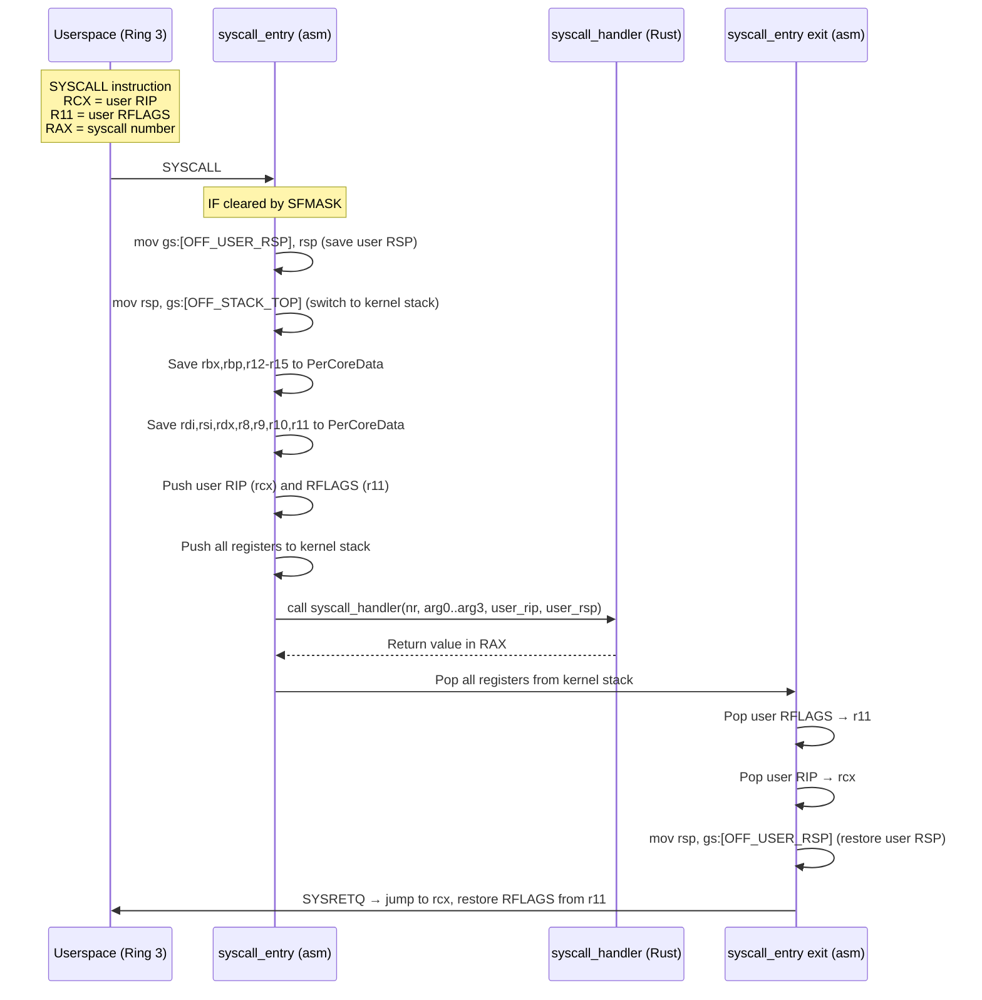
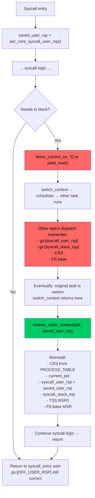
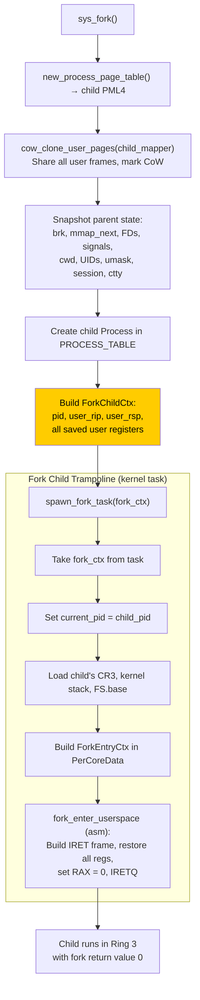
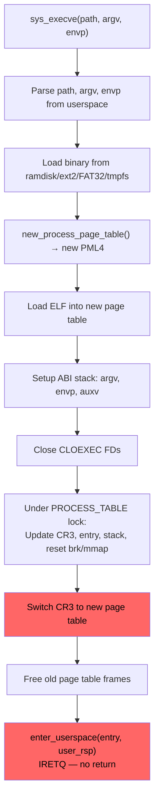
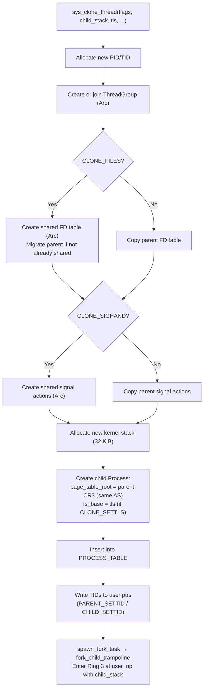

# Current Architecture: Process and Context Management

**Subsystem:** Process lifecycle, task state, syscall entry/exit, per-CPU vs per-task state, context switching, fork/exec, threads
**Key source files:**
- `kernel/src/process/mod.rs` — Process struct, process table, fork trampoline
- `kernel/src/task/mod.rs` — Task struct, switch_context assembly, kernel stack management
- `kernel/src/arch/x86_64/syscall/mod.rs` — syscall_entry asm, syscall_handler, restore_caller_context
- `kernel/src/smp/mod.rs` — PerCoreData struct

## 1. Overview

m3OS has a two-level process model: a **Process** in `PROCESS_TABLE` represents the userspace identity (PID, address space, FD table, signals), while a **Task** in `SCHEDULER` represents the kernel scheduling entity (saved RSP, capability table, IPC state, priority). Every userspace process has both a Process and a Task. Kernel-internal tasks (idle, serial feeder) have only a Task with `pid = 0`.

The critical design issue in this subsystem is the **per-core mutable scratch pattern** for syscall return state. User-critical state like `syscall_user_rsp` lives in `PerCoreData`, not in the Process or Task struct. When a task blocks and another runs on the same core, the per-core state is overwritten. Every blocking syscall must manually call `restore_caller_context()` to reinstall the correct state before returning to userspace.

## 2. Data Structures

### 2.1 Process

```rust
// kernel/src/process/mod.rs (line 518)
pub struct Process {
    // Identity
    pub pid: Pid,                    // u32, monotonically increasing from 1
    pub tid: u32,                    // Thread ID (== pid for main thread)
    pub tgid: u32,                   // Thread group ID (== leader PID)
    pub ppid: Pid,                   // Parent PID (0 = no parent)
    pub pgid: Pid,                   // Process group ID (default: own pid)
    pub session_id: u32,             // Session ID (== session leader PID)

    // State
    pub state: ProcessState,         // Ready | Running | Blocked | Stopped | Zombie
    pub exit_code: Option<i32>,      // Set on zombie transition

    // Address space
    pub page_table_root: Option<x86_64::PhysAddr>,  // PML4 physical address
    pub brk_current: u64,            // Current heap break
    pub mmap_next: u64,              // Next anon mmap VA
    pub mappings: Vec<MemoryMapping>, // Tracked VMAs

    // Execution state
    pub entry_point: u64,            // ELF entry VA
    pub user_stack_top: u64,         // User RSP at ABI setup (points at argc)
    pub kernel_stack_top: u64,       // Top of kernel-mode stack for this process
    pub fs_base: u64,                // FS.base MSR (TLS pointer)

    // File descriptors
    pub fd_table: [Option<FdEntry>; 32],  // MAX_FDS = 32
    pub shared_fd_table: Option<Arc<Mutex<[Option<FdEntry>; 32]>>>,  // CLONE_FILES

    // Signals
    pub pending_signals: u64,        // Bitfield: bit N = signal N pending
    pub blocked_signals: u64,        // Bitfield: bit N = signal N blocked
    pub signal_actions: [SignalAction; 32],
    pub shared_signal_actions: Option<Arc<Mutex<[SignalAction; 32]>>>,  // CLONE_SIGHAND
    pub alt_stack_base: u64,         // Alternate signal stack
    pub alt_stack_size: u64,
    pub alt_stack_flags: u32,

    // Terminal
    pub controlling_tty: Option<ControllingTty>,  // Console | Pty(id)

    // Identity & permissions
    pub uid: u32, pub gid: u32,
    pub euid: u32, pub egid: u32,
    pub umask: u16,                  // Default 0o022

    // Misc
    pub cwd: String,
    pub exec_path: String,
    pub cmdline: Vec<String>,
    pub start_ticks: u64,

    // Threading
    pub thread_group: Option<Arc<ThreadGroup>>,
    pub clear_child_tid: u64,        // CLONE_CHILD_CLEARTID futex address
}
```

### 2.2 ProcessState

```rust
pub enum ProcessState {
    Ready,    // Eligible for scheduling
    Running,  // Currently on a CPU
    Blocked,  // Waiting on I/O, IPC, futex, etc.
    Stopped,  // Stopped by signal (SIGSTOP/SIGTSTP)
    Zombie,   // Exited, awaiting waitpid reap
}
```

### 2.3 Task (Kernel Scheduling Entity)

```rust
// kernel/src/task/mod.rs (line 123)
pub struct Task {
    pub id: TaskId,                  // u64, monotonically increasing from 1
    pub name: &'static str,
    pub state: TaskState,            // Ready | Running | Blocked* | Dead
    pub saved_rsp: u64,              // Kernel RSP saved by switch_context
    pub caps: CapabilityTable,       // 64-slot capability table
    pub pending_msg: Option<Message>, // Delivered IPC message
    pub pending_bulk: Option<Vec<u8>>, // Bulk IPC data
    pub server_endpoint: Option<EndpointId>,
    pub assigned_core: u8,           // CPU this task runs on
    pub pid: u32,                    // 0 = kernel task
    pub priority: u8,                // 0-9 realtime, 10-29 normal, 30 idle
    pub affinity_mask: u64,          // One bit per core (default: all cores)
    pub user_ticks: u64,
    pub system_ticks: u64,
    pub start_tick: u64,
    pub switching_out: bool,         // True during RSP save window
    pub wake_after_switch: bool,     // Deferred wake request
    fork_ctx: Option<ForkChildCtx>,  // Fork child entry context
    _stack: Option<Box<[u8]>>,       // Owns kernel stack (32 KiB)
}
```

**KERNEL_STACK_SIZE = 32,768 bytes (32 KiB)**

### 2.4 TaskState

```rust
pub enum TaskState {
    Ready,           // In run queue, eligible for dispatch
    Running,         // On-CPU
    BlockedOnRecv,   // Waiting for IPC message
    BlockedOnSend,   // Waiting for IPC receiver
    BlockedOnReply,  // Waiting for IPC reply (call pattern)
    BlockedOnNotif,  // Waiting on notification object
    BlockedOnFutex,  // Waiting on futex word
    Dead,            // Exited, stack freed
}
```

### 2.5 Process Table

```rust
pub static PROCESS_TABLE: Mutex<ProcessTable> = Mutex::new(ProcessTable::new());

pub struct ProcessTable {
    processes: Vec<Process>,  // Flat vector, linear scan for lookup
}
```

Operations: `insert(proc)` = push, `find(pid)` = O(n) linear scan, `reap(pid)` = `swap_remove` (O(1)).

### 2.6 ThreadGroup

```rust
pub struct ThreadGroup {
    pub leader_tid: u32,
    pub members: Mutex<Vec<u32>>,  // All TIDs in the group
}
```

Created on first `clone(CLONE_THREAD)`. Shared via `Arc<ThreadGroup>` between all threads in a group.

### 2.7 PerCoreData — Syscall State Fields

```rust
// kernel/src/smp/mod.rs (line 62), accessed via GS segment
#[repr(C)]
pub struct PerCoreData {
    // ... core identity, GDT, TSS fields ...

    // Syscall return state (THE CRITICAL FIELDS):
    pub syscall_stack_top: u64,      // Kernel stack for next syscall/interrupt
    pub syscall_user_rsp: u64,       // User RSP saved at SYSCALL entry
    pub syscall_arg3: u64,           // R10 (arg3) from user

    // Saved user registers:
    pub syscall_user_rbx: u64,
    pub syscall_user_rbp: u64,
    pub syscall_user_r12: u64,
    pub syscall_user_r13: u64,
    pub syscall_user_r14: u64,
    pub syscall_user_r15: u64,
    pub syscall_user_rdi: u64,
    pub syscall_user_rsi: u64,
    pub syscall_user_rdx: u64,
    pub syscall_user_r8: u64,
    pub syscall_user_r9: u64,
    pub syscall_user_r10: u64,
    pub syscall_user_rflags: u64,

    pub current_pid: AtomicU32,      // PID of currently running process
    // ... scheduler, run queue fields ...
}
```

`PerCoreData` is `#[repr(C)]` for stable field offsets. `IA32_GS_BASE` MSR points to this struct, enabling `gs:[OFFSET]` assembly access.

## 3. Algorithms

### 3.1 Syscall Entry and Exit



**Critical vulnerability:** At the exit path, `mov rsp, gs:[OFF_USER_RSP]` reads whatever value is in `PerCoreData.syscall_user_rsp`. If the syscall blocked and another process ran on this core, that field now contains the **other process's** user RSP. SYSRETQ then returns to userspace with a corrupted stack pointer.

### 3.2 The `restore_caller_context` Pattern



### 3.3 restore_caller_context Implementation

```rust
// kernel/src/arch/x86_64/syscall/mod.rs (line 3449)
fn restore_caller_context(calling_pid: Pid, saved_user_rsp: u64) {
    let table = PROCESS_TABLE.lock();
    if let Some(proc) = table.find(calling_pid) {
        if let Some(cr3_phys) = proc.page_table_root {
            // Restore CR3 (page table root)
            unsafe { Cr3::write(PhysFrame::containing_address(PhysAddr::new(cr3_phys.as_u64())), ...) };
        }
        let kstack_top = proc.kernel_stack_top;
        let fs_base = proc.fs_base;
        drop(table);

        set_current_pid(calling_pid);

        unsafe {
            let data = per_core_mut();
            (*data).syscall_user_rsp = saved_user_rsp;  // THE KEY RESTORE
            (*data).syscall_stack_top = kstack_top;
            // Also restore TSS.RSP0 and FS.base MSR
        }
    }
}
```

### 3.4 Context Switch Assembly

```mermaid
flowchart TD
    subgraph "switch_context(save_rsp: *mut u64, load_rsp: u64)"
        A["push rbx, rbp, r12, r13, r14, r15"] --> B["pushf  (save RFLAGS including IF)"]
        B --> C["cli  (disable interrupts)"]
        C --> D["mov [rdi], rsp  (save current RSP)"]
        D --> E["mov rsp, rsi  (load new task's RSP)"]
        E --> F["popf  (restore RFLAGS → atomically re-enables IF)"]
        F --> G["pop r15, r14, r13, r12, rbp, rbx"]
        G --> H["ret  (pop RIP from new stack)"]
    end

    style C fill:#ffcc00,color:#000
    style D fill:#ff6666,color:#000
    style E fill:#ff6666,color:#000
    style F fill:#ffcc00,color:#000
```



**Registers saved/restored by `switch_context`:** rbx, rbp, r12-r15, RFLAGS, and implicitly RIP (via `ret`). Caller-saved registers (rax, rcx, rdx, rdi, rsi, r8-r11) are handled by the Rust compiler at call sites.

**Interrupt safety:** `cli` is issued between `pushf` and the RSP swap. `popf` atomically restores the IF flag from the new task's saved RFLAGS. This keeps the critical section (RSP swap) non-interruptible.

### 3.5 Initial Stack Layout for New Tasks

```
high address ─────────────────────────────────
  [frame_start + 56]  RIP   = entry function pointer
  [frame_start + 48]  rbx   = 0
  [frame_start + 40]  rbp   = 0
  [frame_start + 32]  r12   = 0
  [frame_start + 24]  r13   = 0
  [frame_start + 16]  r14   = 0
  [frame_start +  8]  r15   = 0
  [frame_start +  0]  RFLAGS = 0x202  ← saved_rsp points here
low address  ─────────────────────────────────
```

After switch_context: `popf` + 6 `pop`s + `ret` = 64 bytes consumed. RSP ends at 8 (mod 16) — correct for SysV AMD64 ABI function entry.

### 3.6 Fork



**ForkChildCtx carries:** pid, user_rip, user_rsp, all callee-saved registers (rbx, rbp, r12-r15), all caller-saved registers (rdi, rsi, rdx, r8, r9, r10), user_rflags — all read from `PerCoreData.syscall_user_*` fields at fork time.

### 3.7 Exec



**Note:** Exec does NOT go through `fork_child_trampoline`. It calls `enter_userspace()` directly from the syscall handler, abandoning the current kernel stack. The new process gets a fresh `syscall_stack_top` on its next syscall entry.

**Missing:** Signal actions are not cleared to default on exec (Linux requires this for `Handler` dispositions). This is a known limitation.

### 3.8 clone(CLONE_THREAD) — Thread Creation



**Key difference from fork:** Threads share the same `page_table_root` (CR3). No CoW cloning. No new page table.

## 4. State Ownership Map

This diagram shows where different pieces of execution state live and who is responsible for saving/restoring them:

```mermaid
graph TB
    subgraph "Per-Core (PerCoreData via GS)"
        PC_RSP["syscall_user_rsp"]
        PC_STACK["syscall_stack_top"]
        PC_PID["current_pid"]
        PC_REGS["syscall_user_rbx..r15<br/>syscall_user_rdi..r10<br/>syscall_user_rflags"]
    end

    subgraph "Per-Task (Task struct in SCHEDULER)"
        T_RSP["saved_rsp (kernel RSP)"]
        T_STATE["state (TaskState)"]
        T_CAPS["caps (CapabilityTable)"]
        T_MSG["pending_msg"]
        T_PRI["priority, affinity_mask"]
    end

    subgraph "Per-Process (Process in PROCESS_TABLE)"
        P_CR3["page_table_root (CR3)"]
        P_FS["fs_base (TLS)"]
        P_KSTACK["kernel_stack_top"]
        P_FDS["fd_table"]
        P_SIGS["signal_actions, pending/blocked"]
        P_MEM["brk, mmap_next, mappings"]
    end

    subgraph "Hardware"
        HW_CR3["CR3 register"]
        HW_FS["FS.base MSR"]
        HW_RSP["RSP register"]
    end

    P_CR3 -.->|"scheduler dispatch"| HW_CR3
    P_FS -.->|"scheduler dispatch"| HW_FS
    T_RSP -.->|"switch_context"| HW_RSP

    PC_RSP -.->|"SYSRETQ exit"| HW_RSP
    PC_STACK -.->|"TSS.RSP0"| HW_RSP

    style PC_RSP fill:#ff6666,color:#000
    style PC_STACK fill:#ff6666,color:#000
    style PC_REGS fill:#ff6666,color:#000
```



**The red fields are the vulnerability:** Per-core mutable state that is overwritten when any task runs on that core. If a blocking syscall handler doesn't call `restore_caller_context()`, SYSRETQ returns to userspace with the wrong RSP, and the kernel may have the wrong CR3/TLS active during the syscall's post-block logic.

## 5. Known Issues

### 5.1 Stale `syscall_user_rsp` on IPC Blocking Paths (Confirmed Bug)

**Evidence:** `copy-to-user-reliability-bug.md` — "blocking IPC / notification syscalls can return with stale `syscall_user_rsp`" (confirmed). `redox-copy-to-user-comparison.md` — "m3OS should treat user return state as task-owned state first."

**Affected paths:** All IPC-family blocking syscalls (dispatch 1, 3, 5, 7, 15, 16) and the futex WAIT path do not call `restore_caller_context()` after wakeup. After a context switch, the per-core `syscall_user_rsp` is overwritten by whichever task ran on this core.

**Impact:** Userspace task returns from a blocking IPC call with a wrong RSP. This corrupts the user stack and can cause cascading failures.

### 5.2 Manual `restore_caller_context` is Error-Prone

**Evidence:** ~40 call sites in `syscall/mod.rs` (confirmed by grep). Every new blocking syscall must manually add this call. The futex path was historically broken (Phase 21 handoff).

**Impact:** A single missed `restore_caller_context` in any new or modified blocking syscall silently leaves wrong CR3, TLS, and stack pointers active. The failure mode is non-deterministic — it only manifests when the task blocks long enough for another task to run on the same core.

### 5.3 No Involuntary Preemption

**Evidence:** `kernel/src/task/mod.rs` — timer ISR sets `reschedule = true`, but tasks only switch at explicit `yield_now()` or `block_current_*()` call sites. No interrupt handler calls `switch_context`.

**Impact:** A kernel task that loops without yielding holds the CPU indefinitely. True preemptive multitasking would require interrupt-driven context switches, which the current `switch_context` assembly does not support (it requires a cooperative call site).

### 5.4 Dead Tasks Never Removed from Scheduler Vec

**Evidence:** `kernel/src/task/mod.rs` — `SCHEDULER.tasks` is a `Vec<Task>` that only grows. Dead tasks keep their index (for per-core index stability) but their stack is freed via `drain_dead()`.

**Impact:** Over time with many short-lived processes, the task vec grows large, slowing linear scans (e.g., `find_task_by_id`).

### 5.5 Linear Process Table Scan

**Evidence:** `kernel/src/process/mod.rs` — `find(pid)` is `iter().find(|p| p.pid == pid)`, O(n).

**Impact:** Every syscall that looks up a PID (signal delivery, waitpid, capability grant, etc.) is O(n) in the process count.

### 5.6 Kernel Stack Leak for Process Structs

**Evidence:** `kernel/src/process/mod.rs` — `alloc_kernel_stack()` uses `Box::into_raw`, leaking the allocation. Only the kernel `Task::_stack` field properly frees its stack on death. Process-associated kernel stacks accumulate.

### 5.7 `clear_child_tid` Not Implemented on Thread Exit

**Evidence:** `Process.clear_child_tid` is populated by `CLONE_CHILD_CLEARTID` but the exit path does not write 0 to that address and wake the futex. musl's `pthread_join` relies on this.

**Impact:** `pthread_join` hangs in musl-linked programs.

### 5.8 Signal Actions Not Cleared on Exec

**Evidence:** `sys_execve` does not reset `Handler` dispositions to `Default`. Linux requires this (POSIX: exec resets caught signals to default).

**Impact:** An exec'd program could inherit custom signal handlers from its predecessor, causing unexpected behavior.

## 6. Comparison Points for External Kernels

| Aspect | m3OS Current | What to Compare |
|---|---|---|
| User return state ownership | Per-core mutable scratch (`PerCoreData`) | Redox: durable per-context state; seL4: TCB-owned |
| Context switch mechanism | Cooperative `switch_context` asm (callee-saved + RFLAGS) | seL4: minimal TCB save/restore; Zircon: per-thread kernel stack |
| Process table | Flat `Vec<Process>`, O(n) lookup | Zircon: handle-based, O(1); Linux: radix tree PID lookup |
| Thread model | `clone(CLONE_THREAD)` with shared CR3 | Zircon: Thread objects within Process; seL4: TCBs bound to CSpace |
| Preemption | Cooperative only (timer sets flag, doesn't switch) | seL4 MCS: budget-based preemption; Zircon: true preemption |
| Fork mechanism | Full CoW clone + ForkChildCtx trampoline | Zircon: no fork (process creation via handles); Redox: clone with CoW |
