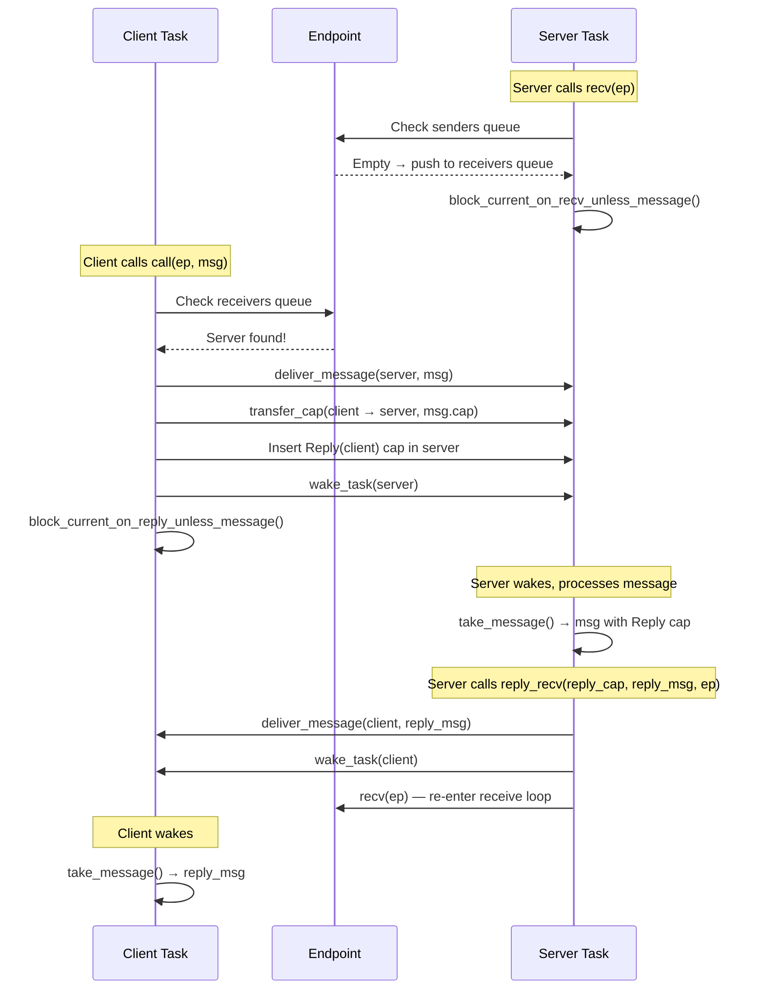
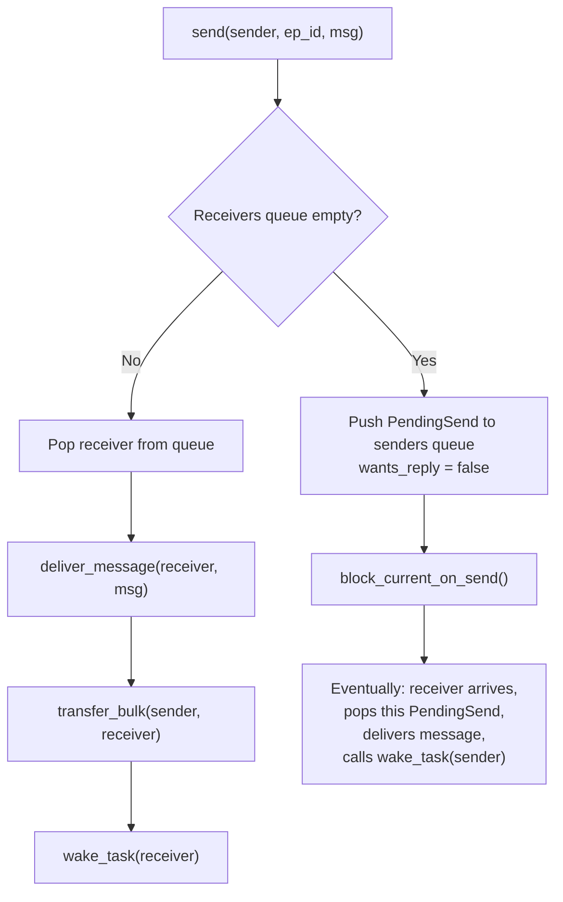
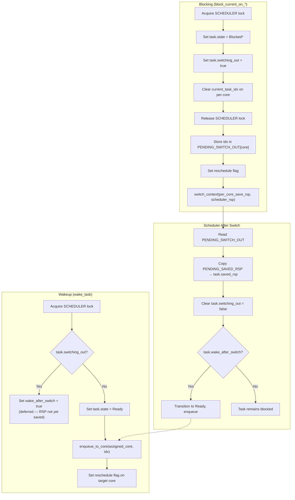
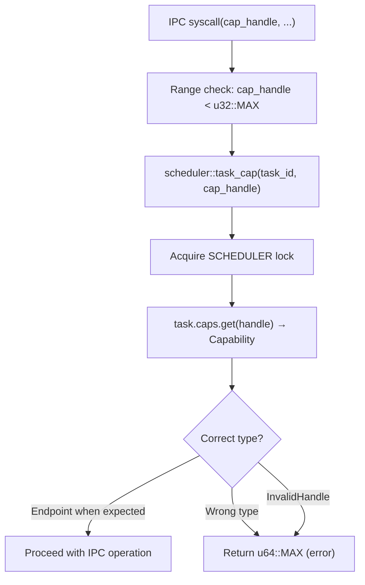
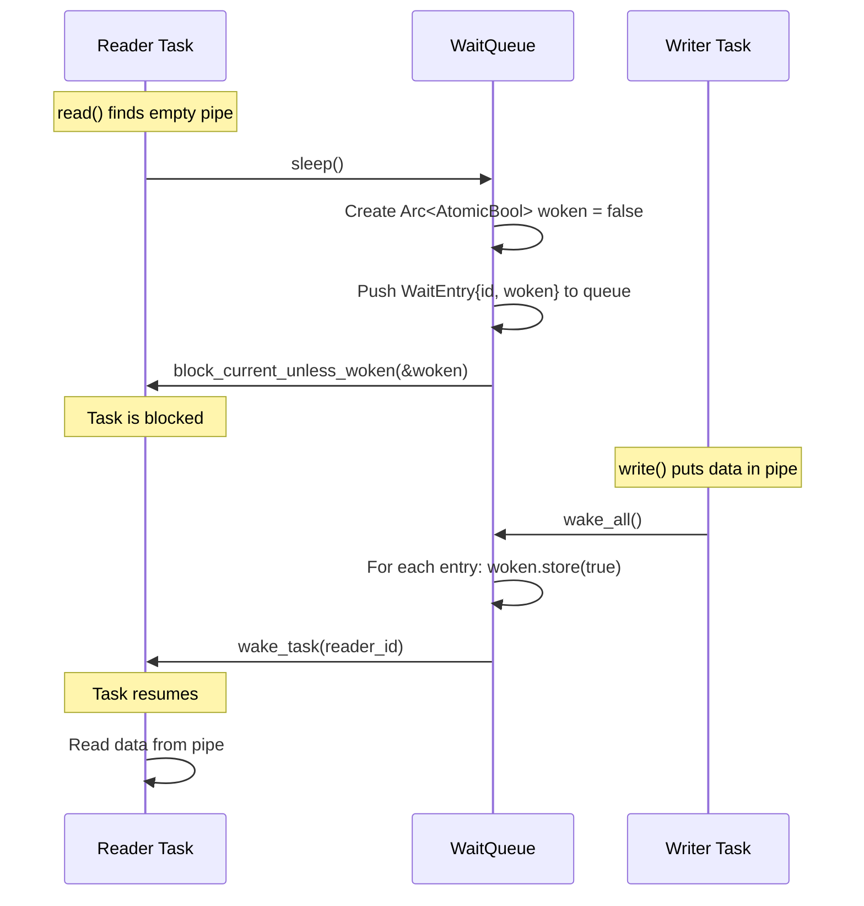
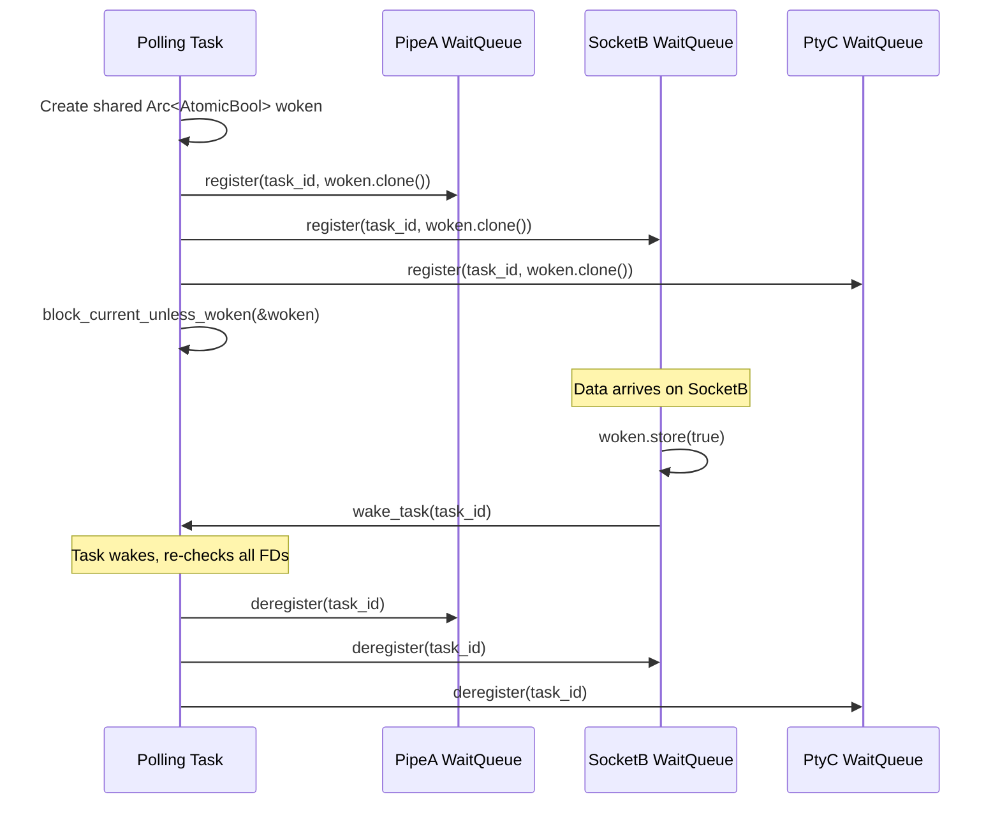
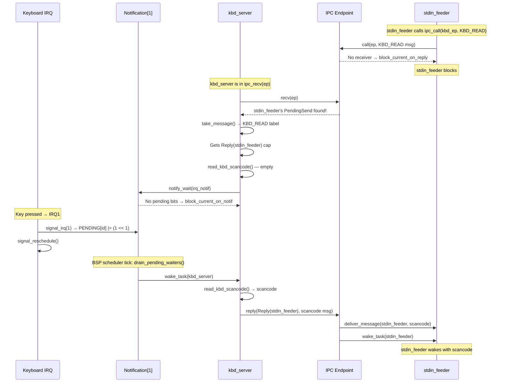

# Current Architecture: IPC and Wakeup Contracts

**Subsystem:** IPC engine (endpoints, notifications), capabilities, service registry, blocking/wakeup protocol
**Key source files:**
- `kernel/src/ipc/endpoint.rs` — Endpoint, EndpointRegistry, rendezvous operations
- `kernel/src/ipc/notification.rs` — Notification objects, ISR-safe signaling
- `kernel/src/ipc/mod.rs` — Syscall dispatch, bulk IPC, service registry helpers
- `kernel/src/ipc/cleanup.rs` — Task IPC cleanup on exit
- `kernel-core/src/ipc/message.rs` — Message type
- `kernel-core/src/ipc/capability.rs` — CapabilityTable, Capability
- `kernel-core/src/ipc/registry.rs` — Service Registry
- `kernel/src/task/wait_queue.rs` — WaitQueue primitive
- `kernel/src/task/mod.rs` — block_current_*, wake_task

## 1. Overview

m3OS uses seL4-inspired synchronous rendezvous IPC with asynchronous notification objects. The model is:
- **Server-to-server:** synchronous `call`/`reply_recv` via endpoints
- **IRQ/vsync:** `Notification` objects (word-sized bitfield, safe to signal from interrupt handlers)
- **Bulk data:** page capability grants, never IPC payloads
- **Resource access:** capability handles validated on every syscall

All IPC objects are accessed through capabilities stored in per-task capability tables.

## 2. Data Structures

### 2.1 Message

```rust
// kernel-core/src/ipc/message.rs
pub struct Message {
    pub label: u64,               // Operation identifier
    pub data: [u64; 4],           // Inline payload: 4 machine words (32 bytes)
    pub cap: Option<Capability>,  // Optional capability transfer
}
```

Messages are pure register-sized. No heap allocation on the hot path. No kernel buffer between sender and receiver.

### 2.2 Endpoint

```rust
// kernel/src/ipc/endpoint.rs (line 43)
pub(super) const MAX_ENDPOINTS: usize = 16;

pub static ENDPOINTS: Mutex<EndpointRegistry> = Mutex::new(EndpointRegistry::new());

pub struct EndpointRegistry {
    slots: [Option<Endpoint>; MAX_ENDPOINTS],  // 16 fixed slots
}

pub struct Endpoint {
    pub(super) senders: VecDeque<PendingSend>,   // Tasks blocked in send/call
    pub(super) receivers: VecDeque<TaskId>,       // Tasks blocked in recv
}

pub(super) struct PendingSend {
    pub(super) task: TaskId,
    pub(super) msg: Message,
    pub(super) wants_reply: bool,  // true = call pattern (sender blocks for reply)
}
```

### 2.3 Notification

```rust
// kernel/src/ipc/notification.rs (line 60)
pub(super) const MAX_NOTIFS: usize = 16;

// Lock-free layer (ISR-safe):
static PENDING: [AtomicU64; MAX_NOTIFS];  // Per-notification bitfields
static IRQ_MAP: [AtomicU8; 16];           // IRQ → NotifId (0xFF = unregistered)

// Mutex-protected layer (task context only):
static WAITERS: Mutex<[Option<TaskId>; MAX_NOTIFS]>;
static ALLOCATED: Mutex<[bool; MAX_NOTIFS]>;
```

### 2.4 Capability System

```rust
// kernel-core/src/ipc/capability.rs
pub type CapHandle = u32;

pub enum Capability {
    Endpoint(EndpointId),
    Notification(NotifId),
    Reply(TaskId),                                    // One-shot reply right
    Grant { frame: u64, page_count: u16, writable: bool },
}

pub struct CapabilityTable {
    slots: [Option<Capability>; 64],  // 64 fixed slots per task
}
```

### 2.5 Service Registry

```rust
// kernel-core/src/ipc/registry.rs
pub const MAX_SERVICES: usize = 16;
pub const MAX_NAME_LEN: usize = 32;

struct Entry {
    name: [u8; MAX_NAME_LEN],
    name_len: usize,
    ep_id: EndpointId,
    owner: u64,  // TaskId; 0 = kernel-registered
}

pub struct Registry {
    entries: [Option<Entry>; MAX_SERVICES],
    count: usize,
}
```

### 2.6 WaitQueue

```rust
// kernel/src/task/wait_queue.rs
struct WaitEntry {
    id: TaskId,
    woken: Arc<AtomicBool>,
}

pub struct WaitQueue {
    waiters: Mutex<VecDeque<WaitEntry>>,
}
```

### 2.7 FutexWaiter

```rust
// kernel/src/arch/x86_64/syscall/mod.rs
pub struct FutexWaiter {
    pub tid: TaskId,
    pub bitset: u32,
    pub woken: Arc<AtomicBool>,
}

// Global futex table: (page_table_root, uaddr) → Vec<FutexWaiter>
static FUTEX_TABLE: Lazy<Mutex<BTreeMap<(u64, u64), Vec<FutexWaiter>>>>;
```

## 3. Algorithms

### 3.1 Synchronous Rendezvous IPC



### 3.2 Send Without Reply (One-Way)



### 3.3 Notification Signal and Wait

```mermaid
flowchart TD
    subgraph "signal(notif_id, bits) — Task Context"
        S1["PENDING[id].fetch_or(bits, Release)"] --> S2["Lock WAITERS"]
        S2 --> S3{Waiter exists?}
        S3 -->|Yes| S4["Take waiter, wake_task(waiter)"]
        S3 -->|No| S5["signal_reschedule()"]
    end

    subgraph "signal_irq — ISR Context, Lock-Free"
        I1["IRQ_MAP lookup: irq to notif_id"] --> I2["PENDING fetch_or bit for irq"]
        I2 --> I3["signal_reschedule"]
        I3 --> I4["Does NOT call wake_task\nnot ISR-safe due to scheduler lock"]
    end

    subgraph "drain_pending_waiters — BSP Tick"
        D1["For each notification 0..15:"] --> D2{"PENDING nonzero\nand waiter\nregistered?"}
        D2 -->|Yes| D3["wake_task for waiter"]
        D2 -->|No| D4["Continue"]
    end

    subgraph "wait(waiter, notif_id)"
        W1["bits = PENDING[id].swap(0, Acquire)"] --> W2{bits != 0?}
        W2 -->|Yes| W3["Return bits (fast path)"]
        W2 -->|No| W4["Lock WAITERS"]
        W4 --> W5["Re-check PENDING under lock"]
        W5 --> W6{bits != 0?}
        W6 -->|Yes| W7["Return bits (closed TOCTOU)"]
        W6 -->|No| W8["Register waiter"]
        W8 --> W9["block_current_on_notif()"]
        W9 --> W10["On wake: loop back to step 1"]
    end
```



**ISR-to-task wakeup latency:** `signal_irq()` sets `PENDING` bits and calls `signal_reschedule()`, but does NOT call `wake_task()` (acquiring `SCHEDULER` lock from ISR context risks deadlock). The actual `wake_task()` happens in `drain_pending_waiters()`, called from the BSP's scheduler loop on each tick. This adds up to **10ms latency** (one 100 Hz tick interval) for ISR-delivered notification wakeups.

### 3.4 Blocking and Wakeup Protocol



**The `switching_out` / `wake_after_switch` two-phase protocol** prevents a race: if `wake_task` runs on another core while the blocking task is mid-`switch_context` (RSP not yet saved), it defers the wakeup until the scheduler loop confirms the RSP is safely stored.

### 3.5 Capability Validation on Syscalls



### 3.6 WaitQueue Usage (Pipes, Sockets, PTY, Poll)



**For poll/select/epoll**, a single task registers on **multiple** WaitQueues simultaneously using a shared `woken` flag:



## 4. Complete IPC Data Flow

### 4.1 Keyboard Input via IPC (kbd_server → stdin_feeder)



## 5. Blocking Path Audit: Which Paths Call `restore_caller_context`

| Blocking Path | Calls restore? | Impact if missing |
|---|---|---|
| `sys_nanosleep` (yield_now loop) | **Yes** | N/A |
| `sys_poll` (block_current_unless_woken) | **Yes** | N/A |
| `sys_select` / `sys_pselect6` | **Yes** | N/A |
| `sys_epoll_wait` | **Yes** | N/A |
| `sys_read` on pipe (WaitQueue::sleep) | **Yes** | N/A |
| `sys_write` on pipe (WaitQueue::sleep) | **Yes** | N/A |
| `sys_read` on socket (WaitQueue::sleep) | **Yes** | N/A |
| `sys_accept4` (WaitQueue::sleep) | **Yes** | N/A |
| `sys_connect` (yield_now loop) | **Yes** | N/A |
| Signal stop loop | **Yes** | N/A |
| **IPC recv** (block_current_on_recv) | **NO** | Wrong CR3, RSP, TLS |
| **IPC call** (block_current_on_reply) | **NO** | Wrong CR3, RSP, TLS |
| **IPC reply_recv** (block_current_on_recv) | **NO** | Wrong CR3, RSP, TLS |
| **notify_wait** (block_current_on_notif) | **NO** | Wrong CR3, RSP, TLS |
| **IPC recv_msg** (block_current_on_recv) | **NO** | Wrong CR3, RSP, TLS |
| **IPC reply_recv_msg** (block_current_on_recv) | **NO** | Wrong CR3, RSP, TLS |
| **FUTEX_WAIT** (block_current_on_futex) | **Structural hole** | Wrong CR3, RSP, TLS |

**The IPC paths do not call `restore_caller_context` because the IPC dispatch is in `kernel/src/ipc/mod.rs`, not in the main syscall handler.** The IPC dispatch calls `endpoint::recv()` or `notification::wait()` which block directly. When the task wakes and the dispatcher returns a value, the per-core state has been overwritten.

## 6. Known Issues

### 6.1 IPC Blocking Paths Miss `restore_caller_context` (Confirmed Bug)

**Evidence:** IPC dispatch in `kernel/src/ipc/mod.rs` calls blocking functions without saving `syscall_user_rsp` beforehand and without calling `restore_caller_context` on return.

**Impact:** After blocking IPC, SYSRETQ returns to userspace with wrong user RSP. This is the confirmed stale-`syscall_user_rsp` bug from the copy_to_user investigation.

### 6.2 ISR Notification Wakeup Latency (Up to 10ms)

**Evidence:** `signal_irq()` does NOT call `wake_task()` — only sets `PENDING` bits. `drain_pending_waiters()` runs only on BSP scheduler tick (100 Hz).

**Impact:** Keyboard input latency includes up to 10ms from ISR to task wakeup. For interactive use this is acceptable; for real-time scenarios it is not.

### 6.3 Single Waiter Per Notification

**Evidence:** `WAITERS[idx]: Option<TaskId>` — only one task can wait. `debug_assert!` fires if two tasks wait on the same notification.

**Impact:** Cannot multiplex a notification across multiple consumers. Each IRQ source needs its own notification.

### 6.4 Hard Limit of 16 Endpoints, Notifications, Services

**Evidence:** `MAX_ENDPOINTS = 16`, `MAX_NOTIFS = 16`, `MAX_SERVICES = 16` — compile-time constants.

**Impact:** A busy system with many services could exhaust the endpoint/notification pool. No dynamic growth.

### 6.5 `reply_recv` Is Not Atomic

**Evidence:** `kernel/src/ipc/endpoint.rs:436` — `reply_recv = reply() + recv()` as two separate operations.

**Impact:** There is a window between the reply delivery and the server re-entering recv where another client could send to the endpoint and see no receiver (the server is between operations). The client would then block on send, waiting for the server to re-enter recv.

### 6.6 `sys_cap_grant` Is Not Atomic Across Tasks

**Evidence:** `kernel/src/ipc/mod.rs:168` — the code comments acknowledge the remove→insert sequence is not atomic.

**Impact:** A concurrent observer can briefly see the capability absent from both source and destination.

### 6.7 No Capability Revocation

**Evidence:** No `revoke` operation exists. When a server dies, the endpoint slot persists in clients' cap tables until the clients exit.

**Impact:** Stale capabilities can accumulate. A restarted service gets a new endpoint ID; old clients with stale caps cannot reach it.

## 7. Comparison Points for External Kernels

| Aspect | m3OS Current | What to Compare |
|---|---|---|
| IPC model | Synchronous rendezvous (seL4-inspired) | seL4: formal fast-path IPC; MINIX3: fixed-size messages; Zircon: channels (async) |
| Notification model | AtomicU64 bitfield, single waiter | seL4: notification objects with badge; Zircon: signals per object |
| Capability table | Fixed 64 slots per task | seL4: CNode tree, unlimited depth; Zircon: handle table (growable) |
| Blocking/wakeup | Manual `block_current_*` + `wake_task` | seL4: scheduler integrates IPC blocking; Zircon: wait sets |
| ISR notification latency | Up to 10ms (scheduler tick) | seL4: immediate notification delivery; Zircon: interrupt ports |
| Bulk IPC | Page capability grants | MINIX3: grants (virtual copy); Zircon: VMOs; seL4: shared memory frames |
