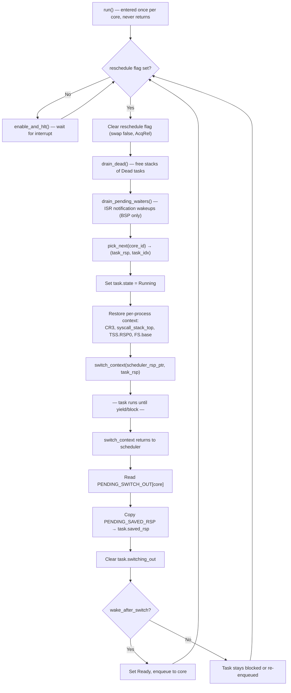
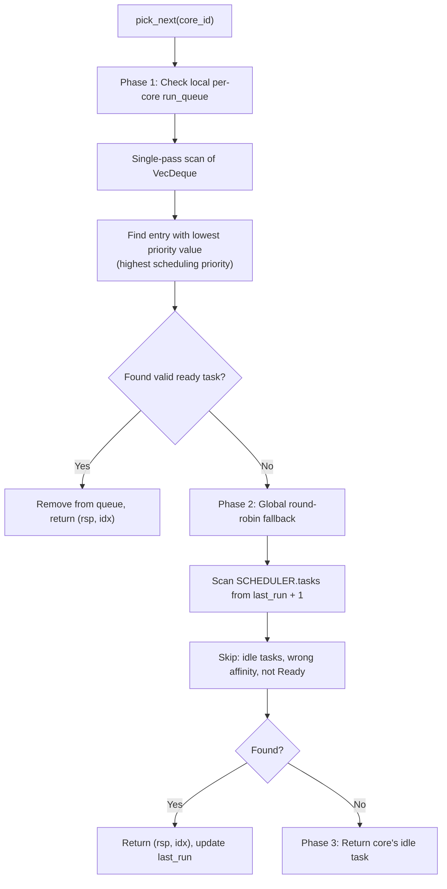
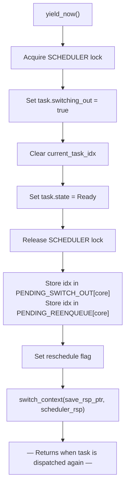
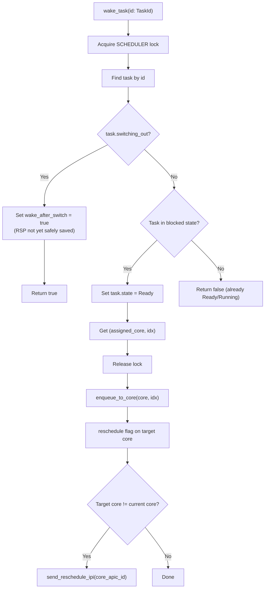
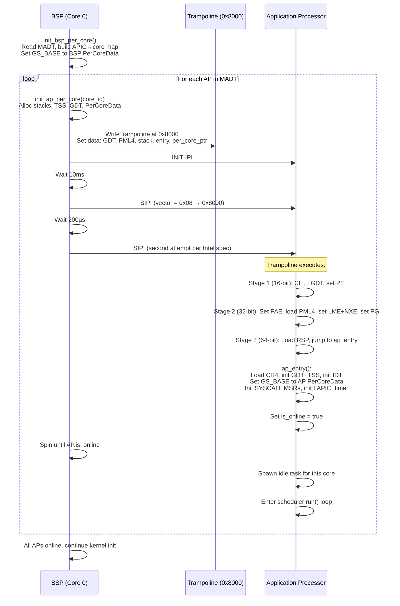
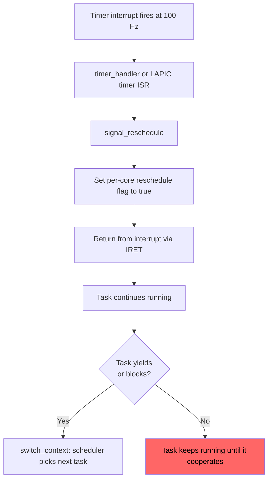
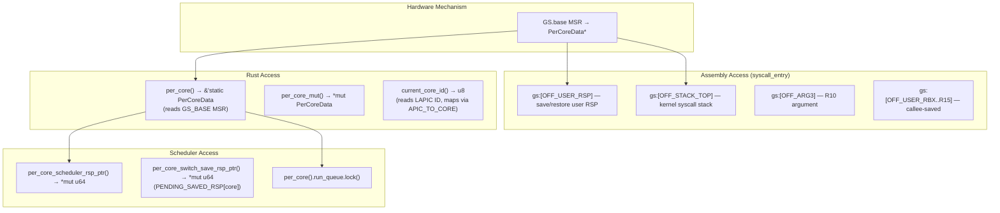

# Current Architecture: Scheduler and SMP

**Subsystem:** Task scheduling, SMP boot, per-CPU data, TLB shootdown protocol, load balancing
**Key source files:**
- `kernel/src/task/mod.rs` — Task struct, switch_context, yield_now, block_current_*, wake_task
- `kernel/src/task/scheduler.rs` — Scheduler struct, pick_next, run loop
- `kernel/src/smp/mod.rs` — PerCoreData, BSP/AP init
- `kernel/src/smp/boot.rs` — AP boot trampoline, INIT-SIPI-SIPI
- `kernel/src/smp/ipi.rs` — IPI vectors and handlers
- `kernel/src/smp/tlb.rs` — TLB shootdown protocol

## 1. Overview

m3OS implements SMP-aware cooperative scheduling with per-core run queues and priority-based dispatch. The scheduler is a single global `Scheduler` struct under a spin mutex, with per-core `VecDeque<usize>` run queues for fast local dispatch. Context switching uses a cooperative `switch_context` assembly stub — tasks switch only at explicit yield or block points.

The SMP subsystem supports up to 16 cores (`MAX_CORES = 16`). The BSP completes full kernel initialization before waking APs via INIT-SIPI-SIPI. Each AP initializes its own GDT, IDT, LAPIC, and per-core data before entering the scheduler idle loop.

## 2. Data Structures

### 2.1 Scheduler

```rust
// kernel/src/task/scheduler.rs (line 75)
pub(crate) struct Scheduler {
    tasks: Vec<Task>,                        // All kernel tasks (append-only)
    last_run: usize,                         // Round-robin fallback cursor
    idle_tasks: [Option<usize>; MAX_CORES],  // Per-core idle task indices
}

pub(super) static SCHEDULER: Mutex<Scheduler> = Mutex::new(Scheduler::new());
```

### 2.2 PerCoreData

```rust
// kernel/src/smp/mod.rs (line 62)
#[repr(C)]
pub struct PerCoreData {
    // Core identity
    self_ptr: *const PerCoreData,     // Offset 0: for gs:[0] self-reference
    pub core_id: u8,
    pub apic_id: u8,
    pub is_online: AtomicBool,

    // GDT/TSS (AP-allocated; BSP uses global)
    tss_ptr: *mut TaskStateSegment,
    gdt_ptr: *const GlobalDescriptorTable,
    gdt_code: SegmentSelector,
    gdt_data: SegmentSelector,
    gdt_tss: SegmentSelector,

    // Kernel stack
    pub kernel_stack_top: u64,

    // Scheduler state
    pub scheduler_rsp: UnsafeCell<u64>,   // Scheduler loop RSP
    pub reschedule: AtomicBool,           // Timer/IPI sets, scheduler reads
    pub current_task_idx: AtomicI32,      // -1 = no current task
    pub run_queue: Mutex<VecDeque<usize>>, // Per-core ready queue

    // LAPIC
    pub lapic_virt_base: u64,
    pub lapic_ticks_per_ms: u32,

    // Syscall state (assembly-accessed via gs-relative offsets)
    pub syscall_stack_top: u64,
    pub syscall_user_rsp: u64,
    pub syscall_arg3: u64,
    pub syscall_user_rbx: u64,    // ... through r15
    pub syscall_user_rdi: u64,    // ... through r10
    pub syscall_user_rflags: u64,

    // Process tracking
    pub current_pid: AtomicU32,
    pub fork_entry_ctx: ForkEntryCtx,
}
```

Global arrays:
```rust
static mut PER_CORE_DATA: [*mut PerCoreData; MAX_CORES];  // MAX_CORES = 16
static CORE_COUNT: AtomicU8;
static mut APIC_TO_CORE: [u8; 256];  // APIC ID → core_id mapping
static BSP_APIC_ID: AtomicU8;
static SMP_INITIALIZED: AtomicBool;
```

### 2.3 RSP Save Coordination Atomics

```rust
// kernel/src/task/mod.rs
static PENDING_SWITCH_OUT: [AtomicI32; MAX_CORES];  // Task idx that just yielded
static PENDING_SAVED_RSP: [AtomicU64; MAX_CORES];   // RSP scratch cell
static PENDING_REENQUEUE: [AtomicI32; MAX_CORES];   // Task to re-enqueue
```

### 2.4 IPI Vectors

```rust
// kernel/src/smp/ipi.rs
pub const IPI_RESCHEDULE: u8 = 0xFE;
pub const IPI_TLB_SHOOTDOWN: u8 = 0xFD;
```

## 3. Algorithms

### 3.1 Scheduler Main Loop (`run()`)



### 3.2 `pick_next(core_id)` — Task Selection



**Priority scheme:** 0-9 = real-time, 10-29 = normal (default 20), 30 = idle. Lower value = higher scheduling priority. Non-root users cannot set priorities below 10 (enforced in `sys_nice`).

### 3.3 `yield_now()` — Cooperative Task Switch



### 3.4 `block_current_on_*()` — Blocking Task Switch

Same as `yield_now()` but sets the task's state to one of `BlockedOnRecv`, `BlockedOnSend`, `BlockedOnReply`, `BlockedOnNotif`, `BlockedOnFutex` instead of `Ready`. The task is NOT re-enqueued — it stays blocked until `wake_task()` is called.

### 3.5 `wake_task(id)` — Resume Blocked Task



### 3.6 SMP Boot Sequence



### 3.7 Preemption Mechanism



**This is NOT true preemptive scheduling.** The timer sets a flag, but the actual context switch only happens when the task explicitly yields or blocks. A tight loop without syscalls or yields will hold the CPU indefinitely.

### 3.8 Load Balancing (Currently Disabled)

```rust
// kernel/src/task/scheduler.rs (line 1083)
fn maybe_load_balance() {
    // Find core with longest run queue
    // Find core with shortest run queue
    // If difference > 2: migrate one non-affinity-pinned task
}
```

Called every 50 ticks (~500ms) but currently **disabled** in the `run()` loop due to task migration thrashing with short-lived userspace processes. The comment suggests re-enabling once per-task cooldown or work-stealing is implemented.

## 4. Per-Core Data Access Patterns



## 5. TLB Shootdown Protocol

### 5.1 Current Protocol

See detailed description in [01-memory-management.md](01-memory-management.md#46-tlb-shootdown-protocol).

Summary of limitations:
1. **Single address** per shootdown — `SHOOTDOWN_ADDR` is one u64
2. **Global serialization** — `SHOOTDOWN_LOCK` mutex prevents concurrent shootdowns
3. **Broadcast** — `send_ipi_all_excluding_self` hits ALL cores, not just those running the affected address space
4. **No address-space awareness** — the protocol does not know or care which address spaces are active on which cores

### 5.2 Shootdown Timing

| Operation | Shootdown cost |
|---|---|
| `munmap(ptr, 4K)` | 1 IPI round-trip |
| `munmap(ptr, 1 MiB)` | 256 sequential IPI round-trips |
| `munmap(ptr, 1 GiB)` | 262,144 sequential IPI round-trips |
| `mprotect(ptr, 4K, ...)` | 1 IPI round-trip |
| `fork` CoW marking | 0 (local CR3 reload only) |
| `resolve_cow_fault` | 0 (local invlpg only) |

## 6. Known Issues

### 6.1 No Involuntary Preemption

**Evidence:** Timer ISR sets `reschedule = true` but no interrupt handler calls `switch_context`. Tasks only switch at explicit yield/block points.

**Impact:** A kernel task in a tight loop (or a userspace task that never makes a syscall) holds the CPU indefinitely. This is a fundamental limitation of the cooperative model.

### 6.2 Load Balancing Disabled

**Evidence:** `kernel/src/task/scheduler.rs` — `maybe_load_balance()` is not called from `run()`. Comment: "migration thrashing with short-lived processes."

**Impact:** Tasks are pinned to their assigned core unless manually migrated. Uneven load distribution possible.

### 6.3 Dead Tasks Accumulate in Scheduler Vec

**Evidence:** `SCHEDULER.tasks` is append-only. Dead tasks have stacks freed but indices are preserved.

**Impact:** Growing memory overhead, slower linear scans over the task vec.

### 6.4 Global Scheduler Lock Contention

**Evidence:** All scheduler operations (spawn, wake, pick_next, block) go through the single `SCHEDULER: Mutex<Scheduler>` lock.

**Impact:** On many-core systems, this becomes a contention bottleneck. Per-core schedulers with work-stealing would reduce contention.

### 6.5 Broadcast TLB Shootdown

**Evidence:** `send_ipi_all_excluding_self(IPI_TLB_SHOOTDOWN)` — hits all cores regardless of which address space they're running.

**Impact:** Unnecessary IPIs to cores that are running different processes. With address-space tracking, only cores running the affected process need to be interrupted.

### 6.6 ISR Notification Wakeup is Tick-Dependent

**Evidence:** `drain_pending_waiters()` runs only on BSP scheduler tick. APs do not run it.

**Impact:** ISR-delivered notifications can be delayed up to one tick (10ms). APs may have even longer delays if the BSP's tick doesn't trigger a remote wakeup fast enough.

## 7. Comparison Points for External Kernels

| Aspect | m3OS Current | What to Compare |
|---|---|---|
| Scheduling algorithm | Priority-based with round-robin fallback | seL4 MCS: budget-based; Zircon: fair scheduler; MINIX3: multilevel feedback |
| Preemption | Cooperative only | seL4 MCS: kernel preemption with budgets; Zircon: true preemption |
| Per-CPU data | GS-relative `PerCoreData`, manual field access | Zircon: `percpu` struct; Redox: `PercpuBlock` with address-space tracking |
| TLB shootdown | Single-address, broadcast, serialized | Redox: per-address-space `used_by`/`tlb_ack`; Linux: batch + targeted |
| Load balancing | Disabled (threshold-based migration) | Zircon: per-core queues with work-stealing; Linux: CFS load balancing |
| Scheduler lock | Single global `Mutex<Scheduler>` | seL4: lock-free ready queues; Zircon: per-CPU scheduler state |
