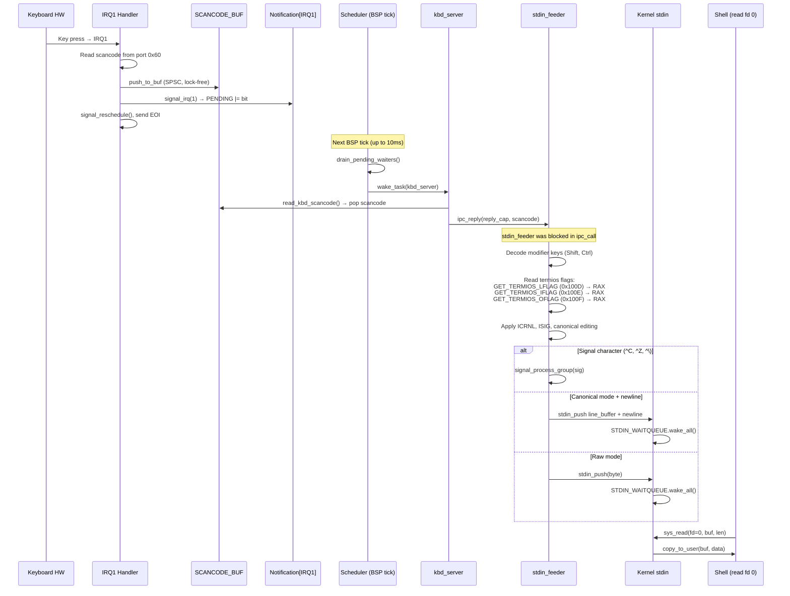
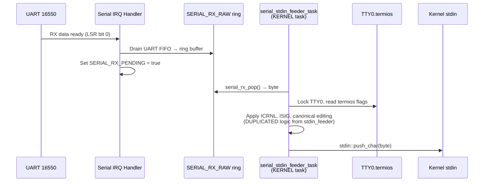
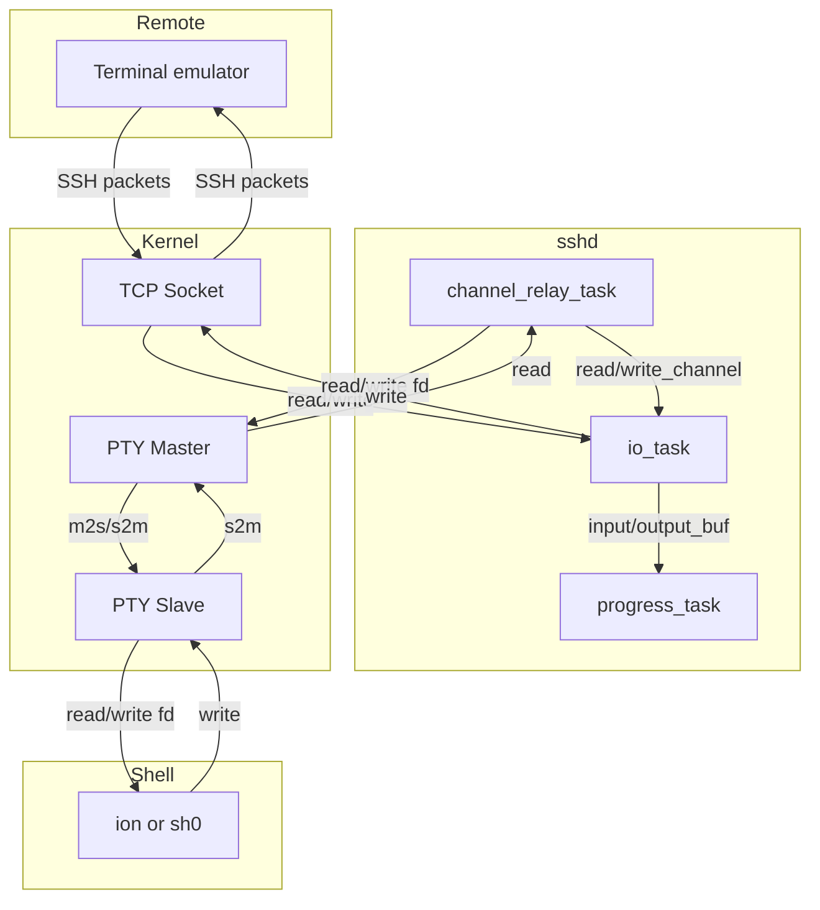
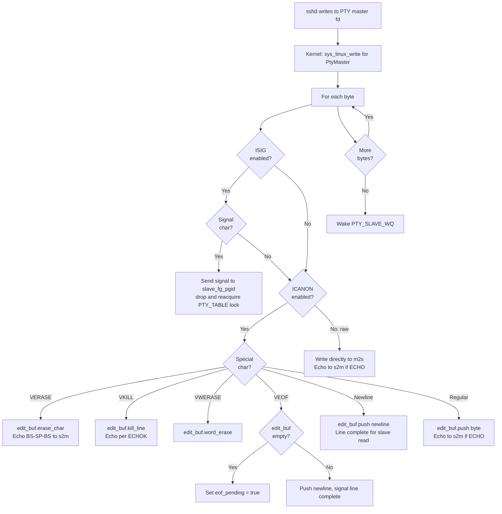
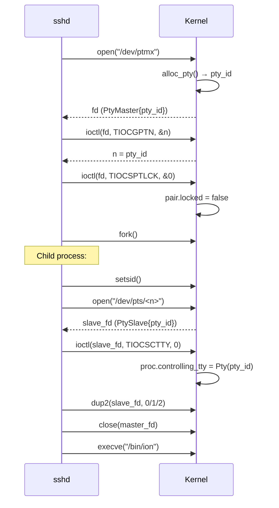
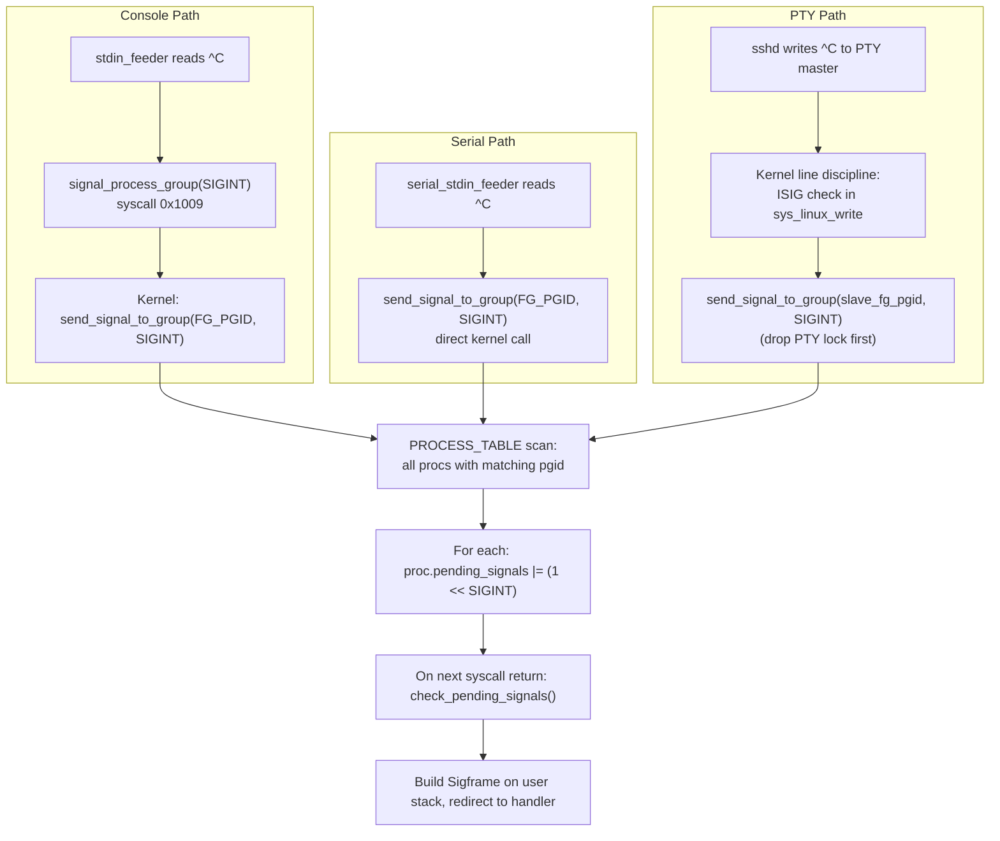
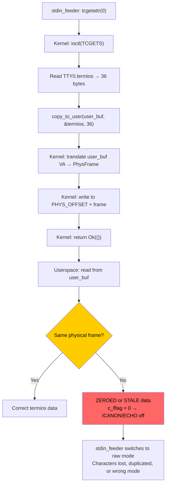

# Current Architecture: Terminal and PTY Subsystem

**Subsystem:** TTY, PTY pairs, termios, console input path, keyboard IRQ, serial console
**Key source files:**
- `kernel/src/tty.rs` — TTY0 global state
- `kernel-core/src/tty.rs` — Termios, Winsize, EditBuffer, constants
- `kernel/src/pty.rs` — PTY table, lifecycle, wait queues
- `kernel-core/src/pty.rs` — PtyRingBuffer, PtyPairState
- `kernel/src/arch/x86_64/interrupts.rs` — Keyboard IRQ handler, scancode buffers
- `kernel-core/src/input.rs` — ScancodeRouter
- `kernel/src/stdin.rs` — Kernel stdin buffer
- `kernel/src/serial.rs` — UART 16550 driver, serial RX ring buffer
- `kernel/src/fb/mod.rs` — Framebuffer console
- `kernel/src/main.rs` — serial_stdin_feeder_task (kernel-space line discipline)
- `userspace/stdin_feeder/src/main.rs` — Keyboard line discipline (userspace)
- `userspace/kbd_server/src/main.rs` — Keyboard IPC server

## 1. Overview

m3OS implements a dual-path terminal subsystem: a **hardware console** (keyboard + framebuffer/serial) and **PTY pairs** for remote sessions (SSH, telnet). Both paths converge on the same kernel stdin buffer for processes.

The line discipline (canonical editing, echo, signal generation) is implemented **twice**: once in the kernel (`serial_stdin_feeder_task` for serial input) and once in userspace (`stdin_feeder` for keyboard input). Both share `TTY0.termios` state. The `copy_to_user` bug forced the userspace implementation to use register-return workaround syscalls for reading termios flags.

## 2. Data Structures

### 2.1 TtyState

```rust
// kernel/src/tty.rs
pub struct TtyState {
    pub termios: Termios,       // Terminal I/O settings
    pub winsize: Winsize,       // Window dimensions (24x80)
    pub fg_pgid: u32,           // Foreground process group ID
    pub edit_buf: EditBuffer,   // Canonical mode line buffer
}

pub static TTY0: Mutex<TtyState> = Mutex::new(TtyState::new());
```

### 2.2 Termios

```rust
// kernel-core/src/tty.rs
#[repr(C)]
pub struct Termios {
    pub c_iflag: u32,       // Input mode flags (ICRNL, INLCR, IGNCR)
    pub c_oflag: u32,       // Output mode flags (OPOST, ONLCR)
    pub c_cflag: u32,       // Control mode flags (B38400, CS8, CREAD, HUPCL)
    pub c_lflag: u32,       // Local mode flags (ICANON, ECHO, ISIG, IEXTEN)
    pub c_line: u8,         // Line discipline (always 0)
    pub c_cc: [u8; 19],     // NCCS=19 control characters
}
// sizeof(Termios) = 36 bytes (matches Linux kernel TCGETS ioctl)
```

Default cooked mode: `c_lflag = ICANON | ECHO | ECHOE | ISIG | IEXTEN`, `c_iflag = ICRNL`, `c_oflag = OPOST | ONLCR`.

### 2.3 EditBuffer

```rust
// kernel-core/src/tty.rs
pub struct EditBuffer {
    pub buf: [u8; 4096],    // EDIT_BUF_SIZE
    pub len: usize,
}
```

Flat 4 KiB array for canonical mode line editing. Operations: `push(b)`, `erase_char()`, `kill_line()`, `word_erase()`, `drain(n)`.

### 2.4 PtyPairState

```rust
// kernel-core/src/pty.rs
pub struct PtyPairState {
    pub m2s: PtyRingBuffer,         // Master→slave buffer (4096 bytes)
    pub s2m: PtyRingBuffer,         // Slave→master buffer (4096 bytes)
    pub termios: Termios,           // Slave-side termios
    pub winsize: Winsize,           // Terminal dimensions
    pub edit_buf: EditBuffer,       // Canonical mode line buffer
    pub slave_fg_pgid: u32,         // Foreground process group on slave
    pub master_refcount: u32,       // Open FD count for master
    pub slave_refcount: u32,        // Open FD count for slave
    pub eof_pending: bool,          // ^D on empty edit buffer
    pub locked: bool,               // Slave locked until TIOCSPTLCK(0)
    pub slave_opened: bool,         // Has slave ever been opened?
}
```

### 2.5 PtyRingBuffer

```rust
// kernel-core/src/pty.rs
pub struct PtyRingBuffer {
    buf: [u8; 4096],    // PTY_BUF_SIZE
    read_pos: usize,
    count: usize,
}
```

Classic circular buffer. Partial writes allowed. Byte-by-byte copy (not split memcpy).

### 2.6 PTY Table

```rust
// kernel/src/pty.rs
pub static PTY_TABLE: Mutex<[Option<PtyPairState>; 16]>;  // MAX_PTYS = 16
pub static PTY_MASTER_WQ: [WaitQueue; 16];
pub static PTY_SLAVE_WQ: [WaitQueue; 16];
```

### 2.7 Scancode Buffers

```rust
// kernel/src/arch/x86_64/interrupts.rs
// TTY path (normal use)
static mut SCANCODE_BUF: [u8; 256];
static SCANCODE_BUF_HEAD: AtomicUsize;
static SCANCODE_BUF_TAIL: AtomicUsize;

// Raw path (framebuffer game mode)
static mut RAW_SCANCODE_BUF: [u8; 256];
static RAW_SCANCODE_BUF_HEAD: AtomicUsize;
static RAW_SCANCODE_BUF_TAIL: AtomicUsize;
```

SPSC (Single Producer, Single Consumer) lock-free ring buffers.

### 2.8 Kernel stdin Buffer

```rust
// kernel/src/stdin.rs
struct StdinState {
    buf: [u8; 4096],   // STDIN_BUF_SIZE
    read_pos: usize,
    count: usize,
}

static STDIN: Mutex<StdinState>;
static EOF_PENDING: AtomicBool;
pub static STDIN_WAITQUEUE: WaitQueue;
```

## 3. Data Flow

### 3.1 Complete Keyboard Input Path



### 3.2 Serial Input Path (Parallel Implementation)



### 3.3 PTY Data Flow (SSH Session)



### 3.4 PTY Master Write (Line Discipline)



### 3.5 openpty / Session Setup Flow



## 4. Signal Delivery via Terminal



## 5. The copy_to_user Bug and Workarounds

### 5.1 The Problem

The `stdin_feeder` calls `tcgetattr(0)` (which uses `ioctl(TCGETS)`) on every keystroke to read the current termios flags. `TCGETS` copies 36 bytes via `copy_to_user` to a stack buffer. Intermittently, the buffer stays zeroed despite the kernel confirming it wrote correct data.



### 5.2 The Workaround

Register-return syscalls bypass `copy_to_user` entirely:

```rust
// Kernel syscall handler:
GET_TERMIOS_LFLAG (0x100D) => TTY0.lock().termios.c_lflag as u64  // returned in RAX
GET_TERMIOS_IFLAG (0x100E) => TTY0.lock().termios.c_iflag as u64
GET_TERMIOS_OFLAG (0x100F) => TTY0.lock().termios.c_oflag as u64

// stdin_feeder reads:
let lflag = get_termios_lflag();  // Direct register return, no buffer
```

The `c_cc` array (control characters) is cached once at startup via `tcgetattr(0)` and never refreshed. This means runtime changes to VINTR, VSUSP, etc. are not picked up by `stdin_feeder`.

### 5.3 Login Termios Validation

```rust
// userspace/login/src/main.rs — disable_echo()
// If saved termios has c_lflag == 0 (never valid for console),
// substitute default_cooked values to prevent poison cascade.
if saved.c_lflag == 0 {
    saved = default_cooked();  // Prevents TTY0.termios poisoning
}
```

## 6. Known Issues

### 6.1 Duplicated Line Discipline

**Evidence:** `kernel/src/main.rs:538-700` (serial) and `userspace/stdin_feeder/src/main.rs` (keyboard) — two independent implementations of ICRNL, ISIG, canonical editing, echo.

**Impact:** Bug fixes or behavior changes must be applied in both places. The two implementations can drift.

### 6.2 stdin_feeder c_cc Cache is Stale

**Evidence:** `userspace/stdin_feeder/src/main.rs:220` — `tcgetattr(0)` called once at startup. `c_cc` array never refreshed.

**Impact:** Programs that change VINTR or VSUSP at runtime (e.g., `stty intr ^X`) will not affect signal generation in `stdin_feeder`.

### 6.3 Fixed PTY Pool (16 pairs)

**Evidence:** `MAX_PTYS = 16` in `kernel-core/src/pty.rs:15`. Fixed array, no dynamic growth.

**Impact:** Cannot open more than 16 simultaneous PTY pairs. Exceeding the limit returns ENOMEM.

### 6.4 TCSETSW Does Not Drain

**Evidence:** `kernel/src/arch/x86_64/syscall/mod.rs` — TCSETSW treated identically to TCSETS.

**Impact:** Programs that rely on output draining before termios change (e.g., password prompt echo disable) may see garbled output.

### 6.5 No VMIN/VTIME Support

**Evidence:** Raw mode read does not implement minimum byte count or timeout semantics.

**Impact:** Programs that rely on `VTIME` for read timeout (e.g., escape sequence detection) must use poll/select instead.

### 6.6 Console is Not a Device File

**Evidence:** No `/dev/tty0` or `/dev/console` exists. stdin/stdout are `FdBackend::DeviceTTY` by convention.

**Impact:** `open("/dev/tty")` does not work for console sessions. Programs that need to open the controlling terminal directly cannot do so.

### 6.7 Scancode Buffer Drop on Full

**Evidence:** 256-byte ring buffers. `push_to_buf` silently drops bytes when full.

**Impact:** Rapid typing during a stalled consumer loses keystrokes.

### 6.8 Single-Consumer Notification for kbd_server

**Evidence:** `WAITERS[idx]: Option<TaskId>` — only one task can wait per notification.

**Impact:** Cannot run multiple kbd_servers or multiplex keyboard input across consumers.

## 7. Comparison Points for External Kernels

| Aspect | m3OS Current | What to Compare |
|---|---|---|
| Line discipline location | Duplicated: kernel (serial) + userspace (keyboard) | Linux: kernel-only ldisc; Redox: scheme-based |
| PTY implementation | Kernel-side ring buffers + line discipline in write path | Linux: full PTY layer with ldisc; Redox: PTY scheme |
| termios reading | Register-return workaround due to copy_to_user bug | Redox: UserSlice typed wrappers; Linux: standard copy_to_user |
| Keyboard input chain | IRQ → SPSC buffer → IPC → userspace feeder → kernel stdin | Linux: IRQ → input subsystem → TTY layer |
| Console device | No device file, hardcoded FdBackend | Linux: /dev/tty, /dev/console, /dev/ttyN |
