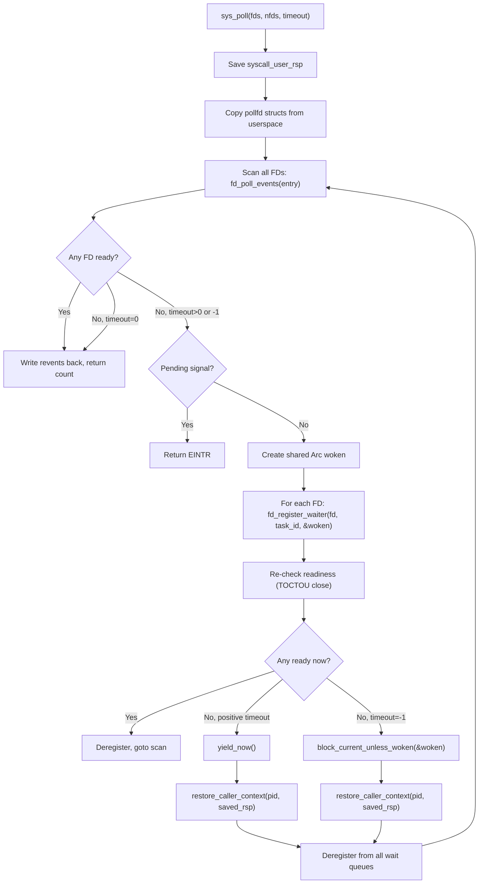
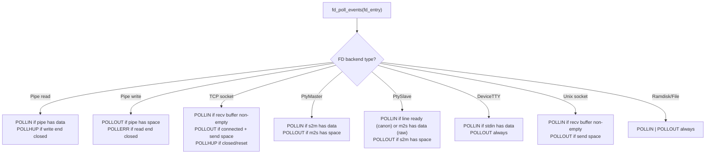
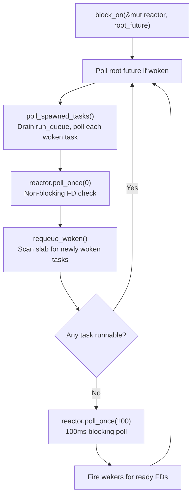
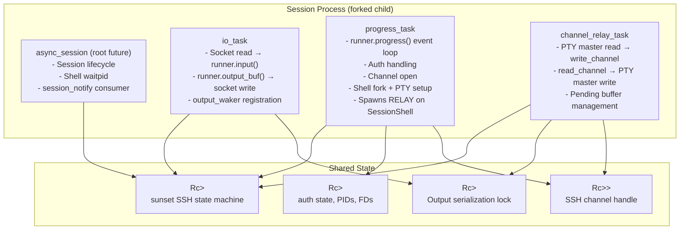
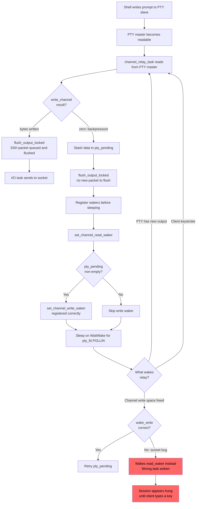
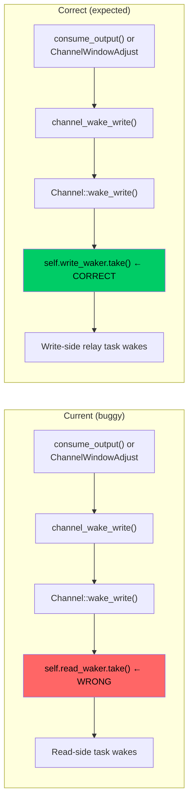
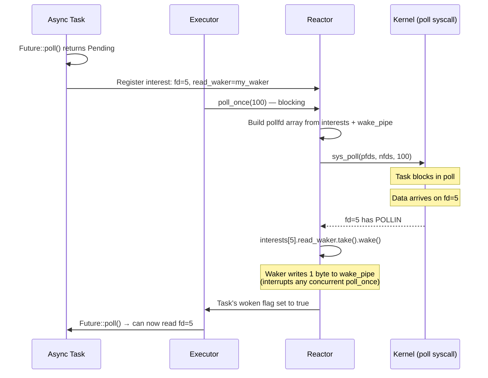
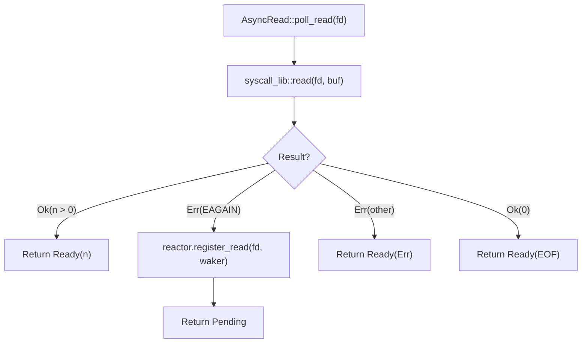
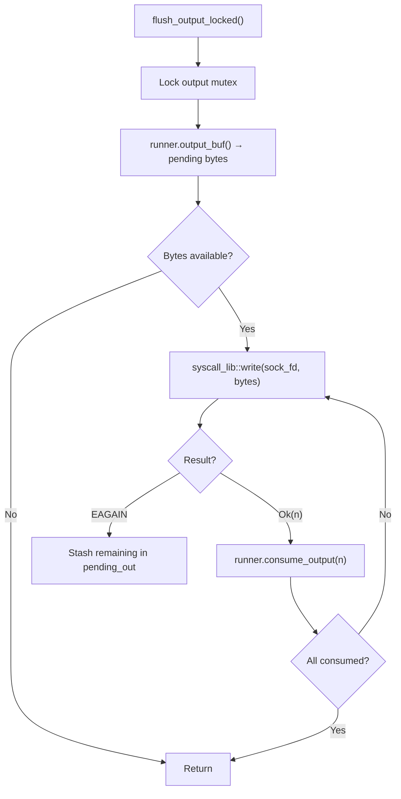
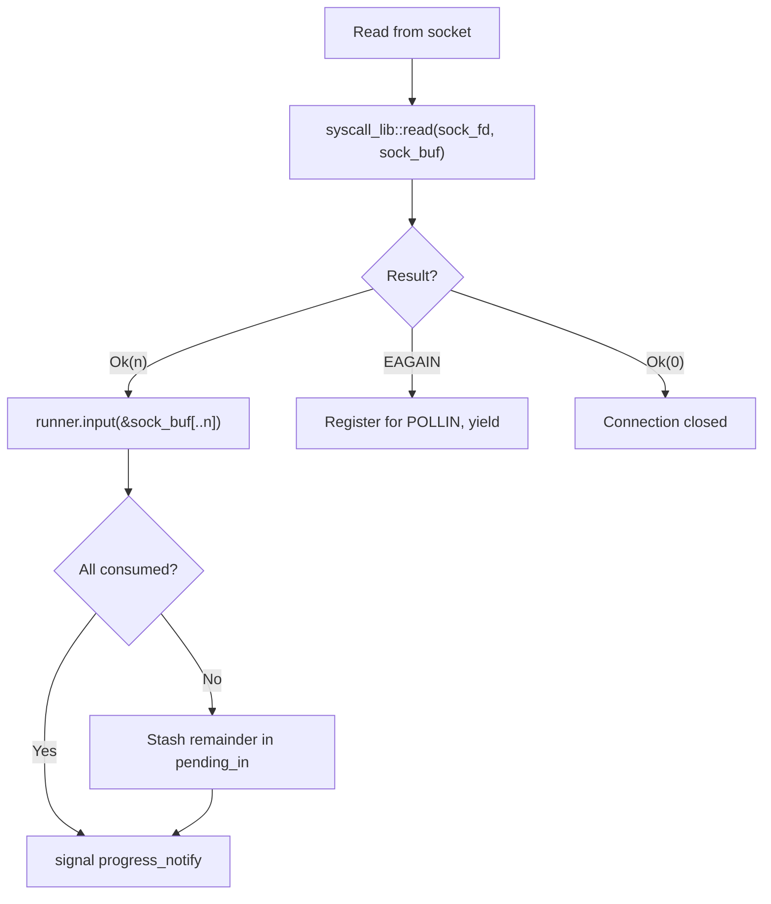

# Current Architecture: Async I/O Model

**Subsystem:** Kernel poll/select/epoll, userspace async executor, sunset SSH integration, sshd multi-task model
**Key source files:**
- `kernel/src/arch/x86_64/syscall/mod.rs` — sys_poll, sys_select, sys_epoll_*, fd_poll_events, fd_register_waiter
- `kernel/src/task/wait_queue.rs` — WaitQueue (used by poll registration)
- `userspace/sshd/src/session.rs` — SSH session multi-task architecture
- `userspace/async-rt/src/executor.rs` — Cooperative async executor
- `userspace/async-rt/src/reactor.rs` — poll-based I/O reactor
- `sunset-local/src/runner.rs` — SSH state machine (vendored)
- `sunset-local/src/channel.rs` — SSH channel wakeup paths

## 1. Overview

m3OS provides kernel-level I/O multiplexing through `poll`, `select`, and `epoll` syscalls, all driven by wait queues attached to FD backends (pipes, sockets, PTYs). The kernel implementation is wait-queue-driven — no busy-waiting or periodic polling.

The sshd daemon uses a userspace cooperative async executor (`async-rt`) built on top of the kernel `poll` syscall. Each SSH session runs three cooperating async tasks that share the sunset SSH state machine via `Rc<Mutex<Runner>>`.

The SSHD hang analysis identified a critical write-side wakeup bug in this model: PTY output stalls when the SSH channel encounters backpressure, because the relay task sleeps without registering for channel write readiness.

## 2. Data Structures

### 2.1 Kernel Poll Infrastructure

```rust
// Syscall layer (mod.rs)
// pollfd struct from userspace:
struct pollfd {
    fd: i32,
    events: i16,   // Requested events (POLLIN, POLLOUT, etc.)
    revents: i16,  // Returned events
}

// Event constants:
const POLLIN:  i16 = 0x0001;
const POLLOUT: i16 = 0x0004;
const POLLERR: i16 = 0x0008;
const POLLHUP: i16 = 0x0010;
const POLLNVAL: i16 = 0x0020;
```

### 2.2 Epoll Instance

```rust
struct EpollInstance {
    interests: Vec<EpollInterest>,
}

struct EpollInterest {
    fd: i32,
    events: u32,  // EPOLLIN | EPOLLOUT | ...
}
```

### 2.3 Userspace Async Executor

```rust
// userspace/async-rt/src/executor.rs
pub struct Executor {
    tasks: Slab<TaskSlot>,           // Fixed-index task store
    run_queue: VecDeque<usize>,      // Ready task indices
    root_woken: AtomicBool,          // Root future needs polling
}

struct TaskSlot {
    future: Pin<Box<dyn Future<Output = ()>>>,
    header: TaskHeader,
}

struct TaskHeader {
    woken: AtomicBool,
    wake_pipe_fd: i32,  // Write here to interrupt reactor.poll_once()
}
```

### 2.4 I/O Reactor

```rust
// userspace/async-rt/src/reactor.rs
pub struct Reactor {
    pub(crate) wake_read_fd: i32,    // Self-pipe read end
    pub(crate) wake_write_fd: i32,   // Self-pipe write end
    pub(crate) interests: Vec<Interest>,
}

pub struct Interest {
    pub fd: i32,
    pub read_waker: Option<Waker>,
    pub write_waker: Option<Waker>,
}
```

### 2.5 SSH Session Shared State

```rust
// userspace/sshd/src/session.rs
type SharedRunner = Rc<Mutex<Runner>>;
type SharedState = Rc<RefCell<SessionState>>;
type SharedChan = Rc<RefCell<Option<ChanHandle>>>;
type SharedOutputLock = Rc<Mutex<()>>;
```

## 3. Algorithms

### 3.1 Kernel `sys_poll` Algorithm



**Key design detail:** The shared `woken` flag is registered on ALL FD wait queues simultaneously. Any single FD event sets the flag and wakes the task. After waking, the task deregisters from all queues and re-scans.

### 3.2 `fd_poll_events` — Per-FD Readiness Check



### 3.3 Userspace Async Executor Loop



### 3.4 SSH Session Task Architecture



### 3.5 The SSHD Hang: Write-Side Wakeup Bug



### 3.6 The Sunset `Channel::wake_write()` Bug



**Evidence:** `sunset-local/src/channel.rs:840-845` — `Channel::wake_write()` uses `self.read_waker.take()` for normal data instead of `self.write_waker.take()`. This means even if `sshd` correctly calls `set_channel_write_waker()`, the backpressure-cleared event wakes the wrong waker.

## 4. Reactor and Waker Mechanism

### 4.1 How Wakers Work



### 4.2 Self-Pipe for Waker Interruption

The reactor uses a self-pipe (`wake_read_fd` / `wake_write_fd`) to interrupt blocking `poll_once()` calls:
1. Self-pipe read end is always in the `pollfd` array
2. When a `Waker` fires, it writes 1 byte to `wake_write_fd`
3. The kernel `poll` returns with the self-pipe readable
4. Reactor drains the self-pipe and processes woken tasks

This ensures that waker events from any source (channel readiness, output buffer drain, etc.) can immediately interrupt a blocking poll.

## 5. Non-Blocking I/O

For `O_NONBLOCK` FDs (sockets, PTYs, pipes):
- `read()` returns `-EAGAIN` if no data available
- `write()` returns `-EAGAIN` if buffer full
- The async executor wraps these in `poll`-then-retry loops via the reactor



## 6. I/O Task Detail

### 6.1 Output Direction (runner → socket)



### 6.2 Input Direction (socket → runner)



## 7. Known Issues

### 7.1 SSHD Write-Side Wakeup Bug (Two Compounding Defects)

**Defect 1 (sshd):** When `write_channel()` returns `Ok(0)`, the relay stashes data in `pty_pending` and correctly registers `set_channel_write_waker` when `pty_pending_len > 0` (this was previously missing and has been partially fixed).

**Defect 2 (sunset library):** `Channel::wake_write()` in `sunset-local/src/channel.rs:840-845` calls `self.read_waker.take()` instead of `self.write_waker.take()`. Even with correct registration, the wrong waker fires.

**Combined effect:** PTY output stalls under channel backpressure until a client keystroke "nudges" output through by triggering `channel_read_waker`.

### 7.2 Cooperative Executor Cannot Preempt Long-Running Futures

**Evidence:** `userspace/async-rt/src/executor.rs` — single-threaded cooperative polling. A future that does CPU-intensive work without yielding blocks all other tasks.

**Impact:** If `runner.progress()` or any other future takes too long, I/O and relay tasks are starved.

### 7.3 100ms Reactor Poll Timeout

**Evidence:** `reactor.poll_once(100)` — the reactor blocks for up to 100ms when no task is runnable.

**Impact:** Adds up to 100ms latency for events that arrive while the reactor is blocking. Lower timeout = more CPU usage. Higher timeout = more latency.

### 7.4 No Backpressure From Socket Writes

**Evidence:** `flush_output_locked()` writes in a loop until EAGAIN. If the socket send buffer is large, this can block the entire executor for the duration of a large write.

**Impact:** Other async tasks are starved during large socket writes.

### 7.5 Shared `Rc<Mutex<Runner>>` Contention

**Evidence:** All three tasks share the same `Rc<Mutex<Runner>>`. Lock contention between I/O, relay, and progress tasks is serialized.

**Impact:** Under heavy traffic, tasks may spin-wait on the runner lock. The cooperative executor means only one task runs at a time, so actual deadlock is impossible, but priority inversion is possible.

## 8. Comparison Points for External Kernels

| Aspect | m3OS Current | What to Compare |
|---|---|---|
| I/O multiplexing | poll/select/epoll (wait-queue-driven) | All kernels: similar poll/epoll; Zircon: ports |
| Async executor | Userspace cooperative (single-threaded) | Redox: scheme-based async; Zircon: port-based event loop |
| SSH integration | Vendored sunset + 3-task cooperative model | N/A (OS-specific) |
| Waker mechanism | Self-pipe + AtomicBool woken flag | Zircon: port signals; Linux: eventfd |
| Non-blocking I/O | O_NONBLOCK + EAGAIN | Universal |
