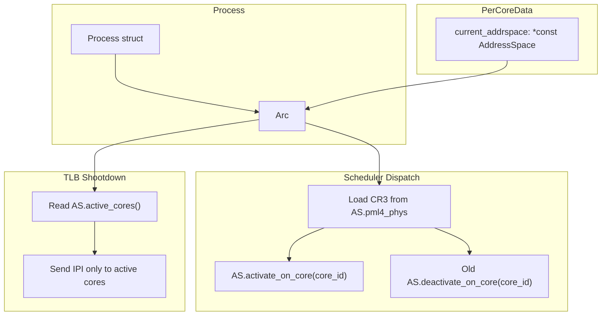
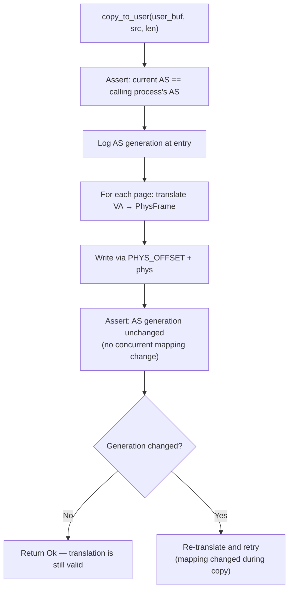
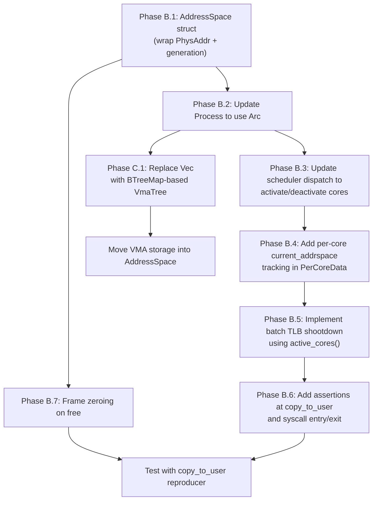

# Next Architecture: Memory Management

**Current state:** [docs/appendix/architecture/current/01-memory-management.md](../current/01-memory-management.md)
**Phases:** B (AddressSpace object, batch TLB, frame zeroing), C (VMA tree)

## 1. First-Class AddressSpace Object

### 1.1 Problem

The kernel has no dedicated address space abstraction. A process's address space is a raw `PhysAddr` stored in `Process::page_table_root`, with no metadata, no refcount, no per-CPU tracking. This makes it impossible to:
- Track which CPUs are currently using an address space
- Send targeted TLB shootdowns only to those CPUs
- Attach generation counters for debugging
- Safely share an address space between threads (CLONE_VM)
- Detect stale mappings (the `copy_to_user` bug root cause)

### 1.2 Proposed Design

```rust
/// A first-class address space object.
/// Wraps the page table root with metadata for debugging and TLB management.
pub struct AddressSpace {
    /// Physical address of the PML4 frame.
    pml4_phys: PhysAddr,

    /// Monotonically increasing generation counter.
    /// Incremented on any mapping change (mmap, munmap, mprotect, CoW resolution, brk).
    generation: AtomicU64,

    /// Bitmask of core IDs currently running with this address space loaded in CR3.
    /// Updated by scheduler dispatch and process exit.
    active_on_cores: AtomicU64,  // Bit N = core N has this AS in CR3

    /// Virtual memory areas (proposed: B-tree or interval tree).
    vmas: Mutex<VmaTree>,

    /// Heap state.
    brk_current: AtomicU64,
    mmap_next: AtomicU64,
}

impl AddressSpace {
    /// Called by scheduler when dispatching a task with this AS.
    pub fn activate_on_core(&self, core_id: u8) {
        self.active_on_cores.fetch_or(1u64 << core_id, Release);
    }

    /// Called by scheduler when switching away from a task with this AS.
    pub fn deactivate_on_core(&self, core_id: u8) {
        self.active_on_cores.fetch_and(!(1u64 << core_id), Release);
    }

    /// Returns the set of cores currently using this address space.
    pub fn active_cores(&self) -> u64 {
        self.active_on_cores.load(Acquire)
    }

    /// Increment generation on any mapping change.
    pub fn bump_generation(&self) -> u64 {
        self.generation.fetch_add(1, Relaxed)
    }
}
```

### 1.3 How It Integrates



**Thread sharing:** `clone(CLONE_VM)` threads share the same `Arc<AddressSpace>`. The `Arc` refcount tracks how many processes reference it. When the last thread exits, the `Arc` drops and the page table is freed.

### 1.4 Comparison: How Redox Does It

Redox tracks address-space identity via three connected pieces:

1. **`Context.addr_space`** (`src/context/context.rs`) — each context (task) has an `Arc<AddrSpaceWrapper>` reference.
2. **`PercpuBlock.current_addrsp`** (`src/percpu.rs`) — each CPU's per-core block tracks which address space is currently loaded.
3. **`AddrSpaceWrapper.used_by`** (`src/context/memory.rs`) — the address space object tracks which CPUs are using it, and TLB shootdown acknowledgement (`tlb_ack`) is tied to this object.

**Source:** `docs/appendix/redox-copy-to-user-comparison.md`, Finding 4; Redox kernel source files: `src/context/context.rs`, `src/percpu.rs`, `src/context/memory.rs`.

### 1.5 Comparison: How Zircon Does It

Zircon's address space is a `VmAspace` object (C++ class) that:
- Owns the hardware page table (arch-specific `ArchVmAspace`)
- Contains a tree of `VmAddressRegion` (VMAR) objects for hierarchical VA management
- Is reference-counted and shared between threads in the same process
- Tracks its own lifecycle independently from the process

**Source:** Fuchsia documentation: `https://fuchsia.dev/fuchsia-src/concepts/kernel/concepts#address_spaces_virtual_memory_and_memory`

## 2. Batch TLB Shootdown

### 2.1 Problem

The current `tlb_shootdown()` handles one address at a time. A `munmap(ptr, 1 GiB)` requires 262,144 sequential shootdowns, each taking the global `SHOOTDOWN_LOCK`, sending an IPI to all cores, and spinning for acknowledgement.

### 2.2 Proposed Design

```rust
/// Batch TLB shootdown request.
pub struct ShootdownRequest {
    /// The address space being modified.
    addr_space: *const AddressSpace,
    /// Range to invalidate.
    start: u64,
    end: u64,       // Exclusive
    /// If true, full TLB flush instead of per-page invlpg.
    full_flush: bool,
}

static SHOOTDOWN_REQUEST: AtomicPtr<ShootdownRequest>;
static SHOOTDOWN_PENDING: AtomicU8;
static SHOOTDOWN_LOCK: Mutex<()>;

pub fn tlb_shootdown_range(addr_space: &AddressSpace, start: u64, end: u64) {
    let _lock = SHOOTDOWN_LOCK.lock();
    let pages = (end - start) / 4096;

    // Local flush
    if pages <= INVLPG_THRESHOLD {
        for addr in (start..end).step_by(4096) {
            tlb::flush(VirtAddr::new(addr));
        }
    } else {
        // Full CR3 reload for large ranges
        unsafe { Cr3::write(Cr3::read().0, Cr3::read().1); }
    }

    // Remote flush: only target cores running this address space
    let active = addr_space.active_cores();
    let self_bit = 1u64 << current_core_id();
    let remote_cores = active & !self_bit;

    if remote_cores == 0 { return; }

    // Set up request
    let request = ShootdownRequest { addr_space, start, end, full_flush: pages > INVLPG_THRESHOLD };
    SHOOTDOWN_REQUEST.store(&request as *const _ as *mut _, Release);
    SHOOTDOWN_PENDING.store(remote_cores.count_ones() as u8, Release);

    // Send IPIs only to cores running this address space
    for core_id in 0..MAX_CORES {
        if remote_cores & (1u64 << core_id) != 0 {
            send_ipi(core_apic_id(core_id), IPI_TLB_SHOOTDOWN);
        }
    }

    // Wait for ack
    while SHOOTDOWN_PENDING.load(Acquire) > 0 {
        core::hint::spin_loop();
    }
}

const INVLPG_THRESHOLD: u64 = 32;  // Pages; above this, use full CR3 reload
```

### 2.3 Shootdown Handler (IPI Receiver)

```rust
fn handle_tlb_shootdown_ipi() {
    let req = unsafe { &*SHOOTDOWN_REQUEST.load(Acquire) };

    // Check if this core is even running the affected address space
    let my_as = per_core().current_addrspace;
    if my_as != req.addr_space {
        // Not running this AS — no TLB entries to flush
        SHOOTDOWN_PENDING.fetch_sub(1, Release);
        return;
    }

    if req.full_flush {
        unsafe { Cr3::write(Cr3::read().0, Cr3::read().1); }
    } else {
        for addr in (req.start..req.end).step_by(4096) {
            tlb::flush(VirtAddr::new(addr));
        }
    }

    SHOOTDOWN_PENDING.fetch_sub(1, Release);
}
```

### 2.4 Performance Comparison

| Operation | Current | Proposed |
|---|---|---|
| `munmap(ptr, 4K)` | 1 IPI to all cores | 1 IPI to active cores only |
| `munmap(ptr, 1 MiB)` | 256 IPIs (sequential, all cores) | 1 IPI (batch, CR3 reload, active cores) |
| `munmap(ptr, 1 GiB)` | 262,144 IPIs | 1 IPI (batch, CR3 reload, active cores) |
| `mprotect` 32 pages | 32 IPIs | 1 IPI (batch invlpg, active cores) |

## 3. Frame Zeroing on Free

### 3.1 Problem

Freed frames retain their old contents. If a stale TLB entry maps a VA to a freed-and-reused frame, userspace sees the new tenant's data. The `copy_to_user` bug doc identified this as an "amplifier."

### 3.2 Proposed Design

```rust
// In free_frame():
pub fn free_frame(phys: u64) {
    if REFCOUNT_INIT.load(Relaxed) {
        let count = refcount_dec(phys);
        if count > 0 { return; }
    }

    // Zero the frame before returning to pool
    let virt = phys_offset() + phys;
    unsafe {
        core::ptr::write_bytes(virt as *mut u8, 0, 4096);
    }

    FRAME_ALLOCATOR.lock().free_to_pool(phys);
}
```

**Tradeoff:** Adds ~1 microsecond per frame free (4 KiB memset). This is acceptable for correctness. A future optimization could use a background zeroing thread or maintain a pool of pre-zeroed frames.

### 3.3 Comparison: How Other Kernels Handle This

| Kernel | Approach |
|---|---|
| Linux | `__GFP_ZERO` flag for callers that need zeroed pages; non-zeroed by default. Security-sensitive allocations (user pages) always zero. |
| Zircon | VMOs zero pages on commit by default. `ZX_VMO_RESIZABLE` pages are zeroed on decommit. |
| seL4 | Untyped memory is not zeroed by the kernel (capability model prevents unauthorized access). |
| Redox | Frame allocator does not zero by default; demand mapper zeros at map time. |

**Recommendation:** Zero on free for all user-accessible frames. Kernel-internal frames can skip zeroing for performance.

## 4. VMA Tree Structure

### 4.1 Problem

`Process::mappings` is a `Vec<MemoryMapping>` with O(n) linear scan for `find_vma`. This is on the critical path in the page fault handler.

### 4.2 Proposed Design

Replace `Vec<MemoryMapping>` with a B-tree keyed by start address:

```rust
use alloc::collections::BTreeMap;

pub struct VmaTree {
    tree: BTreeMap<u64, MemoryMapping>,  // Key = start VA
}

impl VmaTree {
    /// Find the VMA containing `addr`. O(log n).
    pub fn find_containing(&self, addr: u64) -> Option<&MemoryMapping> {
        // Find the last VMA with start <= addr
        self.tree.range(..=addr).next_back()
            .map(|(_, vma)| vma)
            .filter(|vma| addr < vma.start + vma.len)
    }

    /// Insert a new VMA. O(log n).
    pub fn insert(&mut self, vma: MemoryMapping) {
        self.tree.insert(vma.start, vma);
    }

    /// Remove VMAs overlapping a range. Returns removed VMAs for cleanup.
    pub fn remove_range(&mut self, start: u64, len: u64) -> Vec<MemoryMapping> {
        // Split partially overlapping VMAs, remove fully contained ones
        // ... (standard interval tree split logic)
        todo!()
    }
}
```

### 4.3 Performance Impact

| Operation | Current (Vec) | Proposed (BTreeMap) |
|---|---|---|
| Page fault VMA lookup | O(n) | O(log n) |
| mmap insert | O(1) amortized | O(log n) |
| munmap range remove | O(n) scan + split | O(log n) + split |
| mprotect range update | O(n) scan + split | O(log n) + split |

For processes with < 20 VMAs (typical for m3OS), the difference is negligible. For processes with 100+ VMAs (shared libraries, complex applications), the improvement is significant.

### 4.4 Comparison: Linux's Maple Tree

Linux v6.1+ replaced the red-black tree + linked list VMA structure with a maple tree (a B-tree variant optimized for ranges). The maple tree provides O(log n) lookup with cache-friendly layout. m3OS's simpler `BTreeMap` approach is sufficient for its scale while providing the same asymptotic improvement.

**Source:** Linux kernel commit `d4af56c5c7c6` (maple tree introduction); `include/linux/maple_tree.h`.

## 5. Integration: AddressSpace + TLB + copy_to_user

### 5.1 How AddressSpace Solves the copy_to_user Bug

The `copy_to_user` bug ultimately traces to the kernel and userspace disagreeing on which physical frame backs a given VA. With a first-class `AddressSpace` object:



The generation counter catches any mapping change that happened between the translation and the write. If a fork, exec, or any remap occurs during the copy window, the generation will have incremented and the copy can be retried with the new mapping.

### 5.2 Assertion Points for Debugging

```rust
// At syscall entry:
debug_assert_eq!(
    per_core().current_addrspace as *const _,
    current_process().addr_space.as_ref() as *const _,
    "AS mismatch at syscall entry"
);

// Before copy_to_user:
let gen_before = addr_space.generation.load(Acquire);
// ... do copy ...
let gen_after = addr_space.generation.load(Acquire);
if gen_before != gen_after {
    log::warn!("AS generation changed during copy_to_user: {} → {}", gen_before, gen_after);
}

// After scheduler dispatch:
debug_assert_eq!(
    Cr3::read().0.start_address().as_u64(),
    current_process().addr_space.pml4_phys.as_u64(),
    "CR3 mismatch after dispatch"
);
```

## 6. Implementation Order


