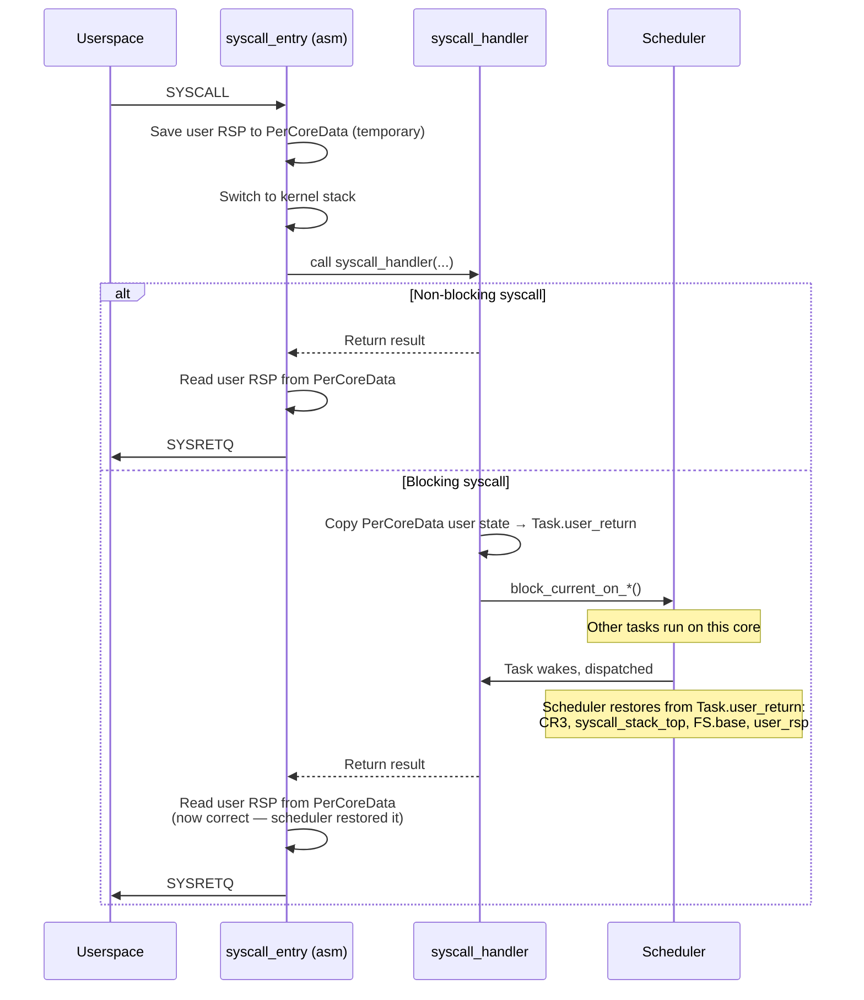
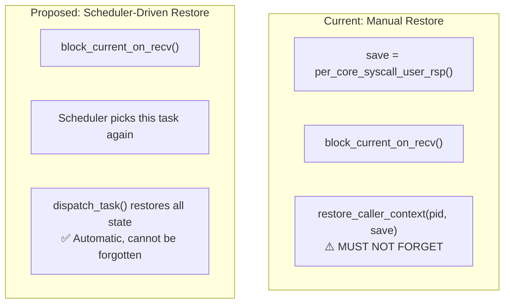
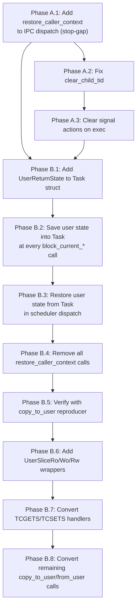

# Next Architecture: Process and Context Management

**Current state:** [docs/appendix/architecture/current/02-process-context.md](../current/02-process-context.md)
**Phases:** A (IPC restore fix), B (task-owned return state, UserBuffer wrappers)

## 1. Task-Owned Syscall Return State

### 1.1 Problem

Syscall return-critical state (`syscall_user_rsp`, `syscall_stack_top`, FS.base) lives in mutable per-core `PerCoreData` fields. When a task blocks and another runs on the same core, these fields are overwritten. Every blocking syscall must manually call `restore_caller_context()` to reinstall the correct values. Missing this call is the confirmed root cause of the stale-`syscall_user_rsp` bug.

This is a design-level problem: ~40 manual `restore_caller_context` call sites in the codebase, each required to correctly handle the same race. Every new blocking syscall path must add this call or silently introduce the same bug.

### 1.2 Proposed Design

Move user return state from `PerCoreData` into the `Task` struct. The scheduler dispatch restores it automatically when a task is selected to run.

```rust
/// User-mode return state. Saved at syscall entry, restored by scheduler.
pub struct UserReturnState {
    pub user_rsp: u64,       // User RSP at SYSCALL entry
    pub user_rip: u64,       // User RIP (rcx at SYSCALL)
    pub user_rflags: u64,    // User RFLAGS (r11 at SYSCALL)
    pub user_rbx: u64,       // Callee-saved user registers
    pub user_rbp: u64,
    pub user_r12: u64,
    pub user_r13: u64,
    pub user_r14: u64,
    pub user_r15: u64,
    pub kernel_stack_top: u64, // Kernel stack for this task
    pub fs_base: u64,          // TLS pointer
}

pub struct Task {
    // ... existing fields ...
    pub user_return: Option<UserReturnState>,  // None for kernel tasks
}
```

### 1.3 Modified Syscall Entry/Exit Flow



### 1.4 Key Change: Scheduler Dispatch Restores User State

```rust
// In scheduler run() loop, after pick_next():
fn dispatch_task(task: &Task, core: &mut PerCoreData) {
    if let Some(ref urs) = task.user_return {
        // Restore CR3
        if let Some(ref addr_space) = task.addr_space {
            Cr3::write(addr_space.pml4_frame(), ...);
            addr_space.activate_on_core(core.core_id);
        }

        // Restore per-core syscall state FROM task struct
        core.syscall_user_rsp = urs.user_rsp;
        core.syscall_stack_top = urs.kernel_stack_top;
        FsBase::write(urs.fs_base);

        // Restore TSS.RSP0
        core.tss_mut().privilege_stack_table[0] = VirtAddr::new(urs.kernel_stack_top);
    }
}
```

### 1.5 Elimination of `restore_caller_context`

With task-owned return state restored by the scheduler, `restore_caller_context` is no longer needed at individual blocking sites. The entire function can be removed.



### 1.6 Comparison: How Redox Handles This

Redox stores architecture context in `src/context/arch/x86_64.rs`:
- `rsp`, `fsbase`, `gsbase`, preserved registers — all per-context fields
- Syscall entry uses a per-CPU temporary slot for the *current transition*
- But the durable task state belongs to the context that is switched by the scheduler

This is exactly the pattern m3OS should adopt: per-core fields for the active transition, but the authoritative state lives with the task.

**Source:** `docs/appendix/redox-copy-to-user-comparison.md`, Finding 3.

### 1.7 Comparison: seL4's TCB

In seL4, all task state lives in the Thread Control Block (TCB). The TCB contains:
- Saved register set (architecture-specific)
- VSpace (address space) capability
- CSpace (capability space) root
- IPC buffer pointer
- Scheduling context (MCS kernel)

There is no per-core mutable scratch that needs manual restoration. The kernel dispatcher restores the complete register set from the TCB on every context switch.

**Source:** seL4 Reference Manual, Chapter 3 (Threads and Execution); `https://sel4.systems/Info/Docs/seL4-manual-latest.pdf`.

## 2. Typed UserBuffer Wrappers

### 2.1 Problem

Syscall handlers operate on raw `(u64 pointer, u64 length)` pairs throughout the codebase. Validation is done ad-hoc at each `copy_to_user`/`copy_from_user` call site. This makes auditing difficult and errors invisible until runtime.

### 2.2 Proposed Design

```rust
/// A validated user-space buffer for reading (kernel reads FROM user).
pub struct UserSliceRo {
    vaddr: u64,
    len: usize,
    _phantom: PhantomData<*const u8>,
}

/// A validated user-space buffer for writing (kernel writes TO user).
pub struct UserSliceWo {
    vaddr: u64,
    len: usize,
    _phantom: PhantomData<*mut u8>,
}

/// A validated user-space buffer for read-write access.
pub struct UserSliceRw {
    vaddr: u64,
    len: usize,
    _phantom: PhantomData<*mut u8>,
}

impl UserSliceRo {
    /// Validate and construct. Fails if address is null, in kernel space,
    /// or length exceeds MAX_COPY_LEN.
    pub fn new(vaddr: u64, len: usize) -> Result<Self, UserCopyError> {
        validate_user_range(vaddr, len)?;
        Ok(Self { vaddr, len, _phantom: PhantomData })
    }

    /// Copy user data into a kernel buffer.
    pub fn copy_to_kernel(&self, dst: &mut [u8]) -> Result<(), UserCopyError> {
        assert!(dst.len() >= self.len);
        copy_from_user(dst, self.vaddr)
            .map_err(|_| UserCopyError::Fault)
    }

    /// Read a single value from user space.
    pub fn read_val<T: Copy>(&self) -> Result<T, UserCopyError> {
        assert!(self.len >= core::mem::size_of::<T>());
        let mut val = core::mem::MaybeUninit::<T>::uninit();
        let dst = unsafe {
            core::slice::from_raw_parts_mut(
                val.as_mut_ptr() as *mut u8,
                core::mem::size_of::<T>(),
            )
        };
        copy_from_user(dst, self.vaddr)?;
        Ok(unsafe { val.assume_init() })
    }
}

impl UserSliceWo {
    pub fn new(vaddr: u64, len: usize) -> Result<Self, UserCopyError> {
        validate_user_range(vaddr, len)?;
        Ok(Self { vaddr, len, _phantom: PhantomData })
    }

    /// Copy kernel data to user space.
    pub fn copy_from_kernel(&self, src: &[u8]) -> Result<(), UserCopyError> {
        assert!(src.len() <= self.len);
        copy_to_user(self.vaddr, src)
            .map_err(|_| UserCopyError::Fault)
    }

    /// Write a single value to user space.
    pub fn write_val<T: Copy>(&self, val: &T) -> Result<(), UserCopyError> {
        let src = unsafe {
            core::slice::from_raw_parts(
                val as *const T as *const u8,
                core::mem::size_of::<T>(),
            )
        };
        copy_to_user(self.vaddr, src)?;
        Ok(())
    }
}

pub enum UserCopyError {
    NullPointer,
    KernelAddress,
    TooLarge,
    Fault,
}
```

### 2.3 Usage at Syscall Boundary

```rust
// BEFORE (current):
fn sys_linux_ioctl(fd: i32, request: u64, arg: u64) -> i64 {
    match request {
        TCGETS => {
            let termios = TTY0.lock().termios;
            let src = unsafe {
                core::slice::from_raw_parts(&termios as *const _ as *const u8, TERMIOS_SIZE)
            };
            match copy_to_user(arg, src) {
                Ok(()) => 0,
                Err(()) => -14, // EFAULT
            }
        }
        // ...
    }
}

// AFTER (proposed):
fn sys_linux_ioctl(fd: i32, request: u64, arg: u64) -> i64 {
    match request {
        TCGETS => {
            let dst = match UserSliceWo::new(arg, TERMIOS_SIZE) {
                Ok(s) => s,
                Err(_) => return -14,
            };
            let termios = TTY0.lock().termios;
            match dst.write_val(&termios) {
                Ok(()) => 0,
                Err(_) => -14,
            }
        }
        // ...
    }
}
```

### 2.4 Benefits

1. **Validation at boundary:** User pointers are validated once when constructing the `UserSlice*` wrapper. Interior code cannot accidentally use an unvalidated pointer.
2. **Read/write intent in the type:** A `UserSliceRo` cannot be used to write to user space — the compiler enforces this.
3. **Auditability:** `grep UserSliceWo` finds all kernel-to-user copy sites. `grep copy_to_user` becomes unnecessary.
4. **Debug metadata:** The wrapper can carry additional state (address-space generation, PID) for diagnostic logging.

### 2.5 Comparison: Redox's UserSlice

Redox wraps raw user pointers as `UserSliceRo`, `UserSliceWo`, `UserSliceRw` in `src/syscall/usercopy.rs`. These wrappers validate the user range once, carry read/write intent in the type, and centralize helpers like `read_u32`, `write_usize`, `copy_to_slice`, and `copy_from_slice`.

**Source:** `docs/appendix/redox-copy-to-user-comparison.md`, Finding 1; Redox kernel `src/syscall/usercopy.rs`.

## 3. Phase A: Immediate Bug Fixes

### 3.1 Fix IPC Blocking Paths

Add `restore_caller_context` to all IPC dispatch paths. This is a stop-gap before the full task-owned state migration.

**Locations to fix (6 paths in `kernel/src/ipc/mod.rs`):**

```rust
// In dispatch(), for blocking IPC syscalls:
fn dispatch(caller: TaskId, number: u8, arg0: u64, ...) -> u64 {
    let saved_rsp = per_core_syscall_user_rsp();  // ADD THIS
    let pid = current_pid();                       // ADD THIS

    let result = match number {
        1 => { /* ipc_recv - can block */ },
        3 => { /* ipc_call - can block */ },
        5 => { /* ipc_reply_recv - can block */ },
        7 => { /* notify_wait - can block */ },
        15 => { /* ipc_recv_msg - can block */ },
        16 => { /* ipc_reply_recv_msg - can block */ },
        // ...
    };

    restore_caller_context(pid, saved_rsp);        // ADD THIS
    result
}
```

### 3.2 Fix `clear_child_tid` on Thread Exit

```rust
// In sys_exit or process_exit, for threads with CLONE_CHILD_CLEARTID:
if proc.clear_child_tid != 0 {
    // Write 0 to the address
    let zero: u32 = 0;
    let _ = copy_to_user(proc.clear_child_tid, &zero.to_ne_bytes());
    // Wake futex waiters at that address
    futex_wake(proc.clear_child_tid, 1);
}
```

### 3.3 Clear Signal Actions on Exec

```rust
// In sys_execve, after building new page table:
for action in proc.signal_actions.iter_mut() {
    if matches!(action.disposition, SignalDisposition::Handler(_)) {
        action.disposition = SignalDisposition::Default;
    }
}
```

## 4. Implementation Order


