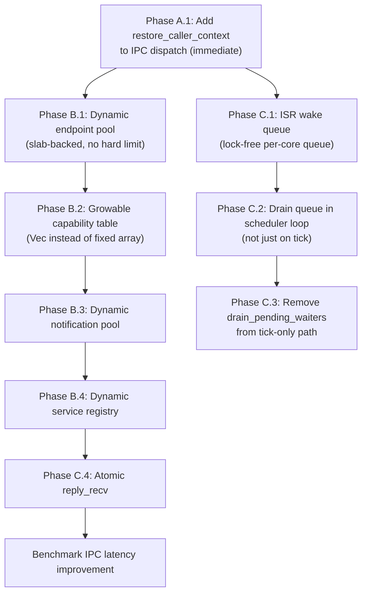

# Next Architecture: IPC and Wakeup Contracts

**Current state:** [docs/appendix/architecture/current/03-ipc-and-wakeups.md](../current/03-ipc-and-wakeups.md)
**Phases:** A (IPC restore fix), B (dynamic pools), C (ISR-direct wakeup)

## 1. Phase A: Fix IPC Blocking Return State

See [02-process-context.md](02-process-context.md) Section 3.1 for the immediate fix.

The IPC dispatch function in `kernel/src/ipc/mod.rs` calls blocking operations (endpoint recv, call, notification wait) without saving `syscall_user_rsp` beforehand and without calling `restore_caller_context` on return. This is the confirmed stale-return-state bug.

**Immediate fix:** Add `saved_user_rsp` capture and `restore_caller_context` to the IPC dispatch function. This is a 6-line change covering all blocking IPC paths.

**Long-term fix:** Task-owned return state (Phase B in process-context doc) eliminates the need for manual restore entirely.

## 2. Phase B: Dynamic IPC Resource Pools

### 2.1 Problem

All IPC resources are fixed-size arrays:
- `MAX_ENDPOINTS = 16`
- `MAX_NOTIFS = 16`
- `MAX_SERVICES = 16`
- `CapabilityTable.slots = [Option<Capability>; 64]`

A system with more than 16 services, or a process needing more than 64 capabilities, hits hard limits with no recourse.

### 2.2 Proposed Design: Slab-Allocated Endpoints

```rust
/// Dynamic endpoint pool backed by slab allocation.
pub struct EndpointPool {
    slabs: Vec<EndpointSlab>,
    free_ids: VecDeque<EndpointId>,
    next_id: EndpointId,
}

struct EndpointSlab {
    endpoints: [Option<Endpoint>; 16],  // Slab of 16 endpoints
}

impl EndpointPool {
    pub fn create(&mut self) -> Result<EndpointId, IpcError> {
        if let Some(id) = self.free_ids.pop_front() {
            // Reuse freed slot
            self.get_mut(id).replace(Endpoint::new());
            Ok(id)
        } else {
            // Allocate new slab if needed
            let slab_idx = self.next_id as usize / 16;
            if slab_idx >= self.slabs.len() {
                self.slabs.push(EndpointSlab::new());
            }
            let id = self.next_id;
            self.next_id += 1;
            self.get_mut(id).replace(Endpoint::new());
            Ok(id)
        }
    }

    pub fn destroy(&mut self, id: EndpointId) {
        if let Some(slot) = self.get_mut(id) {
            *slot = None;
            self.free_ids.push_back(id);
        }
    }
}
```

### 2.3 Growable Capability Table

```rust
/// Dynamically-sized capability table.
pub struct CapabilityTable {
    slots: Vec<Option<Capability>>,  // Grows in chunks of 64
}

impl CapabilityTable {
    pub fn new() -> Self {
        Self { slots: vec![None; 64] }  // Start with 64
    }

    pub fn insert(&mut self, cap: Capability) -> Result<CapHandle, CapError> {
        // Find first free slot
        for (i, slot) in self.slots.iter_mut().enumerate() {
            if slot.is_none() {
                *slot = Some(cap);
                return Ok(i as CapHandle);
            }
        }
        // Grow by 64 slots
        let old_len = self.slots.len();
        self.slots.resize(old_len + 64, None);
        self.slots[old_len] = Some(cap);
        Ok(old_len as CapHandle)
    }
}
```

### 2.4 Comparison: seL4 Capability Spaces

seL4 uses a tree of CNode objects to form a capability space (CSpace). Each CNode is a power-of-2 array of capability slots. CNodes can be nested via CNode capabilities, creating an arbitrarily deep tree. This allows fine-grained control over capability space layout and delegation.

m3OS does not need this level of complexity. A growable flat vector is sufficient for the current use case while removing the hard limit.

**Source:** seL4 Reference Manual, Chapter 4 (Capability Spaces); CNode operations defined in `libsel4/include/sel4/types.h`.

### 2.5 Comparison: Zircon Handle Table

Zircon uses a per-process handle table that is a growable array of `Handle` structs. Handles are allocated and freed dynamically. Each handle carries rights (read, write, duplicate, transfer, etc.) that are checked on every syscall.

**Source:** Fuchsia documentation: `https://fuchsia.dev/fuchsia-src/concepts/kernel/concepts#handles`.

## 3. Phase C: ISR-Direct Notification Wakeup

### 3.1 Problem

`signal_irq()` (called from interrupt handlers) sets `PENDING` bits but does NOT call `wake_task()`, because `wake_task()` acquires the `SCHEDULER` lock which could deadlock if the preempted task was holding it. Instead, `drain_pending_waiters()` runs on the BSP's scheduler tick (100 Hz), adding up to 10ms of latency.

### 3.2 Proposed Design: Lock-Free Wakeup Queue

Instead of calling `wake_task()` directly from ISR context, push the task ID to a lock-free queue that the scheduler drains on every iteration:

```rust
/// Per-core lock-free wakeup queue. ISRs push, scheduler pops.
pub struct IsrWakeQueue {
    buffer: [AtomicU64; 32],  // Ring buffer of TaskId values (0 = empty)
    head: AtomicUsize,        // Write position (ISR advances)
    tail: AtomicUsize,        // Read position (scheduler advances)
}

impl IsrWakeQueue {
    /// Called from ISR context. Lock-free.
    pub fn push(&self, task_id: TaskId) -> bool {
        let head = self.head.load(Relaxed);
        let next = (head + 1) % 32;
        if next == self.tail.load(Acquire) {
            return false;  // Queue full
        }
        self.buffer[head].store(task_id.0, Release);
        self.head.store(next, Release);
        true
    }

    /// Called from scheduler loop (non-ISR). Drains all pending wakeups.
    pub fn drain(&self) -> impl Iterator<Item = TaskId> + '_ {
        core::iter::from_fn(move || {
            let tail = self.tail.load(Relaxed);
            if tail == self.head.load(Acquire) {
                return None;
            }
            let id = self.buffer[tail].load(Acquire);
            self.tail.store((tail + 1) % 32, Release);
            Some(TaskId(id))
        })
    }
}
```

### 3.3 Modified Notification Signal Path

```mermaid
flowchart TD
    subgraph "Current"
        C1["signal_irq(irq)"] --> C2["PENDING.fetch_or(bits)"]
        C2 --> C3["signal_reschedule()"]
        C3 --> C4["... up to 10ms ..."]
        C4 --> C5["drain_pending_waiters() on BSP tick"]
        C5 --> C6["wake_task(waiter)"]
    end

    subgraph "Proposed"
        P1["signal_irq(irq)"] --> P2["PENDING.fetch_or(bits)"]
        P2 --> P3{Waiter registered?}
        P3 -->|Yes| P4["ISR_WAKE_QUEUE.push(waiter_id)"]
        P4 --> P5["signal_reschedule()"]
        P3 -->|No| P5

        P5 --> P6["Scheduler drains ISR_WAKE_QUEUE<br/>(every iteration, not just ticks)"]
        P6 --> P7["wake_task(waiter) — under SCHEDULER lock"]
    end

    style C4 fill:#ff6666,color:#000
    style P4 fill:#00cc66,color:#000
```



### 3.4 Latency Improvement

| Scenario | Current | Proposed |
|---|---|---|
| Keyboard IRQ → kbd_server wakeup | Up to 10ms (next BSP tick) | ~0 (next scheduler iteration) |
| Serial RX IRQ → serial feeder | N/A (kernel task, no IPC) | N/A |
| Timer IRQ → notification waiter | Up to 10ms | ~0 |

The key difference: the scheduler drains `ISR_WAKE_QUEUE` on every loop iteration, not just on timer ticks. Since the ISR sets `signal_reschedule()`, the scheduler wakes immediately from HLT and processes the queue.

### 3.5 Why Not Call wake_task Directly From ISR?

`wake_task()` acquires `SCHEDULER.lock()`. If the preempted task was in the middle of a scheduler operation (e.g., `yield_now()` holding the lock), the ISR would deadlock trying to acquire it.

Solutions:
1. **Lock-free wake queue** (proposed above) — avoids the lock entirely from ISR context
2. **Try-lock** — `SCHEDULER.try_lock()` from ISR, fall back to queue on failure. Simpler but less predictable.
3. **Per-core ready queues with lock-free enqueue** — the ISR pushes directly to a per-core queue (lock-free MPSC). This is more complex but would also help with scheduler lock contention.

The lock-free wake queue (option 1) is the simplest correct solution.

### 3.6 Comparison: seL4 Notification Delivery

In seL4, notifications are delivered immediately. The kernel's notification signal operation is designed to be callable from interrupt handlers:
- The signal operation atomically ORs a badge value into the notification word
- If a thread is waiting on the notification, it is immediately made runnable
- The kernel's interrupt handler epilogue checks for higher-priority runnable threads and context-switches if needed

seL4 achieves this because its scheduler and IPC paths are designed for bounded, predictable execution with interrupts disabled for minimal windows.

**Source:** seL4 Reference Manual, Chapter 6 (Notifications).

### 3.7 Comparison: MINIX3 Asynchronous Notify

MINIX3's `notify` primitive is designed for signals between system processes. It is non-blocking — the notification is always delivered, either immediately (if the recipient is waiting) or queued (as a pending bit). The kernel handles notification delivery without requiring the scheduler lock because notifications are simple bitfield operations on per-process state.

**Source:** MINIX3 documentation; Tanenbaum & Woodhull, "Operating Systems: Design and Implementation," 3rd edition, Chapter 2.

## 4. Atomic Reply-Recv

### 4.1 Problem

`reply_recv` is currently two separate operations: `reply(caller, msg)` then `recv(server, ep)`. There is a window between them where a client could send to the endpoint and find no receiver.

### 4.2 Proposed Design

```rust
/// Atomic reply + recv: reply to the caller and block for the next message
/// in a single critical section.
pub fn reply_recv_atomic(
    server: TaskId,
    reply_cap: TaskId,
    reply_msg: Message,
    ep_id: EndpointId,
) -> u64 {
    let mut endpoints = ENDPOINTS.lock();

    // Step 1: Reply (while holding endpoint lock)
    deliver_message(reply_cap, reply_msg);
    wake_task(reply_cap);

    // Step 2: Check for next sender (same lock hold)
    let ep = &mut endpoints.slots[ep_id as usize].as_mut().unwrap();
    if let Some(pending) = ep.senders.pop_front() {
        // Immediate rendezvous with next sender
        drop(endpoints);
        // ... deliver message to server, handle reply cap ...
    } else {
        // No sender waiting — block
        ep.receivers.push_back(server);
        drop(endpoints);
        block_current_on_recv_unless_message();
    }

    take_message(server)
}
```

This eliminates the window between reply and recv. The server is either immediately matched with the next sender or atomically enters the receivers queue.

### 4.3 Comparison: seL4 ReplyRecv

seL4's `seL4_ReplyRecv` is a single syscall that atomically replies to the caller and waits for the next message on the endpoint. This is the standard server loop pattern in seL4 and is optimized in the fast-path IPC implementation.

**Source:** seL4 Reference Manual, Chapter 5 (IPC); `seL4_ReplyRecv` API.

## 5. Implementation Order


