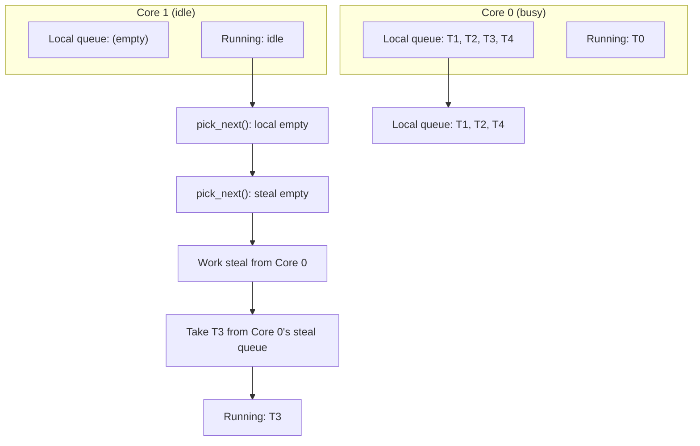
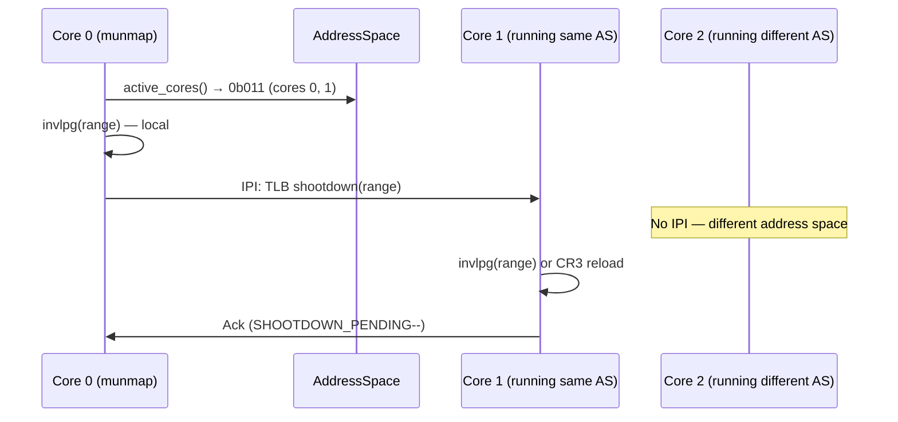
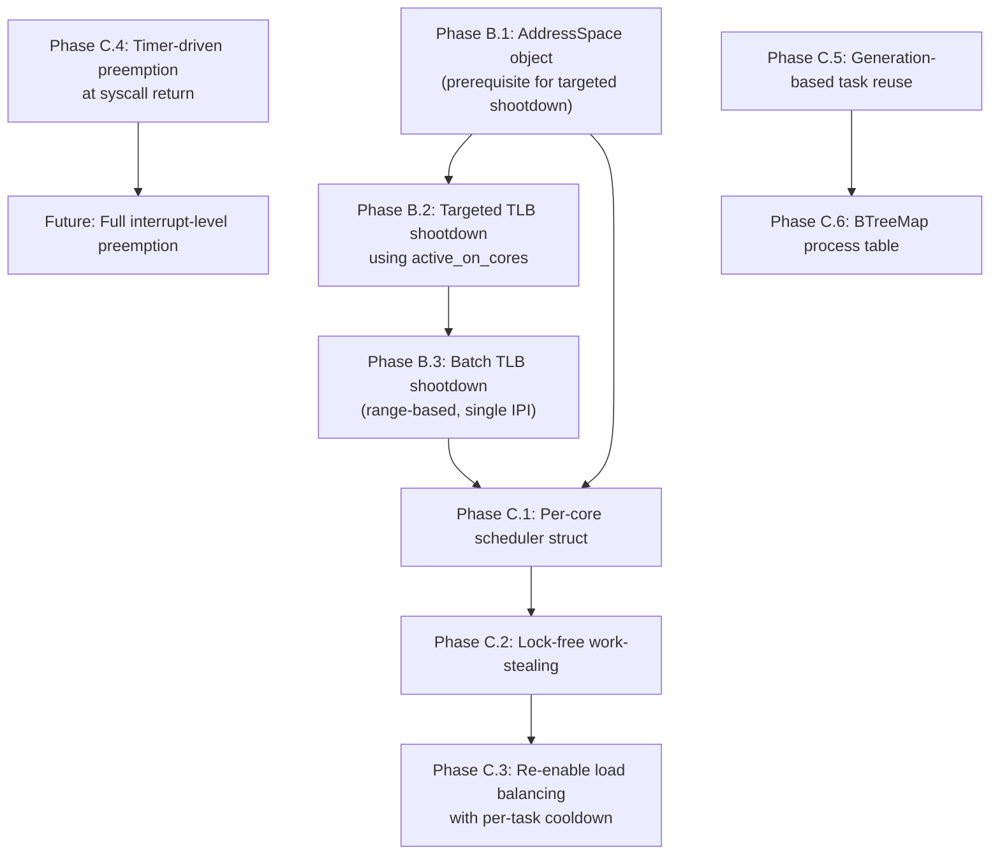

# Next Architecture: Scheduler and SMP

**Current state:** [docs/appendix/architecture/current/04-scheduler-smp.md](../current/04-scheduler-smp.md)
**Phases:** B (targeted TLB shootdown), C (per-core scheduler, work-stealing)

## 1. Per-Core Scheduler with Work-Stealing

### 1.1 Problem

The current `SCHEDULER: Mutex<Scheduler>` is a single global lock protecting all task state. Every scheduler operation (spawn, wake, pick_next, block, yield) acquires this lock. On a 4+ core system, this becomes a contention bottleneck.

Additionally, load balancing is currently disabled due to migration thrashing.

### 1.2 Proposed Design

```rust
/// Per-core scheduler state. No global lock for the common path.
pub struct PerCoreScheduler {
    /// Local ready queue. Only this core modifies; other cores can steal.
    local_queue: VecDeque<TaskHandle>,

    /// Steal-enabled queue tail. Other cores read from here.
    /// Protected by a separate lock to avoid contention with local push/pop.
    steal_queue: Mutex<VecDeque<TaskHandle>>,

    /// Current running task.
    current: Option<TaskHandle>,

    /// Idle task for this core.
    idle_task: TaskHandle,
}

/// Global task registry. Only used for spawn and exit, not scheduling hot path.
pub struct TaskRegistry {
    tasks: Mutex<Vec<Task>>,
}

impl PerCoreScheduler {
    /// Called by the local core. No lock needed.
    fn push_local(&mut self, task: TaskHandle) {
        self.local_queue.push_back(task);
    }

    /// Called by remote cores to enqueue a woken task.
    fn push_remote(&self, task: TaskHandle) {
        self.steal_queue.lock().push_back(task);
    }

    /// Pick next task: local queue first, then steal queue, then steal from others.
    fn pick_next(&mut self) -> TaskHandle {
        // Phase 1: Local queue (no lock)
        if let Some(task) = self.local_queue.pop_front() {
            return task;
        }

        // Phase 2: Steal queue (own lock)
        {
            let mut steal = self.steal_queue.lock();
            if let Some(task) = steal.pop_front() {
                return task;
            }
        }

        // Phase 3: Work-stealing from other cores
        for other_core in random_core_order() {
            if let Some(task) = other_core.steal_one() {
                return task;
            }
        }

        // Phase 4: Idle
        self.idle_task
    }

    /// Allow other cores to steal one task from our local queue.
    fn steal_one(&self) -> Option<TaskHandle> {
        // Move half of local queue to steal queue, then pop one
        // This amortizes the lock cost
        let mut steal = self.steal_queue.lock();
        // ... transfer from local to steal, pop one ...
        steal.pop_front()
    }
}
```

### 1.3 Work-Stealing Flow



### 1.4 Comparison: Zircon's Scheduler

Zircon uses a per-CPU fair scheduler with:
- Per-CPU ready queues
- Priority-based scheduling with deadline support
- No global scheduler lock on the dispatch path
- Work-stealing not currently used (Zircon prefers affinity and migration on explicit events)

**Source:** Fuchsia documentation: `https://fuchsia.dev/fuchsia-src/concepts/kernel/fair_scheduler`.

### 1.5 Comparison: seL4's Lock-Free Queues

In seL4 (MCS kernel), each scheduling context has a budget and period. The kernel maintains per-core ready queues. The fast-path IPC does not need to acquire a scheduler lock — it directly manipulates the ready queue of the current core.

**Source:** seL4 MCS documentation; Lyons et al., "Scheduling-Context Capabilities: A Principled, Light-Weight Operating-System Mechanism for Managing Time," EuroSys 2018.

## 2. Targeted TLB Shootdown

### 2.1 Problem

Current shootdown broadcasts to all cores regardless of which address space is affected. With the proposed `AddressSpace.active_on_cores` tracking, we can send IPIs only to cores running the affected address space.

See [01-memory-management.md](01-memory-management.md) Section 2 for the full batch TLB shootdown design.

### 2.2 Integration with Per-Core Scheduler

The per-core scheduler maintains the `current_addrspace` pointer in `PerCoreData`. The shootdown protocol reads `AddressSpace.active_on_cores` to determine which cores need IPIs:



### 2.3 Comparison: Redox's TLB Protocol

Redox ties TLB shootdown acknowledgement to the address-space object:
- `AddrSpaceWrapper.used_by` tracks which CPUs use each address space
- When a mapping changes, the kernel sends shootdown IPIs only to CPUs in `used_by`
- `tlb_ack` on the address space object tracks acknowledgement

This is exactly the model m3OS should adopt with the proposed `AddressSpace.active_on_cores`.

**Source:** `docs/appendix/redox-copy-to-user-comparison.md`, Finding 4; Redox kernel `src/context/memory.rs`.

## 3. Preemption Improvements

### 3.1 Current Limitation

The timer sets `reschedule = true` but tasks only switch at cooperative yield/block points. A tight loop holds the CPU indefinitely.

### 3.2 Proposed: Timer-Driven Preemption

Modify the timer ISR to check if the current task has exceeded its time quantum:

```rust
fn timer_handler() {
    let core = per_core();

    // Increment current task's system_ticks
    if let Some(idx) = core.current_task_idx.load(Acquire) {
        if idx >= 0 {
            // Check if task has exceeded quantum (e.g., 10ms = 1 tick at 100 Hz)
            let task = &SCHEDULER.tasks[idx as usize];
            let elapsed = current_tick() - task.start_tick;
            if elapsed >= PREEMPT_QUANTUM_TICKS {
                // Set preemption flag — task will be switched at next safe point
                core.preempt_pending.store(true, Release);
            }
        }
    }

    core.reschedule.store(true, Release);
    send_eoi();
}
```

**True involuntary preemption** (switching from the ISR itself) would require saving the complete interrupted context, which the current `switch_context` assembly does not support. A simpler approach is to check `preempt_pending` at system call return and force a yield:

```rust
// At syscall_handler return, before SYSRETQ:
if per_core().preempt_pending.swap(false, Relaxed) {
    yield_now();  // Force context switch
}
```

This gives preemption at syscall granularity (every syscall return is a preemption point), which handles most userspace-heavy workloads. True interrupt-level preemption would require a deeper redesign of `switch_context`.

### 3.3 Comparison: seL4 MCS Preemption

seL4's MCS (Mixed Criticality Systems) kernel provides budget-based preemption:
- Each thread has a scheduling context with a `budget` (time) and `period`
- When the budget is exhausted, the thread is preempted
- Budget replenishment happens at the start of each period
- The kernel itself is preemptible at designated preemption points

**Source:** seL4 MCS documentation; `https://docs.sel4.systems/projects/sel4/api-doc.html#scheduling-context`.

## 4. Dead Task Cleanup

### 4.1 Problem

`SCHEDULER.tasks` is a `Vec<Task>` that only grows. Dead tasks keep their index but stack is freed. Over time, the vec becomes large with many dead entries.

### 4.2 Proposed Design: Generation-Based Reuse

```rust
pub struct TaskSlot {
    generation: u32,         // Incremented on reuse
    task: Option<Task>,      // None = free slot
}

pub struct TaskRegistry {
    slots: Vec<TaskSlot>,
    free_list: VecDeque<usize>,  // Indices of free slots
}

// TaskHandle encodes both index and generation for ABA protection:
pub struct TaskHandle {
    index: u32,
    generation: u32,
}

impl TaskRegistry {
    fn spawn(&mut self, task: Task) -> TaskHandle {
        if let Some(idx) = self.free_list.pop_front() {
            let slot = &mut self.slots[idx];
            slot.generation += 1;
            slot.task = Some(task);
            TaskHandle { index: idx as u32, generation: slot.generation }
        } else {
            let idx = self.slots.len();
            self.slots.push(TaskSlot { generation: 1, task: Some(task) });
            TaskHandle { index: idx as u32, generation: 1 }
        }
    }

    fn exit(&mut self, handle: TaskHandle) {
        let slot = &mut self.slots[handle.index as usize];
        if slot.generation == handle.generation {
            slot.task = None;
            self.free_list.push_back(handle.index as usize);
        }
    }
}
```

The generation counter prevents ABA races: a stale `TaskHandle` from a previously-exited task will not match the new occupant's generation.

## 5. Process Table Optimization

### 5.1 Problem

`PROCESS_TABLE.find(pid)` is O(n) linear scan. With many threads this slows signal delivery, waitpid, and any syscall that looks up by PID.

### 5.2 Proposed Design: HashMap or Slab

```rust
use alloc::collections::BTreeMap;

pub struct ProcessTable {
    by_pid: BTreeMap<Pid, Process>,  // O(log n) lookup
}

impl ProcessTable {
    pub fn find(&self, pid: Pid) -> Option<&Process> {
        self.by_pid.get(&pid)
    }

    pub fn insert(&mut self, proc: Process) -> Pid {
        let pid = proc.pid;
        self.by_pid.insert(pid, proc);
        pid
    }

    pub fn reap(&mut self, pid: Pid) -> Option<Process> {
        self.by_pid.remove(&pid)
    }
}
```

A `BTreeMap` provides O(log n) lookup and ordered iteration (useful for finding children of a process). A `HashMap` would give O(1) amortized but requires a hasher in `no_std`.

## 6. Implementation Order


