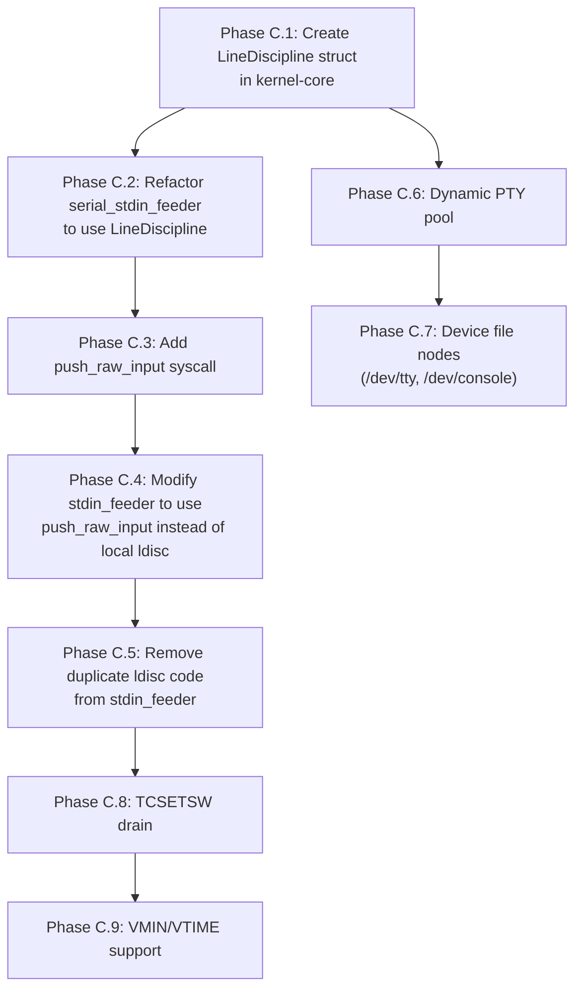

# Next Architecture: Terminal and PTY

**Current state:** [docs/appendix/architecture/current/05-terminal-pty.md](../current/05-terminal-pty.md)
**Phase:** C (unified line discipline, dynamic PTY pool)

## 1. Unified Line Discipline

### 1.1 Problem

The line discipline (canonical editing, signal generation, echo, input flag processing) is implemented twice:
1. **Kernel:** `serial_stdin_feeder_task` in `kernel/src/main.rs:538-700` — for serial input
2. **Userspace:** `stdin_feeder` in `userspace/stdin_feeder/src/main.rs` — for keyboard input

Both implementations read from `TTY0.termios` and write to the kernel's `stdin` buffer. They can drift, and the userspace implementation had to use register-return workaround syscalls to avoid the `copy_to_user` bug.

### 1.2 Proposed Design: Single Kernel-Side Line Discipline

Move all line discipline processing into the kernel, callable from both the serial and keyboard paths. The keyboard path would feed raw bytes to the same kernel function that the serial path uses.

```rust
/// Unified line discipline processor.
/// Called from both serial feeder (kernel task) and keyboard feeder (kernel task or syscall).
pub struct LineDiscipline {
    /// Terminal state reference.
    tty: &'static Mutex<TtyState>,
}

impl LineDiscipline {
    /// Process a single input byte through the line discipline.
    /// Returns bytes to echo (if any) and whether the byte was pushed to stdin.
    pub fn process_byte(&self, byte: u8) -> LdiscResult {
        let mut tty = self.tty.lock();
        let termios = &tty.termios;

        // Input flag processing
        let byte = self.apply_iflag(byte, termios);
        if byte.is_none() { return LdiscResult::Consumed; }
        let byte = byte.unwrap();

        // Signal generation (ISIG)
        if termios.c_lflag & ISIG != 0 {
            if let Some(sig) = self.check_signal(byte, termios) {
                drop(tty); // Release lock before signal delivery
                send_signal_to_group(FG_PGID.load(Relaxed), sig);
                return LdiscResult::Signal(sig);
            }
        }

        // Canonical editing (ICANON)
        if termios.c_lflag & ICANON != 0 {
            return self.process_canonical(byte, &mut tty);
        }

        // Raw mode: push directly
        drop(tty);
        stdin::push_char(byte);
        LdiscResult::Pushed
    }

    fn apply_iflag(&self, byte: u8, termios: &Termios) -> Option<u8> {
        if byte == b'\r' {
            if termios.c_iflag & IGNCR != 0 { return None; }
            if termios.c_iflag & ICRNL != 0 { return Some(b'\n'); }
        }
        if byte == b'\n' && termios.c_iflag & INLCR != 0 {
            return Some(b'\r');
        }
        Some(byte)
    }
}

pub enum LdiscResult {
    Consumed,          // Byte consumed (e.g., IGNCR)
    Signal(u8),        // Signal generated
    Pushed,            // Byte pushed to stdin
    Echo(Vec<u8>),     // Bytes to echo back
}
```

### 1.3 Modified Keyboard Path

```mermaid
flowchart TD
    subgraph "Current"
        A1["IRQ1 → scancode"] --> A2["kbd_server (IPC)"]
        A2 --> A3["stdin_feeder (userspace)"]
        A3 --> A4["Decode scancode → ASCII"]
        A4 --> A5["Read termios via register-return syscalls"]
        A5 --> A6["Apply line discipline in userspace"]
        A6 --> A7["stdin_push syscall"]
    end

    subgraph "Proposed"
        B1["IRQ1 → scancode"] --> B2["kbd_server (IPC)"]
        B2 --> B3["stdin_feeder (userspace or kernel task)"]
        B3 --> B4["Decode scancode → ASCII"]
        B4 --> B5["push_raw_input syscall"]
        B5 --> B6["Kernel: LineDiscipline.process_byte()"]
        B6 --> B7["stdin::push_char() + echo"]
    end
```



**Benefits:**
- Single implementation of line discipline logic
- No `copy_to_user` needed for termios reads (kernel reads directly)
- No `c_cc` caching staleness (kernel always reads live termios)
- Consistent behavior between serial and keyboard input
- Easier to maintain and test

### 1.4 Comparison: Linux TTY Layer

Linux implements the line discipline entirely in the kernel as a "ldisc" (line discipline) module. The default N_TTY ldisc handles canonical editing, echo, signal generation, and input/output flag processing. Input sources (keyboard driver, serial driver, PTY master writes) all feed bytes through the ldisc layer.

This is exactly the pattern m3OS should adopt — though at a simpler scale given the single-user interactive focus.

**Source:** Linux kernel `drivers/tty/n_tty.c`; LWN article "The TTY demystified" (`https://www.linuxjournal.com/article/5langston`).

## 2. Dynamic PTY Pool

### 2.1 Problem

`MAX_PTYS = 16` is a compile-time constant. A system with more than 16 SSH sessions, or an application opening many PTYs (e.g., terminal multiplexer), hits this limit.

### 2.2 Proposed Design

```rust
/// Dynamic PTY pool backed by Vec.
pub struct PtyPool {
    pairs: Vec<Option<PtyPairState>>,
    wait_queues_master: Vec<WaitQueue>,
    wait_queues_slave: Vec<WaitQueue>,
    free_ids: VecDeque<usize>,
}

impl PtyPool {
    pub fn alloc(&mut self) -> Result<usize, ()> {
        if let Some(id) = self.free_ids.pop_front() {
            self.pairs[id] = Some(PtyPairState::new(id as u32));
            Ok(id)
        } else {
            let id = self.pairs.len();
            self.pairs.push(Some(PtyPairState::new(id as u32)));
            self.wait_queues_master.push(WaitQueue::new());
            self.wait_queues_slave.push(WaitQueue::new());
            Ok(id)
        }
    }

    pub fn free(&mut self, id: usize) {
        self.pairs[id] = None;
        self.free_ids.push_back(id);
    }
}
```

### 2.3 Wait Queue Management

Each PTY pair currently has separate `PTY_MASTER_WQ` and `PTY_SLAVE_WQ` arrays indexed by PTY ID. With dynamic allocation, these become `Vec<WaitQueue>` that grow alongside the PTY pool.

## 3. Device File Interface

### 3.1 Problem

The console TTY is not a real device file. There is no `/dev/tty0`, `/dev/console`, or `/dev/tty`. stdin/stdout are `FdBackend::DeviceTTY` by convention. Programs cannot `open("/dev/tty")` to access their controlling terminal.

### 3.2 Proposed Design

Add device nodes to the VFS:

```rust
/// Device file entries in tmpfs or a dedicated devfs.
pub enum DeviceNode {
    Console,           // /dev/console → TTY0
    Tty,               // /dev/tty → calling process's controlling terminal
    Ptmx,              // /dev/ptmx → allocate new PTY pair (already exists)
    Pts(u32),          // /dev/pts/<n> → PTY slave (already exists)
    Null,              // /dev/null → discard writes, read EOF
    Zero,              // /dev/zero → read zeros
}
```

When a process `open("/dev/tty")`:
1. Look up the calling process's `controlling_tty`
2. If `Console` → return `FdBackend::DeviceTTY`
3. If `Pty(id)` → return `FdBackend::PtySlave { pty_id: id }`
4. If `None` → return `ENXIO`

## 4. TCSETSW Drain Implementation

### 4.1 Problem

`TCSETSW` is documented to wait for output to drain before changing terminal settings. Currently treated identically to `TCSETS`.

### 4.2 Proposed Design

For PTY: wait until `s2m` ring buffer is empty (all echoed/output data has been read by the master).
For console: wait until the serial TX FIFO and framebuffer write queue are empty.

```rust
fn tcsetattr_wait(fd: i32, termios: &Termios) -> i32 {
    match fd_backend(fd) {
        PtySlave { pty_id } => {
            loop {
                let table = PTY_TABLE.lock();
                let pair = &table[pty_id];
                if pair.s2m.is_empty() { break; }
                drop(table);
                // Block on slave wait queue until master reads
                PTY_SLAVE_WQ[pty_id].sleep();
            }
            // Now apply termios
            PTY_TABLE.lock()[pty_id].termios = *termios;
            0
        }
        DeviceTTY => {
            // Console: just apply (no real output queue to drain)
            TTY0.lock().termios = *termios;
            0
        }
        _ => -ENOTTY,
    }
}
```

## 5. Implementation Order


