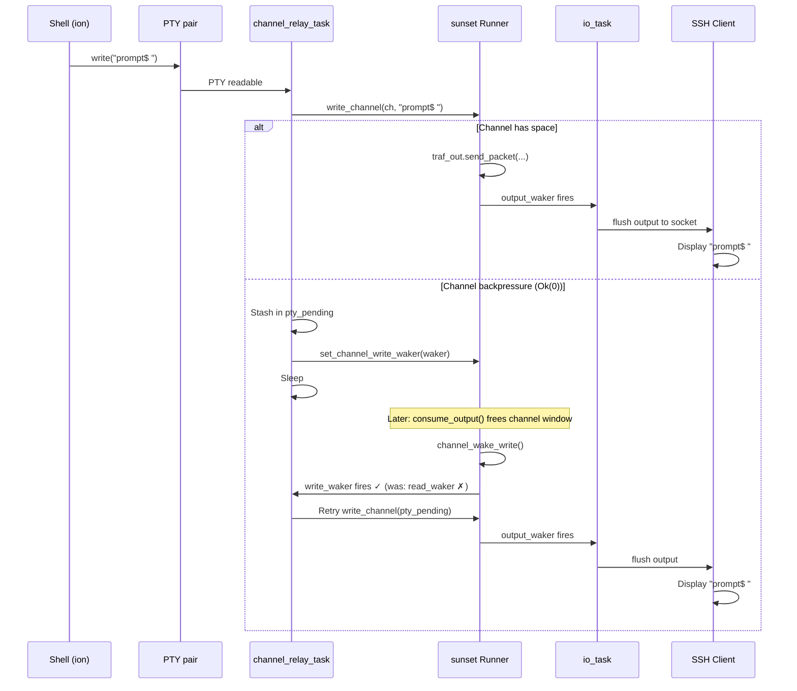
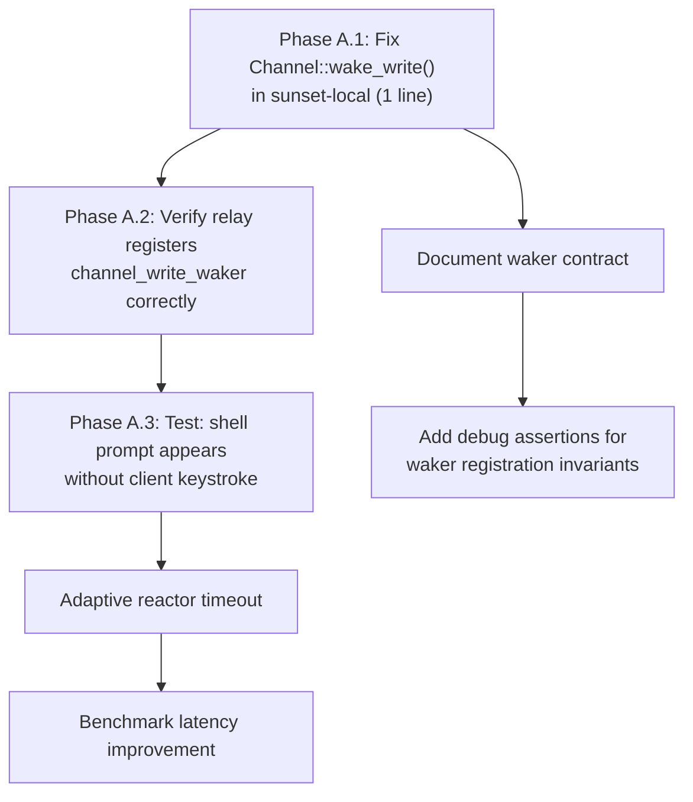

# Next Architecture: Async I/O Model

**Current state:** [docs/appendix/architecture/current/06-async-io-model.md](../current/06-async-io-model.md)
**Phase:** A (sunset wake_write fix)

## 1. Phase A: Fix sunset `Channel::wake_write()` Bug

### 1.1 Problem

Two compounding defects cause PTY output to stall under SSH channel backpressure:

**Defect 1 (sunset library):** `Channel::wake_write()` in `sunset-local/src/channel.rs:840-845` calls `self.read_waker.take()` instead of `self.write_waker.take()` for normal data. Even if sshd correctly registers a write waker, the backpressure-cleared event wakes the wrong waker.

**Defect 2 (sshd session):** The relay task's write-waker registration was previously missing (now partially fixed in the codebase, but the sunset bug makes it ineffective).

### 1.2 Fix

```rust
// sunset-local/src/channel.rs, Channel::wake_write()
// BEFORE (buggy):
pub fn wake_write(&mut self, dt: ChanData) {
    match dt {
        ChanData::Normal => {
            if let Some(w) = self.read_waker.take() {  // ← WRONG
                w.wake();
            }
        }
        // ...
    }
}

// AFTER (correct):
pub fn wake_write(&mut self, dt: ChanData) {
    match dt {
        ChanData::Normal => {
            if let Some(w) = self.write_waker.take() {  // ← CORRECT
                w.wake();
            }
        }
        // ...
    }
}
```

### 1.3 Verification

After the fix, the following scenario should work without requiring a client keystroke:



## 2. Improved Waker Contract Documentation

### 2.1 Problem

The waker contract between sshd and the sunset library is implicit and poorly documented. The three async tasks share `Rc<Mutex<Runner>>` and must coordinate through sunset's waker API, but the expected call patterns are not formalized.

### 2.2 Proposed Waker Contract

Document and enforce the following waker contract:

```
┌─────────────────────────────────────────────────────────────────┐
│                    sunset Waker Contract                        │
├─────────────────┬───────────────────────────────────────────────┤
│ Event           │ Who Wakes         │ Waker Used                │
├─────────────────┼───────────────────┼───────────────────────────┤
│ New output in   │ Runner internals  │ output_waker              │
│ output_buf()    │ (after progress   │ (set by io_task via       │
│                 │  or write_channel)│  set_output_waker)        │
├─────────────────┼───────────────────┼───────────────────────────┤
│ Runner can      │ Runner internals  │ input_waker               │
│ accept more     │ (after consuming  │ (set by io_task via       │
│ input           │  input bytes)     │  set_input_waker)         │
├─────────────────┼───────────────────┼───────────────────────────┤
│ Channel has     │ Runner internals  │ channel_read_waker        │
│ readable data   │ (after decrypt)   │ (set by relay via         │
│                 │                   │  set_channel_read_waker)  │
├─────────────────┼───────────────────┼───────────────────────────┤
│ Channel can     │ Runner internals  │ channel_write_waker       │
│ accept writes   │ (after window     │ (set by relay via         │
│                 │  adjust or drain) │  set_channel_write_waker) │
├─────────────────┼───────────────────┼───────────────────────────┤
│ Progress needed │ Runner internals  │ progress_waker            │
│                 │                   │ (set by progress_task via │
│                 │                   │  progress_notify)         │
└─────────────────┴───────────────────┴───────────────────────────┘
```

### 2.3 Task Sleep Invariant

Each async task MUST register wakers for ALL events that could unblock it before sleeping:

```rust
// channel_relay_task sleep invariant:
// Before sleeping, the relay must have registered:
// 1. PTY read interest (via reactor) — for new shell output
// 2. PTY write interest (if pty_write_pending > 0) — for PTY write space
// 3. channel_read_waker — for client keystrokes
// 4. channel_write_waker (if pty_pending > 0) — for channel write space
//
// Missing ANY of these → potential stall.
```

## 3. Reactor Latency Improvement

### 3.1 Problem

The reactor blocks for up to 100ms when no task is runnable. This adds latency for events that arrive during the blocking poll.

### 3.2 Proposed: Adaptive Timeout

```rust
impl Reactor {
    pub fn poll_once_adaptive(&mut self, idle_count: &mut u32) -> usize {
        // Start with non-blocking poll
        let ready = self.poll_inner(0);
        if ready > 0 {
            *idle_count = 0;
            return ready;
        }

        // Exponential backoff: 1ms, 2ms, 4ms, 8ms, 16ms, max 50ms
        let timeout = match *idle_count {
            0 => 1,
            1 => 2,
            2 => 4,
            3 => 8,
            4 => 16,
            _ => 50,
        };
        *idle_count = (*idle_count + 1).min(5);

        self.poll_inner(timeout)
    }
}
```

This reduces idle CPU usage while keeping latency low for bursty workloads.

## 4. Future: Event-Driven Architecture

### 4.1 Current Limitation

The sshd's cooperative async executor is single-threaded. All three tasks share one thread of execution. Under heavy traffic, contention on the `Runner` mutex and sequential task polling limit throughput.

### 4.2 Long-Term Direction: Kernel Event Ports

For future consideration (not immediate), m3OS could adopt a Zircon-style port mechanism:

```rust
/// Kernel-side event aggregation (like Zircon ports or Linux io_uring).
pub struct EventPort {
    queue: VecDeque<Event>,
    waiters: WaitQueue,
}

pub struct Event {
    pub key: u64,       // User-defined correlation key
    pub status: i32,    // Result code
    pub signal: u32,    // Signal bits
}
```

This would allow truly asynchronous I/O where the kernel queues completion events and the userspace executor drains them without per-FD polling.

### 4.3 Comparison: Zircon Ports

Zircon's `zx_port_t` is the primary event aggregation mechanism:
- Objects can be "bound" to a port with `zx_object_wait_async()`
- When the object's signals change, a packet is queued to the port
- `zx_port_wait()` blocks until a packet is available
- This replaces poll/select/epoll with a more general event model

**Source:** Fuchsia documentation: `https://fuchsia.dev/fuchsia-src/concepts/kernel/concepts#ports`.

## 5. Implementation Order


