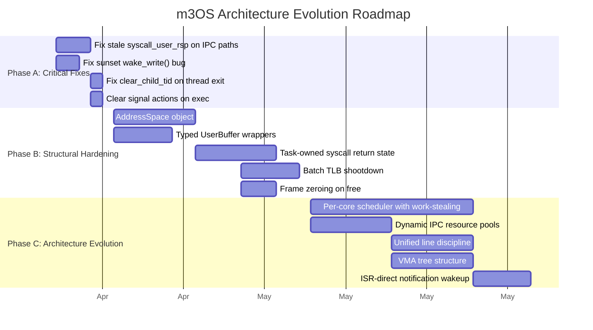

# m3OS Next Architecture: Proposed Changes

**Version:** Targeting kernel v0.53+ (post Phase 52)
**Date:** 2026-04-10
**Purpose:** Phased roadmap of architectural improvements to address the structural weaknesses documented in `docs/appendix/architecture/current/`.

## Motivation

The `copy_to_user` reliability bug and the SSHD hang analysis revealed that m3OS's current issues are not isolated bugs but symptoms of deeper architectural patterns. This document proposes a phased set of changes organized by severity: critical bug fixes first, then structural hardening, then architectural evolution.

## Change Phases

## Document Index

| # | Document | Scope | Phase |
|---|---|---|---|
| 01 | [Memory Management](01-memory-management.md) | AddressSpace object, batch TLB shootdown, frame zeroing, VMA tree | B, C |
| 02 | [Process and Context](02-process-context.md) | Task-owned return state, UserBuffer wrappers | A, B |
| 03 | [IPC and Wakeups](03-ipc-and-wakeups.md) | IPC restore fix, dynamic pools, ISR-direct wakeup | A, B, C |
| 04 | [Scheduler and SMP](04-scheduler-smp.md) | Per-core scheduler, targeted TLB shootdown | B, C |
| 05 | [Terminal and PTY](05-terminal-pty.md) | Unified line discipline, dynamic PTY pool | C |
| 06 | [Async I/O Model](06-async-io-model.md) | sunset wake_write fix, improved waker contract | A |
| -- | [Sources](sources.md) | All external references used in these documents | -- |

## Phase Summary

### Phase A: Critical Bug Fixes (Immediate)

These are confirmed bugs with known fixes. No architectural redesign needed — just targeted patches.

| Fix | Root Cause | Impact | Effort |
|---|---|---|---|
| `restore_caller_context` for IPC blocking paths | IPC dispatch doesn't save/restore per-core state | Wrong user RSP on return from blocking IPC | Low: ~6 call sites |
| sunset `Channel::wake_write()` | `read_waker.take()` instead of `write_waker.take()` | PTY output stalls under channel backpressure | Low: 1 line fix |
| `clear_child_tid` on thread exit | Exit path doesn't write 0 and wake futex | musl `pthread_join` hangs | Low: ~10 lines |
| Clear signal actions on exec | `sys_execve` doesn't reset caught signals | Exec'd programs inherit unexpected handlers | Low: ~5 lines |

### Phase B: Structural Hardening (Near-term)

Redesign patterns that are proven sources of bugs. These changes are larger but don't alter the kernel's fundamental architecture.

| Change | Problem Addressed | Approach |
|---|---|---|
| First-class `AddressSpace` object | No per-CPU address-space tracking, no generation cookies | Wrap CR3 + VMAs + generation in a refcounted struct |
| Typed `UserBuffer` wrappers | Raw u64 pointer/length pairs scattered across syscall handlers | `UserSliceRo`/`UserSliceWo` validated at syscall boundary |
| Task-owned syscall return state | Manual `restore_caller_context` at every blocking path | Move `syscall_user_rsp`, stack_top, FS.base into Task struct |
| Batch TLB shootdown | O(pages) IPIs for munmap/mprotect | Range-based shootdown with single IPI |
| Frame zeroing on free | Stale data exposure via freed frames | Zero frames in `free_frame` before returning to pool |

### Phase C: Architecture Evolution (Medium-term)

Larger architectural changes that improve scalability and maintainability.

| Change | Problem Addressed | Approach |
|---|---|---|
| Per-core scheduler with work-stealing | Global scheduler lock contention | Per-core ready queues, lock-free work-stealing |
| Dynamic IPC resource pools | Hard limits of 16 endpoints/notifications/services | Growable `Vec`-backed pools or slab allocation |
| Unified line discipline | Duplicated line discipline in kernel + userspace | Single kernel-side line discipline for all input paths |
| VMA tree | O(n) VMA lookup in page fault handler | Balanced tree (B-tree or interval tree) |
| ISR-direct notification wakeup | Up to 10ms latency from ISR to task wakeup | Lock-free `wake_task` callable from ISR context |

## Design Principles

These principles guide all proposed changes, informed by studying Redox, seL4, Zircon, and MINIX3:

### 1. State Ownership Over Mutable Scratch

> "User return state should be task-owned, not per-core scratch." — Redox comparison analysis

Per-core mutable state that is overwritten on every context switch is inherently fragile. Critical state should live in the task/process structure and be restored by the scheduler, not by manual calls in every blocking path.

**Redox precedent:** Per-CPU temporary slot for the *current transition*, but durable task state in the context struct (`src/context/arch/x86_64.rs`).
**Source:** `docs/appendix/redox-copy-to-user-comparison.md`, Finding 3.

### 2. Address Space as First-Class Object

> "Always be able to answer: which address space does this CPU believe is current right now, and which physical frame backs this user VA in that address space?" — Redox comparison analysis

Address space identity should be explicit, tracked per-CPU, and carry metadata (generation counter, usage set).

**Redox precedent:** `Context.addr_space`, `PercpuBlock.current_addrsp`, `AddrSpaceWrapper.used_by` + `tlb_ack`.
**Source:** `docs/appendix/redox-copy-to-user-comparison.md`, Finding 4.

### 3. Validate Once at Boundaries, Trust Internally

User pointers should be validated and wrapped in typed objects at the syscall boundary. Interior code operates on validated types. This is the `UserSlice` pattern from Redox.

**Redox precedent:** `UserSliceRo`, `UserSliceWo`, `UserSliceRw` in `src/syscall/usercopy.rs`.
**Source:** `docs/appendix/redox-copy-to-user-comparison.md`, Finding 1.

### 4. Targeted Over Broadcast

TLB shootdowns should go only to CPUs running the affected address space, not broadcast to all cores. This requires per-CPU address-space tracking (principle 2).

**Redox precedent:** `AddrSpaceWrapper.used_by` tracks which CPUs use each address space; TLB ack is tied to the address-space object.
**Source:** `docs/appendix/redox-copy-to-user-comparison.md`, Finding 4.

### 5. Microkernel Pragmatism

> "We should not reject potentially useful kernel-side invariants or bookkeeping just because they are not the absolute minimal possible kernel." — Redox comparison analysis

Redox and seL4 both keep more bookkeeping in the kernel than a naive "minimal kernel" interpretation would suggest. The right question is whether the invariant supports isolation and correctness.

**Source:** `docs/appendix/redox-copy-to-user-comparison.md`, Finding 6.
