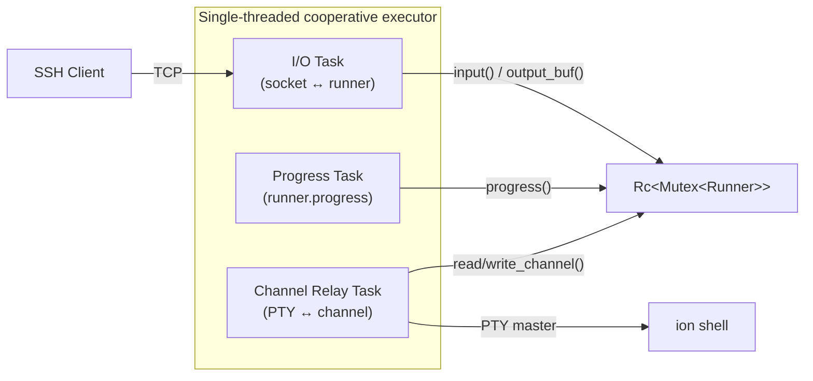
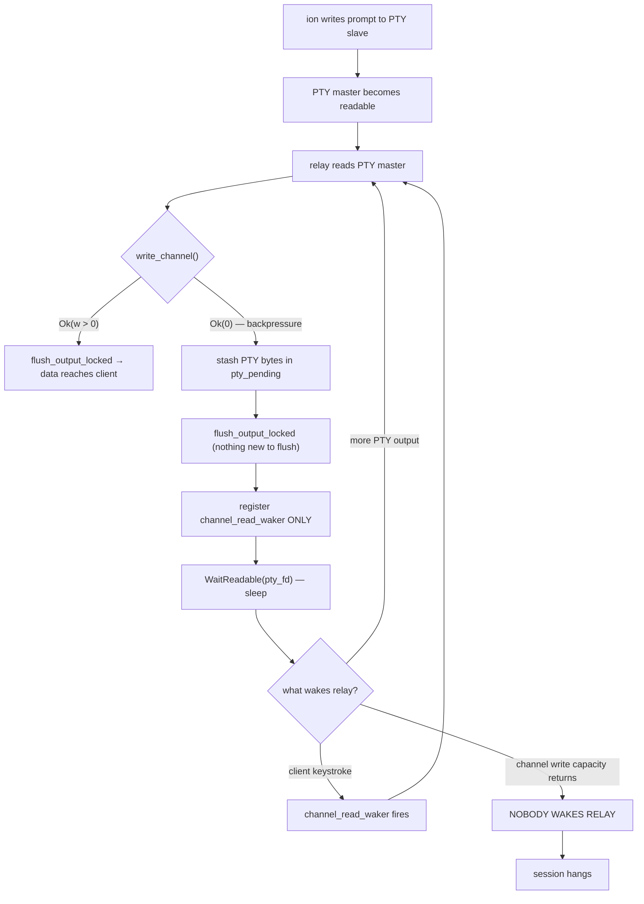
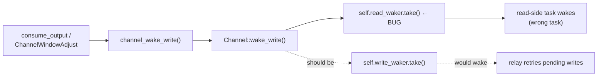
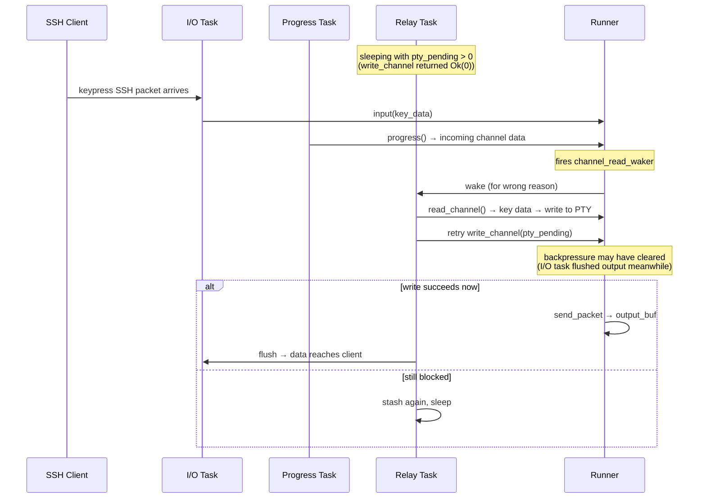
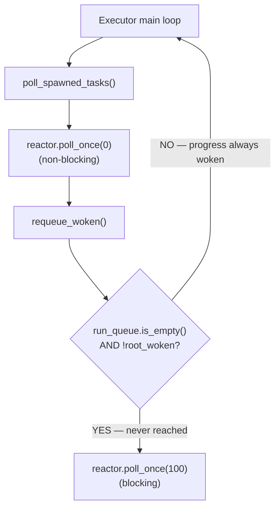
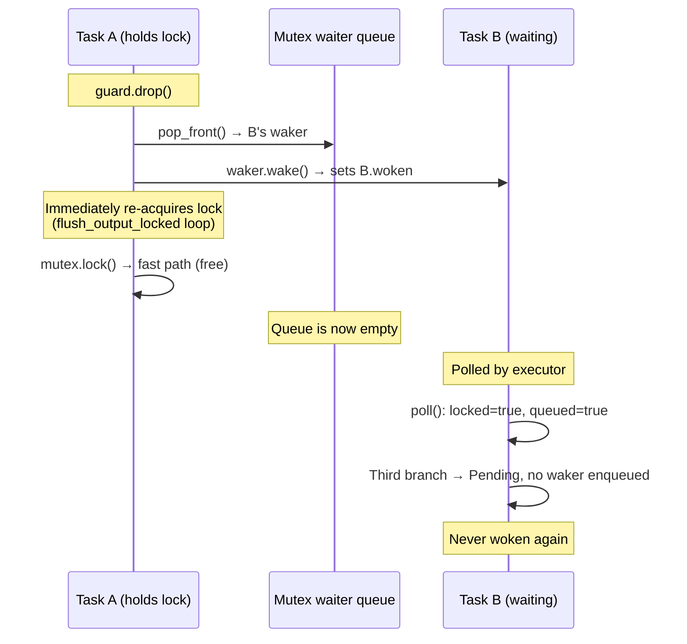

# SSHD Output Hang — Combined Static Analysis

**Date**: 2026-04-04
**Branch**: `docs/phase-43-task-list`
**Predecessors**: [`sshd-multi-task-debug.md`](./sshd-multi-task-debug.md), [`sshd-hang-analysis.md`](./sshd-hang-analysis.md)
**Method**: Static analysis of session code, executor, mutex, reactor, sunset-local fork, and upstream sunset-async architecture research. Synthesises findings from two independent analyses.

> **Historical note:** This appendix records the debugging hypotheses that were
> under consideration before the shipped sshd/session fixes. Treat it as
> archived analysis rather than the current implementation status.

## Executive Summary

Shell output never reaches the SSH client after authentication. Pressing a key occasionally nudges data through.

Two independent analyses converge on a **two-bug root cause** in the channel relay's write path, plus several contributing architectural issues:

1. **Primary (relay write waker)**: The relay task never registers `set_channel_write_waker()`. When `write_channel()` returns `Ok(0)` (backpressure), PTY data is stashed but the relay sleeps only on PTY readability and channel read readiness — it has no way to wake when write capacity returns.
2. **Primary (sunset bug)**: Even if the relay registered a write waker, `Channel::wake_write()` fires `read_waker` instead of `write_waker` for normal data (`sunset-local/src/channel.rs:840-845`).
3. **Contributing (progress busy-loop)**: The progress task busy-loops via `yield_once()`, monopolising executor cycles. The blocking reactor poll is never reached.
4. **Latent (mutex liveness)**: The async mutex has a latent waker-consumption bug that currently doesn't fire but will deadlock if any task ever yields while holding the lock.
5. **Minor (PTY write loss)**: Direction 1 of the relay silently drops data when the non-blocking PTY write returns EAGAIN.

Both analyses independently confirmed that **H1 is false** — `write_channel()` places encrypted ciphertext directly into `output_buf()` without needing `progress()`.

## Architecture



| Task | Slab index | Role | Sleeps on |
|---|---|---|---|
| I/O | 0 | Socket ↔ runner input/output | `WaitReadable(sock_fd)` + `output_waker` |
| Progress | 1 | Drives `progress()`, handles SSH events | `yield_once()` (never truly sleeps) |
| Relay | 2 | PTY master ↔ sunset channel | `WaitReadable(pty_fd)` + `channel_read_waker` |

Poll order within `poll_spawned_tasks` follows slab index: I/O, Progress, Relay.

## The Failure: Missing Channel Write Waker

### How write backpressure occurs

`write_channel_ready()` (`sunset-local/src/runner.rs:594-624`) returns `Ok(Some(0))` under several conditions:

- **KEX in progress**: `!self.conn.kex_is_idle()` — only KEX packets allowed
- **Output buffer full**: `traf_out.send_allowed()` returns 0 — buffer still holds unflushed KEX/auth packets
- **Channel window exhausted**: `channels.send_allowed()` returns 0 — client hasn't sent window adjust yet

Any of these can occur during or immediately after the KEX/auth/shell-open sequence, precisely when the relay task first tries to send shell prompt output.

### The current broken path



The relay registers `set_channel_read_waker` (`session.rs:738`) but never registers `set_channel_write_waker`. When backpressure clears (via `consume_output` or `ChannelWindowAdjust`), sunset calls `channel_wake_write()` — but the relay has no write waker registered, so nothing happens.

### The sunset wake\_write bug

Even if the relay registered a write waker, it wouldn't fire. `Channel::wake_write()` uses the wrong field:



**Evidence** (`sunset-local/src/channel.rs:840-845`):
```rust
pub fn wake_write(&mut self, dt: Option<ChanData>, is_client: bool) {
    if dt == Some(ChanData::Normal) || dt.is_none() {
        if let Some(w) = self.read_waker.take() {  // ← should be write_waker
            w.wake()
        }
    }
    // ...
}
```

Compare with `set_write_waker()` (line 808-811) which correctly stores in `self.write_waker`. The waker is stored in the right field but read from the wrong one.

### Why a key press nudges data through



The key press triggers `channel_read_waker`, giving the relay an incidental chance to retry its stalled write. If backpressure has cleared in the meantime (because the I/O task flushed output between attempts), the retry succeeds. This is the exact "nudge" behavior described in the debug handoff.

## Contributing Issue: Progress Task Busy-Loop

**File**: `userspace/sshd/src/session.rs:572-585`

The progress task uses `yield_once()` on `Event::None`, which calls `cx.waker().wake_by_ref()` — making it **always runnable**.



Consequences:
- The blocking reactor poll is **never called** — I/O readiness detection relies entirely on non-blocking `poll_once(0)`
- Progress monopolises executor cycles in a tight lock-progress-unlock-yield loop
- Other tasks get less frequent scheduling, widening the window for backpressure scenarios

**Upstream comparison**: sunset-async uses a `progress_notify: Signal`. On `Event::None`, the progress task **waits** on `progress_notify` until signalled by `input()`, `write_channel()`, or `consume_output()`. Our implementation lacks this signal entirely.

While not the primary cause of the hang, the busy-loop exacerbates the timing conditions that trigger the write-backpressure scenario.

## Latent Issue: Mutex Waker Consumption Bug

**File**: `userspace/async-rt/src/sync/mutex.rs:80-84`

The third branch of `MutexLockFuture::poll` assumes the waker is still in the queue after being woken:

```rust
} else {
    // BUG: waker was already consumed by guard Drop — returns Pending
    // with no waker in the queue. Task is never woken again.
    Poll::Pending
}
```



**Current mitigation**: No task yields while holding the lock, so when the waiter is polled the lock is always free (fast path). But this is a correctness bug that will deadlock if any future code adds an `.await` inside a lock scope.

## Minor Issue: Silent Data Loss on Non-Blocking PTY Write

**File**: `userspace/sshd/src/session.rs:648`

Direction 1 of the relay (client keystrokes → shell) calls `write_all(pty_fd, ...)` where `pty_fd` is non-blocking. If the PTY write buffer is full, `write` returns `-EAGAIN`, the loop breaks, and unwritten bytes are silently dropped.

Not related to the output hang (wrong direction) but a data integrity bug.

## Hypothesis Evaluation (Consolidated)

Both analyses agree on every hypothesis from the original debug handoff:

| Hypothesis | Verdict | Reasoning |
|---|---|---|
| H1: output not visible until `progress()` | **False** | `write_channel()` → `send_packet()` → `traf_out.buf` directly. Verified against upstream. |
| H2: output disappears between lock acquisitions | **Unlikely** | Cooperative single-threaded executor — no interleaving within a task's synchronous code path. |
| H3: output\_waker / WaitReadable broken | **Secondary** | WaitReadable returns Ready on any re-poll. The stall occurs before packet creation (write backpressure), not after. |
| H4: async mutex fairness | **Low** | FIFO waiter queue. Failure mode is a missing event, not starvation. Latent bug exists but doesn't trigger today. |
| H5: kernel TCP buffering | **Low** | Single-task sshd works on the same kernel. |
| H6: architecture mismatch with sunset-async | **Partly true** | Missing `progress_notify` signal (busy-loop instead). Missing write-side channel waker. |
| H7: revert to single-task for diagnosis | **Useful fallback** | Code inspection already points to a narrower defect. |

## Fix Plan (Priority Order)

### Fix 1: Correct `Channel::wake_write()` in sunset-local

**File**: `sunset-local/src/channel.rs:840-845`

Change `self.read_waker.take()` to `self.write_waker.take()`:

```rust
// Before (buggy):
pub fn wake_write(&mut self, dt: Option<ChanData>, is_client: bool) {
    if dt == Some(ChanData::Normal) || dt.is_none() {
        if let Some(w) = self.read_waker.take() {  // wrong field
            w.wake()
        }
    }
    // ...
}

// After:
pub fn wake_write(&mut self, dt: Option<ChanData>, is_client: bool) {
    if dt == Some(ChanData::Normal) || dt.is_none() {
        if let Some(w) = self.write_waker.take() {  // correct field
            w.wake()
        }
    }
    // ...
}
```

Without this, fix 2 is ineffective.

### Fix 2: Register `set_channel_write_waker()` in the relay task

**File**: `userspace/sshd/src/session.rs:728-747`

When `write_channel()` returns `Ok(0)` or `pty_pending_len > 0` at the point where the relay registers wakers before sleeping, also register the write waker:

```rust
// Current (read waker only):
{
    let mut guard = runner.lock().await;
    let ch_ref = chan.borrow();
    if let Some(ref ch) = *ch_ref {
        let waker = get_current_waker().await;
        guard.set_channel_read_waker(ch, ChanData::Normal, &waker);
    }
    drop(ch_ref);
    drop(guard);
}

// After (read + write wakers):
{
    let mut guard = runner.lock().await;
    let ch_ref = chan.borrow();
    if let Some(ref ch) = *ch_ref {
        let waker = get_current_waker().await;
        guard.set_channel_read_waker(ch, ChanData::Normal, &waker);
        if pty_pending_len > 0 {
            guard.set_channel_write_waker(ch, ChanData::Normal, &waker);
        }
    }
    drop(ch_ref);
    drop(guard);
}
```

The relay now wakes on PTY readability, channel read readiness, **and** channel write readiness when it has pending data.

### Fix 3: Replace `yield_once()` with a `progress_notify` signal

Add a `Notify` primitive to async-rt. The progress task sleeps on `Event::None` until signalled:

```rust
// Progress task:
Ok(Event::None) => {
    drop(guard);
    progress_signal.wait().await;  // truly suspends
    continue;
}

// I/O task, after input():
progress_signal.signal();

// Relay task, after write_channel():
progress_signal.signal();
```

This matches upstream sunset-async and eliminates the busy-loop that exacerbates timing-sensitive backpressure scenarios.

### Fix 4: Fix mutex liveness bug

**File**: `userspace/async-rt/src/sync/mutex.rs:80-84`

Re-enqueue the waker on re-poll instead of assuming it persists:

```rust
} else {
    // Waker was consumed — re-enqueue
    self.mutex.waiters.borrow_mut().push_back(cx.waker().clone());
    Poll::Pending
}
```

### Fix 5: Handle EAGAIN in PTY write (direction 1)

When `write_all` to the non-blocking PTY master partially completes, stash the unwritten remainder and retry on the next relay iteration, rather than silently dropping it.

### Optional: Targeted debug logging

If the write-waker fix doesn't resolve the hang, add prints at these three points to confirm the diagnosis:

```
relay: after write_channel, print return value and output_buf().len() (same lock scope)
flush_output_locked: print bytes found and bytes written
I/O task: print when output_waker fires vs. sock_fd readability
```

## Expected Fix Sequence

```mermaid
gantt
    title Fix implementation order
    dateFormat X
    axisFormat %s

    section Primary (hang fix)
    Fix sunset wake_write bug        :a1, 0, 1
    Register channel write waker     :a2, after a1, 2

    section Contributing (stability)
    Add progress_notify signal       :b1, after a2, 3
    Fix mutex liveness bug           :b2, after a2, 1

    section Minor (correctness)
    Handle PTY write EAGAIN          :c1, after b1, 1
```



Fixes 1 and 2 are the minimum required to unblock the output hang. Fixes 3-5 address real defects that will matter for session robustness even after the primary hang is resolved.

## Key Files Reference

| File | Lines | What |
|---|---|---|
| `sunset-local/src/channel.rs` | 840-845 | `wake_write()` — fires wrong waker |
| `sunset-local/src/channel.rs` | 808-821 | `set_write_waker()` — stores correctly |
| `sunset-local/src/runner.rs` | 490-506 | `write_channel()` — send\_packet + wake |
| `sunset-local/src/runner.rs` | 427-442 | `output_buf()` / `consume_output()` |
| `sunset-local/src/runner.rs` | 594-624 | `write_channel_ready()` — backpressure conditions |
| `sunset-local/src/runner.rs` | 659-670 | `set_channel_write_waker()` API |
| `sunset-local/src/runner.rs` | 699-721 | `wake()` — output\_waker / input\_waker |
| `sunset-local/src/traffic.rs` | 431-451 | `TxState` machine (Write/Idle/Closed) |
| `userspace/sshd/src/session.rs` | 614-748 | Relay task — missing write waker |
| `userspace/sshd/src/session.rs` | 728-747 | Waker registration before sleep |
| `userspace/sshd/src/session.rs` | 370-607 | Progress task — yield\_once busy-loop |
| `userspace/sshd/src/session.rs` | 219-347 | I/O task — output\_waker handling |
| `userspace/sshd/src/session.rs` | 830-850 | `flush_output_locked()` |
| `userspace/async-rt/src/executor.rs` | 199-231 | Executor main loop |
| `userspace/async-rt/src/sync/mutex.rs` | 64-85 | `MutexLockFuture::poll` — latent bug |
