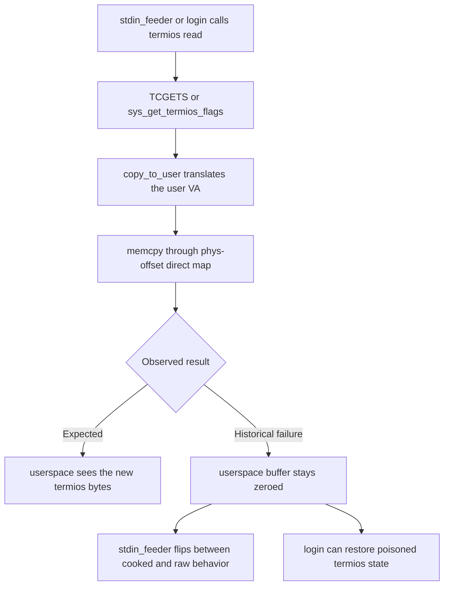

# `copy_to_user` reliability investigation

This directory collects the current investigation state for the intermittent
`copy_to_user` reliability failure described in
[`../copy-to-user-reliability-bug.md`](../copy-to-user-reliability-bug.md).

## Current verdict

| Question | Verdict |
|---|---|
| Was the bug real? | **Yes, high confidence.** The in-tree bug document records successful kernel-side writes paired with zeroed userspace reads and visible terminal corruption. |
| Is the current branch still obviously broken at the surface? | **Not in the default path.** `stdin_feeder` now bypasses `copy_to_user` for the hot termios flags, `login` defends against zeroed saved termios, and a login-bearing regression passes after priming the image. |
| Is the root cause proven? | **No.** The strongest candidates are inconsistent TLB invalidation after user-PTE mutation, frame ABA/reuse, and `get_mapper()` aliasing/stale-view hazards. |

## Synthesized conclusions

1. The bug is best treated as **historically validated but root-cause-open**.
2. The current tree contains **symptom-masking workarounds**, not a demonstrated fix.
3. The kernel has an **inconsistent invalidation story**: some user-page mutations use SMP shootdown, while others only do a local `invlpg` or local CR3 reload.
4. A pure stale-TLB explanation is plausible, but not airtight for the primary `stdin_feeder` case; frame reuse and mapper aliasing remain credible alternatives.

## Failure model at a glance

## Ranked hypotheses

| Rank | Hypothesis | Why it stays alive |
|---|---|---|
| 1 | **User-PTE invalidation bug** | `resolve_cow_fault`, demand paging, `fork()` CoW setup, and `brk()` rely on local invalidation, while `munmap()` and `mprotect()` use `smp::tlb::tlb_shootdown`. |
| 2 | **Frame ABA / reuse race** | `copy_to_user` writes to a translated physical frame exactly once, while frame free/reuse and zeroing can happen elsewhere. `munmap()` frees before shootdown, which widens the suspicion surface. |
| 3 | **`get_mapper()` aliasing / stale mapper view** | `get_mapper()` fabricates `OffsetPageTable<'static>` over the active CR3. `copy_to_user` keeps a live mapper across fault resolution, unlike `copy_from_user`, which deliberately drops it before mutating page tables. |

## Practical validation status

| Check | Outcome | Meaning |
|---|---|---|
| Historical repo evidence | **Strong** | The bug document plus the debug/workaround commit chain validate that the failure was real. |
| `cargo xtask regression --test pty-overlap --timeout 120` from a fresh worktree | **Blocked by login bootstrap** | The run failed early with `login: cannot read /etc/passwd`, so it did not isolate the termios path. |
| `cargo xtask image && cargo xtask regression --test fork-overlap --timeout 120` | **Pass** | The default login-bearing 4-core flow works with current workarounds in place. |
| Single-core (`-smp 1`) experiment | **Not done yet** | `xtask` hardcodes `-smp 4`, so the single-core discriminator still needs a manual QEMU path. |

## Best next proof steps

1. Add immediate kernel readback plus `(vaddr, phys)` logging inside `copy_to_user`.
2. Run the same termios path on **single-core QEMU** with a manual `qemu-system-x86_64 -smp 1` invocation.
3. Normalize all user-PTE mutation sites onto one invalidation policy, or prove why local-only flush is sufficient for each.

See [evidence.md](./evidence.md) for the detailed evidence chain and mutation matrix,
and [worker-findings.md](./worker-findings.md) for the parallel GPT/Opus synthesis.
