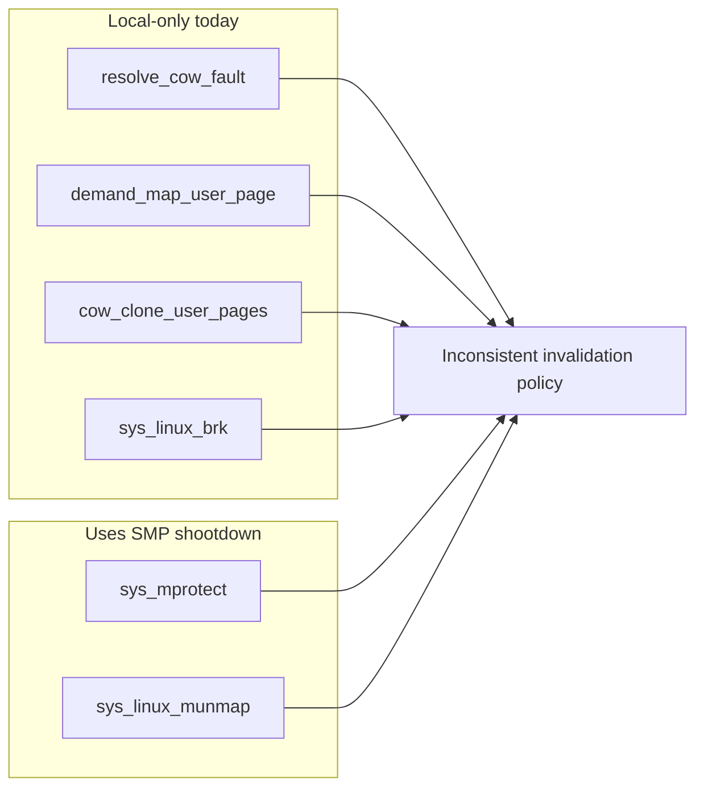

# Evidence and code audit

## Historical validation chain

The strongest validation signal is the repository's own debug and workaround
timeline:

| Commit | What it established |
|---|---|
| `683c017` | Added kernel-side logging showing the kernel saw sane termios state before copying it out. |
| `c316a3b` | Tried a compiler-fence mitigation for `get_termios_flags`; this did not close the issue. |
| `96b3240` | Tried `read_volatile` in `stdin_feeder`; this also did not close the issue. |
| `3c172fd` | Added register-return termios syscalls specifically to bypass the failing `copy_to_user` path. |
| `70b701e` | Added the `login` guard that treats zeroed saved termios as a known bug symptom rather than valid state. |
| `1d7a49c` | Captured the full bug report, symptoms, ruled-out causes, and open investigation tasks. |

Taken together, that chain is stronger than a single anecdotal log: the codebase
contains both the **debugging attempt history** and the **surgical symptom
workarounds** that followed.

## Current-code facts

| Area | Current fact | Why it matters |
|---|---|---|
| `kernel/src/mm/user_mem.rs` | `copy_to_user` translates the destination VA and writes through the phys-offset direct map. | If the user VA later resolves to a different frame than the one written, the kernel can return success while userspace still reads zeros. |
| `kernel/src/mm/user_mem.rs` | `copy_to_user` keeps a mapper alive across CoW and demand-fault handling; `copy_from_user` drops and recreates it around those mutations. | This asymmetry makes `copy_to_user` the riskier path even before any root cause is proven. |
| `kernel/src/mm/paging.rs` | `get_mapper()` reconstructs an `OffsetPageTable<'static>` from the active CR3. | The API is convenient, but it also means correctness depends on CR3 discipline and mapper lifetime discipline. |
| `userspace/stdin_feeder/src/main.rs` | The feeder now reads `c_lflag`, `c_iflag`, and `c_oflag` through direct return-value syscalls. | This is a targeted workaround for the hot symptom path, not a general fix to `copy_to_user`. |
| `userspace/login/src/main.rs` | `disable_echo()` substitutes default cooked termios when `tcgetattr()` returns `c_lflag == 0`. | This explicitly encodes the bug as a still-possible runtime symptom. |

## User page-table mutation and invalidation matrix

| Site | Mutation | Invalidation today | Risk note |
|---|---|---|---|
| `resolve_cow_fault()` | Replace CoW PTE with writable private frame | Local `tlb::flush()` only | Suspicious on SMP if another core can cache the same address space. |
| `demand_map_user_page()` | Install newly allocated user frame | Local `tlb::flush()` only | Same SMP suspicion surface as CoW. |
| `cow_clone_user_pages()` | Clear parent `WRITABLE`, add child CoW mappings | Local CR3 reload only | Handles the current CPU, but not obviously all CPUs sharing the address space. |
| `sys_linux_brk()` | Map new writable heap pages | `flush.flush()` from `map_to()` | Local only. |
| `sys_mmap_file_backed()` | Map file-backed pages | Depends on `map_user_frames()` internals | Worth auditing if the bug survives the other suspects. |
| `sys_linux_munmap()` | Unmap pages and free frames | `smp::tlb::tlb_shootdown()` after the loop | Better, but it frees frames before shootdown completion. |
| `sys_mprotect()` | Rewrite PTE permissions in place | `smp::tlb::tlb_shootdown()` after the loop | This is the most obviously SMP-safe pattern in the set. |
| `sys_execve()` | Switch to a fresh process CR3 | Local `Cr3::write()` | Likely fine for a private fresh address space. |



## Strongest TLB-specific clue

The page-fault handler still contains an old single-core assumption directly
above the CoW resolution path:

```rust
// CoW fault - resolve directly in the ISR. Safe because
// the fault is from ring 3 (no kernel locks held) and
// we're on a single CPU. On OOM, fall through to kill.
```

That matters because `resolve_cow_fault()` now runs in an SMP kernel but still
ends with only a local `tlb::flush()`. The mismatch does **not** prove the full
bug report on its own, but it is the clearest code-level reason the TLB theory
remains the leading explanation.

## Runtime notes from this worktree

### What did not help

- Running `cargo xtask regression --test pty-overlap --timeout 120` directly in
  a fresh investigation worktree failed before the termios-sensitive steps,
  stopping at:

  ```text
  m3OS login: root
  login: cannot read /etc/passwd
  ```

  That failure is useful only as an environment note: it is **not** evidence for
  or against the `copy_to_user` bug.

### What did help

- `cargo xtask image && cargo xtask regression --test fork-overlap --timeout 120`
  passed in the investigation worktree.
- That run still matters because it exercises the default boot-to-login flow on
  the 4-core QEMU path, showing that the current workaround stack keeps the
  mainline UX working.

## Where the evidence lands

### Evidence that the bug was real

- The original bug report.
- The debug commit that logged sane kernel-side termios values.
- The sequence of mitigation attempts that failed.
- The later shift to register-return syscalls and login-side validation.

### Evidence that the current tree is only masked, not proven fixed

- `TCGETS` and `sys_get_termios_flags` still use `copy_to_user`.
- The feeder bypasses the buffer-copy path for exactly the fields that caused
  the visible breakage.
- `login` still treats a zeroed `tcgetattr()` result as a known invalid case.

### Evidence still missing

- A clean single-core reproduction check.
- A proof that `copy_to_user` wrote the right frame and that userspace later read
  a different frame.
- A full audit showing that every user-PTE mutation site is either SMP-safe or
  provably private to one CPU.
