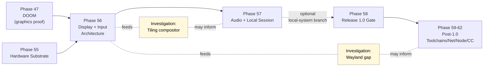

# GUI Investigations

**Status:** Research / non-binding
**Updated:** 2026-04-18
**Owner:** docs/research branch

## Purpose

This folder collects the long-form investigations behind GUI questions that come
up around the convergence-and-release phases (specifically Phases 56–58 and the
post-1.0 Phases 59–62). It exists so that:

- Speculative architecture work has a home that is **not** the official roadmap.
- Recurring questions ("what would Wayland take?", "what about a tiling WM?",
  "how close are we to a Redox-like desktop?") can be answered once and pointed
  to instead of re-derived.
- Decisions that eventually move into roadmap phases have a paper trail.

These are **research notes**. They do not commit the project to anything. When
something here becomes real work it migrates to `docs/roadmap/NN-…md` and
follows the phase-doc template in `docs/appendix/doc-templates.md`.

## Scope

The investigations focus on the gap between m3OS's current display story and a
realistic graphical-system target. They cover:

- The substrate the kernel and userspace would need to grow to support standard
  graphical ecosystems (Wayland, X11, GLES, etc.).
- The architectural shape of a m3OS-native graphical stack and how it compares
  to existing Rust and C/C++ desktops.
- Trade-offs between building native, porting protocols, and porting whole
  compositors or window managers.

Out of scope (for now):

- Detailed driver design for specific GPUs.
- Toolkit design (GTK/Qt/Iced/Slint level decisions).
- Application UX and design language work.

## Document index

| Document | What it answers | Length |
|---|---|---|
| [wayland-gap-analysis.md](./wayland-gap-analysis.md) | What sits between Phase 56's native display protocol and being able to run a Wayland compositor or Wayland clients on m3OS, layer by layer. | Long |
| [tiling-compositor-path.md](./tiling-compositor-path.md) | What it would take to ship a Hyprland-style keyboard-driven tiling compositor (the "omarchy aesthetic") on m3OS, both natively and as a port. | Long |

Future investigations expected to land here:

- `font-and-text-rendering.md` — what to ship between framebuffer text and a real
  text-shaping pipeline (HarfBuzz, FreeType, fontconfig surrogates).
- `input-stack.md` — the path from PS/2 keyboard + planned mouse to a
  libinput-equivalent event surface.
- `gpu-acceleration.md` — when (and whether) to take on Mesa, llvmpipe, or a
  custom rasterizer.
- `terminal-emulator.md` — what a first-class native graphical terminal looks
  like on the Phase 56 compositor and how it interacts with PTY/TTY.

## How these relate to the roadmap

The official roadmap stops describing GUI architecture at Phase 56–57 and does
not commit to Wayland, X11, or any specific compositor. These investigations
sit *off the critical path* and feed advice into later phase planning if and
when the project decides to push past the headless/reference 1.0.

## Related docs

Outside this folder, the canonical references are:

- [`docs/evaluation/gui-strategy.md`](../../evaluation/gui-strategy.md) — the
  high-level GUI strategy and recommended direction.
- [`docs/evaluation/usability-roadmap.md`](../../evaluation/usability-roadmap.md)
  — the four-stage usability model (Stages 0–3) that contextualizes GUI work.
- [`docs/evaluation/microkernel-path.md`](../../evaluation/microkernel-path.md)
  — why GUI work is also microkernel work.
- [`docs/evaluation/roadmap/R09-display-and-input-architecture.md`](../../evaluation/roadmap/R09-display-and-input-architecture.md)
  — the release-track view of the same area.
- [`docs/roadmap/56-display-and-input-architecture.md`](../../roadmap/56-display-and-input-architecture.md)
  and [`docs/roadmap/57-audio-and-local-session.md`](../../roadmap/57-audio-and-local-session.md)
  — the actual phase docs.

## Status legend

Used in document headers throughout this folder:

| Status | Meaning |
|---|---|
| Research / non-binding | Exploratory; the project has not committed to any of it. |
| Proposed | The investigation is recommending a direction; needs roadmap discussion. |
| Adopted | A decision has been made and a roadmap phase or task captures it. |
| Superseded | A later doc replaces this one; kept for history. |

All documents currently in this folder are **Research / non-binding**.
