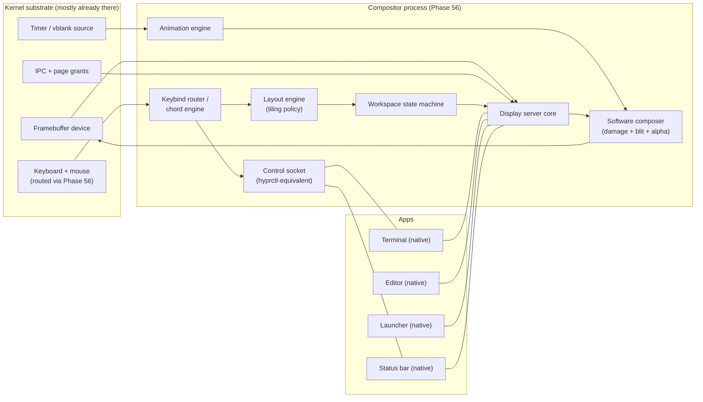
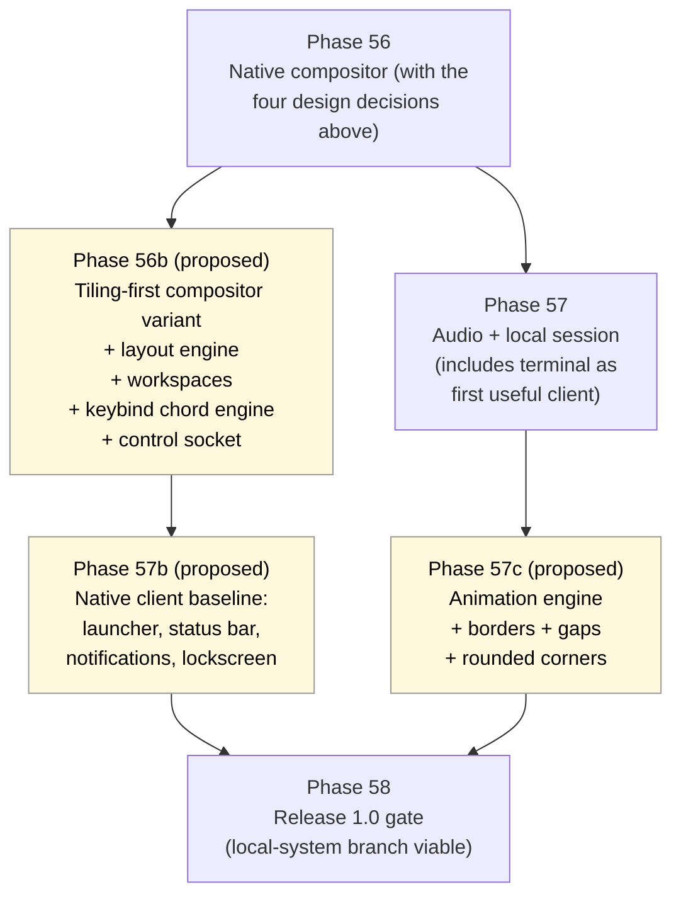
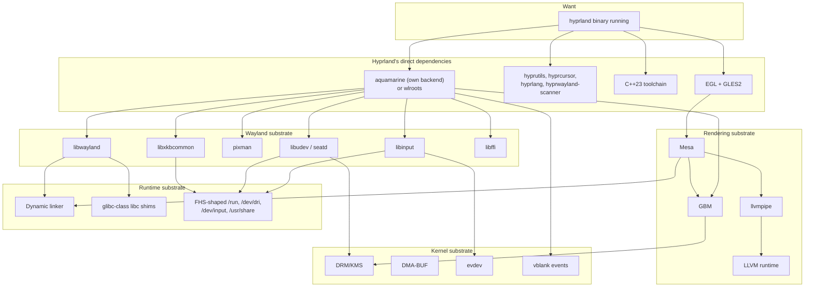

# Tiling Compositor Path

**Status:** Research / non-binding
**Updated:** 2026-04-18
**Related phases:** [Phase 56](../../roadmap/56-display-and-input-architecture.md),
[Phase 57](../../roadmap/57-audio-and-local-session.md)
**Companion doc:** [wayland-gap-analysis.md](./wayland-gap-analysis.md)

## Bottom line

In Wayland — and on any modern compositor architecture — the **compositor is
the window manager**. There is no separate WM process the way there is on X11
under `dwm`/`i3`. Hyprland is a Wayland compositor that happens to do tiling.
Sway is a Wayland compositor that happens to do tiling. River is a Wayland
compositor that happens to do tiling.

This means "ship Hyprland (or something Hyprland-like) on m3OS" is not
"port a window manager onto an existing compositor". It is one of two things:

- **Goal A**: ship a m3OS-native compositor whose UX is keyboard-driven
  tiling — the omarchy aesthetic on the Phase 56 substrate. Pure policy work.
  No Wayland required.
- **Goal B**: port a real Wayland compositor (Hyprland, sway, river, niri)
  unmodified. Requires the entire Wayland substrate from
  [wayland-gap-analysis.md](./wayland-gap-analysis.md).

Goal A is *much* closer than Goal B and gives you most of the experience.
Goal B gives you the binary and the ecosystem at multi-year cost.

This document spends most of its space on Goal A because that is the
realistic path. It covers Goal B in enough detail to size the alternative.

## Architecture model

The headline observation: **everything in the compositor box is policy code on
top of the Phase 56 substrate.** None of it implies Wayland, Mesa, DRM, or any
new kernel work beyond what Phase 56 already includes.

## Survey of existing tiling compositors / WMs

| Project | Stack | Substrate it expects | Approx. size | Suitability for direct port to m3OS |
|---|---|---|---|---|
| dwm | C, X11 only | Xlib + an X server | ~2k LoC | Would need an X server — much heavier than the WM itself. Not realistic. |
| i3 | C, X11 only | XCB + an X server | ~30k LoC | Same X-server problem; larger. |
| awesomewm | C + Lua, X11 | X11 + Lua runtime | ~30k C + ~20k Lua | Adds a Lua runtime requirement. Not realistic. |
| sway | C, Wayland | wlroots, full Wayland substrate | ~50k LoC | Requires the full Wayland substrate (Path B / C in the gap analysis). |
| river | Zig, Wayland | wlroots, Zig toolchain | ~25k LoC Zig | Same Wayland substrate burden, plus Zig toolchain. |
| Hyprland | C++23, Wayland | aquamarine (own backend) or wlroots; EGL/GLES2 *required*, no software fallback | ~60k LoC C++ | Hardest of the bunch — C++23 + GLES2 dependency. Goal B realistically. |
| niri | Rust, Wayland | smithay (Rust wlroots-equivalent) | ~25k LoC Rust | Rust is the friendliest language for the existing m3OS toolchain, but it still needs the full Wayland substrate. Best Goal-B candidate if Goal B is ever pursued. |
| **Goal A native** | Rust, m3OS IPC | Phase 56 compositor framework | small (greenfield) | Direct fit. |

The pattern is clear: every existing tiling compositor that isn't X11-based
imposes the full Wayland substrate cost. The X11-based ones impose an X-server
cost that is comparable. **There is no cheap "just port the WM" option.** The
cheap option is "build the compositor native and copy the *shape* of an
existing tiling WM into it."

## What "Hyprland-the-experience" actually is

If the goal is the omarchy/Hyprland feel rather than the binary, it helps to
list the specific behaviors that create that feel. Each is independent and
each is policy code.

### Layout

| Layout | Behavior | Implementation cost |
|---|---|---|
| Master / stack | One large window on one side; the rest stack on the other. Resizable split. | Trivial (10s of lines of layout math). |
| Dwindle | Each new window splits the focused one alternately horizontally/vertically. | Small (binary tree of windows). |
| Spiral | Variation of dwindle that always splits in a fixed rotation. | Small (variant of dwindle). |
| Manual / BSP | User chooses split direction per insertion; full binary space partitioning. | Small (BSP tree). |
| Grid / columns | Fixed-grid or i3-style columns/rows. | Small. |
| Tabbed / stacked | One area shows one of N windows at a time with tab indicators. | Small (a container that paints a tab strip). |
| Floating override | Per-window opt-out into floating placement. | Small (floating list rendered above tiled tree). |
| Fullscreen toggle | Hide chrome, give a window the whole output. | Trivial. |

A single layout engine module (single Rust crate, in the few-thousand-LoC
range) covers all of the above.

### Workspaces / groups

- N numbered workspaces per output, with a current workspace per output.
- Move-window-to-workspace, switch-workspace, follow/no-follow on move.
- Optional named workspaces.
- Optional "groups" (Hyprland-style) for per-window sets independent of
  workspaces.
- Per-workspace layout selection.

State machine, easily expressed as a small set of operations on indexed
collections.

### Keybind / chord engine

- Mod-key chords (`SUPER`, `SUPER+SHIFT`, etc.) capture early in the input
  pipeline before clients see them.
- Optional leader-key sequences (Spacemacs/which-key style).
- Per-mode binding tables (for resize mode, presentation mode, etc.).
- Reload from config without restart.
- A control socket lets external tools or the launcher emit synthetic
  bindings (drives the hyprctl story).

The Phase 56 input model has to expose a "grab modifier+key before client" hook
for this to work. It does not have to be Wayland-shaped.

### Animations

| Effect | GPU required? | Software cost (1080p60) | Notes |
|---|---|---|---|
| Window slide / fade in | No | A few full-window blits per frame | Very feasible. |
| Workspace slide | No | One full-screen blit + offset | Feasible. |
| Window movement | No | Damage rectangles | Cheap. |
| Rounded corners | No | Per-edge alpha mask | Cheap. |
| Drop shadows | No | Per-window alpha overlay | Cheap if precomputed. |
| Live blur (Hyprland signature) | Effectively yes | ~2-pass separable Gaussian per affected region; CPU at 1080p ≥ ~30 fps for small regions only | Defer until GPU exists, or accept a "frosted snapshot" non-live approximation. |
| Fancy shaders (color grading, etc.) | Yes | Not realistic on CPU | Defer. |

The animation engine is responsible for: timing curves (linear, ease-out,
spring), interpolation, frame scheduling tied to vblank, and producing damage
regions for the composer.

### Gaps and decoration

- Outer gaps (between tiled area and screen edge).
- Inner gaps (between adjacent tiles).
- Per-window borders with active/inactive colors.
- Optional title bars (omarchy/Hyprland tend to disable these).

Gaps are layout math. Borders are 1–4 px rectangles in the composer.

### Status bar / launcher / notifications

These are normal clients of the compositor, not part of it. They want:

- A "layer" concept to render above or below normal windows
  (Wayland calls this `wlr-layer-shell`; the m3OS-native protocol can express
  the same idea).
- Strut/exclusion zones so tiled windows don't overlap them.
- Subscribe-to-events on the control socket (active workspace, focused
  window title, etc.) so the bar can render up-to-date info.

Reasonable native equivalents:

| Class | Hyprland-ecosystem example | Native-on-m3OS equivalent |
|---|---|---|
| Terminal | foot, kitty, alacritty | A native compositor terminal client (probably written against existing PTY work) |
| Launcher | fuzzel, rofi, wofi | A small native fuzzy-find launcher |
| Status bar | waybar | A native bar reading from the compositor's control socket |
| Notifications | mako, dunst | A native notification daemon, layer-shell-equivalent client |
| Lockscreen | swaylock, hyprlock | Native lockscreen client; depends on auth via Phase 27/48 |
| Screenshot | grim + slurp | Native screenshot subcommand on the compositor's control socket |

Each is its own small project but none requires Wayland.

### Control socket

`hyprctl`-equivalent surface: a UNIX-domain socket that accepts commands
(switch workspace, run keybind, change layout, query state) and emits events
(workspace changed, window focused). This is purely m3OS IPC; the protocol
can be JSON or a small binary frame format.

## Mapping to Phase 56

Phase 56's deliverables (from `docs/roadmap/56-display-and-input-architecture.md`):

1. One userspace process owns presentation.
2. Documented client protocol over m3OS IPC + buffer transport.
3. Keyboard/mouse event model with focus routing.
4. Service-model integration for crash/restart.

Goal A asks Phase 56 (or a tightly-scoped Phase 56b) to make four design
choices early so the tiling experience falls out cleanly:

| Decision | Why it matters for tiling |
|---|---|
| Layout policy lives in a swappable module from day one | Lets tiling-first be the default without baking a floating-only assumption into the compositor core |
| Keybind grab path exposes a "swallow before client" hook keyed on modifier sets | Mod-key chords are the entire UX; if they have to be implemented as window-focus tricks, it gets fragile fast |
| Layer-shell-equivalent surface role exists in the protocol | Bar, launcher, lockscreen all need it |
| Control socket is part of the protocol, not an afterthought | Drives `hyprctl`-style scripting and the bar |

If those four are present in Phase 56, then a tiling-first compositor is
mostly the layout engine + workspace state machine + animations + a small
ecosystem of native clients. The Phase 56 doc does not currently mandate any
of them; this is the place to flag that they should be on the table during
Phase 56 implementation planning.

## Software-only rendering budget

Why this matters: the Hyprland feel includes movement and transitions, and
m3OS won't have GPU acceleration for a long time. So the question is how
much of the feel survives software composition.

### Composition cost

| Resolution | Pixels per frame | Frames per second | Bytes per frame (RGBA8) | Bytes per second (1× full overdraw) |
|---|---|---|---|---|
| 1920×1080 | ~2.07 M | 60 | ~8.3 MB | ~500 MB/s |
| 2560×1440 | ~3.69 M | 60 | ~14.7 MB | ~885 MB/s |
| 3840×2160 | ~8.29 M | 60 | ~33.2 MB | ~1.99 GB/s |

Modern desktop CPUs sustain memcpy bandwidths of several GB/s per core, so
1080p/60 with single overdraw is comfortable, 1440p/60 is feasible, and 4K/60
is borderline single-threaded. Damage tracking (only redrawing changed
rectangles) is a multiplicative win.

### What you can ship without GPU

- Smooth window movement and resize.
- Full-screen workspace slide transitions (single blit per frame, just
  offset).
- Fade-in / fade-out animations with per-pixel alpha.
- Rounded corners and 1–2 px borders.
- Cheap drop shadows from precomputed alpha tables.
- A snapshot-style "frosted" effect that is not live (the blurred image is
  computed once when the lockscreen / launcher opens and reused).

### What you cannot reasonably ship without GPU

- **Live, full-screen blur** behind moving windows. Two-pass Gaussian on a
  full 1080p frame at 60 Hz on CPU is borderline; at 1440p it isn't going to
  happen.
- Real-time shader effects (color grading, distortions, SDF rounded-rect
  rendering at scale).
- High-DPI scaling at 4K with effects layered on.

The pragmatic answer: ship Hyprland-the-shape (tiling, animations, gaps,
borders, workspaces) and defer Hyprland-the-blur until a GPU exists. The
omarchy aesthetic survives this trade with surprisingly little loss.

## Goal A: native tiling compositor — recommended staging

**Phase 56 (planned, unchanged scope, four design notes added)**

- Native compositor, native protocol, focus-aware input, supervised restart.
- Adds the four design decisions called out above so tiling-first is
  achievable without rework.

**Phase 56b (proposed)**

- Tiling layout engine: master-stack + dwindle + manual + floating-override
  + fullscreen.
- Workspace state machine.
- Keybind chord engine integrated with the Phase 56 input grab hook.
- Control socket and a tiny `m3ctl` client.
- Per-window borders (no animations yet).

Acceptance criteria sketch:

- Two terminals can tile master-stack with `MOD+Enter`, swap layouts with
  `MOD+space`, switch workspaces with `MOD+1..9`.
- A second monitor (or simulated second output) has independent workspaces.
- The control socket can switch workspace, focus a window, and emit events
  on focus change.
- A window-tree audit log is produced for the compositor's regression tests.

**Phase 57 (planned)**

- Audio + local session.
- A native graphical terminal becomes a real client of the compositor (this
  is already named in the Phase 57 doc).

**Phase 57b (proposed)**

- Layer-shell-equivalent role.
- Native status bar reading the control socket.
- Native fuzzy-find launcher.
- Native notification daemon.
- Native lockscreen tied to Phase 27/48 auth.

**Phase 57c (proposed)**

- Animation engine (timing curves, vblank-aligned scheduling, damage output).
- Window slide/fade, workspace slide, fade-out on close.
- Rounded corners.
- Configurable gaps.

After 57c, Goal A is essentially done: the system has a tiling-first
compositor with workspaces, keybinds, animations, and the standard local
client baseline. The only Hyprland trademark missing is live blur.

## Goal B: actual Hyprland binary — what it would actually take

Every box below the "Want" row is missing on m3OS today. The picture is the
same as Path C in [wayland-gap-analysis.md](./wayland-gap-analysis.md), with
one extra row of Hyprland-specific dependencies on top.

Realistic order to even *start* a Hyprland port:

1. Phase 59 Clang lands (C++23 capable) — already roadmap.
2. C++ runtime (libc++ recommended; smaller and modern) added to the
   toolchain — *not* roadmap.
3. Dynamic linking + libc shims — *not* roadmap.
4. Path A from the gap analysis (libwayland + xkbcommon + pixman + evdev shim
   + cross-process MAP_SHARED) — *not* roadmap.
5. Mesa + llvmpipe + LLVM runtime — *not* roadmap.
6. DRM-equivalent + DMA-BUF + libdrm + GBM — *not* roadmap.
7. libinput + libudev + seatd shims — *not* roadmap.
8. *Then* the Hyprland source tree builds.

This is roughly an entire roadmap-sized program of work before line 1 of
Hyprland's source matters. The honest framing is: **Goal B is not on any
horizon, and Goal A delivers >80% of the user-visible value at <5% of the
cost.**

## Middle ground: `wl_shm` shim inside the native compositor

Once Goal A's compositor exists, **add a Wayland-server backend that speaks
only the `wl_shm` subset of the protocol**. This is the same idea as Path A
in the gap analysis, but framed in terms of getting clients into the tiling
compositor rather than getting "Wayland compositor" as an end in itself.

This unlocks unmodified versions of:

- foot (terminal, software path).
- fuzzel (launcher, software path).
- mako (notifications).
- waybar (mostly — needs `wlr-layer-shell`).
- Several small utilities (grim/slurp, swayidle, swaylock with caveats).

Without unlocking:

- Anything that requires GLES2 (most GTK4/Qt apps) — those still fail.
- Hyprland the compositor itself — it requires GLES2.

This is probably the right answer if there is real demand for "I want to run
*this specific Wayland app* on m3OS" without committing to the Mesa/GPU
substrate. It also slots in cleanly *after* Goal A is done, so it does not
delay the native experience.

## Risks and open questions

1. **Are the four Phase 56 design decisions actually achievable inside Phase
   56's scope?** If the input-grab hook or the layer-shell-equivalent role
   would meaningfully expand Phase 56, they may belong in 56b instead.
2. **Native client baseline cost.** Even small native clients (launcher,
   bar, notifier, lockscreen) add up. Worth surveying whether any existing
   Rust GUI crates (slint, iced, egui) can be made to render against the
   m3OS protocol with limited effort, vs. writing each from scratch.
3. **Animation engine and vblank.** Smooth animations need consistent vblank
   pacing. This is a hardware-substrate question (Phase 55 area) more than a
   compositor question.
4. **Configuration language.** Hyprland uses its own `hyprlang`. Sway uses an
   i3-shaped config. The native compositor needs to pick something — likely
   the simplest possible TOML or a tiny custom DSL.
5. **Multi-monitor.** Goal A's design must include per-output workspaces from
   day one to avoid a painful retrofit.
6. **Accessibility.** No tiling WM in this list ships strong a11y. Worth a
   stance, even if it's "not in the first pass".
7. **Touch / gesture.** Hyprland and niri lean into touchpad gestures on
   laptops. Out of scope for Phase 56 input but worth noting as a future
   extension.

## Recommendation

1. Treat Goal A as the realistic path. It delivers the omarchy/Hyprland
   experience without taking on the Wayland substrate.
2. Add the four Phase 56 design decisions to Phase 56 implementation planning
   (or document them as Phase 56b's preconditions).
3. Defer Goal B indefinitely. It is not unachievable; it is just not
   competitive on cost vs. value while m3OS is pre-1.0 and pre-GPU.
4. Treat the `wl_shm` shim as an *optional add-on* after Goal A, only
   pursued if specific Wayland-app compatibility becomes a real requirement.
5. When (if) a GPU substrate exists, revisit the live-blur question and the
   Goal B path together — they share most of the prerequisites.

## References

- [`docs/roadmap/56-display-and-input-architecture.md`](../../roadmap/56-display-and-input-architecture.md)
- [`docs/roadmap/57-audio-and-local-session.md`](../../roadmap/57-audio-and-local-session.md)
- [`docs/evaluation/gui-strategy.md`](../../evaluation/gui-strategy.md)
- [wayland-gap-analysis.md](./wayland-gap-analysis.md) (companion)
- Hyprland: <https://hyprland.org>
- aquamarine: <https://github.com/hyprwm/aquamarine>
- sway: <https://swaywm.org>
- river: <https://codeberg.org/river/river>
- niri: <https://github.com/YaLTeR/niri>
- smithay (Rust wlroots-equivalent): <https://github.com/Smithay/smithay>
- `wlr-layer-shell` protocol: <https://wayland.app/protocols/wlr-layer-shell-unstable-v1>
